[toc]

# 模式

*    面向对象思维模式(OOP paradigm)
*    泛型函数式编程思维模式(generic functional programming paradigm)

# 编程规范

-    边界条件
-    差错处理

## 调试

### 运行时间

```cpp
cout << "The run time is: "<< (double)clock()/ CLOCKS_PER_SEC << "s"<< std::endl;
```

## 命名

C++标识符,是系统预留的用于描述系统使用的元素的名称,由大小写的26个英文字母、0～9之间的10个数字以及下划线组成,并且第一个元素必须是字母（大写或小写都、可以）或者下划线.

标识符是区别大小写的.

*    对象或变量名：在内存中占据一部分空间,C＋＋为它定义一个名称,在程序中使用对象名或变量名就可以直接访问存储空间中的值.

```cpp
int int_num;//驼峰命名法
```

*    类、结构或联合体名称：实质上是复杂类型的名称的标识符,用于标识不同种类的复杂类型.

```cpp
class Shape{//驼峰命名法
public:
private:
};
```

*    类型名称：表示简单类型的名称的标识符.
*    类、结构、联合体或枚举的成员：表示在类、结构、联合体或枚举中定义的成员变量的标识符.
*    函数或类成员函数：表示函数名称的标识符.
*    typedef名称z表示类型重定义的标识符.
*    标签名称：表示C＋＋中用于标记goto语句可以跳转到的语句,此处主要用作语句指示.
*    宏名称和宏参数：使用＃define定义的宏的名称和参数.
*    指针

```
ptr_//前缀
```

*    函数:驼峰命名法

### 命名空间

尽量把名称集合到一个命名空间里面,避免名称重复.

#### 注释

```cpp
/**
* @brief 
* @param 
*/
```

```cpp
//注释对齐
```

## main()的定义式

根据C++标准规格,只有两种main()是可移植的

```cpp
int main(){
    //to do
}
```

```cpp
int main(int argc,char* argv[]){
    //to do
}
```

C++在main()的末尾定义了一个隐式的

```cpp
return 0;
```

## 自增自减

*    "前置式递增"比"后置式递增"效率高.

后者需要一个额外的临时对象,因为它必须存放原本位置并将它返回,所以一般情况下最好使用"前置式递增"

# 数据类型

## 声明与定义

* 声明是一个函数原型,即声明函数,但是没有函数体
* 包括extern标识符时,但是对象和变量名没有初始化,或者函数没有函数体.此时表示在当前处理单元中不用进行定义,给定的是外部的连接名称
* 在类声明中的静态数据成员.因为静态类数据成员是被类的所有对象共享的不连续的变量,因此,必须在类声明的外部定义和初始化
* 没有定义的类名称的声明
* 使用typedef关键字声明的类型

## 基本数据类型

```c++
<typename> int;
typename* name=new <typename>;
```

|    c++基本类型     |
| :----------------: |
|   unsigned char    |
|    signed char     |
|        char        |
|       short        |
|   unsigned short   |
|        int         |
|    unsigned int    |
|       _intn        |
|        long        |
|   unsigned long    |
|     long long      |
| unsigned long long |
|       float        |
|       double       |
|    long double     |
|        void        |

>    C++中各种基本数据类型所占的存储空间所占的存储空间根据C++实现的不同而不同

## 数值极限

```cpp
#include <climits>
#include <limits.h>
```

| 类型        | 最小长度 |
| ----------- | -------- |
| char        | 1 byte   |
| short int   | 2 bytes  |
| int         | 2 bytes  |
| long int    | 4 bytes  |
| float       | 4 bytes  |
| double      | 8 bytes  |
| long double | 8 bytes  |

*    通用型template,为所有类型提供缺省极值

```cpp
namespace std{
    template<class T>
    class numeric_limits{
        public:
        static const bool is_specialized=false;
    };
}
```

*    各具体类型的极值,由特化版本提供

```cpp
namespace std{
    template<>class numeric_limits<int>{
        public:
        static T min() throw(){
            return -2147483648;
        }
        static T max() throw(){
            return 2147483647;
        }
        static const int digits=31;
        ...
    };
}
```

### class numeric_limits<>

std::numeric_limits为模板类,在库编译平台提供基础算术类型的极值等属性信息,取代传统C语言,所采用的预处理常数.比较常用的使用是对于给定的基础类型用来判断在当前系统上的最大值、最小值.若使用此类,需包含\<limits>头文件.

| 成员              | 意义                                                         |
| ----------------- | ------------------------------------------------------------ |
| is_specialized    | 类型是否有极值                                               |
| is_signed         | 类型带有正负号                                               |
| is_integer        | 计算结果不产生舍入误差                                       |
| is_bounded        | 数字集的个数有限                                             |
| is_modulo         | 两政治相加,其结果可能因溢位而回绕为较小的值                  |
| is_iec559         | 遵从IEC 559及IEEE 754标准                                    |
| min()             | 最小值                                                       |
| max()             | 最大值                                                       |
| digits            | 字符和整数;不带正负号之位个数浮点数;尾数中之radix位个数      |
| digits10          | 十进制的个数                                                 |
| radix             | 浮点数,指数表示式的底数(base)                                |
| min_exponent      | 底数radix的最小负整数指数                                    |
| max_exponent      | 底数radix的最大正整数指数                                    |
| min_exponent10    | 底数10的最小负整数指数                                       |
| max_exponent10    | 底数10的最大正整数指数                                       |
| epsilon()         | 1和最接近1的值之间的差距                                     |
| round_style       | 舍入风格                                                     |
| round_error()     | 最大舍入误差量测                                             |
| has_infinity      | 有"正无穷大"表示式                                           |
| infinity()        | "正无穷大"                                                   |
| has_quiet_NaN     | 本类型有不发信号的"非数值"表述式                             |
| quiet_NaN         | 如果可以,安静地表述出"这不是个数值"                          |
| has_signaling_NaN | 如果可以,发出信号表述出"这不是个数值"                        |
| has_denorm        | 本类型是否允许非标准化数值                                   |
| has_denorm_loss   | 准确度的遗失是以一个非标准化值而不是以一个不精密的结果被侦测出来 |
| denorm_min        | 最小的非标准化正值                                           |
| traps             | 已实作出Trapping                                             |
| tinyness_before   | 在舍入之前可侦测出tinyness                                   |

#### numeric_limits<>的舍入风格

| 舍入风格                  | 意义                   |
| ------------------------- | ---------------------- |
| round_toward_zero         | 向零舍入               |
| round_to_neearest         | 向最接近的可表示值舍入 |
| round_toward_infinity     | 向正无限值舍入         |
| round_toward_neg_infinity | 向负无限值舍入         |
| round_indeterminate       | 无法确定               |

#### numeric_limits<>的"denormalization style"

| 舍入风格             | 意义                                              |
| -------------------- | ------------------------------------------------- |
| denorm_absent        | 此类型不允许"denormalized values"                 |
| denorm_present       | 此类型允许向最接近的可表示值做denormalized values |
| denorm_indeterminate | 无法确定                                          |

## 位域

类和结构可以包含占用比整型类型还小的存储空间的成员,这些数据成员称为位字段或位域

```cpp
数据成员声明:占用的位数
```

数据成员声明部分表示在程序中访问时使用的名称,必须是整型类型

### 作用

位域可以充分利用存储空间,节约空间,提高程序运行效率.在通信协议的解析等对存储位要求严格的情况下非常有用.但是在位域上进行操作时,不能操作位域的地址,也不能初始化位域的引用

## 数据类型转换

```cpp
valuename=typename(value);
```

### 类型转换符

#### static_cast

```cpp
static_cast<[typename1]>([typename2]);
```

利用原值重建一个临时对象,并在设立初值时使用类型转换

#### dynamic_cast

```cpp
dynamic_cast<[typename1]>([typename2]);
```

将多态类型向下转型为其实际静态类型

#### const_cast

设定或去除类型的常数性,亦可去除volatile饰词

#### reinterpret_cast

<u>使用此转型动作通常带来不可移植性</u>

## 作用域

每个变量只能在程序的一定范围内使用,此范围称为变量的作用域.

### 作用域类型

*    本地作用域

*    函数作用域

只有标签属于此作用域的变量.标签可以在定义它的函数内任意地方使用,函数外部就不能使用.

*    文件作用域

在代码块或类的外部声明的变量具有文件作用域

*    类作用域

类的成员变量具有类作用域.只能通过使用对象的成员选择操作符或类对象的指针成员操作符访问.而静态类成员数据可以看做类对象的本地作用域.

*    原型作用域

函数原型中声明的变量只是在原型声明范围内有效.

### 范围确定符

在C＋＋中, 在变量名前加上范围确定符 "::" 前缀, 即两个冒号, 可以告诉编译器使 用全局变量而不使用本地变量. 即使代码上下文环境是嵌套的本地作用域, 范围确定符也 不能提供访问下个外层范围的变量, 只能提供对全局变量的访问.

### 命名空间namespace

#### 声明定义命名空间

```cpp
namespace [name]{
	//do
}
```

与class不同的是,namespace是开放的,可以在不同的模块中定义和扩展namespace.

#### 使用命名空间

##### 直接指定标识符

```cpp
[name]::[name-item]
```

##### 使用using

```cpp
using namespace [name];//使[name]中的所有名字曝光,可能会导致名称冲突问题,using directive
using namespace [name]::[name-item];//using declaration
```

## 字符常数

字符常数有3种形式——标准字符常数、多字符常数和宽字符常数

```cpp
const char ch='y';//标准字符常数
const int mbch='xy';//指定依赖于系统的多字符常数
const wchar_t wcch=L'xy';//指定宽字符常数
```

一个多字符常数可以包含4个字符,指定超过4个字符的字符常数时,会发生错误.

### C++常用转义字符

| 字符       | ASII表示方法 | ASCII值    | 转义序列 |
| ---------- | ------------ | ---------- | -------- |
| 换行       | NL(LF)       | 10 or 0x0a | \n       |
| 水平TAB    | HT           | 9          | \t       |
| 垂直TAB    | VT           | 11 or 0x0b | \v       |
| 退格键     | BS           | 8          | \b       |
| 回车       | CR           | 13 or 0x0d | \r       |
| 进制符     | FF           | 12 or 0x0c | \f       |
| 反斜线     | \            | 92 or 0x5c | \\\\     |
| 问号       | ?            | 63 or 0x3f | \?       |
| 单引号     | '            | 39 or 0x27 | \\'      |
| 双引号     | "            | 34 or 0x22 | \\"      |
| 八进制数   | ooo          | —          | \ooo     |
| 十六进制数 | hhh          | —          | \xhhh    |
| Null字符   | NUL          | 0          | \0       |

## 数组

直接派生数据指从基本数据类型直接派生而来的数据类型,包括数组、函数、指针和引用等.

组合派生数据类型指将基本数据类型组合而成的新的数据类型,其中不止包含一种基本数据类型,称为组合派生类型,包括类、结构体和共用体.

数组语法

*    创建数组

```cpp
//一维数组
typename Arrayname[size];
classname class-value[size];
//二维数组
typename Arrayname[size][size];
classname class-value[size][size];
```

*    访问数组

```cpp
数组标识符[下标表达式];
```

## 结构体

```cpp
struct struct_name{
    //body
};
```

### pair<typename1,typename2>

pair是将2个数据组合成一组数据,当需要这样的需求时就可以使用pair,如stl中的map就是将key和value放在一起来保存.另一个应用是,当一个函数需要返回2个数据的时候,可以选择pair. pair的实现是一个结构体,主要的两个成员变量是first second 因为是使用struct不是class,所以可以直接使用pair的成员变量.

#### 标准库类型

```cpp
#include <utility>
```

#### 类模板

```cpp
template<class T1,class T2> struct pair;
//参数：T1是第一个值的数据类型,T2是第二个值的数据类型.
//功能：pair将一对值(T1和T2)组合成一个值,
```

#### 生成pair< ,>

```cpp
pair<T1, T2> p1; //创建一个空的pair对象（使用默认构造）,它的两个元素分别是T1和T2类型,采用值初始化.
pair<T1, T2> p1(v1, v2); //创建一个pair对象,它的两个元素分别是T1和T2类型,其中first成员初始化为v1,second成员初始化为v2.
make_pair(v1, v2); //以v1和v2的值创建一个新的pair对象,其元素类型分别是v1和v2的类型.
```

#### 操作

```cpp
p1 < p2; //两个pair对象间的小于运算,其定义遵循字典次序：如 p1.first < p2.first 或者!(p2.first < p1.first)&&(p1.second < p2.second)则返回true.
p1 == p2；//如果两个对象的first和second依次相等,则这两个对象相等;该运算使用元素的==操作符.
p1.first; //返回对象p1中名为first的公有数据成员
p1.second; //返回对象p1中名为second的公有数据成员
```

#### 访问map

```cpp
#include <map>
std::map<typename1,typename2>m_map;
for(pair<typename1,typename2> x:m_map){
    //to do
}
```

#### 定义

```cpp
namespace std{
    template<class T1,class T2>
    struct pair{
        /*type names for the values*/
        typedef T1 first_type;
        typedef T2 second_type;
        /*member*/
        T1 first;
        T2 second;
        
        pair():first(T1()),second(T2()){
            
        }
        
        /*constructor for two values*/
        pair(const T1&a,const T2&b):first(a),second(b){
     		
        }
        
        /*copy constructor with implicit conversions*/
        template<class T,class V>
        pair(const pair<U,V>&p):first(p.first),second(p.second){
            
        }
    }
}

/*comparisons*/
template <class T1,class T2>
bool operator==(const pair<T1,T2>&,const pair<T1,T2>&);
template <class T1,class T2>
bool operator<(const pair<T1,T2>&,const pair<T1,T2>&);
.../*similar:!=,<=,>,>=*/
/*convenience function to create a pair*/
template<class T1,class T2>
pair<T1,T2>make_pair(const T1&,const T2&);
```

#### pair之间的比较

如果两个pair对象内的所有元素都相等,这两个pair对象就被视为相等

```cpp
namespace std{
    template <class T1,class T2>
    bool operator==(const pair<T1,T2>&x,const pair<T1,T2>&y){
        return x.first==y.first &&x.second==y.second;
    }
}
```

两个pair互相比较时,第一元素具有较高的优先级.

如果第一元素相等,才继续比较第二元素,并把比较结果当做整体比较结果.

#### 便携函数make_pair()

```cpp
namespace std{
	/*create value pair only by providing the values*/
    template<class T1,class T2>
	pair<T1,T2>make_pair(const T1& x,const T2& y){
        return pair<T1,T2>(x,y);
    }
}
```

## 共用体

```cpp
union union_name{
    //body
};
```

### 匿名共用体

```c++
union{成员列表};
```

## 枚举类型

默认情况下,第一个枚举成员的值为0,每个连续枚举成员比上一个枚举成员大1,除非显式地为

```cpp
enum 枚举类型名称;//定义枚举类型
```

## typedef

为基本类型和派生类型定义别名

当开发平台更换,根据需要对数据类型的使用发生变化时,只需要修改使用typedef的定义语句,就可以方便地实现数据类型的平台移植,而不需要修改程序中所有需要使用数据类型的地方

## const常类型

固定的量,在有效范围内是不可以改变的.

```cpp
const datatype name=value;
```

上述语法表示为一个数据类型为datatype,名称为name,取值为value的常量

```cpp
const 声明
成员函数 const
```

* 第一条用于const关键字定义常对象,其值在程序中是不可以修改的
* 第二条语句使用const关键字定义常函数,即只读函数,不可以修改所在对象中的任何数据成员,也不能调用任何不是常类型的成员函数

## string转数值

| 函数                                                         | 效果                                                         |
| ------------------------------------------------------------ | ------------------------------------------------------------ |
| double atof(const char *str)                                 | 把参数 str 所指向的字符串转换为一个浮点数（类型为 double 型） |
| int atoi(const char *str)                                    | 把参数 str 所指向的字符串转换为一个整数（类型为 int 型）     |
| long int atol(const char *str)                               | 把参数 str 所指向的字符串转换为一个长整数（类型为 long int 型） |
| double strtod(const char *str,  char **endptr)               | 把参数 str 所指向的字符串转换为一个浮点数（类型为 double 型） |
| long int strtol(const char  *str, char **endptr, int base)   | 把参数 str 所指向的字符串转换为一个长整数（类型为 long int 型） |
| unsigned long int  strtoul(const char *str, char **endptr, int base) | 把参数 str 所指向的字符串转换为一个无符号长整数（类型为 unsigned long int 型） |

## auto

实现自动类型推断,进行显式初始化,让编译器能将变量的类型设置为初始值的类型

## decltype

将变量的类型声明为表达式指定的类型

```cpp
decltype(x) y;//让y的类型与x相同
```

## nullptr

空指针是不会指向有效数据的指针,nullptr是指针类型,不能转换为整型数据

## 判断是否溢出

*    最值

INT_MAX

```cpp
int main(){
 int a,b;
 if(INT_MAX/b<a){
 return 0;
}
 return a*b;
}
```

## memset初始化

C++中,memset通常包含在头<cstring>中.

```cpp
/*
第一个参是指针变量,指向任何类型的数据
第二个参是赋值量,表示要初始化的值（int类型）
第三个参是赋值内存的大小
*/
void* __cdecl memset(
 _Out_writes_bytes_all_(_Size) void* _Dst,
 _In_  int  _Val,
 _In_  size_t _Size
);
```

### bool类赋值

```cpp
memset(a,0,sizeof(a));//0是false 1是true
```

### char数组类赋值

```cpp
memset(ch,‘I’,sizeof(ch)); //初始化为对应字符
memset(ch,65,sizeof(ch)); //直接用ascll码初始化
```

### int类赋值

```cpp
int num[10];
memset(num,0,sizeof(num));
```

## **<u>*堆和栈的区别*</u>**

堆和栈的区别主要有五大点，分别是：

1、申请方式的不同。栈由系统自动分配，而堆是人为申请开辟;

2、申请大小的不同。栈获得的空间较小，而堆获得的空间较大;

3、申请效率的不同。栈由系统自动分配，速度较快，而堆一般速度比较慢;

4、存储内容的不同。栈在函数调用时，函数调用语句的下一条可执行语句的地址第一个进栈，然后函数的各个参数进栈，其中静态变量是不入栈的。而堆一般是在头部用一个字节存放堆的大小，堆中的具体内容是人为安排;

5、底层不同。栈是连续的空间，而堆是不连续的空间。

# 复杂度

| 类型    | 表示法       | 含义                                         |
| ------- | ------------ | -------------------------------------------- |
| 常数    | O(1)         | 运行时间与元素个数无关                       |
| 对数    | O(log(n))    | 运行时间随元素个数的增加呈对数增长           |
| 线性    | O(n)         | 运行时间随元素个数的增加呈线性增长           |
| n-log-n | O(n*long(n)) | 运行时间随元素的增加呈"线性和对数的乘积"增长 |
| 二次    | O($n^2$)     | 运行时间随元素的个数的增加呈平方增长         |

# 运算符

## 算术运算符

| 算术运算符 | 功能                                     |
| ---------- | ---------------------------------------- |
| +          | 两个操作数相加                           |
| -          | 减号运算符从第一操作数中减去第二个操作数 |
| *          | 将两个操作数相乘                         |
| /          | 使用第一个操作数除以第二个操作数         |
| %          | 使用第一个操作数除以第二个操作数的余数   |

## 赋值运算符

| 赋值运算符 | 功能                                                       |
| ---------- | ---------------------------------------------------------- |
| =          | 将右操作数赋值给左操作数                                   |
| *=         | 将右操作数和左操作数的乘积赋值给左操作数                   |
| /=         | 将右操作数和左操作数的商赋值给左操作数                     |
| %=         | 将右操作数和左操作数的余数赋值给左操作数                   |
| +=         | 将右操作数和左操作数的和赋值给左操作数                     |
| -=         | 将右操作数和左操作数的差赋值给左操作数                     |
| <<=        | 将右操作数的二进制位向左移动右操作数个位，并赋值给左操作数 |
| >>=        | 将右操作数的二进制位向右移动右操作数个位，并赋值给左操作数 |
| &=         | 将右操作数和左操作数的与结果赋值给左操作数                 |
| \|=        | 将右操作数和左操作数的或结果赋值给左操作数                 |
| ^=         | 将右操作数和左操作数的异或结果赋值给左操作数               |

## 关系运算符

| 关系运算符 | 功能                               |
| ---------- | ---------------------------------- |
| <          | 判断左操作数是否小于右操作数       |
| <=         | 判断左操作数是否小于或等于右操作数 |
| >          | 判断左操作数是否大于右操作数       |
| >=         | 判断左操作数是否大于或等于右操作数 |
| ==         | 判断左操作数是否等于右操作数       |
| !=         | 判断左操作数是否不等于右操作数     |

## 位运算

| 位运算符 | 功能                                                         |
| -------- | ------------------------------------------------------------ |
| &        | 位与运算符是二目运算符， 比较第一个操作数的每位和第二个操作数相应的位． 如果都为1， 则结果值相应的位也为1；否则， 结果值相应的位为0 |
| \|       | 位或运算符是二目运算符， 比较第一个操作数的每位和第二个操作数相应的位． 如果其中有一个位为1， 则结果值相应的位也为1; 否则， 结果值相应的位为0 |
| ^        | 位异或运算符是二目运算符， 比较第一个操作数的每位和第二个操作数相应的位。 如果两个中一个为0， 另一个为1， 则结果值相应的位也为1; 否则， 结果值相应的位为0 |
| <<       | 左移运算符是二目运算符， 结果是将第一个操作数的各位向左移动第二个操作数指定的位数后的值． 在移动过程中， 原来左边多出的位数丢掉， 右边的位数使用0补齐 |
| >>       | 右移运算符是二目运算符， 结果是将第一个操作数的各位向右移动第二个操作数指定的位数后的值。 在移动过程中， 原来右边多出的位数丢掉， 左边的位数使用0补齐 |
| ~        | 二进制反码运算符是一目运算符， 也称为 补码或位非运算符， 得出操作数的补码。 操作 数必须是整型类型的， 并且运算后的结果值的类型与操作数相同。 当操作数的某位为 1 时， 结果值对应的位为0： 当操作数的某位为0时， 结果值对应的位为1 |

## 三目运算符

```cpp
逻辑表达式?表达式:条件表达式
if(逻辑表达式){
    结果=表达式;
}
else{
    结果=条件表达式;
}
```

## 类成员访问符

```cpp
表达式.成员选择标识符
表达式->成员选择标识符
```

## 自增自减运算符

| 运算符  | 含义           |
| ------- | -------------- |
| ++value | 自增后返回结果 |
| value++ | 返回原值再自增 |
| --value | 自减后返回结果 |
| value-- | 返回原值再自减 |

## 逗号运算符

逗号运算符不能在操作数之间完成类型转换,不能处理左值.在第一个操作数后有一个顺序点,表示左操作数的所有求值会在右操作符求值开始之前完成

逗号运算符通常用在上下文环境中只允许一个表达式时,计算两个或多个表达式.在有些情况下,可以作为分隔符使用

## sizeof运算符

sizeof关键字用于计算表达式表示的变量或类型的存储字节数.此关键字返回一个size_t类型的值,计算的表达式是标识符或类型转换表达式.

* 当计算结构类型或变量时,sizeof返回实际类型大小,其中也包括为对其而插入的字节
* 当计算静态数组大小时,sizeof返回整个数组的大小
* sizeof运算符不能返回动态分配的数组或外部数组的大小

## 范围确定符

在C++中,AI变量名前加上范围确定符"::"前缀,即两个冒号,可以告诉编译器使用全局变量而不使用本地变量

即便代码上下文环境是嵌套的本地作用域,范围确定符也不能提供下个外层范围的变量,只能提供对全局变量的访问

## 类成员访问符

```cpp
表达式.成员选择标识符			// 第一种方式
表达式->成员选择标识符		// 第二种方式,指针类型
```

## 成员指针操作符

```cpp
类表达式.成员表达式			// 第一种情况
类表达式->成员表达式			// 第二种情况,指针类型
```


# 关键字

|          |                  |           |             |
| -------- | ---------------- | --------- | ----------- |
| asm      | auto             | bad_cast  | bad_typeid  |
| bool     | break            | case      | catch       |
| char     | class            | const     | const_cast  |
| continue | default          | delete    | do          |
| double   | dynamic_cast     | else      | enum        |
| except   | explicit         | extern    | false       |
| finally  | float            | for       | friend      |
| goto     | if               | inline    | int         |
| long     | mutable          | namespace | new         |
| operator | private          | protected | public      |
| register | reinterpret_cast | return    | short       |
| signed   | sizeof           | static    | static_cast |
| struct   | switch           | template  | this        |
| throw    | true             | try       | type_info   |
| typedef  | typeid           | typename  | union       |
| unsigned | using            | virtual   | void        |
| volatile | while            |           |             |

## 微软指定C++关键字

|            |            |          |                        |                      |                       |
| ---------- | ---------- | -------- | ---------------------- | -------------------- | --------------------- |
| allocate   | dllexport  | __inline | __leave                | property             | __try                 |
| __asm      | dllimport  | __int8   | __multiple_inheritance | selectany            | uuid                  |
| __based    | __except   | __int16  | naked                  | __single_inheritance | __uuidof              |
| __cdecl    | __fastcall | __int32  | nothrow                | __stdcall            | __virtual_inheritance |
| __declspec | __finally  | __int64  | thread3                |                      |                       |


## noexcept（ C++11）

关键字 noexcept 用于指出函数不会引发异常.它也可用作运算符,判断操作数（表达式）是否可能引发异常;如果操作数可能引发异常,则返回 false,否则返回 true.

## new/delete

new关键字用于为指定类型的对象从空闲存储区中分配内存,并返回指向对象的对应类型的指针.如果失败,则new操作返回0.

用户可以通过编写自定义异常处理程序修改默认的操作,并将函数名作为参数调用运行时库函数 _set_new_handler.

```cpp 
[::] new [定位符] 类型名称 [初始值]
[::] new [定位符] (类型名称) [初始值]
```

如果重写对象的new方法,则定位符可以用于传递外加的参数.类型名称指定要分配的空间存储的变量的类型.如果类型是复杂类型,则可以通过使用括号强制绑定顺序.初始值用于提供初始化对象使用的值.不能为数组指定初始值,只有当类具有默认的构造函数时,new操作符才可以创建数组对象.

使用 delete 运算符可以释放由 new 运算符分配的内存空间. 

```cpp
[::] delete 指针
[::] delete [ ] 指针//delete数组
```

## explicit

C++中的explicit关键字只能用于修饰只有一个参数的类构造函数, 它的作用是表明该构造函数是显示的, 而非隐式的, 跟它相对应的另一个关键字是implicit, 意思是隐藏的,类构造函数默认情况下即声明为implicit(隐式).

```cpp
class [classname]{
public:
	explicit [classname]([typename] parametername);	
};
```

## inline

用于指定内联函数,告诉编译器使用函数体的代码代替函数调用部分.此种替换方式也就是"内联展开",也称为内联

内联展开通过增加代码大小来减轻函数调用的开销

inline关键字告诉编译器优先进行内联展开

* 显式指定内联函数:在类的成员函数定义前面加上inline关键字
* 隐式指定内联函数:在类的成员函数的声明中,直接加上函数体的内容

# 操作符

| 操作符           | 名称           | 方向     |
| ---------------- | -------------- | -------- |
| ::               | 范围确定符     | 无       |
| ::               | 全局符         | 无       |
| []               | 数组下标       | 从左到右 |
| ()               | 函数调用       | 从左到右 |
| ()               | 转换           | 无       |
| .                | 对象的成员选择 | 从左向右 |
| ->               | 指针的成员选择 | 从左向右 |
| ++               | 自增一后缀     | 无       |
| --               | 自减一后缀     | 无       |
| *                | 乘             | 无       |
| &                | 地址符         | 无       |
| +                | 加             | 无       |
| -                | 减             | 无       |
| ！               | 逻辑否         | 无       |
| ~                | 位与           | 无       |
| sizeof           | 对象大小       | 无       |
| sizeof()         | 类型名称       | 无       |
| new              | 分配对象       | 无       |
| delete           | 删除对象       | 无       |
| delete[]         | 删除对象       | 无       |
| typeid()         | 类型名称       | 无       |
| (type)           | 类型转换       | 从右向左 |
| const_cast       | 类型转换       | 无       |
| dynamic_cast     | 类型转换       | 无       |
| reinterpret_cast | 类型转换       | 无       |
| static_cast      | 类型转换       | 无       |
| *                | 类成员应用指针 | 从左向右 |
| ->*              | 类成员的指针   | 从左向右 |
| *                | 乘             | 从左向右 |
| /                | 除             | 从左向右 |
| %                | 取模           | 从左向右 |
| +                | 加             | 从左向右 |
| -                | 减             | 从左向右 |
| <<               | 左转换         | 从左向右 |
| >>               | 右转换         | 从左向右 |
| <                | 小于           | 从左向右 |
| >                | 大于           | 从左向右 |
| <=               | 小于等于       | 从左向右 |
| >=               | 大于等于       | 从左向右 |
| ==               | 等于           | 从左向右 |
| !=               | 不等于         | 从左向右 |
| &                | 位与           | 从左向右 |
| ^                | 位异或         | 从左向右 |
| \|               | 位或           | 从左向右 |
| &&               | 逻辑与         | 从左向右 |
| \|\|             | 逻辑或         | 从左向右 |
| e1?e2:e3         | 条件           | 从右向左 |
| =                | 赋值           | 从右向左 |
| *=               | 乘赋值         | 从右向左 |
| /=               | 除赋值         | 从右向左 |
| %=               | 模赋值         | 从右向左 |
| +=               | 加赋值         | 从右向左 |
| -=               | 减赋值         | 从右向左 |
| <<=              | 左转换赋值     | 从右向左 |
| >>=              | 右转换赋值     | 从右向左 |
| &=               | 位与赋值       | 从右向左 |
| \|=              | 位或赋值       | 从右向左 |
| ^=               | 位异或赋值     | 从右向左 |
| ,                | 逗号           | 从左向右 |

# 函数

*    声明

声明是一个函数原型,即声明函数,但是没有函数体

包括extern标识符时,对象和变量没有初始化,或者函数没有函数体

在类声明中的静态数据成员,因为是被类的所有对象共享的不连续变量,必须在类声明的外部定义和初始化

没有定义的类名称的声明

使用typedef关键字声明的类型

*    定义

定义是对象或变量、函数、类或枚举型的唯一说明.

定义必须是唯一的,声明和定义是一对多的关系,同一定义的元素,可以在程序中多处声明

有如下两种情况,程序元素可以被声明但是不用定义

1.   函数声明,但是未被其他函数调用或使用此函数地址的表达式
2.   类仅被使用,但是不需要知道其定义.将声明放在.h头文件中.

*    参数
*    返回

```cpp
returntypename functionname(parametertype name1,parametertype name2,...){
    return value;
}
```

## 带默认形参值

```cpp
可选的说明符 函数名称(参数列表 形参名称=形参值, ...)其他函数限定符
{
	//body
}
```

## 常量成员函数

将类的成员函数定义为常量,即常量成员函数.在函数体内不可以修改任何数据成员,也不可以调用任何不适常量的成员函数

```cpp
returntype class::functionname(param1,param2,......)const{
    //body-函数体
}
```

## lambda表达式

```cpp
[caputrue](params)opt->ret{body;};
[函数对象参数](操作符重载函数参数) mutable 或 exception 声明-> 返回值类型{函数体}
```

>    []不截取任何变量
>    [&]截取外部作用域中所有变量,并作为引用在函数体中使用
>    [=]截取外部作用域中所有变量,并拷贝一份在函数体中使用
>    [=,&foo]截取外部作用域中所有变量,并拷贝一份在函数体中使用,但是对foo变量使用引用
>    [bar]截取bar变量并且拷贝一份在函数体重使用,同时不截取其他变量
>    [this]截取当前类中的this指针.如果已经使用了&或者=就默认添加此选项.

# 生成随机数

## 整型

```cpp
srand(time(NULL));
int target=rand()%[a]+[b];//随机数范围[b,a+b-1]
```

## 浮点数

```cpp
srand(time(NULL));
double target=rand()/double(RAND_MAX/[a])+[b];//随机数范围[b,a+b)
```

# system("  ")指令

下面列出常用的DOS命令,都可以用system函数调用:

| DOS命令 | 含义 |
| ---- | ---- |
|ASSOC|显示或修改文件扩展名关联。 |
|AT|计划在计算机上运行的命令和程序。 |
|ATTRIB|显示或更改文件属性。|
|BREAK|设置或清除扩展式|
|CACLS|显示或修改文件的访问控制列表(ACLs)。   |
|CALL|从另一个批处理程序调用这一个。 |
|CD|显示当前目录的名称或将其更改。   |
|CHCP|显示或设置活动代码页数。|
|CHDIR|显示当前目录的名称或将其更改。|
|CHKDSK|检查磁盘并显示状态报告。  |
|CHKNTFS|显示或修改启动时间磁盘检查。 |
|CLS|清除屏幕。   |
|CMD|打开另一个|
|COLOR|设置默认控制台前景和背景颜色。   |
|COMP|比较两个或两套文件的内容。 |
|COMPACT|显示或更改|
|CONVERT|将|
|COPY|将至少一个文件复制到另一个位置。  |
|DATE|显示或设置日期。  |
|DEL|删除至少一个文件。 |
|DIR|显示一个目录中的文件和子目录。   |
|DISKCOMP|比较两个软盘的内容。 |
|DISKCOPY|将一个软盘的内容复制到另一个软盘。|
|DOSKEY|编辑命令行、调用|
|ECHO|显示消息，或将命令回显打开或关上。|
|ENDLOCAL|结束批文件中环境更改的本地化。 |
|ERASE|删除至少一个文件。   |
|EXIT|退出|
|FC|比较两个或两套文件，并显示不同处。   |
|FIND|在文件中搜索文字字符串。  |
|FINDSTR|在文件中搜索字符串。   |
|FOR|为一套文件中的每个文件运行一个指定的命令 |
|FORMAT|格式化磁盘，以便跟|
|FTYPE|显示或修改用于文件扩展名关联的文件类型。|
|GOTO|将|
|GRAFTABL|启用|
|HELP|提供|
|IF|执行批处理程序中的条件性处理。 |
|LABEL|创建、更改或删除磁盘的卷标。   |
|MD|创建目录。   |
|MKDIR|创建目录。 |
|MODE|配置系统设备。|
|MORE|一次显示一个结果屏幕。  |
|MOVE|将文件从一个目录移到另一个目录。  |
|PATH|显示或设置可执行文件的搜索路径。  |
|PAUSE|暂停批文件的处理并显示消息。   |
|POPD|还原|
|PRINT|打印文本文件。|
|PROMPT|更改|
|PUSHD|保存当前目录，然后对其进行更改。 |
|RD|删除目录。   |
|RECOVER|从有问题的磁盘恢复可读信息。   |
|REM|记录批文件或|
|REN|重命名文件。 |
|RENAME|重命名文件。 |
|REPLACE|替换文件。   |
|RMDIR|删除目录。 |
|SET|显示、设置或删除|
|SETLOCAL|开始批文件中环境更改的本地化。 |
|SHIFT|更换批文件中可替换参数的位置。  |
|SORT|对输入进行分类。  |
|START|启动另一个窗口来运行指定的程序或命令。  |
|SUBST|将路径跟一个驱动器号关联。 |
|TIME|显示或设置系统时间。  |
|TITLE|设置|
|TREE|以图形模式显示驱动器或路径的目录结构。   |
|TYPE|显示文本文件的内容。 |
|VER|显示|
|VERIFY|告诉|
|VOL|显示磁盘卷标和序列号。|
|XCOPY|复制文件和目录树。  |

## 不同类型转换

### int to string

```cpp
string name = to_string(int);
```

### string to int

```cpp
string a = "5";
int ai = atoi(a.c_str());
cout << ai;
```

### char to string

```cpp
string name = string(1,char);
```

### char to int

```cpp
char target = '5';
int save = target -'0';
cout<<save;
```

### int to char

```cpp
int a = 5;
char ca = a +'0';
cout<<ca;
```

# 字符串

## C风格字符串

```c++
char site[]="...";
char site[7]={'R','U,'N','O','O','B','\0'};
```

|        函数         | 目的                                                         |
| :-----------------: | :----------------------------------------------------------- |
| **strcpy(s1, s2);** | 复制字符串 s2 到字符串 s1。                                  |
| **strcat(s1, s2);** | 连接字符串 s2 到字符串 s1 的末尾。连接字符串也可以用**+**号，例如: `string str1 = "runoob"; string str2 = "google"; string str = str1 + str2;` |
|   **strlen(s1);**   | 返回字符串 s1 的长度。                                       |
| **strcmp(s1, s2);** | 如果 s1 和 s2 是相同的，则返回0；如果 s1<s2 则返回值小于0；如果 s1>s2 则返回值大于0。 |
| **strchr(s1, ch);** | 返回一个指针，指向字符串 s1 中字符 ch 的第一次出现的位置。   |
| **strstr(s1, s2);** | 返回一个指针，指向字符串 s1 中字符串 s2 的第一次出现的位置。 |

```c++
char info[100];
cin>>info;//read a word
cin.getline(info,100);//read a line, discard
cin.get(info,100);//read a line, leave
```

## string对象

```c++
string stuff;
cin>>stuff;//read a word
getline(cin,stuff);//read a line, discard
```

### getline版本

```c++
cin.getline(info,100,':');//read up to :, discard :
getline(stuff,':');//read up to :, discard :
```

# 函数

swap包含在命名空间std里面

| 函数       | 含义                                 |
| ---------- | ------------------------------------ |
| swap(a,b)  | swap 包含在命名空间std 里面,交换a和b |
| swap(a,b,) |                                      |

## string.h、cstring(C)

|                    函数                    |                             含义                             |
| :----------------------------------------: | :----------------------------------------------------------: |
|        strcat(char[], const char[])        |                        字符串连接函数                        |
|     strncat(char[],const char[],int )      |                        字符串连接函数                        |
|        strcpy(char[],const char[])         |                        字符串复制函数                        |
|      strncpy(char[],const char[],int)      |                        字符串复制函数                        |
|      strcmp(const char[],const char)       |                        字符串比较函数                        |
|         strlenstrlen(const char[])         |                        字符串长度函数                        |
|         memset(char[], int, int )          |                          初始化函数                          |
| char *strtok(char srcl, const char *delim) |         字符串分割src为待分解的字符串, delim为分隔符         |
|   char *strstr(char *str1, char *str2);    | 找出str2字符串在str1字符串中第一次出现的位置（不包括str2的串dao结束符） |

## cstring、string（C++）

|               函数               |     含义     |
| :------------------------------: | :----------: |
|           find(string)           |   正向查找   |
|           find(string)           |   逆向查找   |
| replacereplace(int,int ,string ) | 替换子串函数 |

## math.h、cmath

|             函数              |          含义           |
| :---------------------------: | :---------------------: |
|        int abs(int i)         |  返回整型参数i的绝对值  |
|     double fabs(double x)     | 返回双精度参数x的绝对值 |
|       long labs(long n)       | 返回长整型参数n的绝对值 |
|     double exp(double x)      |   返回指数函数e^x的值   |
| double pow(double x,double y) |       返回x^y的值       |
|      double pow10(int p)      |      返回10^p的值       |
|     double log(double x)      |      返回logex的值      |
|    double log10(double x)     |     返回log10x的值      |
|     double sqrt(double x)     |       返回√x的值        |
|      int ceil(double x)       |  返回不小于x的最小整数  |
|      int floor(double x)      |  返回不大于x的最大整数  |

## stdlib.h、cstdlib

|             函数             |            含义             |
| :--------------------------: | :-------------------------: |
|     void exit(int code)      |        终止程序执行         |
| void * malloc(long NumBytes) |          申请内存           |
|     void free(void *ptr)     |          释放内存           |
|     void srand(int seed)     |      随机数生成器种子       |
|        int rand(void)        | 生成0~32768之间的一个随机数 |

## algorithm

|                 函数                 | 含义       |
| :----------------------------------: | ---------- |
|      sort(begin, end, less<>())      | 升序       |
|    sort(begin, end, greater<>())     | 降序       |
|               min(a,b)               | 返回最小值 |
|               max(a,b)               | 返回最大值 |
| reverse(object.begin(),object.end()) | 翻转       |

*    sort()为类模板,需要声明其类型

     *    如果cmp返回结果为假,那么函数就会将他们互换位置;

          如果cmp返回结果为真,就会保持原来位置不变.

[为数组vector排序](#vector排序)

### 挑选较小值和较大值min()/max()

```cpp
namespace std{
    template <class T>
        inline const T& min(const T& a,const T& b){
        return b<a?b:a;
    }
    template <class T>
        inline const T& max(const T&a,const T& b){
        return a<b?b:a;
    }
}
//another edition
namespace std{
    template <class T,class Compare>
        inline const T& min(const T& a,const T& b,Compare comp){
		return comp(b,a)?b:a;
    }
    template <class T,class Compare>
        inline const T& max(const T& a,const T& b,Compare comp){
		return comp(a,b)?b:a;
    }
}
```

### 两值交换swap()

```cpp
namespace std{
    template<class T>
        inline void swap(T& a,T& b){
        T tmp(a);
        a=b;
        b=tmp;
    }
}
```

swap()的最大优势在于,通过模板特化或函数重载,可以为更复杂的类型提供特别的版本

### STL类算法

#### min_element()、max_element()

调用时,必须传入两个参数,定义出预处理的元素范围.如果想要处理容器内的所有元素,可以使用begin()和end()

两个算法都返回一个迭代器,分别指向最小或最大元素的位置.

```cpp
[min_parameter_pos]=min_element([.begin()],[.end()]);
cout<<*[min_parameter_pos];
[max_parameter_pos]=max_element([.begin(),[.end()]]);
cout<<*[max_parameter_pos];
```

#### sort()

对容器进行排序

直接对容器进行操作

```cpp
sort([.begin()],[.end()],cmp);
template<typename T>
bool cmp(T a,T b){
    return ([a]>[b]?[true/false]:[true/false]);
}
```

#### find()

查找数据

返回查找位置

```cpp
[find_parameter_pos]=find([.begin()],[.end()],[targetvalue]);
```

#### reverse()

翻转数据

```cpp
reverse([.begin()],[.end()]);
```

#### for_each()

对每个数值进行func()处理

```cpp
void func(...){
    // to do
}
for_each([].begin(),[].end(),func);
```

## utility

### 比较符

```cpp
//相同参数类型定义
namespace std{
    namespace rel_ops{
        template <class  T>
            inline bool operator!=(const T& x,const T& y){
            return !(x==y);
        }
        template <class T>
            inline bool operator>(const T&x,const T& y){
            return y<x;
        }
        template <class T>
            inline bool operator<=(const T&x,const T& y){
            return !(y<x);
        }
        template <class T>
            inline bool operator>=(const T&x,const T& y){
            return !(x<y);
        }
    }
}

//两种不同的参数类型定义
namespace std{
    template <class T1,class T2>
        inline bool operator!=(const T1& x,const T2& y){
        return !(x==y);
    }
    ...
}
```

## ctype.h

|           函数            |                   描述                   |
| :-----------------------: | :--------------------------------------: |
|    int isalnum(char c)    |  该函数检查所传的字符是否是字母和数字。  |
|    int isalpha(char c)    |     该函数检查所传的字符是否是字母。     |
|    int iscntrl(char c)    |   该函数检查所传的字符是否是控制字符。   |
|    int isdigit(char c)    |  该函数检查所传的字符是否是十进制数字。  |
|    int isgraph(char c)    |  该函数检查所传的字符是否有图形表示法。  |
|    int islower(char c)    |   该函数检查所传的字符是否是小写字母。   |
|    int isprint(char c)    |   该函数检查所传的字符是否是可打印的。   |
|    int ispunct(char c)    | 该函数检查所传的字符是否是标点符号字符。 |
|    int isspace(char c)    |   该函数检查所传的字符是否是空白字符。   |
|    int isupper(char c)    |   该函数检查所传的字符是否是大写字母。   |
|   int isxdigit(char c)    | 该函数检查所传的字符是否是十六进制数字。 |
| char tolower(char target) |                 返回小写                 |
| char touppre(char target) |                 返回大写                 |

## cstddef、cstdlib

### cstddef

| 标识符    | 意义                                        |
| --------- | ------------------------------------------- |
| NULL      | 指针值,用来表示"未定义"或"无值"             |
| size_t    | 一种无正负号的类型,用来表示大小             |
| prtdiff_t | 一种带哟正负号的类型,用来表示指针之间的距离 |
| offsetof  | 表示一个成员在struct或union中的偏移量       |

### cstdlib

| 定义                         | 意义                      |
| ---------------------------- | ------------------------- |
| exit(int status)             | 退出程序,并清理static对象 |
| EXIT_SUCCESS                 | 程序正常结束              |
| EXIT_FAILURE                 | 程序不正常结束            |
| abort()                      | 退出程序                  |
| atexit(void (* function)() ) | 退出程序时调用某些函数    |

*    exit()会销毁所有static对象,将所有缓冲区清空,关闭所有IO通道,然后终止程序
*    abort()会立刻终止函数,不做任何清理工作

## for(:)语句

```c++
for(auto n:str){...};//不需要修改数组时
for(auto &n:str){...};//要修改数组时
```

# 指针

```c++
<typename>*<pointname> = new <typename>
<typename>*<pointname> = new <typename>[<length>]
str[i]<=>*(str+i);
String*glamour;//声明指向类对象的指针
String*first=&sayings[0];//将指针初始化为已有对象
String*gleep=new String;//使用new和默认的类构造函数对指针进行初始化
String*favorite=new String(sayings[choice]);//使用new和String(const string&)类构造函数对指针进行初始化
if(sayings[i].length()<shortest->length());//使用->操作符通过指针访问类方法
if(sayingts[i]<*first)//使用*解除引用操作符获得对象
```

## 函数指针

函数指针的定义方式为：

```cpp
函数返回值类型 (* 指针变量名) (函数参数列表);
```

“函数返回值类型”表示该指针变量可以指向具有什么返回值类型的函数；“函数参数列表”表示该指针变量可以指向具有什么参数列表的函数。这个参数列表中只需要写函数的参数类型即可。

## 二维动态数组<span id="STL_vector数组"> </span>

```cpp
int **p;
p = new int*[length]; //注意,int*[length]表示一个有10个元素的指针数组
for (int i = 0; i < length; ++i)
{
 p[i]= new int[wide];
}
```

[二维vector](#二维vector)

# 引用

```
声明标识符 & [限定符列表] 引用名称;
```

在C++中,任何地址都可以转换为指针类型的对象,也可以转换成对应的引用类型.

# 预处理

## 宏定义

```cpp
#define 宏名称 宏内容// 定义宏
#undef 宏名称// 关闭宏
```

## 文件包含

```cpp
#include "文件名"//首先从文件所在路径查找
#include <文件名>//首先从编译选项指定的路径查找
```

## 条件编译

```cpp
#if defined()
...;
#elif defined()
...;
#else
...;
#endif
```

# class 类

```cpp
class classname{
public:
 friend function;
 classname();
~classname();
private:
protected:
};
```

|   权限    |      |
| :-------: | :--: |
|  public   | 公有 |
| protected | 保护 |
|  private  | 私有 |

## 类之间的关系

### 继承

继承指的是一个类继承另外的一个类，继承的类叫做子类，被继承的类叫做父类。

```cpp
class A{
};
class B:public A{
};
```

### 实现

实现讲的是c++中面向对象的“接口”，“接口”是java中的重点，在c++中的接口主要通过纯虚函数实现。

```cpp
class A{
public:
   virtual void func();
};
class B:public A{
void func(){
   }
};
```

类A中的函数func（）为纯虚函数，没有函数体，在继承它的函数中写出func（）的具体实现。

### 依赖

C++语法中，通过将一个类作为另一类方法的参数的形式实现两个类之间的依赖关系。

```cpp
class A{
};
class B{
public:
   void func(A a){};
};
```

### 聚合

 在C++语法中，通过类的指针来实现聚合。

```cpp
class A{
};
class B{
public:
   A a[5];
};
```

### 关联

```cpp
class A{
};
class B{
public:
   A *a;
};
```

### 组合

组合是将一个对象（部分）放到另一个对象里（组合）。相比"聚合"，组合是一种强所属关系，组合关系的两个对象往往具有相同的生命周期，被组合的对象是在组合对象创建的同时或者创建之后创建，在组合对象销毁之前销毁。一般来说被组合对象不能脱离组合对象独立存在，而且也只能属于一个组合对象。在C++语法中，使用在一个类中包含另外一个类类型的成员来实现组合。

```cpp
class A{
};
class B{
public:
   A a;
};
```


## 结构、类和共用体区别

| 结构                   | 类                       | 共用体                   |
| ---------------------- | ------------------------ | ------------------------ |
| 使用struct定义         | 使用class定义            | 使用union定义            |
| 默认的访问权限是公开的 | 默认的访问权限是私有的   | 默认的访问权限是公开的   |
| 没有使用限制           | 没有使用限制             | 同一时间只能使用一个成员 |
| 只描述属性和状态       | 描述属性、状态和对象行为 | 只描述属性和状态         |

* 空类的长度为1

## 嵌套类

在C++中,类可以在其他类的范围内声明,这样的类成为嵌套类.

嵌套类的声明与类的声明相同,只是声明的位置是在其他类的范围内.

```cpp
class BufferIO{
public:
    enum IOError{None,Access,General};
	class BufferInput{
	public:
        int read();
        int good(){return _inuterror==None;}
    private:
        
    }    
}
```

## this指针指向对象

C++为类、结构和共用体类型提供了只能在成员函数中使用的this指针,它指向调用 成员函数的对象.只有非静态成员函数才可以使用this指针.当对象调用非静态成员函数时,对象地址会作为函数的隐藏参数传入

```cpp
class Cpoint{
private:
	int Inum;
public:
	Cpoint(){
		this->Inum=0;
		return;
	}
    ~Cpoint(){
    	return;
    }
};
```

表达式＊this通常用于从成员函数中返回 调用函数的当前对象.

## 使用静态成员保存类的数据

类中可以包含静态数据成员和静态函数成员, 统称为静态成员. 默认情况下, 静态成员的作用域是类范围内且是外部链接的. 静态成员在内存中只有一个副本, 不是类对象的 一部分, 而是独立的对象. 因此, 静态数据成员的声明不是定义, 声明在类作用域内完成, 而定义在文件作用域内完成. 

静态数据成员的访问也是遵循类成员访问规则的.私有静态数据成员只允许类成员函 数和友元访问.与非静态成员函数相比,静态成员函数没有this参数.

*    静态成员函数不能使用成员选择操作符访问非静态成员数据
*    静态成员函数不能声明为虚函数
*    静态成员函数不能声明为与非静态函数具有相同参数类型的函数名

### 静态数据成员

在类中,静态成员可以实现多个对象之间的数据共享,并且使用静态数据成员还不会破坏隐藏的原则,保证了安全性

静态数据成员在定义或说明时前面加关键字static

sizeof 运算符不会计算静态成员变量,使用静态数据成员可以节省内存,因为它是所有对象所公有的,因此,对多个对象来说,静态数据成员只存储一处,供所有对象共用

静态数据成员是静态存储的,它是静态生存期,必须对它进行初始化.静态成员初始化与一般数据成员初始化不同,类数据成员在类内部声明,但是静态成员必须在类的外面初始化,

如果一个类中说明了静态数据成员,只有在这个类的第一个对象被创建时被初始化,自第二个对象起均不作初始化

**静态数据成员被类的所有对象所共享,包括该类派生类的对象.**即**派生类对象与基类对象共享基类的静态数据成员**

#### 静态数据成员初始化的格式

```cpp
<数据类型><类名>::<静态数据成员名>=<值>
```

初始化在类体外进行,而前面不加static,**以免与一般静态变量或对象相混淆**

#### 作用

类为静态数据成员只分配了一块存储空间.如果一个数据是一个类的所有实例都需要的,而这个数据值的变化对于这个类的所有实例又始终应当是统一的,就应该把这个数据定义为静态数据成员

## 静态成员函数

除静态数据成员以外,一个类还可以有静态成员函数.**静态函数仅可以访问静态成员,或是静态成员函数或是静态数据成员**

静态成员函数和静态数据成员一样,它们都属于类的静态成员,它们都不是对象成员.因此,对静态成员的引用不需要用对象名

因为静态成员函数属于整个类,在类实例化之前就已经分配空间了,而类的非静态成员必须在类的实例化对象之前才能有内存空间,所以**类的静态成员访问非静态成员就会出错**,就好像没有声明一个变量却提前使用它一样.但**类的非静态成员函数却可以调用静态成员函数**

前面加了static关键字的静态成员变量为所有对象共享.如果是public的话,那么静态成员在没有对象生成的时候也能直接访问.静态成员函数没有this指针,所以它不需要实例就能运行

静态成员函数是被类的所有对象所共享,包括该类派生类的对象

### 调用静态成员函数

```cpp
<类名>::<静态成员函数名>(<参数表>);
```

## 特殊成员函数

### 	默认构造函数

```c++
typename::typename(typename name=<default value>):name(value){};
```

```c++
//带参数的构造函数可以是默认构造函数,只要所有参数都有默认值
<class name>(typename parameter=<default value>){};
//使用new[]来初始化c_pointer
c_name&c_name::operator=(const c_name&cn){
 if(this==&cn){
 return *this;
}
 delete[]c_pointer;
//set size number of type_name units to be copied 
 c_pointer=new type_name[size];
//the copy data pointed to by cn.c_pointer to location pointed to by c_pointer
 return *this;
}
```

默认构造函数要么没有参数,要么所有的参数都有默认值.如果没有定义任何构造函数,编译器将定义默认构造函数

* 初始化工作
  * 如果类是从虚基类中继承而来,则首先初始化对象的虚基类指针
  * 按照声明的顺序,调用基类的构造函数
  * 如果类有虚函数或继承虚函数,则初始化对象的虚函数指针.虚函数指针指向类的虚函数表(v-table),因为虚函数是晚绑定,所以使用虚函数表可以重新绑定虚函数调用的代码
  * 执行构造函数体中的代码

### 默认析构函数

```
typename::~typename(){};
```

构造函数中要么使用new[],要么使用new,而不能混用.
*    如果**构造函数**使用的还是new[],则析构函数应使用delete[]
*    如果**构造函数**使用的是new,则析构函数应使用delete

```cpp
class Point{
public:
    Point();
    ~Point(){
        delete[]desc;
    }
private:
    char *desc;
}
```

### 复制构造函数

```c++
typename::typename(const typename&_name);
```

复制构造函数接收其所属类的对象作为参数

*    将对象初始化为一个同类对象
*    按值将对象传递给函数
*    函数按值返回对象
*    编译器生成临时对象

### 赋值运算符

```c++
typename&operator=(const typename&_classname);
```

如果编译器发现程序将一个对象赋给同一个类的另一个对象,它将自动为这个类提供一个赋值运算符

如果类构造函数使用new来初始化指针,则需要提供一个显式赋值运算符

如果派生类使用了new,则必须提供显式赋值运算符

```c++
using namespace std;
baseDMA&baseDMA::operator=(const baseDMA&rs){//赋值运算符
 if(this==&rs){
 return *this;
}
 delete[]label;
 label=new char[strlen(rs.label)+1];
 rating=rs.rating;
 return *this;
}
```

### 地址运算符

## 默认的方法和禁用的方法

```cpp
class Someclass{
public:
 Someclass()=default;
 Someclass(const Someclass &)=delete;
 Someclass& operator=(const Someclass &)=delete;
 Someclass(Someclass &&)=default;
 Someclass & operator=(Someclass &&)=default;
 Someclass & operator+(const Someclass &)const;
...
}
```

## 继承与派生

### 使用继承方法

```cpp
类名称定义:[[,][[private|protected|public][virtual]]|[[virtual][private|protected|public]]基类名]+
```

每个继承由三个部分组成

*    访问修饰符

private/protected/public

*    virtual关键字

用于定义虚继承

*    基类名

指定要继承的类的名称

### 私有继承has-a

使用私有继承,基类的公有成员和保护成员都将成为派生类的私有成员,意味着基类方法不会成为派生对象公有接口的一部分

私有继承提供的特性与包含相同,获得实现,但不获得接口

### 派生类的构造函数与析构函数

```cpp
派生类名::派生类名(参数列表):基类名(参数列表),基类名2(参数列表)...
{
	//派生类构造函数
}
```

### 多态和虚函数

虚函数是面向对象程序设计思想中比较高级的概念.因为面向对象程序设计思想的核心是将编程过程中操作的数据作为对象处理,而对象是对世界万物的抽象,因此有一个重要的概念就是虚函数.

虚函数类似现实世界的“种类”.相同的种类具有相同的行为,具体行为的执行方式,根据个体不同而有差别.

而虚函数是一类函数的抽象,这类函数具有相同的行为,具体函数的行为方式由它自己决定.

#### 使用虚函数实现派生类的通用功能

虚函数的主要作用是将基类和各个派生类的通用功能抽象出来,实现通用部分,而在 派生类中写特定代码.

不管调用函数表达式是怎样的,虚函数都会根据规则调用正确的函数.**如果基类声明了虚函数,而派生类定义了相同名称的函数,则不管使用基类的指针还是派生类的指针都会调用在派生类中定义的函数.**

指针调用虚函数,其指向的对象不同,分别会调用对象定义的函数版本.

如果派生类中没有重写基类的虚函数,则当调用虚函数时,会执行基类的虚函数.

#### 纯虚函数和抽象基类

纯虚函数是指不指定任何实现的函数.

如果类只包含纯虚函数,或从纯虚函数继承而来,井且没有提供任何实现,则该类称为抽象类.

程序中不能创建抽象类对象,只能使用抽象类进行派生,而所有从抽象类派生而来的类必须实现纯虚函数.

```cpp
virtual function()=0;
```

抽象类的使用是有严格规定的.它既不能作为变量、成员数据和参数类型,也不能作 为函数的返回值,并且不能显式地转换抽象类.在抽象类的构造函数中不能调用纯虚函数, 包括间接地调用也不允许,但是可以调用其他成员函数.

```cpp
class Func{
public:
    Func(){
        return;
    };
    virtual ~Func()=0;
}
Func::~Func(){
    return;
}
```

### 派生类和基类之间的关系

```c++
class Base{
private:
 typename value;
public:
 Base(typename _value=<default value>):value(_value){};
 virtual ~class_one(){};
}

class Pro():
	public Base
{
private:
	
public:
	Pro(){};
~Pro(){};
}
```

以公有方式派生的类的对象可以通过多种方式来使用基类的方法

*    派生类对象自动使用继承而来的基类方法,如果派生类没有重新定义该方法
*    派生类的构造函数自动调用基类的构造函数
*    派生类的构造函数自动调用基类的默认构造函数,如果没有在成员初始化列表总置顶其他构造函数
*    派生类构造函数显式地调用成员初始化列表中指定的基类构造函数
*    派生类方法可以使用作用域解析运算符来调用公有和受保护的基类方法
*    派生类的友元函数可以通过强制类型转换,将派生类引用或指针转换为基类引用或指针,然后使用该引用或指针调用基类的友元函数
*    构造函数执行初始化的顺序.当构造函数进行初始化时,会按照基类列表中各个基类的顺序执行基类的构造函数
*    析构函数执行清理工作的顺序.当析构函数进行清理工作时,会按照与基类列表中各个基类相反的顺序执行基类的析构函数
*    基类的顺序还会影响类的内存配置.在设计程序时,不要有针对继承顺序的设计

|    函数    | 能否继承 | 成员还是友元 | 默认能否生成 | 能否为虚函数 | 是否可以有返回类型 |
| :--------: | :------: | :----------: | :----------: | :----------: | :----------------: |
|  构造函数  |    否    |     成员     |      能      |      否      |         否         |
|  析构函数  |    否    |     成员     |      能      |      能      |         否         |
|     =      |    否    |     成员     |      能      |      能      |         能         |
|     &      |    能    |     任意     |      能      |      能      |         能         |
|  转换函数  |    能    |     成员     |      否      |      能      |         否         |
|     ()     |    能    |     成员     |      否      |      能      |         能         |
|     []     |    能    |     成员     |      否      |      能      |         能         |
|     ->     |    能    |     成员     |      否      |      能      |         能         |
|    op=     |    能    |     任意     |      否      |      能      |         能         |
|    new     |    能    |   静态成员   |      否      |      否      |       void*        |
|   delete   |    能    |   静态成员   |      否      |      否      |        void        |
| 其他运算符 |    能    |     任意     |      否      |      能      |         能         |
|  其他成员  |    能    |     成员     |      否      |      能      |         能         |
|    友元    |    否    |     友元     |      否      |      否      |         能         |

派生类对象能使用基类的方法,条件是方法不是私有的

**构造函数和析构函数都不能继承,赋值运算符不能继承+**

**基类指针可以在不进行显示类型转换的情况下指向派生类对象;基类引用可以在不进行显式类型转换的情况下引用派生类对象**

公有继承	public	

is-a关系(**建议**)

has-a关系

is-implemented-as-a关系

uses-a关系

**最好对类数据成员采用私有访问控制**,不要使用保护访问控制;同时通过基类方法使派生类能够访问基类数据

|       特征       |       公有继承       |        保护继承        |       私有继承       |
| :--------------: | :------------------: | :--------------------: | :------------------: |
|   公有成员变成   |   派生类的公有成员   |    派生类的保护成员    |   派生类的私有成员   |
|   保护成员变成   |   派生类的保护成员   |    派生类的保护成员    |   派生类的私有成员   |
|  私有成员变变成  | 只能通过基类接口访问 |  只能通过基类接口访问  | 只能通过基类接口访问 |
| 能够隐式向上转换 |          是          | 是（但只能在派生类中） |          否          |

#### 多重继承

```c++
class classname:public class_one,public class_two{
    //新成员
};
```

虽然基类列表中各个基类的顺序没有特殊意义,但是其顺序会影响到下列处理:

*    构造函数执行初始化的顺序
*    析构函数执行清理工作的顺序
*    基类的顺序会影响类的内存配置

在多重继承时,对于指针和引用之间的转换需要特别注意,因为多重继承会导致名称继承有可能多于条路径.因此,在使用基类的成员时,必须使路径唯一.

## 重定义访问权限

希望Student类能够使用valarray类的sum()方法,可以在Student类的声明中声明一个sun()方法

```c++
double student::sum()const{
 return std::valarray<double>::sum();
}
```

将包装在另一个函数调用中

```c++
class Student:private std::string,private std:vallary<double>{
public:
 using std::valarray<double>::min;
 using std::valarray<double>::max;
}
```

### 派生类使用new

为派生类定义显示**析构函数**、**复制构造函数**和**赋值运算符**

```c++
baseDMA::~baseDMA(){//析构函数
 delete[]label;
 return;
}
hasDMA::~hasDMA(){//析构函数
 delete style;
 return;
}
```

```c++
using namespace std;
baseDMA::baseDMA(const baseDMA&rs){//复制构造函数
 label=new char[strlen(re.label)+1];
 strcpy(label,rs.label);
 rating=rs.rating;
 return;
}
```

```c++
using namespace std;
baseDMA&baseDMA::operator=(const baseDMA&rs){//赋值运算符
 if(this==&rs){
 return *this;
}
 delete[]label;
 label=new char[strlen(rs.label)+1];
 rating=rs.rating;
 return *this;
}
```

### 虚方法（virtual method）

>    **允许在派生类中重新定义与基类同名的函数,并且可以通过基类指针或引用来访问基类和派生类中的同名函数.**

如果方法是通过引用或指针而不是对象调用的,它将确定使用哪一种方法.如果没有使用关键字virtual,程序将根据引用类型或指针类型选择方法;如果使用了virtual,程序将根据引用或指针指向的对象的类型来选择方法

在基类方法的声明中使用关键字virtual可使该方法在基类以及所有的派生类中是虚的

如果使用指向对象的引用或指针来调用虚方法,程序将使用为对象类型定义的方法,而不使用为引用或指针类型定义的方法,称之为**动态联编**

>    **构造函数不能是虚函数,析构函数应当是虚函数**,除非类不用做基类

友元不能是虚函数,友元不是类成员,而只用成员才能是虚函数

#### 纯虚方法

```c++
virtual typename founctionname()const=0
```

纯虚方法用于定义派生类的通用接口

**可以在声明中的分号前面加上=0来声明纯虚方法**

### 虚基类

从虚基类的一个或多个实例派生而来的类将只继承一个基类对象,为实现这种特性,必须满足其他要求

*    有间接虚基类的派生类包含直接调用间接基类构造函数的构造函数,这对于间接非虚基类来说是非法的
*    通过优先规则解决名称二义性

#### M1

M1会增加编程的复杂程度,这种**复杂性主要是由于派生类通过多条途径继承同一个基类引起的**

### ABC理念

在处理继承的问题上,在设计ABC之前,首先应**开发一个模型**,指出编程问题所需的类以及它们之间的相互关系.如果要设计类继承层次,则只能将那些不会用作基类的类设计为具体的类

可以将ABC看做是一种必须实施的接口,ABC要求不提派生类覆盖其纯虚函数,**迫使派生类遵循ABC设置的接口规则**,在这种情况下,使用ABC使得组件设计人员能够制定“接口约定”,确保从ABC派生出的所有组件都至少支持ABC指定的功能.

## 返回对象和返回引用

如果函数返回在函数中创建的临时对象,则不要使用引用（&）

如果函数返回的是通过引用或指针传递给它的对象,则应按引用返回对象

### const确保方法不修改调用它的对象

## 友元类、函数

```cpp
class 类名{
    friend 函数返回类型 函数名(函数);
    friend class 类名;
}
```

默认情况下,类的私有成员不允许其他类访问,类的受保护成员不允许继承类外的其他类访问.为了使指定类可以访问这些成员,C++提供了友元,允许函数或类访问类中的 私有成员和受保护成员.

```c++
class classname{
private:
 typename value;
public:
 classname(typename _name=<default value>):value(_name){};
//friend function
 friend typename functionname(typename _name){};
}
```

友元能访问此类的所有成员

### 友元函数的声明位置

*    首先必须是在类中
     至于是在public,protected,private无所谓,外界都可以直接调用
*    友元函数的实现位置,也就是具体的定义(非声明)所在位置
     *    第1种方式(推荐):在宿主类中声明的同时直接提供定义
     *    将宿主类用一个新的namespace框起来,然后在其他cpp文件中提供友元的定义,但是需要使用类似 myNameSpace::operator<<() 这样的命名空间限定符

### 友元特性

*    友元不是双向的
*    友元不具有继承性
*    友元不具有传递性

## operator 重载运算符

```c++
operator typename();//类型转换
ostream& operator<<(ostream& _out,<object>& _name);//重载cout
ofstream& operator<<(ofstream& _out,<object>& _name);//重载ofstream
```

### 重载赋值运算符

赋值运算符必须是非静态成员函数,并且不能全局重载,而且派生类不能继承基类的赋值运算符.

当没有重载运算符时,编译器会生成默认的赋值运算符.

```cpp
class Point{
public:
    Point &operator=(Point &pt){
        _x=pt._x;
        _y=pt._y;
        return *this;
    }
}
```

# 选择

## if

```cpp
if(表达式)语句1
if(表达式)语句1 else 语句2
```

## switch

switch语句根据表达式的取值在多个代码段中选择要执行的代码段.

```cpp
switch(表达式){
    case 常量表达式1:
        语句1
            break;
    case 常量表达式2:
        语句2
            break;
    case 常量表达式n:
        语句n
            break;
    default:
        语句n+1;
}
```


# 循环

## for语句

```c++
for(; ; ){

}
```

## do-while语句

```
do{

}while();
```

## while语句

```
while(){

}
```

## 跳转语句

### break

从循环中退出

### continue

转到循环开始处

### return

返回

# template 类模板

template,针对一个或多个尚未明确的类型所撰写的函数或类别.使用template时,可以显式或隐式将类型当做参数来传递.

模板提供参数化类型,能够将类型名作为参数传递给接收方来建立类或函数

template并非一次编译便产生出适合所有类型的代码,而是针对被使用的某个类型进行编译.

## 定义类模板

```c++
template<typename T>
//function
```

>    **不能将模板成员函数放在独立的实现文件中**

由于模板不是函数,不能单独编译.模板类必须与特定的模板实例化请求一起使用

## 递归使用模板

```c++
ArrayTP<ArrayTP<int,5>,10>twodee;
```

## 默认类型模板参数

### 声明

```c++
template<typename T1,typename T2=int>
class classname{
public:
private:
}
```

### 使用

```cpp
clasname<> newclass;
```

## 显式实例化

*    当使用键字template并指出所需类型来声明类时,编译器将生成类声明的显式实例化

```c++
template class ArrayTP<string,100>;
```

## 显式具体化

*    显式具体化是特定类型的定义

```c++
template<typename T>
class SortedArray{
	//details omitted
}
```

## 部分具体化

```c++
template<class T1,class T2>
class Pair{
    ...
};

template<class T1>
class Pair<T1,int>{
    ...
};
```

## 将模板用作参数

```cpp
template<template<typename T>class Thing>
class Crab;
```

*    template<typename T>class是类型,Thing是参数

## 模板类和友元

### 非模板友元

```c++
template<class T>
class HsaFriend{
public:
	friend void counts();//friend to all HasFriend instantiations
}
```

### 模板类的约束模板友元函数

首先,在类定义的前面声明每个模板函数

```c++
template<typename T>
void counts();

template<typename T>
void report(T &);
```

然后,在函数中再次将模板声明为友元

```c++
template <typename TT>
class HasFriendT{
	friend void counts<TT>();
	friend void report<>(HasFriendT<TT>&);
}
```

声明中的<>指出这是模板具体化.对于report(),<>可以为空,可以从函数参数推断出模板类型参数

第三步,为友元提供模板定义

```c++
template <typename T>void counts(){...}
template <typename T>void report(T& hf){...}
```

### 模板类的非约束模板友元函数

通过在类中声明模板,可以创建非约束友元函数

## 可变参数模板

*    模板参数包（ parameter pack）
*    函数参数包
*    展开（ unpack）参数包
*    递归

```cpp
/*递归终止函数*/
void function()
{
	//todo
    return;
}

/*展开函数*/
template <class T, class ...Args>
void function(T parat, Args... rest)
{
	//todo
	function(rest...);
	return;
}
```

## 非类型模板参数

非类型模板参数可以看做是整个template类型的一部分.

```cpp
bitset<32> flags32;	//bitset witt 32 bits
```

## 模板与宏

模板与宏有很多相似之处,都是使用给定的类型替换模板化的变量

* 在预处理器编译宏时,不会进行类型检查,因此这时类型时不安全的.模板在编译时会进行类型安全检查
* 如果任何一个参数有增量变量,则自增会执行两次操作
* 因为宏时由预处理器展开,编译错误消息会指向展开的宏,而不是宏定义本身.因此在调试时,宏也会暴露出来,从而有可能造成代码泄露

## 缺省模板参数

```cpp
template<class T,class container = vector<T>>
class MyClass;
```

如果只传给它一个参数,缺省参数可以作为第二个参数使用.

## typename

关键字typename用来作为型别之前的标识符号.

```cpp
template<typename T>
```

## 成员模板

class member function可以是个template,但这样的member template既不能是virtual,也不能有缺省参数.

```cpp
class MyClass{
    template <class T>
    void f(T);
}
```

## 基本型别的显式初始化

如果采用不含参数的、明确的constructor(构造函数)调用语法,基本型别会被初始化为零.

这个特性可以确保我们在撰写template程序代码时,任何型别都有一个确切的初始值.

# 错误处理(Error)和异常(Exception)处理

## 调用abort()

```cpp
void abort(void);
```

受控方式运行代码

abort()函数位与头文件**cstdlib**中,典型实现是向标准错误流发送消息abnormal program termination,然后终止程序
**abort()是否刷新文件缓冲区取决于实现**,如果愿意,也可以用exit(),该函数刷新文件缓冲区,但不显示消息

作用：终止程序

## 异常机制

>    对异常的处理包含3个组成部分
>
>    *    引发异常
>    *    使用处理程序捕获异常
>    *    使用try块

throw关键字表示引发异常,紧随其后的值指出了异常的特征

程序使用异常处理程序来捕获异常,异常处理程序位与要处理问题的程序中

catch关键字表示捕获异常,以关键字catch开头,随后是位与括号中的类型声明,指出了异常处理程序要相应的异常类型;然后是一个用花括号括起的代码块,指出要采取的措施.catch关键字和异常类型用作标签,指出当异常被引发时,程序应跳到这个位置执行

try块表示其中特定的异常可能被激活的代码块,后面跟一个或多个catch块.try块是由关键字try指示的,关键字try的后面是一个由花括号括起的代码块,表明需要注意这些代码引发的异常

```c++
try{
	//保护代码块
}
catch(/*找到错误*/){
	//错误处理
}
```

```cpp
class Error;
void f()
{
    ...
    if(exception-condition)
    {
        throw Error();//抛出错误
    }
}
```

### 抛出字符串异常

```cpp
throw "[字符串]";
```

```cpp
try{
	// 语句体
}catch(const char* argc){// const char argc[]
    // 处理语句
}
```

## 栈解退

c++通常通过将信息放在栈中来处理函数调用

程序将调用函数的指令的地址放在栈中.当被调函数执行完毕后,程序将使用该地址来确定从哪里开始继续执行.

函数调用将函数参数放在栈中.在栈中,这些函数参数被视为自动变量.如果被调用的函数创建了新的自动变量,则这些变量也将被添加到栈中.如果被调用的函数调用了另一个函数,则后者的信息将被调用时存储的地址处,同时栈顶的元素被释放.

>    假设函数由于出现异常而终止,则程序也将释放栈中的内存,但不会再释放栈的第一个返回地址后停止,而是继续释放栈,直到找到一个位于try块的返回地址.随后,控制权交啊ing转到块尾的异常处理程序,而不是函数调用后面的第一条语句.

函数返回仅仅处理该函数放在栈中的对象,而throw语句则处理try块和throw之间整个函数调用序列放在栈中的对象.

## stdexcept异常类

头文件**stdexcept**定义了其他几个异常类.首先,该文件定义了logic_error和runtime_error类,它们都是以公有方式从exceptin派生而来的:

```c++
class logic_error:public exception{
public:
explicit logic_error(const string& what_arg);
...
}

class domain_error:public logic_error{
public:
explicit domain_error(const string& what_arg);
...
}
```

每个类的名称指出了它用于报告的错误类型

|     错误类型     |              解释              |
| :--------------: | :----------------------------: |
|   domain_error   |          定义域和值域          |
| invalid_argument |    给函数传递了一个意外的值    |
|   length_error   | 没有足够的空间来执行所需的操作 |
|  out_of_bounds   |            索引错误            |

每个类独有一个类似于logic_error的构造函数,能够提供一个供方法what()返回的字符串

接下来,**runtime_error**异常系列描述了可能在运行期间发生但难以预计和防范的错误

|    错误类型     |                            解释                            |
| :-------------: | :--------------------------------------------------------: |
|   range_error   | 计算结果可能不再函数允许的范围之内，但没有发生上溢下溢错误 |
| overflow_error  |                          上溢错误                          |
| underflow_error |                          下溢错误                          |

## bad_alloc异常和new

对于使用new导致的内存分配问题,让new引发bad_alloc异常

头文件new包含bad_alloc类的声明,是从exception类公有派生而来的

## C++标准的异常

| 异常                   | 描述                                                         |
| :--------------------- | :----------------------------------------------------------- |
| **std::exception**     | 该异常是所有标准 C++ 异常的父类。                            |
| std::bad_alloc         | 该异常可以通过 **new** 抛出。                                |
| std::bad_cast          | 该异常可以通过 **dynamic_cast** 抛出。                       |
| std::bad_exception     | 这在处理 C++ 程序中无法预期的异常时非常有用。                |
| std::bad_typeid        | 该异常可以通过 **typeid** 抛出。                             |
| **std::logic_error**   | 理论上可以通过读取代码来检测到的异常。                       |
| std::domain_error      | 当使用了一个无效的数学域时，会抛出该异常。                   |
| std::invalid_argument  | 当使用了无效的参数时，会抛出该异常。                         |
| std::length_error      | 当创建了太长的 std::string 时，会抛出该异常。                |
| std::out_of_range      | 该异常可以通过方法抛出，例如 std::vector 和 std::bitset<>::operator[]()。 |
| **std::runtime_error** | 理论上不可以通过读取代码来检测到的异常。                     |
| std::overflow_error    | 当发生数学上溢时，会抛出该异常。                             |
| std::range_error       | 当尝试存储超出范围的值时，会抛出该异常。                     |
| std::underflow_error   | 当发生数学下溢时，会抛出该异常。                             |

### 语言本身所支持的异常

*    全局操作符new操作失败,会抛出bad_alloc异常
*    执行期间,当一个加诸于reference身上的"动态类型转换操作"失败时,dynamic_cast会抛出bad_cast异常
*    执行期类型辨识RTTI过程中,如果交给typeid的参数为零或者空指针,typeid操作符会抛出bad_typeid异常
*    如果发生非预期的异常,bad_exception异常会接手处理
     *    当函数抛出异常规格以外的异常,bad_exception就会调用unexpected()
     *    如果异常规格中列出bad_exception,那么unexpected()总是会重新抛出(rethrows)bad_exception异常
     *    如果异常规格中罗列了bad_exception,那么任何未列于规格的异常,都将在函数unexpected()中代之以bad_exception

### C++标准程序库所发生的异常

*    invalid_argument表示无效参数
*    length_error指出某个行为"可能超越了最大极限"
*    out_of_range指出参数值"不在预期范围内"
*    domain_error指出专业领域范畴内的错误
*    range_error指出内部计算时发生区间错误(range error)
*    overflow_error指出算术运算发生上溢位(overflow)
*    underflow_error指出算术运算发生下溢位(underflow)

### 异常类别头文件

| 类别                    | 头文件        |
| ----------------------- | ------------- |
| exception/bad_exception | \<exception\> |
| bad_alloc               | \<new\>       |
| bad_cast/bad_typeid     | \<typeinfo\>  |
| ios_base::fallure       | \<ios\>       |
| ...                     | \<stdexcept\> |

#### 异常类别成员

为了在catch子句中处理异常,必须采用异常所提供的接口.

所有标准的接口只含有一个成员函数,即what(),用以获取"类型本身以外的附加信息"

```cpp
namespace std{
    class exception{
    public:
        virtual const char*what()const throw();
        ...
    };
}
```

很大程度决定了帮助的级别和信息的详细度.

标准异常中的其他成员,用来处理生成、复制、赋值、销毁等动作.

```cpp
try{
    //to do
}
catch(const std::exception& error){
    std::cerr<<error.what()<<std::endl;
}
```

#### 抛出标准异常

生成时只需要一个string参数,成为被what()返回的描述字符串.

```cpp
namespace std{
    class logic_error:public exception{
        public:
        explicit logic_error(const string&whatString);
    };
}
```

提供这种功能的标准异常有:logic_error及其派生类别、runtime_error及其派生类别、ios_base::fallure

想要抛出一个标准异常,需要生成一个描述该异常的字符串,并将它初始化,交给异常对象

```cpp
std::string s;
...
throw std::out_of_range(s);
```

由于char*可被隐式转换为string,所以可以直接使用字符串字面量

```
throw std::out_of_range("out_of_range(somewhere,somehow)");
```

#### 从标准异常类别中派生出新类别

```cpp
namespace MyLib{
	class MyProblem:public std::exception{
        public:
        ...
        MyProblem(...){
            /*special constructor*/
        }
        virtual const char*what()const throw(){
            /*what function*/
        }
    }
}
...
void f(){
    /*create an exception object and throw it*/
    throw MyProblem(...);
    ...
}
```

```cpp
namespace MyLib{
    class MyRangeProblem:public std::out_of_range{
        public:
        MyRangeProblem(const string&whatString):out_of_range(whatString){
        }
    };
    ...
    void f(){
        throw MyRangeProblem("here is my special range problem");
        ...
    }
}
```

# RTTI

## RTTI用途

### dynamic_cast

判断是否可以将对象的地址赋给特定类型的指针

```c++
dynamic_cast <type-id> (expression)
```

>    **该运算符把expression转换成type-id类型的对象.Type-id 必须是类的指针、类的引用或者void***
>
>    **dynamic_cast运算符用于将派生类指针转换为基类指针,其主要用途是确保可以安全地调用虚函数.**

如果可以,运算符将返回对象的地址,否则返回一个空指针

即便编译器支持RTTI,在默认情况下,它也可能关闭该特性,程序可能仍然能通过编译.

应尽可能使用虚函数,而在必要时使用RTTI.

### typeid

typeid运算符使能够确定两个对象是否为同种类型,与sizeof有些相像,可以接收两种参数

>    **typeid运算符返回一个type_info对象.可以对两个typeid的返回值进行比较,以确定对象是否为特定的类型,而返回的type_info对象可用于获得关于对象的信息.**

|        参数        |      使用方法      |
| :----------------: | :----------------: |
|        类名        |  typeid(dataType)  |
| 结果为对象的表达式 | typeid(expression) |

### type_info

```
class type_info {
public:
     virtual ~type_info();
     int operator==(const type_info& rhs) const;
     int operator!=(const type_info& rhs) const;
     int before(const type_info& rhs) const;
     const char* name() const;
     const char* raw_name() const;
private:
     void *_m_data;
     char _m_d_name[1];
     type_info(const type_info& rhs);
     type_info& operator=(const type_info& rhs);
};
```

C++标准规定,type_info 类至少要有如下所示的4 个 public 属性的成员函数,其他的扩展函数编译器开发者可以自由发挥,不做限制.

|                     原型                     |                             用法                             |
| :------------------------------------------: | :----------------------------------------------------------: |
|           const char* name() const           | 返回一个能表示类型名称的字符串。但是C++标准并没有规定这个字符串是什么形式的，例如对于上面的`objInfo.name()`语句，VC/VS 下返回“class Base”，但 GCC 下返回“4Base”。 |
|   bool before (const type_info& rhs) const   | 判断一个类型是否位于另一个类型的前面，rhs 参数是一个 type_info 对象的引用。但是C++标准并没有规定类型的排列顺序，不同的编译器有不同的排列规则，程序员也可以自定义。要特别注意的是，这个排列顺序和继承顺序没有关系，基类并不一定位于派生类的前面。 |
| bool operator== (const type_info& rhs) const | 重载运算符“==”，判断两个类型是否相同，rhs 参数是一个 type_info 对象的引用。 |
| bool operator!= (const type_info& rhs) const | 重载运算符“!=”，判断两个类型是否不同，rhs 参数是一个 type_info 对象的引用。 |

## 类型转换运算符

更严格限制允许的类型转换,并添加4个类型转换运算符,使转换过程更规范

|      运算符      | 用法                                     |                             作用                             |
| :--------------: | ---------------------------------------- | :----------------------------------------------------------: |
|   dynamic_cast   | dynamic_cast\<type-name>(expression)     |      使能够在类层次结构中进行向上转换，而不允许其他转换      |
|    const_cast    | const_cast\<type-name>(expression)       | 除了const或volatile特征可以不同之外，type_name和expression的类型必须相同 |
|   static_cast    | static_cast\<type-name>(expression)      | 仅当type_name可被隐式转换为expession所属的类型或expresion可被隐式转换为type_name所属的类型时，上述转换才是合法的 |
| reinterpret_cast | reinterpret_cast\<type-name>(expression) | reinterprete_cast运算符并不支持所有的类型转换，不能将函数指针转换为数据指针，反之亦然 |

# 智能指针

智能指针应该保证,无论在何种情况下,只要自己被摧毁,就一定连带释放其所指资源.

由于智能型指针本身就是区域变量,所以无论是正常退出,还是异常退出,只要函数退出,就一定被销毁.

```c++
void remodel(string & str){
 string * ps=new string(str);
...
 str = ps;
 return;
}
```

每当调用时,该函数都分配堆中的内存,但从不收回,从而导致内存泄露

在return语句前添加下面的语句,以释放分配的内存

```c++
delete ps;
```

## 头文件

```cpp
#include <memory>
```

## 选择智能指针

要创建智能指针对象,必须包含头文件memory,该文件模板定义.然后使用通常的模板来实例化所需要类型的指针.

|  智能指针  |                          用法                           |
| :--------: | :-----------------------------------------------------: |
|  auto_ptr  |  auto_ptr\<type-name>name(new type-name(initialvalue))  |
| unique_ptr | unique_ptr\<type-name>name(new type-name(initialvalue)) |
| shared_ptr | shared_ptr\<type-name>name(new type-name(initialvalue)) |
|  weak_ptr  |  weak_ptr\<type-name>name(new type-name(initialvalue))  |

```c++
#include <memory>
auto_ptr<double>pd(new double(value));
auto_ptr<std::string>ps(new std::stirng("value"));
```

```c++
unique_ptr<double>pdu(new double);
shared_ptr<std::string>pss(new std::string("value"));
```

auto_ptr被c++11摒弃,**避免潜在的内存泄漏问题**

>    你在一个函数中使用智能指针,在用的时候会有引用计数增加,这个时候指针指向的内存是有值的.
>
>    接着你将**一个正常指针指向这块内存区域,都能正常访问,但是他没有通知智能指针增加引用计数**,这就埋下伏笔！
>
>    然后,你的**智能指针不再被使用,（出了作用域等）引用计数减完,然后C++会自动删除指针所指向的内存区域,并释放！**
>
>    这时,正常指针并不知道自己所指向的区域已经被删除了,就变成了野指针,接下就是崩溃啦~~~~

### 指针类型

#### auto_ptr

auto_ptr指向的对象的拥有者,当省委对象拥有者的auto_ptr被摧毁时,该对象也将遭到摧毁.

**<u>auto_ptr要求一个对象只能有一个拥有者,严谨一物二主. auto_ptr之间不能共享拥有权</u>**

auto_ptr的接口与一般指针非常相似,operator*用来题领其所指的对象,operator->用来指向对象中的成员.

##### auto_ptr拥有权的转移

auto_ptr所界定的是一种严格的<u>拥有权</u>观念.由于一个auto_ptr会删除其所指对象,这个对象绝对不能同时被其他对象"拥有".

>    拥有权的转移,并非只是被简单拷贝了而已.只要发生了拥有权转移,先前的拥有者就失去了拥有权,拥有者一旦交出了拥有权,就两手空空,只剩下一个null指针在手.

###### 起点和终点

某个函数可以利用auto_ptr将拥有权转交给另一个函数

*    某函数是数据的终点,auto_ptr以by value(传值)方式被当做一个参数传递给某函数.此时被调用的参数获得了这个auto_ptr的拥有权,如果函数不再将它传递出去,所指的对象就会在函数退出时被删除.

```cpp
void Sink(std::auto_ptr<ClassA>);
```

*    某函数是数据的起点,其拥有权转交给调用端

```cpp
std::auto_ptr<ClassA>f(){
	std::auto_ptr<ClassA>ptr(new ClassA);
    ...
    return ptr;
}
```

只要有一个auto_ptr被当做参数,放进函数中,所拥有的对象就一定会被删除.

##### 要点

*    auto_ptr之间不能共享拥有权
*    并不存在针对array而设计的auto_ptr
     *    auto_ptr是通过delete而非delete[]来释放其所拥有的对象
*    auto_ptr并不是万用型指针
*    auto_ptr不满足STL容器对其元素的要求

```cpp
template <class _Ty>
class auto_ptr;

template <class _Ty>
struct auto_ptr_ref { // proxy reference for auto_ptr copying
    explicit auto_ptr_ref(_Ty* _Right) : _Ref(_Right) {}

    _Ty* _Ref; // generic pointer to auto_ptr ptr
};

template <class _Ty>
class auto_ptr { // wrap an object pointer to ensure destruction
public:
    using element_type = _Ty;

    explicit auto_ptr(_Ty* _Ptr = nullptr) noexcept : _Myptr(_Ptr) {}

    auto_ptr(auto_ptr& _Right) noexcept : _Myptr(_Right.release()) {}

    auto_ptr(auto_ptr_ref<_Ty> _Right) noexcept {
        _Ty* _Ptr   = _Right._Ref;
        _Right._Ref = nullptr; // release old
        _Myptr      = _Ptr; // reset this
    }

    template <class _Other>
    operator auto_ptr<_Other>() noexcept { // convert to compatible auto_ptr
        return auto_ptr<_Other>(*this);
    }

    template <class _Other>
    operator auto_ptr_ref<_Other>() noexcept { // convert to compatible auto_ptr_ref
        _Other* _Cvtptr = _Myptr; // test implicit conversion
        auto_ptr_ref<_Other> _Ans(_Cvtptr);
        _Myptr = nullptr; // pass ownership to auto_ptr_ref
        return _Ans;
    }

    template <class _Other>
    auto_ptr& operator=(auto_ptr<_Other>& _Right) noexcept {
        reset(_Right.release());
        return *this;
    }

    template <class _Other>
    auto_ptr(auto_ptr<_Other>& _Right) noexcept : _Myptr(_Right.release()) {}

    auto_ptr& operator=(auto_ptr& _Right) noexcept {
        reset(_Right.release());
        return *this;
    }

    auto_ptr& operator=(auto_ptr_ref<_Ty> _Right) noexcept {
        _Ty* _Ptr   = _Right._Ref;
        _Right._Ref = 0; // release old
        reset(_Ptr); // set new
        return *this;
    }

    ~auto_ptr() noexcept {
        delete _Myptr;
    }

    _NODISCARD _Ty& operator*() const noexcept {
#if _ITERATOR_DEBUG_LEVEL == 2
        _STL_VERIFY(_Myptr, "auto_ptr not dereferenceable");
#endif // _ITERATOR_DEBUG_LEVEL == 2

        return *get();
    }

    _NODISCARD _Ty* operator->() const noexcept {
#if _ITERATOR_DEBUG_LEVEL == 2
        _STL_VERIFY(_Myptr, "auto_ptr not dereferenceable");
#endif // _ITERATOR_DEBUG_LEVEL == 2

        return get();
    }

    _NODISCARD _Ty* get() const noexcept {
        return _Myptr;
    }

    _Ty* release() noexcept {
        _Ty* _Tmp = _Myptr;
        _Myptr    = nullptr;
        return _Tmp;
    }

    void reset(_Ty* _Ptr = nullptr) noexcept { // destroy designated object and store new pointer
        if (_Ptr != _Myptr) {
            delete _Myptr;
        }

        _Myptr = _Ptr;
    }

private:
    _Ty* _Myptr; // the wrapped object pointer
};
```

#### shared_ptr

如果程序要使用多个指向同一个对象的指针,应选用`shared_ptr`.这样的情况包括：

-    有一个指针数组,并使用一些辅助指针来标示特定的元素,如最大的元素和最小的元素;
-    连个对象包含指向第三个对象的指针;
-    STL容器包含指针.很多STL算法都支持复制和赋值操作,这些操作可用于shared_ptr,但不能用于unique_ptr（编译器发出warning）和auto_ptr（行为不确定）.如果你的编译器没有提供shared_ptr,可使用Boost库提供的shared_ptr.

<u>不能用下面的方式使得两个 shared_ptr 对象托管同一个指针：</u>

```cpp
A* p = new A(10);
shared_ptr <A> sp1(p), sp2(p);
```

#### unique_ptr

如果程序不需要多个指向同一个对象的指针,则可使用unique_ptr.如果函数使用new分配内存,并返还指向该内存的指针,将其返回类型声明为unique_ptr是不错的选择.这样,所有权转让给接受返回值的unique_ptr,而该智能指针将负责调用delete.可将unique_ptr储存到STL容器中,只要不调用将unique_ptr**复制或赋值**给另一个算法（如sort()).

对于unique_ptr而言,它就好像是引用,它只能指向某一特定对象,它一旦指向某一对象别的unique_ptr就无法再指向该对象了,从而避免了两次delete和使用无效智能指针的错误.
 Unique_ptr不允许两个同作用域,同生存期的指针互相赋值,但是它允许把一个临时性的unique_ptr指针赋给一个非临时性的unique_ptr指针.

#### weak_ptr

设计weak_ptr的原因：**解决使用shared_ptr因循环引用而不能释放资源的问题.**

*    weak_ptr不控制对象的生命期,但是它知道对象是否还活着,如果对象还活着,那么它可以提升为有效的shared_ptr（提升操作通过lock()函数获取所管理对象的强引用指针）;如果对象已经死了,提升会失败,返回一个空的shared_ptr.

### const 指针

不能更改auto_ptr的拥有权

```cpp
std::auto_ptr<int>f(){
    const std::auto_ptr<int> p(new int);
    std::auto_ptr<int> q(new int);
    *p=42;			//OK,change value to which p regers
    bad_print(p);   //COMPILE-TIME ERROR
    *p=*q;			//OK,change value to which p refers
    p=q;			//COMPILE-TIME ERROR
    return p;   	//COMPILE-TIME ERROR
}
```

# 标准模板库STL

STL不是面向对象编程,而是泛型编程

STL容器值提供通常具备良好实践效能的成员函数,意味着具有常数复杂度或对数复杂度,防止程序员调用性能很差的函数.

## STL容器元素的条件

*    必须可透过copy构造函数进行复制.副本与原本必须相等,原本与副本行为一致.
*    必须通过assignment操作符完成赋值操作.容器和算法都使用assignment操作符,才能以新元素改写旧元素.
*    必须通过析构函数完成销毁操作.当容器元素被移除,它在容器内的副本将被销毁.析构函数不能设计为private,同时不能抛出异常.
*    对序列式容器而言,元素的default构造函数必须可用.在没有任何初始值的情况下,创建一个非空容器,或增加容器的元素个数.
*    对于某些动作,必须定义operator==以执行相等测试
*    在关联式容器中,元素必须定义出排序准则.缺省情况下是operator<,透过仿函数less<>调用.

## 容器

**各种容器的特性**

|         容器          | 特性                                                         |
| :-------------------: | ------------------------------------------------------------ |
|   [vector](#vector)   | 序列容器，C++标准严格要求次容器的实现内存必须是连续的，唯一可以和标准C兼容的stl容器，任意元素的读取、修改具有常数时间复杂度，在序列**尾部进行插入**、删除是常数时间复杂度，但在序列的头部插入、删除的时间复杂度是O(n)，可以在任何位置插入新元素，有随机访问功能，插入删除操作需要考虑。重新分配一段连续的内存空间，其大小是现在连续空间的2倍，再将原先空间中的元素复制到新的空间中，性能消耗比较大，尤其是当元素是非内部数据时。vector的另一个常见的问题就是clear操作。clear函数只是把vector的size清为零，但vector中的元素在内存中并没有消除 |
|    [stack](#stack)    | 后进先出                                                     |
|    [queue](#queue)    | 一个队列，实现先进先出功能，queue不是标准的STL容器，却以标准的STL容器为基础。queue是在deque的基础上封装的。之所以选择deque而不选择vector是因为deque在删除元素的时候释放空间，同时在重新申请空间的时候无需拷贝所有元素。 |
|    [deque](#deque)    | 序列容器，内存也是连续的，和vector相似，区别在于在序列的头部插入和删除操作也是常数时间复杂度,可以在任何位置插入新元素，有随机访问功能。deque支持**双端插入数据**。deque的内存空间分布是小片的连续，小片间用链表相连，实际上内部有一个map的指针。deque空间的重新分配要比vector快，重新分配空间后，原有的元素是不需要拷贝的，可以认为deque是vector和list的折中 |
|     [list](#list)     | 序列容器，内存是不连续的，任意元素的访问、修改时间复杂度是O(n)，插入、删除操作是常数时间复杂度,可以在任何位置插入新元素。 |
|      [set](#set)      | **关联容器**，元素不允许有重复，数据被组织成一棵**红黑树**，查找的速度非常快，时间复杂度是O(logN) |
| [multiset](#multiset) | **关联容器**，和set一样，却别是**允许有重复的元素**，具备时间复杂度O(logN)查找功能。 |
|      [map](#map)      | **关联容器**，按照{键，值}方式组成集合，按照键组织成一棵**红黑树**，查找的时间复杂度O(logN)，其中键不允许重复。 |
| [multimap](#multimap) | 和map一样，区别是**键可以重复**                              |

*    序列式容器,其中每个元素均有固定位置

vector,deque,list

*    关联式容器,元素位置取决于特定的排列顺序

set,multiset,map,multimap

>    set	单变量
>
>    map	双变量

### <span id="vector">vector</span>

vectors元素之间总是存在某种顺序,vector是一种有序群集.vector支持随机存取,只要知道位置,就可以在常数时间内存取任何一个元素.

vector迭代器是随机存取迭代器,对任何一个STL算法都奏效.

#### 头文件

```c++
#include <vector>
```

#### 构造函数

| 操作                     | 效果                                        |
| ------------------------ | ------------------------------------------- |
| vector<Elem\> c          | 产生一个空vector，其中没有元素              |
| vector<Elem\> c1(c2)     | 产生另一个同型vector的副本                  |
| vector<Elem\> c(n,elem)  | 产生一个大小为n的vector，每个元素值都是elem |
| vector<Elem\> c(beg,end) | 产生一个vector，以区间[beg;end]作为元素初值 |
| c.~vector<Elem\>()       | 销毁所有元素，并释放内存                    |

vector将元素放置与一个dynamic array中加以管理,允许随机存取,可以利用索引直接存取任何一个元素

#### size()

```cpp
vector.size();
```

*    返回容器中元素的个数

#### empty()

```cpp
vector.empty();
```

*    判断容器是否为空

#### resize()

```cpp
vector.resize(num);
```

*    重新指定容器的长度为num,若容器变长,则以默认值填充新位置.如果容器变短,则末尾超出容器长度的元素被删除.

```cpp
vector.resize(num, elem);
```

*    重新指定容器的长度为num,若容器变长,则以elem值填充新位置.如果容器变短,则末尾超出容器长度的元素被删除.

#### 数据存取

| 操作      | 效果                                                   |
| --------- | ------------------------------------------------------ |
| c.at(idx) | 返回索引idx所标识的元素。如果idx越界，抛出out_of_range |
| c[idx]    | 返回索引idx所标识的元素。不进行范围检查                |
| c.front() | 返回第一个元素，不检查第一个元素是否存在               |
| c.back()  | 返回最后一个元素，不检查最后一个元素是否存在           |

```cpp
vector.push_back(object);	//原数据不动,容器尾部增加数据
vector.at(idx); //返回索引idx所指的数据,如果idx越界,抛出out_of_range异常.
vector[idx]; //返回索引idx所指的数据,越界时,运行直接报错
```

>    访问数组使用[]运算符与数组相似,都是从0开始

#### 赋值

| 操作              | 效果                           |
| ----------------- | ------------------------------ |
| c1 = c2           | 将c2的全部元素赋值给c1         |
| c.assign(n,elem)  | 复制n个elem，赋值给c           |
| c.assign(beg,end) | 将区间[beg;end]内的元素赋值给c |
| c1.swap(c2)       | 将c1和c2元素互换               |
| swap(c1,c2)       | 全局函数，将c1和c2元素互换     |

#### 插入数据

| 操作                  | 效果                                                     |
| --------------------- | -------------------------------------------------------- |
| c.insert(pos,elem)    | 在pos位置上插入一个elem副本，并返回新元素位置            |
| c.insert(pos,n,elem)  | 在pos位置上插入n个elem副本，无回传值                     |
| c.insert(pos,beg,end) | 在pos位置上插入区间[beg;end]内的所有元素的副本，无回传值 |
| c.push_back(elem)     | 在尾部添加一个elem副本                                   |
| c.pop_back()          | 移除最后一个元素                                         |
| c.erase(pos)          | 移除pos位置上的元素，返回下一元素的位置                  |
| c.erase(beg,end)      | 移除[beg,end]区间内的所有元素，返回下一元素的位置        |
| c.resize(num)         | 将元素数量改为num                                        |
| c.resize(num,elem)    | 将元素数量改为num                                        |
| c.clear()             | 移除所有元素，将容器清空                                 |

```cpp
terator insert( iterator loc, const TYPE &val );
void insert( iterator loc, size_type num, const TYPE &val );//在loc处插入数据,并且将之后的数据往后移动一位
void insert( iterator loc, input_iterator start, input_iterator end );
```

在array中部或头部安插元素,为了保持原本的相对次序,安插点之后的所有元素都必须移动,挪出位子

#### vector<bool\>特殊操作

| 操作            | 效果                                        |
| --------------- | ------------------------------------------- |
| c.flip()        | 将所有bool元素值取反，亦即求补码            |
| m[idx].flip     | 将索引idx的bit元素取反                      |
| m[idx]=val      | 令索引idx的bit元素值为val                   |
| m[idx1]=m[idx2] | 令索引idex1的bit元素值为索引dix2的bit元素值 |

#### 合并两个vector

```c++
#include <vector>
using namespace std;
vector<type_name> name_one(size);
vector<type_name> name_two(size);
name_one.insert(name_one.end(),name_two.begin(),name_two.end());
```

#### <span id="二维vector">二维vector</span>

*    已知vector行数,直接定义

```cpp
vector<vector<type-name>>vector-name(rowNumber,vector<type-name>());
```

-    先定义好二维数组结构,再直接赋值

```cpp
#include <vector>
namespace std;
vector<vector<typename>> name(length);
for(int i=0;i<length;i++){
	for(int j=0;j<width;j++){
		name[i].push_back(object);
	}
}
```

-    利用vector的push_back函数

```cpp
#include <vector>
using namespace std;
vector<vector<int>> vec;

vector<int> a;
a.push_back(1);
a.push_back(2);
a.push_back(3);

vector<int> b;
b.push_back(4);
b.push_back(5);
b.push_back(6);

vec.push_back(a);
vec.push_back(b);
```

[STL vector数组](#STL_vector数组)

##### 获得二维vector数组宽长

```cpp
vector<vector<int>> matrix = {{1,2,3,4,5},{5,6,7,8,9},{9,10,11,12,13}};
int raws = matrix.size(); //行
int cols = matrix[0].size(): //列
```

#### <span id=vector排序>排序</span>

```cpp
#include <algorithm>
using namespace std;
int main(){
 vector<int> vec={4,5,2,7,6};
 sort(vec.begin(),vec.end,less<int>());//从小到大
 for(int x:vec){//打印数据
 cout<<x<<"";
}
 cout<<endl;
 sort(vec.begin(),vec.end(),greater<int>());//从大到小
 for(int y:vec){//打印数据
 cout<<y<<"";
}
}
```

### <span id=stack>stack</span>

#### 构造函数

##### default

```cpp
stack<typename> name;
```

*    default构造函数
*    产生一个空的stack

##### 初值

```cpp
explicit stack::stack (const container& cont)
```

*    产生一个stack,并以容器cont内的元素为初值.
*    cont内的所有元素均被复制.

#### empty()

```cpp
bool stack::empty() const
```

*    判断stack是否为空(亦即不含任何元素)
*    与stack::size () == 0等效,但可能更快.

#### top()

```cpp
value_type& stack::top ()
const value_type& stack::top () const
```

*    以上两种形式都返回stack的下一个元素.
*    所谓“下一个元素”是指最后一个(亦即在其它所有元素之后)被插入的元素.
*    调用者必须确保stack不为空(size()>0) ,否则可能导致未定义的行为.
*    第一种形式是针对non-const stacks设计的,返回一个reference.所以你可以就地( in place)修改stack内的元素.

#### push()

```cpp
void stack::push (const value type& elem)
```

*    将elem的副本安插到stack内,并成为其新的第一元素.

#### pop()

```cpp
void stack::pop ()
```

*    移除stack内的下一个元素.
*    所谓“下一个元素”是指最后一个(亦即在其它所有元素之后)被插入的元素.
*    此函数没有回返值.如果想处理被移那个元素,你必须先调用top().
*    调用者必须确保stack不为空,否则可能导致未定义的行为.

#### size()

```cpp
size_type stack::size () const
```

*    返回元素个数.
*    如果要检验容器是否为空(亦即不含任何元素),应使用empty (),因为它可能更快.

#### comparision()

```cpp
bool comparision (const stack& stack1, const stack& stack2)
```

*    返回两个同型stack的结果
*    如果两个stacks的元素个数相等,且相同次序上的元素值也相等(也就是说所有对应元素之间的比较都得到true) ,则这两个容器相等.
*    stack之间的大小比较是以“字典顺序”而定.

### <span id="deque">deque</span>

deque是"double-ended queue"的缩写,是一个dynamic array,可以向两端发展,不论在尾部或头部安插元素都十分迅速

与vector相比,deque功能上的不同点在于

*    两端都能快速安插元素和移动元素,这些操作可以在常数时间内完成
*    存取元素时,deque的内部结构会多一个间接过程,所以元素的存取和迭代器的动作会稍慢一些
*    迭代器需要再不同区间跳转,所以必须是特殊的智能型指针,非一般指针.
*    在对内存区块有所限制的系统之,deque可以内含更多元素,因为它使用不止一块内存.
*    deque不支持对容量和内存重新分配的控制
*    deque的内存区块不在被使用时,会被释放.deque的内存大小是可缩减的.
*    迭代器属于random access iterator
*    需要在两端安插和移除元素
*    无需引用容器内的元素
*    要求容器释放不再使用的元素

#### deque的构造函数和析构函数

| 构造                    | 效果                                                         |
| ----------------------- | ------------------------------------------------------------ |
| deque<Elem\> c          | 产生一个空的deque                                            |
| deque<Elem\> c1(c2)     | 针对某个deque产生同型副本                                    |
| deque<Elem\> c(n)       | 产生一个deque，含有n个元素，这些元素均已default构造函数产生出来 |
| deque<Elem\> c(n,Elem)  | 产生一个deque，含有n个元素，这些元素均是elem的副本           |
| deque<Elem\> c(beg,end) | 产生一个deque，以区间[beg;end]的元素为初始值销毁所有元素，释放内存 |
| c.~deque<Elem\>()       | 产生一个deque，以区间[beg;end]内的元素为初值销毁所有元素，释放内存 |

#### deque的非变动性操作

| 操作                  | 效果                                                   |
| --------------------- | ------------------------------------------------------ |
| c.size()              | 返回容器的实际元素个数                                 |
| c.empty()             | 判断容器大小是否为零，等同于size() == 0                |
| c.max_size()          | 返回可容纳的最大元素数量                               |
| c1 == c2              | 判断是否c1等于c2                                       |
| c1 != c2              | 判断是否c1不等于c2。等同于!(c1 == c2)                  |
| c1 < c2               | 判断是否c1小于c2。等同于!(c2 < c1)                     |
| c1 > c2               | 判断是否c1大于c2。等同于!(c1 < c2)                     |
| c1 <= c2              | 判断是否c1小于等于c2。等同于!(c1 < c2)                 |
| c1 >= c2              | 判断c1是否大于等于c2。等同于!(c2 < c1)                 |
| c.at(idx)             | 返回索引idx所标示的元素。如果idx越界，抛出out_of_range |
| c[idx]                | 返回索引idx所标识的元素，不进行范围检查                |
| **c.front()**         | **返回第一个元素。不检查元素是否存在**                 |
| **c.back()**          | **返回最后一个元素。不检查元素是否存在**               |
| **c.begin()**         | **返回一个随机迭代器，指向第一元素**                   |
| **c.end()**           | **返回一个随机迭代器，指向最后元素的下一位置**         |
| c.rbegin()            | 返回一个逆向迭代器，指向逆向迭代器的第一个元素         |
| c.rend()              | 返回一个逆向迭代器，指向逆向迭代时的最后元素的下一位置 |
| c1 = c2               | 将c2的所有元素赋值给c1                                 |
| c.assign(n,elem)      | 将n个elem副本赋值给c                                   |
| c.assign(beg,end)     | 将区间[beg;end]中的元素赋值给c                         |
| c1.swap(c2)           | 将c1和c2的元素互换                                     |
| swap(c1,c2)           | 将c1和c2的元素互换                                     |
| c.insert(pos,elem)    | 在pos位置插入一个elem副本，并返回新元素的位置          |
| c.insert(pos,n,elem)  | 在pos位置插入elem的n个副本，并返回新元素的位置         |
| c.insert(pos,beg,end) | 在pos位置插入在区间[beg;end)所有元素的副本，无返回值   |
| **c.push_back(elem)** | **在尾部添加elem的一个副本**                           |
| c.pop_back()          | 移除最后一个元素                                       |
| c.push_front()        | 在头部插入elem的一个副本                               |
| c.pop_front()         | 移除头部元素                                           |
| c.erase(pos)          | 移除pos位置上的元素，返回下一元素的位置                |
| c.erase(beg,end)      | 移除[beg;end)区间内的所有元素，返回下一元素位置        |
| c.resize(num)         | 将大小改为num                                          |
| c.resize(num,elem)    | 将大小改为num，size()增长，新增元素是elem的副本        |
| c.clear()             | 移除所有元素，将容器清空                               |

### <span id="string">string</span>

#### 前置

```cpp
#include <iostream>
using namespace std;
string string-name;
```

#### 构造函数

|                           构造函数                           |                             描述                             |
| :----------------------------------------------------------: | :----------------------------------------------------------: |
|                     string(const char*s)                     |               将string对象初始化Wies指向的NBTS               |
|                 string(size_type n, char c)                  | 创建一个包含n个元素的string对象，其中每个元素都被初始化为字符c |
|                  string(const string& str)                   |            将一个string对象初始化为string对象str             |
|                           string()                           |              创建一个默认的string对象，长度为0               |
|              string(const char* s, size_type n)              | 将string对象初始化为s指向的NBTS的前n的字符，即使超过了NBTS结尾 |
|      template\<class Iter>string(Iter begin, Iter end)       | 将string对象初始化为区间[begin, end]内的字符，其中begin和end的行为就像指针，用于指定位置，范围包括begin在内，但不包括end |
| string(const string& str,string size_type pos = 0,size_type n = npos) | 将一个string对象初始化为对象str中从位置pos开始到结尾的字符，或从位置pos开始的n个字符 |
|                string(string && str)noexcept                 | C++11新增，将一个string对象初始化为string对象str，并可能修改str |
|              string(initializer_list\<char> il)              |   c++11新增，将一个string对象初始化为初始化列表il中的字符    |

#### 搜索给定子字符或字符

| 方法原型                                                     | 描述                                                         |
| ------------------------------------------------------------ | ------------------------------------------------------------ |
| size_type find(const string & str, size_type pos = 0)const   | 从字符串的pos位置开始，查找子字符串str。如果找到，则返回该子字符串首次出现时其首字符的索引；否则，返回string::npos |
| size_type find(const char *s, size_type pos = 0)const        | 从字符串的pos位置开始，查找子字符串s。如果找到，则返回该子字符串首次出现时首字符的索引；否则，返回string::npos |
| size_type find(const char * s, size_type pos = 0, size_type n) | 从字符串的pos位置开始，查找s的前n个字符组成的子字符串。如果找到，则返回该子字符串首次出现时其首字符的索引；否则，返回string::npos |
| size_type find(char ch,size_type pos = 0)const               | 从字符串的pos位置开始，查找字符ch。如果找到，则返回该字符首次出现的位置；否则，返回string::npos |

由于关系运算符被重载,因此可以像对待数值变量那样对待字符串

```c++
while(guesses>0&&attempt!=target)
```

>    npos变量是string类的静态成员,它的值是string对象能存储的最大字符数.由于索引从0开始,所以它比最大的索引值大1,因此可以使用它来表示没有查找到字符或字符串.

#### 在末尾添加删除操作

```cpp
string a="123";
//1.在字符串末尾添加一个字符
a.push_back('3'); //结果为 a="1233";
//2.在字符串末尾删除一个字符
a.pop_back(); //结果为 a="12";
```

#### 自动调整大小

|    方法    |               解释               |
| :--------: | :------------------------------: |
| capacity() | 返回当前分配给字符串的内存块大小 |
| reserve()  |       请求内存块的最小长度       |

很多C++实现分配一个比实际字符串大的内存块,为字符串提供了增大空间.然而,如果字符串不断增大,超过了内存块的大小,程序将分配一个大小为原来两倍的新内存块,以提供足够的增大空间,避免不断地分配新的内存块.

#### 获取字符串的首地址

```cpp
s.c_str();用来获取字符串的首地址
```

#### 拷贝

```cpp
s.copy(buff,5,5);//将字符串s从第5个开始后面5个字符考给buff；第3个形参不写的化默认到末尾
```

#### 求字符串长度

```cpp
s.length();//求字符串长度
```

#### 判断是否为空

```cpp
s.empty();//是否为空,为空返回1
```

#### 赋值

```cpp
string &assign(const char *s);//把字符串s赋值给当前字符串
string &assign(const char *s,int n);//把字符串s的钱n个字符赋值给当前字符串
string &assign(int n,char c);//将n个c赋值给当前字符串
string &assign(const char *s,int start,int n);//把字符串s从start开始的后n个字符赋值给当前字符串
```

#### 链接

```cpp
string &append(const char *s);//把字符串s赋值给当前字符串
string &append(const char *s,int n);//把字符串s的钱n个字符赋值给当前字符串
string &append(int n,char c);//将n个c赋值给当前字符串
string &append(const char *s,int start,int n);//把字符串s从start开始的后n个字符赋值给当前字符串
```

#### 比较

```cpp
int compare(const string &s)const;
int compare(const char *s)const;
返回值,大于返回1；小于返回-1；等于返回0
```

#### 查找

```cpp
int find(char c,int pos=0);//从pos位开始找c字符,返回值为c字符所在的位置
int find(const char *s,int pos =0);//从pos位开始找s字符串,返回值为s字符串所在的位置
int find(const string &s,int pos =0);//从pos位开始找s字符串,返回值为s字符串所在的位置找不到返回-1；
//查找不到,则返回string::npos
string find_first_of();
string find_last_of();
string find_first_not_of();
string find_last_not_of();
```

#### 替换

```cpp
string &replace(int pos,int n,const char *s);
string &replace(int pos,int n,const string &s);//从pos位开始后面n个用字符串s替换
```

#### 插入

```cpp
string &insert(int pos,const char *s);
string &insert(int pos,const char *s);//在pos位插入s字符串
```

#### 删除

```cpp
basic_string & erase(size_type pos=0, size_type n=npos);
```

即从给定起始位置pos处开始删除,要删除字符的长度为n,返回值修改后的string对象引用

#### 获得子字符串

```cpp
string substr ( size_t pos = 0, size_t n = npos ) const;//pos为起始位置（默认为0）,n为结束位置（默认为npos）
//为半区间[)
```

#### 从string中拆分单词

```cpp
#include <sstream>
void split_String(vector<string>& ves, string str)
{
	istringstream ss(str);
	string s;
	while (ss >> s)
	{
		ves.push_back(s);
	}
}
```

#### string去除空格

```cpp
string str;
str.erase(0,str.find_first_not_of(''));
str.erase(str.find_last_not_of('')+1);
cout<<str;
```

#### 转换为string类型

c++11标准增加了全局函数std::to_string

```cpp
string to_string (int val);
string to_string (long val);
string to_string (long long val);
string to_string (unsigned val);
string to_string (unsigned long val);
string to_string (unsigned long long val);
string to_string (float val);
string to_string (double val);
string to_string (long double val);
//功能：int转换成string
```

#### atoi/atof/atol

采用标准库中atoi函数,对于其他类型也都有相应的标准库函数,比如浮点型atof(),long型atol()等等

### <span id="queue">queue</span>

queue 和 stack 有一些成员函数相似,但在一些情况下,工作方式有些不同：

#### front()

返回 queue 中第一个元素的引用.如果 queue 是常量,就返回一个常引用;如果 queue 为空,返回值是未定义的.

#### back()

返回 queue 中最后一个元素的引用.如果 queue 是常量,就返回一个常引用;如果 queue 为空,返回值是未定义的.

#### push(const T& obj)

在 queue 的尾部添加一个元素的副本.这是通过调用底层容器的成员函数 push_back()来完成的.

#### push(T&& obj)

以移动的方式在 queue 的尾部添加元素.这是通过调用底层容器的具有右值引用参数的成员函数 push_back()来完成的.

#### pop()

删除 queue 中的第一个元素.

#### size()

返回 queue 中元素的个数.

#### empty()

如果 queue 中没有元素的话,返回 true.

#### emplace()

用传给 emplace()的参数调用 T 的构造函数,在 queue 的尾部生成对象.

#### swap(queue\<Template-name> &other_q)

将当前 queue 中的元素和参数 queue 中的元素交换.它们需要包含相同类型的元素.也可以调用全局函数模板 swap()来完成同样的操作.


queue<T> 模板定义了拷贝和移动版的 operator=(),对于所保存元素类型相同的 queue 对象,它们有一整套的比较运算符,这些运算符的工作方式和 stack 容器相同.

和 stack 一样,queue 也没有迭代器.访问元素的唯一方式是遍历容器内容,并移除访问过的每一个元素.

### priority_queue

#### 构造函数

##### 默认构造函数

```cpp
priority_queue::priority_queue()
```

*    default构造函数
*    产生一个空的priority queue.

##### 设置排序准则

```cpp
explicit priority_queue::priority_queue (const CompFunc& op)
```

*    产生一个priority queue,以op为排序准则.

```cpp
priority_queue::priority_queue (const CompFunc& op, const Container& cont)
```

*    产生一个priority queue,以op为排序准则,并以容器cont内的元素为初值.
*    cont中的所有元素都会被复制.

```cpp
priority_queue::priority_queue (InputIterator beg, InputIterator end)
```

*    产生一个priority queue,以区间[beg, end]内的元素为初值.
*    此构造函数是一个template member,也就是说只要源区间内的元素型别可以转化为本容器内的元素型别,此构造函数即可运行.

```cpp
priority_queue::priority_queue (InputIterator beg, InputIterator end, const CompFunc& op)
```

*    产生一个priority queue,以op为排序准则,并以区间(beg. ena)内的元素为初值.
*    此构造函数是一个termplate member,也就是说只要源区间内的元素型别可以转化为本容器内的元素型别,此构造函数即可运作.

```cpp
priority_queue::priority_queue (InputIterator beg, InputIterator end, const CompFunc& op, const Container& cont)
```

*    产生一个priority queue,以op为排序准则,并以区间[beg, end)内的元素以及容器cont内的元素为初值.
*    此构造函数是一个template member,也就是说只要源区间内的元素型别可以转化为本容器内的元素型别,此一构造函数即可运作.

#### size()

```cpp
size_type priority_queue::size () const
```

*    返回元素数量.
*    如果要检验容器是否为空 (亦即不含任何元素) ,应使用empty(),因为它可能更快.

#### empty()

```cpp
bool priority_queue::empty () const
```

*    判断priority queue是否为空(亦即不含任何元素).
*    与priority_queue::size ()x==0等效,但可能更快.

#### push()

```cpp
void priority_queue::push (const value_type& elem)
```

*    将elem的副本安插到priority queue内.

#### top()

```cpp
const value_type& priority_queue::top () const
```

*    返回priority queue内的“下一个元素”,所谓下一个元素是指所有元素中数值,最大的那个.
*    如果同时存在若干相等的最大元素,则无法确知会返回哪一个.
*    调用者必须确保priority queue不为空(size()>o) ,否则导致未定义行为.

#### pop()

```cpp
void priority_queue::pop ()
```

*    移除priority queue内的“下一个元素”.
*    所谓下一个元素是指所有元素中数值最大的那个.
*    如果同时存在若干相等的最大元素,则无法确知会返回哪一个.
*    这个函数无回返值.
*    如果想处理“下一个元素”,必须先调用top().
*    调用者必须确保priority queue不为空(size1)>0) ,否则导致未定义行为.

### Bitsets

Bitsets造出一个内含位(bits)或布尔(boolean)值且大小固定的array.当你需要管理各式标志(flags) ,并以标志的任意组合来表现变量时,就可运用bitsets.C程序和传统C++程序通常使用型别1ong来作为bits aray,再通过&,|,~等位操作符(bit operators)操作各个位.Class bitset的优点在于可容纳任意个数的位(译注:但不能动态改变) ,并提供各项操作.

#### 构造函数

##### default

```cpp
bitset<bits>::bitset()
```

*    defaut构造函数.
*    生成一个bitset,所有位均初始化为零.

#### 初值

```cpp
bitset<bits>::bitset (unsigned long value)
```

*    产生一个bitset,以整数值value的位作为初值.
*    如果value的值太小,前面不足的位被设为0.

```cpp
explicit bitset<bits>::bitset (const string& str)
bitset<bits>::bitset (const string& str, string::size_type str_idx)
bitset<bits>::bitset (const string& str, string::size_type str_idx, string::size_type str_num)
```

*    所有形式都用来产生bitset,以字符串str或其子字符申加以初始化.
*    该字符串或子字符串中只能包含字符"0"和"1".
*    str_idx是str中用于初始化的第一个字符.
*    如果省略str_num,从str_idx开始到str结束的所有字符都将用于初始化.
*    如果该字符串或子字符串中的字符数量少于所需,则前面多余的位将设初值0.
*    如果该字符串的子字符串中的字符数量多于所需,则多出来的字符会被忽略.
*    如果str_idx > str.size(),抛出out_of_ronge异常.
*    如果有个字符既不是"0"也不是"1",抛出invalid_argument异常.这个构造函数是个template member.因此就第一参数而言,不会发生从const char*向string的隐式型别转换.

#### size()

```cpp
size_t bitset<bits>::size () const
```

*    返回位的个数.

#### count()

```cpp
size_t bitset<bits>::count () const
```

*    返回位值为“1”的位个数

#### any()

```cpp
bool bitset<bits>::any () const
```

*    判断是否有任何位被设立(数值为1)

#### none()

```cpp
bool bitset<bits>::none () const
```

*    判断是否没有任何一个位被设立(亦即所有的位值皆为0)

#### test()

```cpp
bool bitset<bits>::test (size_t idx) const
```

*    判断idx位置上的位是否被设立(数值为1)
*    如果idx >=size()则抛出out_of_range异常.

#### operator==

```cpp
bool bitset<bits>::operator== (const bitset<bits>& bits) const
```

*    判断*this和bits的所有位是否都相等.

#### operator!=

```cpp
bool bitset<bits>::operator!= (const bitset<bits>& bits) const
```

*    判断*this和bits之中是否有些位不相等.

#### set()

```cpp
bitset<bits>& bitset<bits>::set ()
```

*    将所有位设为true (1)
*    返回更动后的bitset

```cpp
bitset<bits>& bitset<bits>::set (size_t idx)
```

*    将位置idx上的位设为true (1)
*    返回更动后的bitset
*    如果idx >= size()则抛出out_of_range异常

```
bitset<bits>& bitset<bits>::set (size_t idx, int value)
```

*    根据value上的值设定idx位置的位值
*    返回更动后的bitset
*    value将被当做boolean值处理
*    如果value等于0,则idx位置上的位值被设为false:其它的value值都会使该位被设为true
*    如果idx >= size ()则抛出out_of_range异常.

#### reset()

```cpp
bitset<bits>& bitset<bits>::reset ()
```

*    将所有位设为false (0) 
*    返回更动后的bitset

```cpp
bitset<bits>& bitset<bits>::reset (size_t idx)
```

*    将位置idx上的位设为false (0)
*    返回更动后的bitset
*    如果idx >=size()则抛出out_of_range异常.

#### flip()

```cpp
bitset<bits>& bitset<bits>::fllp ()
```

*    反转所有位(原本1者转为0,原本0者转为1)
*    返回更动后的bitset

```cpp
bitset<bits>& bitset<bits>::flip (size_t idx)
```

*    反转idx位置上的位
*    返回更动后的bitset
*    如果idx >= size ()则抛出out_of_range异常.

#### operator^=

```cpp
bitset<bits>& bitset<bits>::operator^= (const bitset<bits>& bits)
```

*    对每个位逐一进行exclusive-or运算
*    将*this之中所有和"bits内数值为1的位”的对应位都翻转,其它位保持不动.
*    返回更动后的bitset

#### operator|=

```cpp
bitset<bits>& bitset<bits>::operator|= (const bitset<bits>& bits)
```

*    位逐一进行or运算.
*    将*this之中所有和“bits内数值为1的位”的对应位都设为1,其它位保持不动.
*    返回更动后的bitset.

#### operator&=

```cpp
bitset<bits>& bitset<bits>::operator&= (const bitset<bits>& bits)
```

*    位逐一进行and运算.
*    将*this之中所有和"bits内数值为0的位”的对应位都设为0,其它位保持不动.
*    返回更动后的bitset

#### operator <<=

```cpp
bitset <bits>& bitset<bits>::operator<<= (size_t num)
```

*    将所有位向左移动num个位置
*    返回更动后的biset
*    空出来的位设为false (0) 

```cpp
bitset <bits>& bitset<bits>::operator>>= (size_t num)
```

*    将所有位向右移动num个位置
*    返问变动后的bitset
*    空出来的位设为false (0) 

#### operator[]

```cpp
bitset<bits>::reference bitset<bits>::operator[] (size_t idx)
bool bitset<bits>::operator[] (size_t idx) const
```

*    这两种形式都返回idx位置上的位值
*    第一种形式针对non-const bitsets,使用了一个proxy (代理人、替身)型别.使得回返值成为一个可被更动的值(左值, Ivalue)
*    调用者必须确保idx有效,否则会导致未定义的行为

#### operator-

```cpp
bitset<bits> bitset<bits>::operator- () const
```

*    产生一个新的bitset并返回;以+this的位翻转值作为初值.

#### operator<<

```cpp
bitset<bits> bitset<bits>::operator<< (size_t nun) const
```

* 产生一个新的bitset并返回:以*this的位向左移动nun个位置作为初值.

#### operator>>

```cpp
bitset<bits> bitset<bits>::operator>> (size_t nun) const
```

*    ,产生一个新的bitset并返回:以*this的位向右移动nun个位置作为初值.

#### operator&

```cpp
bitset<bits> operator& (const bitset<bits>& bits1, const bitset<bits>& bits2)
```

*    对bits1和bits2两者进行“各位逐一and运算”并返回结果.
*    返回的新bitset中,只有"bits1和bits2的位值都为1”的那些位才会被设为1

#### operator|

```
bitset<bits> operator| (const bitset<bits>& bits1, const bitset<bits>& bits2)
```

*    对bits1和bits2两者进行“各位逐一or运算”并返回结果
*    返回的新bitset中,只有"bits1或bits2的位值为1"的那些位才会被设为1

#### operator^

```cpp
bitset<bits> operator^ (const bitset<bits>& bitsl, const bitset<bits>& bits2)
```

*    对bits1和biet2两者进行“各位逐一exclusive or运算”并返回结果
*    返回的新biset中,只有"bits1或bits2的位值相异”的那些位才会被设为1

#### to_ulong()

```cpp
unsigned long bitset<bits>::to_ulong () const
```

*    返回bitset所有位所代表的整数
*    如果unsigned long不足以表现这个整数,抛出overfiow_emor异常

#### to_string()

```cpp
string bitset<bits>::to_string () const
```

*    返回一个string,以字符串形式表现该bitset的二进制值(不是0就是1)
*    字符顺序按照bitset的索引高低摔列
*    这是一个template函数,其回返值型别被参数化了.

#### I/O操作

##### operator>>

```cpp
istream& operator>> (istream& strm, bitset<bits>& bits)
```

*    将一个包含'0'和'1'的字符序列转换为对应位,读入bits
*    读取行为一直进行下去,直到发生以下数种情况之一:
     *    读取结束(多半是这种情况).
     *    strm中出现end_of_file符号
     *    下一个字符既不是'0'也不是'1'.
*    返回strm
*    如果读入的位少于bitset的位数量,前面不足的位填0.
*    如果此一操作无法读取任何字符,则strm的ios: :failbit会被设立,导致相关异常被抛出来

##### operator<<

```cpp
ostream& operator<< (ostream& strm, const bitset<bits>& bits)
```

*    将bits的二进制形式转换为字符串(成为一个包含'0'和'1'的序列)
*    使用to_string()来产生输出字符
*    返回strm

### <span id="list">list</span>

*    list不支持随机存取,list不提供at(),也不提供subscript操作符
*    任何位置上执行元素的安插和移除都非常快,始终都是常数时间内完成
*    安插和删除操作并不会造成指向其他元素的各个pointers、references、iterators失效
*    list对于异常,要么操作成功,要么什么都不发生
*    list提供了不少特殊的成员函数,专门用于移动元素.

#### 头文件

```cpp
#include <list>
```

#### 生成

| 操作                   | 效果                                                    |
| ---------------------- | ------------------------------------------------------- |
| list<Elem\> c          | 产生一个空的list                                        |
| list<Elem\> c1(c2)     | 产生一个与c2同型的list                                  |
| list<Elem\> c(n)       | 产生拥有n个元素的list,这些元素都以default构造函数初始化 |
| list<Elem\> c(n,elem)  | 产生拥有n个元素的list,每个元素都是elem的副本            |
| list<Elem\> c(beg,end) | 产生一个list并以[beg;end]区间内的元素为初值             |
| c.~list<Elem\> ()      | 销毁所有元素,释放内存                                   |

#### size()

返回元素个数

#### 赋值

| 操作              | 效果                         |
| ----------------- | ---------------------------- |
| c1 = c2           | 将c2的全部元素赋值给c1       |
| c.assign(n,elem)  | 将elem的n个拷贝赋值给c       |
| c.assign(beg,end) | 将区间[beg;end)的元素赋值给c |
| c1.swap(c2)       | 将c1和c2的元素互换           |
| swap(c1,c2)       | 将c1和c2的元素互换           |

#### begin()、end()

通过调用list容器的成员函数begin()得到一个指向容器起始位置的iterator,可以调用list容器的end()函数来得到list末端下一位置

#### rbegin()、rend()

返回逆向迭代器

| 操作       | 效果                                                  |
| ---------- | ----------------------------------------------------- |
| c.rbegin() | 返回一个逆向迭代器,指向逆向迭代器的下一个元素         |
| c.rend()   | 返回一个逆向迭代器,指向逆向迭代器的最后元素的下一位置 |

#### push_back()、push_front()

使用list的成员函数push_back和push_front插入一个元素到list中.其中push_back()是从list的末端插入,而push_front()是从list的头部插入.

#### empty()

判断list是否为空

#### resize()

调用resize(n)将list的长度改为只容纳n个元素,超出的元素将被删除.如果n比list原来的长度长,那么默认超出的部分元素置为0.也可以用resize(n, m)的方式将超出的部分赋值为m.

#### clear()

清空list中的所有元素

#### front()、back()

通过front()可以获得list容器中的头部元素,通过back()可以获得list容器的最后一个元素.

注意：当list元素为空时,这时候调用front()和back()不会报错.因此在编写程序时,最好先调用empty()函数判断list是否为空,再调用front()和back()函数.

#### pop_back()、pop_front()

使用pop_back()可以删掉尾部第一个元素,pop_front()可以删掉头部第一个元素.注意：list必须不为空,如果当list为空的时候调用pop_back()和pop_front()会使程序崩掉.

#### sort()

sort() 函数模板定义在头文件 algorithm 中,要求使用随机访问迭代器.但 list 容器并不提供随机访问迭代器,只提供双向迭代器,因此不能对 list 中的元素使用 sort() 算法.但是,还是可以进行元素排序,因为 list 模板定义了自己的 sort() 函数.

sort() 有两个版本：无参 sort() 函数将所有元素升序排列.第二个版本的 sort() 接受一个函数对象或 lambda 表达式作为参数,这两种参数都定义一个断言用来比较两个元素.

```cpp
list.sort(cmp);
```

#### assign()

有两种使用情况：

*    a.assign(n, val):将a中的所有元素替换成n个val元素
*    a.assign(b.begin(), b.end())

#### swap()

交换两个链表.a.swap(b)和swap(a, b),都可以完成a链表和b链表的交换.

#### reverse()

可以实现list的逆置

#### merge()

a.merge(b)调用结束后b变为空,a中元素包含原来a和b的元素.

#### insert()

| 操作                  | 效果                                                         |
| --------------------- | ------------------------------------------------------------ |
| c.insert(pos,elem)    | 在迭代器pos所指位置上安插一个elem副本,并返回新元素的位置     |
| c.insert(pos,n,elem)  | 在迭代器pos所指的位置上安插n个elem副本,无返回值              |
| c.insert(pos,beg,end) | 在迭代器pos所指位置上安插[beg;end]区间内的所有元素的副本,无返回值 |

在指定位置插入一个或多个元素

```cpp
a.insert(a.begin(),100); //在a的开始位置（即头部）插入100
a.insert(a.begin(),2,100); //在a的开始位置插入2个100
a.insert(a.begin(),b.begin(), b.end());//在a的开始位置插入b从开始到结束的所有位置的元素
```

#### erase()

删除一个元素或一个区域的元素

```cpp
a.erase(a.begin()); //将a的第一个元素删除
a.erase(a.begin(),a.end()); //将a的从begin()到end()之间的元素删除.
```

#### remove()

从list中删除元素

#### remove_if()函数

```cpp
remove_if(op);
```

移除所有"造成op(elem)结果为true"的元素

括号中可以传入

*    回调函数

回调函数的原型为boolisRemove(T &obj1);

函数名任意,如果obj1需要被移除则返回1,否则返回0

使用方法：

```cpp
list.remove_if(isRemove);
```

这种方法最简单,但是无法向回调函数中传递参数,每一个条件就要有一个回调函数,因此不推荐使用

*    创建用于比较的类,传入类名及初始化参数

用于比较的类必须重载bool operator()(T &obj1)方法,如果obj1需要被移除则返回1,否则返回0.

用于比较的类还应当包含必要的构造函数,用于传递参数.

使用方法：

```cp
list.remove_if(classname(args));
```

#### list的特殊变动性操作

| 操作                    | 效果                                                         |
| ----------------------- | ------------------------------------------------------------ |
| c.unique()              | 如果存在若干相邻而数值相等的元素,就移除重复元素,只留下一个   |
| c.unique(op)            | 如果存在若干相邻元素,都使op()的结果为true,则移除重复元素,只留下一个 |
| c1.splice(pos,c2)       | 将c2内的所有元素转移到c1之内、迭代器pos之前                  |
| c1.splice(pos,c2,c2pos) | 将c2类的[c2beg;c2end]区间内所有元素转移到c1内的pos之前       |
| c.sort()                | 以operator<为准则,对所有元素排序                             |
| c.sort(op)              | 以op()为准则,对所有元素排序                                  |
| c1.merge(c2)            | 假设c1和c2容器都包含已序元素,将c2的全部元素转移到c1,并保证合并后的list仍为已序 |
| c1.merge(c2,op)         | 假设c1和c2容器都包含op()原则下的已序元素,将c2的全部元素转移到c1,并保证合并后的list在op()原则下仍为已序 |
| c.reverse()             | 将所有元素反序                                               |

##### void list: unique();void Iist::unique (BinaryPredicate op)

*    移除lists之内相邻而重复的元素,使每一个元素都不同于下一个元素
*    第一形式会将所有“和前一元素相等"的元素移除.第二形式的意义是:任何一个元素elen,如果其前一元素是e,而elem和e造成二元判断式op (elem, e)获得true值,那么就移除elem.换言之,这个判断式并非拿元素和其目前的前一紧临元素比较,而是拿元素和其未被移除的前一元素比较
*    注意, op不应在函数调用过程中改变状态
*    被移除元素的析构函数会被调用
*    如果“无素比较动作”中不抛出异常,则此函数亦不抛出异常

##### void list::splice (iterator pos, list& source)

*    将source的所有元素移动到* this,并安插到选代器pos所指位置
*    调用之后, source清空
*    如果source和* this相同,会导致未定义的行为.所以调用端必须确定source和* this是不同的lists.如果要移动同一个lists内的元素,应该使用稍后提及的其它splice()形式
*    调用者必须确定pos是* this的一个有效位置;否则会导致未定义的行为
*    本函数不抛出异常

##### void list::splice (iterator pos, list& source, iterator sourcePos)

*    从source list中,将位于sourcePos位置上的元素移动至* this,并安插于迭代器pos所指位置
*    source和* this可以相同.这种情况下,元素将在lists内部被移动
*    如果source和* this不是同一个list,在此操作之后,其元素个数少1
*    调用者必须确保pos是* this的一个有效位置、sourcePos是source的一个有效迭代器,而且sourcePos不是source.end ();否则会导致未定义行为
*    此函数不抛出异常

##### void list::plice (iterator pos, list& source, iterator sourceBeg, iterator sourceEnd)

*    从source list中,将位于[sourceBeg, sourcend)区间内的所有元素移动到* this,并安插于迭代器pos所指位置
*    source和* this可以相同.这种情况下, pos不得为被移动序列的一部分,而元素将在lists内部移动
*    如果source和* this不是同一个list,在此操作之后,其元素个数将减少
*    调用者必须确保pos是* this的一个有效位置、sourceBeg和sourceEnd形成一个有效区间,该区间是source的一部分;否则会导致未定义的行为
*    本函数不抛出异常

##### void list::sort ();void list::sort(CompFunc op)

*    对lists内的所有元素进行排序

*    第一型式以operator<对lists中的所有元素进行排序

*    第二型式透过如下的op操作来比较两元素,进而对lists中的所有元素排序

     ```cpp
     op(eleml,elem2)
     ```

*    实值相同的元素,其顺序保持不变(除非有异常被丢出)

##### void list::merge (list& source);void list::merge (list& source, CompFunc op)

*    将lists source内的所有元素并入* this

*    调用后source变成空容器

*    如果* this和source在排序准则operator<或op之下已序(sorted) ,则新产生的lists也是已序.严格地说,标准规格书要求两个lists必须已序,但实际上对无序的lists进行合并也是可能的,不过使用前最好先确认一下

*    第一形式采用operator<作为排序准则

*    第二形式采用以下的op操作作为可有可无的排序准则,以此比较两个元素的大小

     ```cpp
     op (elen, sourceElem)
     ```

*    只要元素的比较操作不抛出异常,此函数万一失败也不会造成任何影响.

##### void list::reverse ()

*    将lists中的元素颠倒次序
*    本函数不抛出异常

### <span id="set">set</span>/<span id="multiset">multiset</span>

set和multiset会根据特定的排序准则,自动将元素排序.<u>两者不同处在于multiset允许元素元素重复而set不允许.</u>

（1）set是STL中一个很有用的容器,用来存储同一种数据类型的数据结构（可以称之为K的模型）,基本功能与数组相似.
（2）set与数组不同的是,在set中每个元素的值都是唯一的.
（3）而且set插入数据时,能够根据元素的值自动进行排序.
（4）set中数元素的值并不能直接被改变.

#### 排序准则

*    必须是”反对称的“
*    必须是“可传递的”
*    必须是“非自发的”

#### 概念区别

（1）set的底层是红黑树,是红黑树里面K的模型;

K模型：表示只能存放同一种数据类型
KV模型：表示能存放两种数据类型

（2）map的底层也是红黑树,而它是KV模型.
（3）set不允许插入重复数据,而multiset允许插入相同的数据.

>    补充：multiset：multiset功能与set类似,接口也基本一样,最主要的区别是：set不允许数据冗余,而multiset允许数据冗余

#### 模板参数定义

```cpp
template < class T,//表示set里面存放的数据类型
 class Compare = less<T>,//仿函数,可以指定让set按照什么方式进行比较数据
 class Alloc = allocator<T> //空间配置器,默认是系统提供的
>
```

##### set和multiset构造函数

| 操作              | 效果                                                     |
| ----------------- | -------------------------------------------------------- |
| set c             | 产生一个孔的set/multiset，其中不含任何元素               |
| set c(op)         | 以op为排序准则,产生一个孔的set/multiset                  |
| set c1(c2)        | 产生某个set/multiset的副本,所有元素均被复制              |
| set c1(beg,end)   | 以区间[beg;end]内的元素产生一个set/multiset              |
| set c(beg,end,op) | 以op为排序准则,利用[beg;end]类的元素生成一个set/multiset |
| c.~set()          | 销毁所有元素,释放内存                                    |

其中set可以为下列形式

| set               | 效果                                         |
| ----------------- | -------------------------------------------- |
| set<Elem\>        | 一个set,以less<>(operator<)为排序准则        |
| set<Elem,op>      | 一个set,以op为排序准则                       |
| multiset<Elem\>   | 与IG额multiset,以less<>(operator<)为排序准则 |
| multiset<Elem,op> | 一个multiset,以op为排序准则                  |

##### 排序准则

```c++
set<typename,op<typename>> [name];
```

*    以template参数定义之
*    以构造函数参数定义之
     *    秩序穿衣一个参数作为排序准则
     *    不必针对元素元素类型提供operator==
     *    可以对"相等性"有截然相反的定义

##### 插入数据（接口为insert）

| 操作               | 效果                                 |
| ------------------ | ------------------------------------ |
| c.insert(elem)     | 安插一份elem副本,返回 新元素位置     |
| c.insert(pos,elem) | 安插一份elem副本,返回新元素位置      |
| c.insert(beg,end)  | 将区间[beg;end]类所有元素副本安插到c |

```cpp
pair<iterator,bool> insert (const value_type& val);

iterator insert (iterator position, const value_type& val);

template <class InputIterator> 
void insert (InputIterator first, InputIterator last);
```

##### size()

返回容器的大小

##### 搜寻操作函数

| 操作              | 效果                                                         |
| ----------------- | ------------------------------------------------------------ |
| count(elem)       | 返回"元素值为elem"的元素个数                                 |
| find(elem)        | 返回"元素值为elem"的第一个元素,如果找不到就返回end()         |
| lower_bound(elem) | 返回"元素值为elem" 第一个元素,也就是"元素值>=elem"的第一个元素位置 |
| upper_bound(elem) | 返回elem的最后一个可安插位置,也就是"元素值>elem"的第一个元素位置 |
| equal_range(elem) | 返回elem可安插的第一个位置和最后一个位置,也就是"元素值==elem"的元素区间 |

##### empty()

判断容器大小是否为零.等同于size()==0

##### max_size()

返回可容纳的最大元素数量

##### set的遍历

###### 正向迭代器

```cpp
set<int>::iterator it1 = s.begin();
while (it1 != s.end())
{
 cout << *it1 << "";
++it1;
}
```

###### 反向迭代器

```cpp
set<int>::reverse_iterator it1 = s.rbegin();
while (it1 != s.rend())
{
	cout << *it1 << "";
	++it1;
}
cout << endl;
```

##### set删除数据（接口为erase)

| 操作             | 效果                                            |
| ---------------- | ----------------------------------------------- |
| c.erase(elem)    | 移除"与elem相等"的所有元素,返回被移除的元素个数 |
| c.erase(pos)     | 移除迭代器pos所指位置上的所有元素,无返回值      |
| c.erase(beg,end) | 移除区间[beg;end]内的所有元素,无返回值          |
| c.clear()        | 移除全部元素,将整个容器清空                     |

###### 删除某个位置

```cpp
set<int>::iterator pos = s.find(10);
if (pos != s.end())//！=s.end()说明数据存在
{
     s.erase(pos);
}
```

###### 删除某个区间

```cpp
void erase (iterator first, iterator last);
```

利用该方式删除的是一个左闭右开的区间;（即last表示最后一个删除数据的下一个位置）;

##### set查找数据（接口为find)

```cpp
iterator  find (const value_type& val) const;
```

##### count（统计数据是否存在于set里面）

```cpp
size_type  count (const value_type& val) const;
```

（1）返回值只有0或1；
（2）如果返回1说明查找的数据存在,如果查找的数据不存在则返回零.
注意：multiset的count返回该值出现的次数;

##### swap

（1）交换两个set,接口及参数如下：void swap (set& x);
（2）底层是将两个set的根进行交换

### <span id="map">map</span>/<span id="multimap">multimap</span>

>    map: #include < map >
>    unordered_map: #include < unordered_map >
>    
>**内部实现机理不同**
>    map： map内部实现了一个<u>红黑树</u>（红黑树是非严格平衡二叉搜索树,而AVL是严格平衡二叉搜索树）,<u>红黑树具有自动排序的功能</u>,因此map内部的所有元素都是有序的,红黑树的每一个节点都代表着map的一个元素.因此,对于map进行的查找,删除,添加等一系列的操作都相当于是对红黑树进行的操作.map中的元素是按照二叉搜索树（又名二叉查找树、二叉排序树,特点就是左子树上所有节点的键值都小于根节点的键值,右子树所有节点的键值都大于根节点的键值）存储的,使用中序遍历可将键值按照从小到大遍历出来.
>    unordered_map: unordered_map内部实现了一个<u>哈希表</u>（也叫散列表,通过把关键码值映射到Hash表中一个位置来访问记录,查找的时间复杂度可达到O(1),其在海量数据处理中有着广泛应用）.因此,其元素的排列顺序是无序的.哈希表详细介绍
>    
>**优缺点以及适用处**
>    map：
>    
>优点：
>    
>有序性,这是map结构最大的优点,其元素的有序性在很多应用中都会简化很多的操作
>    红黑树,内部实现一个红黑书使得map的很多操作在lgn的时间复杂度下就可以实现,因此效率非常的高
>    缺点：空间占用率高,因为map内部实现了红黑树,虽然提高了运行效率,但是因为每一个节点都需要额外保存父节点、孩子节点和红/黑性质,使得每一个节点都占用大量的空间
>    
>适用处：对于那些有顺序要求的问题,用map会更高效一些
>    
>
>     
>unordered_map：
>    
>优点：因为内部实现了哈希表,因此其<u>查找速度</u>非常的快
>    缺点：哈希表的建立比较耗费时间
>    适用处：对于查找问题,unordered_map会更加高效一些,因此遇到查找问题,常会考虑一下用unordered_map
>    总结：
>    
>内存占有率的问题就转化成红黑树 VS hash表,还是unorder_map占用的内存要高.
>    但是unordered_map执行效率要比map高很多
>    对于unordered_map或unordered_set容器,其遍历顺序与创建该容器时输入的顺序不一定相同,因为遍历是按照哈希表从前往后依次遍历的
>    **map和unordered_map的使用**
>    unordered_map的用法和map是一样的,提供了 insert,size,count等操作,并且里面的元素也是以pair类型来存贮的.其底层实现是完全不同的,上方已经解释了,但是就外部使用来说却是一致的.

与map类似,但是存在重复键值,并非独一无二

不允许使用subscript(下标)操作符,因为maltimaps允许单一索引对应到多个不同的元素,而下标操作符只能处理单一实值.

```cpp
#include <map>
namespace std{
    template<class Key,class T,class Compare = less<Key>,class Allocator = allocator<pair<const Key,T>>>
        class map;
    template <class Key,class T,class Compare = less<key>,class Allocator = allocator<pair<const Key,T>>>
        class multimap;
}
```

#### 键值

|              | 说明  | 访问         |
| ------------ | ----- | ------------ |
| first(键值)  | key   | iter->first  |
| second(实值) | value | iter->second |

>    The elements of a map<string,int> are of type pair<string,int>;
>    The first member of a pair is called first and the second member second.

存取multimaps或map的元素时,必须透过pair结构的first成员和second成员,才能取得键值(key)和实值(value).

#### 特性

从小到大排序

key值不重复

为了实现快速查找,map内部本身就是按序存储的（比如红黑树）.在我们插入<key, value>键值对时,就会按照key的大小顺序进行存储.这也是作为key的类型必须能够进行<运算比较的原因.现在我们用string类型作为key,因此,我们的存储就是按字典排序储存的.

map是STL的一个关联容器,提供一对一的数据处理能力

-    第一个参数称为关键字,每个关键字只能在map中出现一次
-    第二个参数称为该关键字的值

|      函数       | 含义                                                         |
| :-------------: | :----------------------------------------------------------- |
|     begin()     | 返回指向map头部的迭代器                                      |
|     clear()     | 删除所有元素                                                 |
|   count(key)    | 返回指定元素出现的次数                                       |
|     empty()     | 如果map为空则返回true                                        |
|      end()      | 返回指向map末尾的迭代器                                      |
|  equal_range()  | 返回特殊条目的迭代器对,"键值为key"的元素第一个可安插位置和最后一个可安插位置,也就是"键值 == key"的元素区间 |
|     erase()     | 删除一个元素                                                 |
|    find(key)    | 返回键值等于key的第一个元素,找不到就返回end()                |
| get_allocator() | 返回map的配置器                                              |
|    insert()     | 插入元素                                                     |
|   key_comp()    | 返回比较元素key的函数                                        |
|  lower_bound()  | 返回键值>=给定元素的第一个位置                               |
|   max_size()    | 返回可以容纳的最大元素个数                                   |
|    rbegin()     | 返回一个指向map尾部的逆向迭代器                              |
|     rend()      | 返回一个指向map头部的逆向迭代器                              |
|     size()      | 返回map中元素的个数                                          |
|     swap()      | 交换两个map                                                  |
|  upper_bound()  | 返回键值>给定元素的第一个位置                                |
|  value_comp()   | 返回比较元素value的函数                                      |

#### map构造函数

| 操作              | 效果                                                     |
| ----------------- | -------------------------------------------------------- |
| map c             | 产生一个空的map/multimap,其中不含任何元素                |
| map c(op)         | 以op为排序准则,产生一个空的map/multimap                  |
| map c1(c2)        | 产生某个map/multimap的副本,所有元素均被复制              |
| map c(beg,end)    | 以区间[beg;end]内的元素产生一个map/multimap              |
| map c(beg,end,op) | 以op为排序准则,利用[beg;end]内的元素生成一个map/multimap |
| c.~map()          | 销毁所有元素,释放内存                                    |

其中,map可为下列形式

| 操作                  | 效果                                       |
| --------------------- | ------------------------------------------ |
| map<Key,Elem>         | 一个map,以less<>(operator<)为排序准则      |
| map<Key,Elem,op>      | 一个map,以op为排序准则                     |
| multimap<Key,Elem>    | 一个multimap,以less<>(operator<)为排序准则 |
| multimap<Key,Elem,op> | 一个multimap,以op为排序准则                |

```cpp
map<int,string> mapname;
```

#### map数据插入操作

| 操作               | 效果                                                         |
| ------------------ | ------------------------------------------------------------ |
| c.insert(elem)     | 安插一份elem副本,返回新元素位置                              |
| c.insert(pos,elem) | 安插一份elem副本,返回新元素位置(pos是提示,指出安插操作的搜寻起点) |
| c.insert(beg,end)  | 将区间[beg;end]内的元素的副本安插到c                         |

##### 使用insert函数插入pair数据

```cpp
mapname.insert(pair<int,string>(1,"zhao"));
mapname.insert(map<string,float>::value_type("otto",22.3));
mapname.insert(make_pair("otto",22.3));
```

##### 使用数组

通常关联式容器并不提供元素的直接存取,必须依靠迭代器.不过map提供下标操作符,支持元素的直接存取.

| 操作   | 效果                                                         |
| ------ | ------------------------------------------------------------ |
| m[key] | 返回一个reference,指向键值为key的元素.如果该元素尚未存在,就安插该元素. |

Maps允许使用operator[]安插元素,缺点是可能不小心误置新元素.

```cpp
mapname[1]="zhao";
mapname[2]="qian";
mapname[3]="sum";
```

>    用insert插入数据,涉及到集合的唯一性,当map中有这个关键字时,insert不能实现数据的插入
>
>    使用数组方式插入数据,插入的数据会覆盖该关键字之前对应的值

#### 遍历map

##### iterator

```cpp
cout<<"content of map as followed: \n";
map<string,int>::iterator iter;
for(iter=mapname.begin();iter!=mapname.end();iter++){
 cout<<iter->first<<""<<iter->second<<endl;
}
```

##### pair<typename1,typename2>

```cpp
for(std::pair<typename1,typename2> x: [map]){
	//to do
}
```

#### map中的查找

map和multimap根据元素的key自动对元素进行排序.根据已知的key搜寻某个元素时,就能够有很好的性能,而根据已知的value搜寻元素时,性能就很糟糕.

```cpp
map<string,int>::iterator iter;
iter=mapname.find(key);
if(iter!=mapname.end()){
 cout<<"find\n";
}
else{
 cout<<"not find\n";
}//find没有查找到,就返回mapname.end()
```

#### map中的删除

| 操作             | 效果                                                   |
| ---------------- | ------------------------------------------------------ |
| c.erase(elem)    | 移除value与elem相等的所有元素,返回被移除个数的元素个数 |
| c.erase(pos)     | 移除迭代器破碎所指位置上的元素,无返回值                |
| c.erase(beg,end) | 移除区间[beg;end]内的所有元素,无返回值                 |

"自动排序"这一性质使得map和multimap身上有了一条重要的限制:不可以直接改变元素的key

##### 清空map

```cpp
mapname.clear();
```

##### 删除map中的指定数据

```cpp
map<string,int>::iterator iter;
iter=mapname.find(2);
mapname.erase(iter);
```

##### 遍历multimap并删除数据

```cpp
multimap<,>coll;
for(pos=coll.begin();pos!=coll.end();){
    if(option){
        coll.erase(pos);
        pos++;
    }
    else{
        ++pos;
    }
}
```

### string

C++标准程序库对于string的设计思维就是,让它的行为尽可能像基本型别,不会在操作上引起什么麻烦(至少原则如此) .

凡是“以一个素引和一个长度作为参数”的地方,字符串行为遵循下面两项规则:

*    素引值必须合法.该值必须小于字符串的字符个数(第一字符的索引是0).最后一个字符的下一个位置(的索引值)可用来标明结束位置.大部分情况下,如果你指定的索引超过实际字符数,会引发out_of_range异常.不过,用以搜寻单一字符成某个位置的所有搜寻函数,均可接受任意索引.如果索引超过实际字符数,这些函数会返回string: :npos (表示没找到).
*    字符数量(长度)可为任意值.如果其值大于实际剩余的字符数,则这些剩余字符都会被用到.如果使用string::npos,相当于指明“剩余所有字符”.

#### string型别和wstring型别

*    string是针对char而预先定义的特化版本

```cpp
namespace std {
    
    typedef basic_string<char> string;
}
```

*    wstring是针对wchar_t而预先定义的特化版本

```cpp
namespace std {
    typedef basic_string<wchar_t> wstring;
}
```

#### 方法

| 操作函数                         | 效果                               |
| -------------------------------- | ---------------------------------- |
| 构造函数                         | 产生或复制字符串                   |
| 析构函数                         | 销毁字符串                         |
| =, assign()                      | 赋以新值                           |
| swap()                           | 交换两个字符串的内容               |
| +=, append(), push_back()        | 添加字符                           |
| insert()                         | 插入字符                           |
| erase()                          | 删除字符                           |
| clear()                          | 移除全部字符                       |
| resize()                         | 改变字符数量                       |
| replace()                        | 替换字符                           |
| +                                | 串联字符串                         |
| ==, !=, <, <=, >, >=,  compare() | 比较字符串内容                     |
| size(), length()                 | 返回字符数量                       |
| max_size()                       | 返回字符的最大可能个数             |
| empty()                          | 判断字符串是否为空                 |
| capacity()                       | 返回重新分配之前的字符容量         |
| reserve()                        | 保留一定量内存以容纳一定数量的字符 |
| [ ], at()                        | 存取单一字符                       |
| >>, getline()                    | 从stream中读取某值                 |
| <<                               | 将某值写入stream                   |
| copy()                           | 将内容复制为一个C-string           |
| c_str()                          | 将内容以C-string形式返回           |
| data()                           | 将内容以字符数组形式返回           |
| substr()                         | 返回某个子字符串                   |
| 搜寻函数                         | 搜寻某个子字符串或字符             |
| begin(), end()                   | 提供正常的(正向)迭代器支持         |
| rbegin(), rend()                 | 提供逆向迭代器支持                 |
| get_allocator()                  | 返回配置器(allocator)              |

#### 构造函数

| 表达式                      | 效果                                                         |
| --------------------------- | ------------------------------------------------------------ |
| string s                    | 缺省构造函数，生成一个空字符串                               |
| string s(str)               | copy构造函数，生成字符串str的一个复制品                      |
| string s(str,stridx)        | 将字符串str内“始于位置stridx”的部分，当做字符串s的初值       |
| string s(str,stridx,strlen) | 将字符串str内“始于位置stridx且长度顶多strlen”的部分，当做字符串s的初值 |
| string s(cstr)              | 以C-string cstr作为字符串s的初值                             |
| string s(chars,chars_len)   | 以C-string cstr的前chars_len个字符作为字符串s的初值          |
| string s(num,c)             | 生成一个字符串，包含num个c字符                               |
| string s(beg,end)           | 以区间[beg;end]内的字符作为字符串s的初值                     |
| s.~string()                 | 销毁所有字符，释放内存                                       |

##### string::string()

*    default(缺省)构造函数
*    产生一个空字符串

##### string::string(const string& str)

*    copy(拷贝)构造函数
*    产生一个新字符串,是str的副本

##### string::string(const string&str,size_type str_idx)

##### string::string(const string& str,size_type str_idx,size_type str_num)

*    产生一个新字符串,其初值为“str内,从索引sr_idx开始的最多str_num个字符”
*    如果没有指定str_num,则取用“从str_idx开始到str尾部”的所有字符
*    如果str_idx>str.size(),抛出out_of_range异常

##### string::string(const char* cstr)

*    产生一个字符串,并以C-string cstr作为初值
*    初值为cstr内以'\0'为结束符号(但不包括'\0')的所有字符
*    cstr不可为NULL指标
*    如果所得结果超出最大字符数,抛出length_error异常

##### string::string(const char* chars,size_type chars_len)

*    产生一个字符串,以字符数组chars内的chars_len个字符为初值
*    chars必须至少包含chars_len个字符.这些字符可以为任意值, '\0'无特殊意义
*    如果chars_len等于string::npos,抛出length_error异常
*    如果所得结果超出最大字符数,抛出length_error异常

##### string::string(size_type num,char c)

*    产生一个字符串,其内容初值为num个字符c
*    如果num等于string::npos,抛出length_error异常
*    如果所得结果超出最大字符数,抛出length_error异常

##### string::string(InputIterator beg,InputIterator end)

*    产生一个字符串,以区间[beg;end]内的字符为初值
*    如果所得结果超出最大字符数,抛出length_error异常

##### string::~string()

*    析构函数
*    销毁所有字符并释放内存
*    大部分构造函数都可以接受配置器作为附加参数传入

#### Strings和C-Strings

有三个函数可以将字符串内容转换为字符数组或C-String:

*    data() 以字符数组的形式返回字符串内容.由于并未追加'\0'字符,所以返回型别并非有效的C-string
*    c_str() 以C-string形式返回字符串内容,也就是在尾端添加'\0'字符.
*    copy () 将字符串内容复制到“调用者提供的字符数组”中.不添加'\0'字符.

##### 产生C-string和字符数组(Character Arrays)

###### const char* string::c_str () const

*    将string的内容以C-string (一个字符数组,尾部添加'0')形式返回
*    返回值隶属于该string,所以调用者不能修改、释放或删除该返回值
*    唯有当string存在,并且用来处理该返回值的函数是个“常数型函数”时,这个返回值才保持有效

###### const char* string::data () const

*    将string的内容以字符数组的形式返问
*    返回值内含string的所有字符,完全未加修改或扩充,更明确地说,并没有附加null字符.因此这个返回值往往不是有效的C-string
*    返回值隶属于该string,所以调用者不能修改、释放或删除该返回值
*    唯有当string存在,并且用来处理该返回值的函数是个“常数型函数”时,这个返回值才保持有效

###### size_type string::copy (char* buf, size_type buf_size) const

###### size_type string::copy (char* buf, size_type buf_size, size_type idx) const

*    以上两种形式都将字符串*this (从索引idx开始)内最多buf_size个字符复制到字符数组buf中
*    返回被复制的字符数
*    不添加null字符.因此函数执行后的buf内容可能不是有效的C-string
*    调用者必须确保buf有足够的内存;否则会导致未定义行为
*    如果idx > size(),抛出out_of_range异常

#### 大小、容量

##### size_type string::size()

##### const size_type string::length() const

*    两个函数都返回现有字符的个数
*    二者等价(equivalent)
*    如果想要检查字符串是否为空,应采用速度更快的empty ()

##### bool string::empty() const

*    判断字符串是否为空,亦即是否未包含任何字符
*    等价于string::size ()==0,但可能更快

##### size_type string::max_size() const

*    返回字符串可含的最大字符数目
*    任何操作一旦产生长度大于max_size()的字符串,就抛出length_error异常

##### size_type string::capacity() const

*    返回重分配之前字符串所能包含的最多字符个数

>    容量概念应用于string和应用于vector是相同的,但有一个显著差异:面对string你可以调月reserve ()来缩减实际容量,而vector的renerve()却没有这项功能.
>
>    拿一个“小于现有容量”的参数来调用reserve(实际上就是一种*非强制性缩减请求*(nonbinding shrink request)如果参数小于现有字符数,则这项请求被视为*非强制性适度缩减请求*(nonbinding shrink-to-fitrequest) .
>
>    也就是说你可能想要缩减容量至某个目标,但不保证你一定可以如愿.String的reserve()参数默认值为0,所以调用reserve()并且不给参数,就是一种“非强制性适度缩减请求”

##### void string::reserve () void string::reserve (size_type num)

*    第二种形式用以保留“至少能容纳nun个字符”的内存
*    如果num小于目前实际容量,调用这个函数相当于“非强制性容量缩减请求”
*    如果nun小于目前字符量,调用这个函数相当于“非强制性适度缩减(shink-to-fit)请求”.其意义是请求将容量缩小至实际字符数的大小
*    如果没有传递参数(上述第一形式) ,调用该函数相当于一个“非强制性适度缩减（shink-o-fi)请求"
*    容量永远不能小于实际字符数
*    每次重分配都会造成所有references, pointers和iterators失效,并耗费一定时间.因此可事先调用reserve ()来加快速度,并因此保持references, pointers和iterators的有效性

##### 改变大小

###### void string::resize (size_type num)

###### void string::resize (size_type num, char c)

*    两种形式都将*this的字符数改为num.也就是说如果num不等于目前的size(),则函数将在尾都添加或删除足够字符,使字符数量等于新的大小num
*    如果字符数增加,则以c作为初值.如果未指定c,则使用“字符型别"的default构造函数来为新字符设初值(对string而言将是'\0')
*    如果num等于string::npos,两者都抛出length_error异常
*    如果所得结果超出最大字符数,两者都抛出length_error异常

#### 元素存取(Element Access)

*    operator []并不检查索引是否有效, at ()则会检查.如果调用at ()时指定的索引无效,系统会抛出out_of_range异常.如果调用operator []时指定的索引无效,其行为未有定义-可能存取非法内存,因面引起某些讨厌的边缘效应或甚至崩溃.
*    对于operator[]的const版本,最后一个字符的后面位置也是有效的.此时的实际字符数是有效索引.在此情况下operator []的返回值是“由char型别之defaut构造函数所产生”的字符.因此,对于型别为string的对象,返回值为'\0'字符.
*    其它任何情况(包括成员函数at()和operator1]的non-const版本) ,实际字符数都是个无效素引.如果使用该索引,会引发异常,或导致未定义行为.

以下操作可能导致指向字符的references和pointers失效:

*    以swap()交换两值
*    以operator>> ()或getline ()读入新值
*    以data ()或c-str ()输出内容
*    调用operator[], at(), begin(), rbegin(), end()或rend()之外的任何non-const成员函数
*    调用任何函数并于其后跟着operator [], at (), begin(), rbegin(), end ()或rend()

#### 比较(Comparisons)

Strings支持常见的比较(compartson)操作符,操作数可以是strings或C-strings

```cpp
string1 比较符 string2
```

##### bool comparison (const string& str1, const string& str2)

##### bool comparison (const string& str, const char cstr)

##### bool comparison (const char*cstr, const string& str)

*    第一种形式返回两个strings的比较结果
*    后两种形式返回string和C-string的比较结果
*    camparieon指的是以下任何一种动作
     *    operator ==
     *    operator != 
     *    operator <
     *    operator >
     *    operator <=
     *    opevator >=
*    按字典次序(lexicographically)进行比较

##### int string::compare(size_type idx,size_type len,const string& str) const

*    把*this拿来和str进行比较.*
*    *返回值:*
     *    0,表示两端字符串相等
     *    <0,表示* this小于str(按字典次序)
     *    \>0,表示* this大于str (按字典次序)
*    以traits::compare()为比较准则

##### int string::compare(size_type idx,size_type len,const string& str)const

*    将*this之内“从idx开始的最多1en个字符”拿来和str比较
*    如果idx > size(),抛出out_of_range异常
*    比较动作和前述的compare(str)相同.

##### int string::compare(size_type idx,size_type len,const string& str,size_type str_idx,size_type str_len)const

*    将*this之内“从idx开始的最多1en个字符"拿来和str之内“从str_idx开始的最多str_1en个字符”相较
*    如果idx > size(),抛出out_of_range异常
*    如果str_idx >str.size(),抛出out_of_range异常
*    比较动作和前述的compare(str)相同

##### int string::compare (const char* cstr) const

*    将*this的字符和C-string cstr的字特进行比较
*    比较动作和前述的compare(str)相同

##### int string::compare (size_type idx,size_type len,const char* cstr) const

*    将*this之内“从idx开始的最多len个字符”拿来和C-string cscr的所有字符比较.
*    比较动作和前述的compare(str)相同
*    cstr绝不可为nul1指针

##### int string::compare (size_type idx,size_type len,const char* chars,size_type chars_len)const

*    将*this之内“从idx开始的最多1en个字符”拿来和字符数组chars内的chars_Ien个字符相较
*    比较动作和前述的compare(str)相同
*    chars必须至少包含chars_len个字符(可为任意值)
*    '\0'没有特殊意义
*    如果chars_len等于string::npos,抛出length_error异常

#### 字符存取

##### char& string::operator[] (size_type idx) 

##### char string::operator[] (size_type idx)const

*    两种形式都返回索引idx所指示的字符(首字符的索引为0)
*    常量字符串的length ()是一个有效索引,上述函数会因此返回一个“由字符型别的缺省构造函数所产生”的值(对string而言为'\0')
*    非常量(non-const)字符串的length()是一个无效索引
*    无效索引会导致未定义的行为
*    非常量(non-const)字符串返回的reference会因为字符串的修改或重分配而失效
*    如果调用者无法确定索引有效,就应该采用at()

##### char& string::at(size_type idx)

*    两种形式都返回索引idx所指示的字符(首字符的索引为0)
*    对于所有strings, length()均为非法(无效)索引
*    传递无效索引(小于0或大于等于size())会导致out_of_range异常
*    非常量(non-const)字符串返回的reference会因为字符串的修改或重分配而失效
*    如果调用者确定索引是有效的,可采用操作符[],速度更快

#### 添加字符

##### string& string::operator+= (const string& str)

##### string& string::append (const string& str)

*    两种形式都将str的字符添加到*this尾部
*    都返回*this
*    如果所得结果超出最大字符数,两者都抛出length_error异常

##### string& string::append (const string& str, size_type str_idx,size_type str_num)

*    将str之内“从str_idx开始最长str_num个字符”添加到*this尾部
*    返回*this
*    如果str_idx > str.size(),抛出out_of_range异常
*    如果所得结果超出最大字符数,抛出length_error异常

##### string& string::oparptor+= (const char* cstr)

##### string& string::append (const char* cstr)

*    都将C-sring内的字符添加到*this尾部
*    都返回*this
*    cstr不能为null指标
*    如果所得结果超出最大字符数,两者都抛出length_error异常

##### string& string::append (const char* chars, size_type chars_1en)

*    将字符数组chars之内的chars_len个字符添加到*this尾部
*    返回*this
*    chars必须包含至少chars_len个字符,字符可为任意值, '0'无特殊含义
*    如果所得结果超出最大字符数,抛出length_error异常

##### string& string::append (size_type num, char c)

*    将num个字符c添加到*this尾部
*    返问*this
*    如果所得结果超出最大字符数,抛出length_error异常

##### string& string::operator += (char c)

##### void string::puah_back (char c)

*    将字符c添加到*this尾部
*    operator+=返回*this
*    如果所得结果超出最大字符数,两者都抛出length_error异常

##### string& string::append (InputIterator beg, InputIterator end)

*    将区间[beg;end)内所有字符添加到*this尾部
*    返回*this
*    如果所得结果超出最大字符数,抛出length_error异常

#### 更改内容(Modifiers)

如果需要多个参数来描述新值,可采用成员函数assign().

##### string& string::operator = (const string& str) 

##### string& string::assign (const string& str)

*    以上两种形式都将str的值赋给*this
*    都返回*this

##### string& string::assign (const string& str, size_type str_idx,size_type str_num)

*    将字符串str之内“从索引str_idx开始最多str_num个字符”赋值给*this
*    返回*this
*    如果str_idx > str.size(),抛出out-of_range异常

##### string& string::operator (char c)

*    将字符c赋值给*this
*    返回*this
*    调用后, *this只含这一个字符.

#### 交换(Swapping Values)

和许多“非寻常的(nontrivial) "型别一样, string型别提供了一个特殊的swap()函数,用来交换两字符申内容.保证常数复杂度,所以如果赋值之后不再需要旧值,你应该利用它进行交换,从而达成赋新值的目的.

##### void string::swap (string& str)

##### void swap (string& str1, string& str2)

*    两种形式都用来交换两个strings:
     *    成员函数版本用来交换*this和str的内容
     *    全局函数版本用来交换str1和str2的内容
*    你应该尽可能采用这些函数取代赋值操作(assignment) ,因为它们更快.它们具有常数复杂度.

#### 替换

##### string& string::replace (size_type idx, size_type len, const string& str）

##### string& string::replace (iterator beg, iterator end, const string& str)

*    第一种形式将*this之内“从idx开始,最长为len”的字符替换为str内的所有字符
*    第二种形式将[beg;end)区间内的字符替换为str的所有字符
*    返回*this
*    如果idx > size(),抛出out_of_range异常
*    如果所得结果超出最大字符数,两者都抛出length_error异常

##### string& string::replace (size_type idx, size_type len, const string& str, size_type str_idx, size_type str_num)

*    将*this之内“从idx开始,最长为len"的字符替换为str之内"从str_idx开始,最长为str_num"的所有字符
*    返回*this
*    如果idx > size(),抛出out_of_range异常
*    如果str_idx > str.size(),抛出out_of_range异常
*    如果所得结果超出最大字符数,抛出length_error异常

##### string& string::replace (size_type idx, size_type len, const char* cstr)

##### string& string::replace (iterator beg, iterator end, const char* cstr)

*    两种形式分别将*this之中“以idx开始,最长为len"的字符,或[begin; end)区间内的字符替换为C-string cstr中的所有字符
*    都返回*this
*    cstr不得为null指标
*    如果idx >size(),两者都抛出out_of_range异常
*    如果所得结果超出最大字符数,两者都抛出length_error异常

##### string& string::replace (size_type idx, size_type len, const char* chars, size_type chars_len) 

##### string& string::replace (iterator beg, iterator end.congt char* chars, size_type charg_len)

*    两种形式分别将* this之中“以idx开始,最长为len"的字符或[begin; end)区间内的字符,替换为字符数组chars的chars_len个字符
*    都返回*this
*    chars必须包含至少chars_len个字符,字符可为任意值, '\0'无特殊含义
*    如果idx > size(),两种形式都抛出out_of_range异常
*    如果所得结果超出最大字符数,两者都抛出length_error异常

##### string& string::replace (size_type idx, size_type len, size_type num, char c)

##### string& string::replace (iterator beg, iterator end, size_type rum, char c)

*    两种形式分别将* this之内“从idx开始,最长为len"的字符,或区间[begin;end)内的字符,替换为num个字符c
*    都返回*this
*    如果idx >size(),两种形式都抛出out_of_range异常
*    如果结果大小超出最大字符数,则两种形式都抛出length_error

##### string& string::replace (iterator beg, iterator end, InputIterator newBeg,  InputIterator newEnd)

*    以区间[newBeg; newEnd)内的所有字符替换区间[beg;end)内的所有字符
*    返回*this
*    如果所得结果超出最大字符数,抛出length_error异常

#### 令Strings成空

```cpp
str="";
str.clear();
str.erase();
```

#### 安插(Inserting)和移除(Removing)字符

Strings提供许多成员函数用于安插(insert)、移除(remove)、替换(replace)擦除(erase)字符.另有operator+, append()和push_back()可添加字符.

##### 安插

###### string& string::insert (size_type idx, const string& str)

*    将str插入*this之内,新增字符从索引idx处开始安插
*    返回*this
*    如果idx > size(),抛出out_of_range异常
*    如果所得结果超出最大字符数,抛出length_error异常

###### string& string::insert (size_type idx, const string& str, size_type str_idx, size_type str_num)

*    将str之内“从str_idx开始最多str_num个字符”插入*this,新增字符从索引idx处开始安插
*    返回*this
*    如果idx > size(),抛出out_of_range异常
*    如果str_idx>str.size(),抛出out_of_range异常
*    如果所得结果超出最大字符数,抛出length_error异常

###### string& string::insert (size_type idx, const char* cstr)

*    将C-string cstr插入*this,新增字符从索引idx处开始安插
*    返回*this
*    cstr不得为null指标
*    如果idx >size(),抛出out_of_range异常
*    如果所得结果超出最大字符数,抛出length_error异常

###### string& string::insert (size_type idx, const char* chara, size_type chars_len)

*    将字符数组chars之内的chars_len个字符插入*this,新增字符从索引idx处开始安插
*    返回*this
*    chars必须包含至少chars_1en个字符,字符可为任意值,'\0'无特殊含义
*    如果idx > size(),扼出out_of_range异常
*    如果所得结果超出最大字符数,抛出length_error异常

###### string& string::insert (size_type idx, size_type num, char c)

###### void string::insert (literator pos, size_type num, char c)

*    两种形式分别在idx或pos指定的位置上安插num个字符c
*    第一形式将新字符插入str,新增字符从索引idx处开始
*    第二形式在迭代器pos所指字符之前方插入新字符
*    这两个函数构成重载(overloaded)形式,可能导致模棱两可.如果你以0为第一参数,由于0可被视为索引(通常被转换为unsigned) ,也可被视为迭代器(通常被转换为char* ) ,因而导致模棱两可.这种情况下你应该明确告知参数是个“索引”.
*    两种形式都返回*this
*    如果idx >size(),两种形式都抛出out_of_range异常
*    如果所得结果超出最大字符数,抛出length_error异常

###### iterator string::insert (iterator pos, char c)

*    在迭代器pos所指字符之前插入字符c的副本
*    返回新被插入的字符的位置
*    如果所得结果超出最大字符数,抛出length_error异常

###### void string::insert (iterator pos, InputIterator beg, InputIterator end)

*    在迭代器pos所指字符之前插入区间[beg;end)的所有字符
*    如果所得结果超出最大字符数,抛出length_error异常

##### 擦除

###### void string::clear ()

###### string& string::erase ()

*    两个函数都会删除(delete)字符串的所有字符,因此调用后字符串成空
*    erase()返回*this

###### string& string::erase (size_type idx)

###### string& string::erase (size_type idx, size_type len)

*    两种形式都删除*this之内从索引idx开始的最多len个字符
*    都返回*this
*    如果未指定len,则删除idx之后的所有字符
*    如果idx>size(),两种形式都抛出out_of_range异常

###### string& string::erase (iterator pos)

###### string& string::erase (iterator beg, iterator end)

*    两种形式分别删除pos所指的单一学符或[beg;end)区间内的所有字符
*    两者都返回最后一个被删除字符的下一个字符(因此第二形式返回end)

#### 子串和字符串接合(concatenation)

使用成员函数substr()从string身上提取出子字符串.

##### string string::substr () const

##### string string::substr (size_type idx) const

##### string string:;aubetr (size_type idx, size_type len) const

*    这几种形式都返回*this之内“从索引idx开始的最多len个字符"所组成的子字符串
*    如果没有len,则将“余下的所有字符”当做子字符串返回
*    如果没有idx和len,则返回字符串副本
*    如果idx > size(),则抛出out_of_range异常

##### string operator+ (const string& str1, const string& str2)

##### string operator+ (const string& str, const char* cstr)

##### string operator+ (const char* cstr, const string& str)

##### string operator+ (const string& str, char c)

##### string operator+(char c, const stringk str)

*    所有形式都可以接合两个操作数内的所有字符,并返回接合后的字符串
*    操作数可以是下列任意一种:
     *    一个string
     *    一个C-string
     *    单一字符
*    如果接合结果超出最大字符数,则所有形式都抛出length_error异常

#### I/O操作符

Strings定义了常用的IO操作符

| 操作符       | 含义                             |
| ------------ | -------------------------------- |
| operator  >> | 从input stream读取一个string     |
| operator  << | 把一个string写到output  stream中 |

如果设置了skipws标志,则跳过开头空格.

持续读取所有字符,直到发生以下情形之一;

*    下个字符为空格符(whitespace)
*    stream不再处于good状态(例如遇到end-of-file)
*    stream widch() 设为0

##### ostream& operator << (ostream& strm, const string& str)

*    将str内的字符写入stream strm
*    如果strm.width()大于0,则至少写入width()个字符,然后width()被设置为0
*    ostream的型别是basic_ostream<char\>,具体型别取决于字符型别

##### istream& operator >> (istream& strm, string& str)

*    从strm读取下一个单字(字符串)的所有字符,放到str中
*    如果strm的skipws标志被设立,则前导空格将忽略不计
*    字符读取动作遇到下面情形之一即结束:
     *    strm.width()大于0,且已存入width()个字符
     *    strm.good()为false (可能导致相应的异常)
     *    对下一个字符c, isspace (c, strm.getloc () )为true
     *    已存入str.max_size()个字符
*    视情况重新分配字符
*    istream的型别为basic_istream<char\>,具体型别取决于字符型别

##### istream& getline (istream& strm, string&  str)

##### istream& getline (istream& strm, string& str,char delim)

*    从strm读取下一整行的所有字符到字符串str内
*    读取所有字符(包括前导空格)直到下列情形之一发生:
     *    strm. good ()为false (可能导致相应的异常)
     *    读到delim或strm.widen('\n')
     *    已读入str.max_size ()个字符
*    行分隔符(line delimiter)乃是从参数中获取
*    视情况重新分配内存
*    istream的型别是basic_istream<char\>,具体型别取决于字符型别

#### 搜索和查找(Searching and Finding)

*    搜寻单一字符、字符区间(子字符串)、或若干字符中的一个
*    前向搜寻和后向搜寻
*    从字符串头部或内部任何地方开始搜寻

| string函数          | 效果                                        |
| ------------------- | ------------------------------------------- |
| find()              | 搜寻第一个与value相等的字符                 |
| rfind()             | 搜寻最后一个与value相等的字符               |
| find_first_of()     | 搜寻第一个“与value中的某值相等”的字符       |
| find_last_of()      | 搜寻最后一个“与value中的某值相等”的字符     |
| find_first_not_of() | 搜寻第一个“与value中任何值都不相等”的字符   |
| find_last_not_of()  | 搜寻最后一个“与value中任何值都不想等”的字符 |

*    第一参数总是被搜寻的对象.
*    第二参数(可有可无)指出string内的搜寻起点(索引) .
*    第三参数(可有可无)指出搜寻的字符个数.

##### 参数重载

| const  string& value                                 | 搜寻对象为value（一个string)                                 |
| ---------------------------------------------------- | ------------------------------------------------------------ |
| const string&  value,size_type idx                   | 从*this的it索引位置开始,搜寻value (一个string)               |
| const char* value                                    | 搜寻value (一个C-string)                                     |
| const char* value,size_type  idx                     | 从*this的i索引位置开始,搜寻value (一个C-string) 。           |
| const char* value,size_type  idx,size_type value_len | 从*this的idr索引位置开始,搜索walue (一个C-string)内的前value_len个字符所组成的字符区间。value内的null字符('\0')将不复特殊意义。 |
| const char value                                     | 搜寻value (一个字符).                                        |
| const char value,size_type idx                       | 从*this的id索引位置开始,搜寻value (一个字符) 。              |

##### 搜寻单一字符

###### size_type string::find (char c) const

###### size_type string::find (char c. size_type idx) const

###### size_type string::rfind (char c) const

###### size_type string::rfind (char c, size_type idx) const

*    这些函数都从索引idx开始搜索第一个或最后一个字符c
*    函数find()正向(forward)搜寻,并返回第一个搜寻结果
*    函数rfind()逆向(backward)搜索,并返回最后一个搜寻结果
*    如果这些函数成功,就返回字特索引;否则返回string::npos

##### 搜寻子字符串

###### size_type string::find (const string& str) const

###### size_type string::find (const string& str, size_type idx) const

###### size_type string::rfind (const string& str] const

###### size_type string::rfind (const string& str, size_type idx) const

*    这些函数都从索引idx开始搜寻第一个或最后一个子字符串str
*    函数find()正向(forward)搜寻,并返回第一个子字符串
*    函数rfind()逆向(backward)搜索,并返回最后一个子字符串
*    如果这些函数成功,就返回子字符串的第一字符索引;否则返回string::npos

###### size_type string::find (const char* cstr) const

###### size_type string::flnd (const char* cstr,size_type idx) const

###### size_type string::rfind (const char* cstr) const

###### size_type string::rfind (const char* cstr, size_type idx) const

*    这些函数都从案引idx开始搜寻“与C-string cstr内容相同”的第一个或最后一个子字符串
*    函数find()正向(forward)搜寻,并返问第一个子字符串
*    函数rfind()逆向(backward)搜索,并返回最后一个子字符串
*    如果这些函数成功,就返回子字符串的第一字符索引;否则返回string::npos
*    cstr不得为null指标.

###### size_type string::find (const char* chars, size_type idx, size_type chars_len) const

###### size_type string::rfind (const char* chare, size_type idx, size_type chars_len) const

*    这些函数都从索引idx开始搜寻“与字符数组chars内的chars_Len个字符内容相司”的第一个或最后一个子字符串
*    函数rind()正向(forward)搜寻,并返回第一个子字符串
*    函数rfind()逆向(backward)搜索,并返回最后一个子字符串
*    如果这些函数成功,就返回子字符串的第一字符索引;否则返回string::npos
*    chars必须包含至少chars_len个字符,字符可为任意值, '\0'无特殊含义

##### 搜寻第一个匹配字符

###### size_type string::find_first_of (const string& str) const

###### size_type string::find_firet_of (const string& str, size_type idx) const

###### size_type string::flnd_first_not.of (const string& str) const

###### size_type string::find_first_not_of (const string& str, size_type idx) const

*    这些函数从索引idx处开始搜寻*this之中属于(或不属于) str的第一个字符
*    如果函数成功,就返回子字符串或字符索引;否则返回string::npos

###### size_type string::find_first_of (const char* cstr) const

###### size_type string::flnd_flrst_of (const char* cstr, size_type idx) const

###### size_type string::find_first_not_of (const char* cstr) const

###### size_type string::find_first_not_of (const char* cstr, size_type idx) const

*    这些函数从索引idx处开始搜寻*this之中属于(或不属于) C-string cstr的第一个字符
*    如果函数成功,就返回字符索引:否则返回string::npos
*    cstr不得为null指针

###### size_type string::find_flrst_of (const char* chars, size_type idx, size_type chars_len) const

###### size_type string::find_flrst_not_of (const char* chars, size_type idx, size_type chars_len) const

*    这些函数从索引idx处开始搜寻*this之中“属于(或不属于)字符数组chars内的前chars_len个字符”的第一个字符
*    如果函数成功,就返回字符索引:否则返回string::npose
*    chars必须包含至少chars_len个字符,字符可为任意值
*    '0'无特殊含义

###### size_type string::find_first_of (char s) const

###### size_type string::flnd_last_of (char c, size_type idx) const

###### size_type string::find first_not_of (char c) const

###### size_type string::find_firet_not_of (char c, size_type idx) const

*    这些函数从索引idx处开始搜寻*this之中等于(或不等于)字符c的第一个字符
*    如果函数成功,就返回字符索引;否则返回string::npos

##### 搜寻最后一个匹配字符

###### size_type string::find_Iast_of (const string& str) const

###### size_type string::find_last_of (const string& str, size_type idx) const

###### size_type string::find_last_not_of (const string& str) const

###### size_type string::find_last_not_of (const string& str, size_type idx) const

*    这些函数从索引idx处开始搜寻*this之中属于(或不属于) str的最后一个字符
*    如果函数成功,就返回子字符串或字符索引,否则返回string::npos

###### size_type string::find_last_of (const char* cstr) const

###### size_type string::flnd_last_of (const char* cstr, size_type idx) const

###### size_type string::find_last_not_of (const char* cstr) const

###### size_type string::find_last_not_of (const char* cstr, size_type idx) const

*    这些函数从索引idx处开始搜寻*this之中属于(或不属于) C-string cstr的最后一个字符
*    如果函数成功,就返回字符索引:否则返回string::npos
*    cstr不得为null指标

###### size_type string::flnd_last_of (const char* chars, size_type idx, size_type chars_len} const

###### size_type string::flnd_last_not_of (const char chars, size_type idx, size_type chars_len) const

*    这些函数从索引idx处开始搜寻*this之中“属于(或不属于)字符数组chars内的前chars-len个字符”的最后一个字符
*    如果函数成功,就返回字符索引:否则返回string::npos
*    chars必须包含至少chars_len个字符,字符可为任意值, '\0'无特殊含义

###### size_type string:;find_last_of (char c) const

###### size_type string::find_last_of (char c, size_type idx) const

###### size_type string::find_last_not_of (char c) const

###### size_type string::find_last_not_of (char c, size_type idx) const

*    这些函数从索引idx处开始搜寻*this之中等于(或不等于)字符c的最后一个字符
*    如果函数成功,就返回字符索引;否则返回string::npos

##### string::npos

如果搜寻函数失败,就会返回string::npos

```cpp
if(字符串.find(子字符串)!=string::npos)
```

#### Strings迭代器

String迭代器是randcom access (随机存取)迭代器.也就是说它支持随机存取,所以任何一个STL算法都可与它搭配.

对迭代器而言,如果发生重分配(reallocation) ,或其所指值发生某些变化,选代器就会失效.

| 表达式                         | 效果                                                         |
| ------------------------------ | ------------------------------------------------------------ |
| begin()                        | 返回一个随机存取迭代器,指向第一字符                          |
| end()                          | 返回一个随机存取迭代器,指向最后一个字符的下一个位置          |
| rbegin()                       | 返回一个逆向迭代器,指向倒数第一个字符(亦即最后一个字符)      |
| rend()                         | 返回一个逆向迭代器,指向倒数最后一个字符的下一位置(亦即第一字符的前一位置) |
| string  s(beg,end)             | 以区间[beg; end]内的所有字符作为srring s的初值               |
| append(beg,end)                | 将区间[beg;end]内的所有字符添加于s尾部                       |
| assign(beg,end)                | 将区间[beg;end]内的所有字符赋值给s                           |
| insert(pos,c)                  | 在迭代器pos所指之处插入字符c,并返回新字符的选代器位置        |
| insert(pos,num,c)              | 在迭代器pos所指之处插入num个字符c,并返回第一个新字符的选代器位置 |
| insert(pos,beg,end)            | 在迭代器pos所指之处插入区间[beg;end]内的所有字符             |
| erase(pos)                     | 删除迭代器pos所指字符,并返回下一个字符位置                   |
| erase(beg,end)                 | 删除区间[beg:end]内的所有字符,并返回下一个字符的下一位置     |
| replace(beg,end,str)           | 以string  str内的字符替代[beg;end]区间内的所有字符           |
| replace(beg,end,cstr)          | 以C-string  cstr内的字符替代[beg;end]区间内的所有字符        |
| replace(beg,end,cstr,len)      | 以字符数组str的前1en个字符替代[beg;end]区间内的所有字符      |
| replace(beg,end,num,c)         | 以num个字符c替代[beg;end]区间内的所有字符                    |
| replace(beg,end,newBeg,newEnd) | 以[newBeg;newEnd)区间内的所有字符替代[beg;end)区间内的所有字符 |

##### iterator string::begin ()

##### const_iterator string::begin () const

*    两种形式都返回一个random access (随机存取)迭代器,指向字符串头部(首字符位置)
*    如果字符串为空,以上调用等价于end()

##### iterator string::end ()

##### const_iterator string::end () const

*    两种形式都返回一个random access (随机存取)迭代器,指向字符串尾部(最后字符的下一个位置)
*    end处并未定义字符,所以*s.end ()会导致未定义行为
*    如果字符串为空,以上调用等价于begin()

##### reverse_iterator string::rbegin ()

##### const_reverse_iterator string: :rbegin () const

*    两种形式都返回一个reverse random access (逆向随机存取)迭代器,指向倒数第一个字符(亦即最后一个字符位置)
*    如果字符串为空,以上调用等价于rend()

##### reverse_iterator string::rend ()

##### const_reverse_iterator string::read () const

*    两种形式都返回一个reverse random acces (逆向随机存取)迭代器,指向倒数最后一个元素的下一个位置(亦即第一个字符的前一个位置)
*    rend处并未定义字符,所以*s.rend()会导致未定义行为
*    如果字符串为空,以上调用等价于rhegin()

##### 对配置器(allocator)的支持

##### string::allocator_type

*    这是配置器型别
*    同时也是basic_string<>的第三个template参数
*    对string型别而言,等价于allocator<char\>

##### allocator_type string::get_allocator () const

*    返回字符串的内存模型(memory model) 

#### 效率(Performance)

如果你希望速度更快,请确认你所使用的string classes采用了类似reference counting (引用计数)概念.这种手法可以加速string的复制和赋值(赋值) ,因为在实作之中不再是对字符串内容进行操作,而仅仅是复制和赋值字符串的reference.通过reference counting,你甚至不必透过const reference来传递字符申;不过基于灵活性和可移植性的考虑,一般还是应该采用const reference来传递参数.

#### Strings和Vectors

Strings和vectors很相似,这也不奇怪,因为它们都是一种动态数组.因此,可以把strings视为一种“以字符作为元素”的特定vectors.

实用上可把string当做STL容器使用.但由于string和vectors之间有许多本质上的不同,所以把string当做特殊的vectors还是存在一定的危险.最重要的差异在于两者的主要目标:

*    vectors首要目标是处理和操作容器内的元素,而非容器整体.因此实作时通常会为“容器元素的操作行为”进行优化.
*    strings主要是把整个容器视为整体,进行处理和操作,因此实作时通常会为“整个容器的赋值和传递”进行优化.

#### 内部的型别定义和静态值

##### string::traits_type

*    字符特征(character traits)的型别
*    basic_string<>的第二个template参数
*    对型别string而言,此值等价于char_traits<char\>

##### string::value_type

*    字符型别
*    等价于traits_type::char_type
*    对型别string而言,此值等价于char

##### string::size_type

*    未带正负号的整数型别,用来指定大小值和索引
*    等价于allocator_type::size_type
*    对型别string而言,此值等价于size_t

##### string::difference_type

*    带正负号的整数型别,用来指定差值(距离)
*    等价于allocator_type::difference_type
*    对型别string而言,此值等价于ptrdiff_t

##### string::reference

*    字符的references型别
*    等价于allocator_type::reference
*    对型别string而言,此值等价于char&

##### string::const_reference

*    常数型的字符references型别
*    等价于allocator_type::const_reference
*    对型别string而言,此值等价于const char&

##### string::pointer

*    字符的pointers型别
*    等价于allocator_type::pointer
*    对型别string而言,此值等价于char*

##### string::iterator

*    迭代器型别
*    确切型别由实作作品负责定义
*    对型别string而言通常为char*

##### string::reverse_iterator

*    常数型迭代器型别
*    确切型别由实作作品负责定义
*    对型别string而言通常为const char*

##### string::const_reverse_iterator

*    常数型逆向送代器(constant reverse iterators)型别
*    等价于reverse_iterator<const_iterator>

##### static const size_type string::npos

*    这是一个特殊值,表示下列情形:
     *    “未找到”
     *    “所有剩余字符”
*    初始值为-1(一个无正负号整数值)
*    使用npos时要十分小心


### 各种容器的的使用时机

*    缺省情况下使用vector.vector内部结构最简单,并允许随机存取,数据的存取十分方便灵活,数据的处理也比较快.
*    如果经常要在序列头部和尾部安插和移除元素,应使用deque
*    如果需要经常在容器的中段执行元素的安插、移除和移动,可考虑使用list.但是list不支持随机存取.
*    如果要根据某个准则来搜寻元素,应当使用set或multiset.

|              | vector        | deque           | list               | set                 | multiset            | map                | multimap           |
| ------------ | ------------- | --------------- | ------------------ | ------------------- | ------------------- | ------------------ | ------------------ |
| 典型内部结构 | dynamic array | array of arrays | doubly linked list | binary tree         | binary tree         | binary tree        | binary tree        |
| 元素可重复   | 是            | 是              | 是                 | 否                  | 是                  | 否                 | 是                 |
| 元素         | value         | value           | value              | value               | value               | key/value    pair  | key/value    pair  |
| 可随机存取   | 是            | 是              | 否                 | 否                  | 否                  | 对key而言否        | 否                 |
| 迭代器类型   | 随机存取      | 随机存取        | 双向               | 双向 元素被视为常数 | 双向 元素被视为常数 | 双向 key被视为常数 | 双向 key被视为常数 |
| 元素搜寻速度 | 慢            | 慢              | 非常慢             | 快                  | 快                  | 对key而言快        | 对key而言快        |
| 快速安插移除 | 尾端          | 头尾两端        | 任何位置           | __                  | __                  | __                 | __                 |

*    若想处理key/value  pair,采用map或multimap
*    如果需要关联式数组,采用map
*    如果需要字典结构,使用multimap

## 容器操作

### 容器类别的共通操作函数

| 操作                | 效果                                                         |
| ------------------- | ------------------------------------------------------------ |
| ContType c          | 产生一个未含有任何元素的空容器                               |
| ContType c1(c2)     | 产生一个同型容器                                             |
| ContType c(beg,end) | 复制[beg;end]区间的元素，作为容器初值                        |
| c.~ContType()       | 删除所有元素，释放内存                                       |
| c.size()            | 返回容器中的元素数量                                         |
| c.empty()           | 判断容器是否为空                                             |
| c.max_size()        | 返回元素的最大可能数量                                       |
| c1 == c2            | 判断是否c1等于c2                                             |
| c1 !== c2           | 判断是否c1不等于c2,相当于!(c1==c2)                           |
| c1 < c2             | 判断是否c1小于c2                                             |
| c1 > c2             | 判断是否c1大于c2                                             |
| c1 <= c2            | 判断是否c1小于等于c2，相当于!(c2<c1)                         |
| c1 >= c2            | 判断是否c1大于等于c2，相当于!(c2>c1)                         |
| c1 = c2             | 将c2的所有元素赋值给c1                                       |
| c1.swap(c2)         | 交换c1和c2的数据                                             |
| swap(c1,c2)         | 全局函数，交换c1和c2的数据                                   |
| c.begin()           | 返回一个迭代器，指向第一个元素                               |
| c.end()             | 返回一个迭代器，指向最后元素的下一位置                       |
| c.rbegin()          | 返回一个逆向迭代器，指向逆向遍历时的第一个元素               |
| c.rend()            | 返回一个逆向迭代器，指向逆向遍历时的最后一个元素的下一个元素 |
| c.insert(pos,elem)  | 将elem的一份副本安插于pos处，返回值和pos的意义并不相同       |
| c.erase(beg,end)    | 移除[beg;end]区间的所有元素                                  |
| c.clear()           | 移除所有元素，令容器为空                                     |
| c.get_allocator()   | 返回容器的内存模型(memory model)                             |

### STL中常用的模板

| 模板名称       | 模板功能                                                 |
| -------------- | -------------------------------------------------------- |
| \<algorithm\>  | 定义多种模板实现常用的运算法则                           |
| \<deque\>      | 定义了实现队列容器的模板类                               |
| \<functional\> | 定义了在\<algorithm\>和\<numeric\>中使用的一些基本模板类 |
| \<iterator\>   | 实现定义和操作迭代器的模板类                             |
| \<list\>       | 实现列表容器的模板类                                     |
| \<map\>        | 实现联合容器的模板类                                     |
| \<memory\>     | 实现内存管理的模板类                                     |
| \<numeric\>    | 实现数字函数的模板类                                     |
| \<queue\>      | 实现队列容器的模板类                                     |
| \<set\>        | 实现带有索引的联合容器的模板类                           |
| \<stack\>      | 实现堆栈容器的模板类                                     |
| \<utility\>    | 实现常用功能的模板类                                     |
| \<vector\>     | 实现矢量容器的模板类                                     |

### 遍历

#### 迭代器遍历

```cpp
vector<int>vec;
for(vector<int>::iterator iter=vec.begin();iter!=vec.end();iter++){
     cout<<setw(4)<<left<<*iter;
}
```

#### 基于范围的for循环

```cpp
vector<int>vec;
for(int x:vec){
     cout<<setw(4)<<left<<x;
}
```

#### 随机存取迭代器

```cpp
vector<int>vec;
for(int i=0;i<vec.size();i++){
 cout<<setw(4)<<left<<vec[i];
}
```

### 实现reference语义

通常STL实现的是value语义而不是reference语义,后者在内部构造了元素副本,二和操作返回的也是这些副本.

对指针所指对象采用reference counting智能型指针

```cpp
template <class T>
class CountedPtr{
private:
    T*ptr;
    long*count;
public:
    explicit CountedPtr(T*p=0)
        : ptr(p),count(new long(1)){
        return;
    }
    
    CountedPtr(const CountedPtr<T>& p)throw()
        :ptr(p.ptr),count(p.count){
            ++*count;
        }
    
    ~CountedPtr()throw(){
        dispose();
    }
    
    CountedPtr<T>& operator=(const CountedPtr<T>&p)throw(){
        if(this!=&p){
            dispose();
            ptr=p.ptr;
            count=p.count;
        }
        return *this;
    }
    
    T& operator*()const throw(){
        return *ptr;
    }
    
    T* operator->()const throw(){
        return ptr;
    }
    
private:
    void dispose(){
        if(--*count==0){
            delete count;
            delete ptr;
        }
    }
}
```

### 容器内的类型

#### container::value_type

*    元素型别
*    用于sets和multisets时是常数
*    用于maps和multimaps时是pair <const key-type, value-type>
*    在vectors, deques, lists, sets, multisets, maps, multimaps, strings之中都有定义

#### container::reference

*    元素的引用型别(reference type)
*    典型定义: container: :value_type&
*    在vector<bool\>中其实是个辅助类别 
*    在vectors, deques, lists, sets, multisets, maps, multimaps, strings中都有定义

#### container:: const_reference

*    常数元素的引用型别(reference type)
*    典型定义: const container::value_types&
*    在vector<bool\>中是bool
*    在vectors, deques, lists, sets, multisets, maps, multimaps, strings中都有定义.

#### container: :iterator

*    迭代器型别
*    在vectors, deques, list, sets, multisets, maps, multimaps, strings中都有定义

#### container::const_iterator

*    常数迭代器的型别
*    在vectors, deques, lists, sets, multisets, maps, multimaps, strings中都有定义

#### container::revers_iterator

*    反向迭代器型别
*    在vectors, deques, lists, sets. multisets, maps, multimaps中都有定义

#### container::const_reverse_iterator

*    常数反向迭代器的型别
*    在vectors, deques, lists. sets, multisets, maps, multimaps, strings中都有定义

#### container::size_type

*    无正负号整数型别,用以定义容器大小
*    在vectors, deques, lists, sets, multisets, maps, multimaps, strings中都有定义

#### container::difference_type

*    有正负号整数型别,用以定义距离
*    在vectors, deques, lists, sets, multisets, maps, multimaps, strings中都有定义

#### container::key_type

*    用以定义关联式容器的元素内的key型别
*    用于sets和multisets时,相当于value_type
*    在sets, multisets, maps, multimaps中都有定义

#### container::mapped_type

用以定义关联式容器的元素内的value型别.在maps和multinaps中都有定义.

#### container::key_compare

*    关联式容器内的“比较准则”的型别
*    在sets, multisets, maps, multimaps中都有定义.

#### container::value_compare

*    用于整个元素之“比较准则”的型别
*    用于sets和multisets时,相当于key_compare
*    在maps和multimaps中,它是“比较准则”的辅助类别,仅比较两元素的key
*    在sets, multisets, map, multimap中都有定义

#### container::allocator_type

*    配置器型别
*    在vectors, deques, lists, sets, multisets, maps, multimaps, strings中都有定义

### 生成/复制/销毁

#### container:: container ()

*    defaut构造函数
*    产生一个新的空容器
*    vectors, deques, lists, sets, multisets, maps, multimaps, strings都支持

#### explicit container::container (const CompFunc& op)

*    以op为排序准则,产生一个空容器
*    排序准则必须定义一个strict weak ordering
*    sets, multisets, maps, multimaps支持

#### explicit container::container (const container& c)

*    copy构造函数
*    产生既有容器的一个副本
*    针对c中的每一个元素调用copy构造函数
*    vectors, deques, lists, sets, multisets, maps, multimaps, strings都支持

#### explicit container::container (size_type nun)

*    产生一个容器,可含num个元素
*    元素由其default构造函数创建
*    vectors, deques, lists都支持.

#### container::container (size_type num, const T& value)

*    产生一个容器,可含num个元素
*    所有元素都是value的副本
*    T是元素型别
*    对于strings, value并非pass by reference
*    vectors, deques, lists和strings都支持

#### container::container (InputIterator beg, InputIterator end)

*    产生容器,并以区间[beg; end)内的所有元素为初值
*    此函数为一个member template.因此只要源区间的元素型别可转换为容器元素型别,此函数即可派上用场
*    vectors, deques, lists, sets, multisets, maps, multimaps, strings都支持

#### container::container (InputIterator beg, Inputtterator end ,const CompFunc& op)

*    产生一个排序准则为op的容器,并以区间[beg;end)内的所有元素进行初始化
*    此函数为一个member template .因此只要源区间的元素型别可转换为容器元素型别,此函数即可派上用场
*    排序准则必须定义一个strict weak ordering 
*    sets, multisets, maps和multimaps都支持

#### container::~container ()

*    析构函数
*    移除所有元素,并释放内存.对每个元素调用其析构函数.vectors, dequcs, lists, sets, multisets, maps, multimaps和strings都支持

### 非变动性操作

#### 大小相关操作

##### size_type container::size () const

*    返回现有元素的数目
*    欲检查容器是否为空,应使用empty(),因为empty()可能更快
*    vectors, deques, lists, sets, multisets, maps, multimasp和strings都支持

##### bool container::empty () const

*    检验容器是否为空,并返回检查结果
*    相当于container::size ()==0,但是可能更快(尤其对lists而言) 
*    vectors,deques,lists,sets. multisets,maps,multimaps和strings都支持

##### size_type container::max_sixe () const

*    返回容器可包含的最大元素个数
*    这是一个技术层次的数值,可能取决于容器的内存模型.尤其vectors通常使用一个内存区段(segment) ,所以vector的这个值往往小于其它容器
*    vectors, deques, lists, sets, multisets, maps, multimaps和strings都支持

#### 容量操作

##### size_type container::capacity() const

*    返国重分配内存之前所能容纳的最多元素个数
*    vectors和strings都支持

##### void container::reserve (size_type num)

*    在内部保留若干内存,至少能够容纳num个元素
*    如果num小于实际容量,对vectors无效,对strings则是一个非绑定的缩减请求(nombinding shrink request )
*    每次重新分配都会耗用相当时间,并造成所有references, pointers, iterators失效.因此reserve()可以提高速度,保持references, pointers, iterators的有效性
*    vectors和strings都支持

#### 元素之间的比较

##### bool comparison (const container& c1, const container& c2)

*    返回两个同型容器的比较结果

*    comparison可以是下面之一:

     operator ==

     operator !=

     operator \<

     operator >

     operator <=

     operator >=

*    如果两个容器拥有相同数量的元素,且元素顺序相同,而且所有相应元素两两相比之结果为true,我们便说这两个容器相等

*    要检验A容器是否小于B容器,需使用“字典顺序”来比较

*    vectors, deques, lists, sets, mulisets, maps, multimaps, strings都支持

#### 关联式容器特有的非变动性操作

##### size_type container::count (const T& value) const

*    返回与value相等的元素个数

*    T是被排序值的型别

     在sets和multisets中, T是元素型别

     在maps和multimaps中, r是key的型别

*    复杂度:线性
*    sets, multisets, maps和multimaps都支持

##### iterator container::find (const T& value);const_iterator container::find (const T& value) const

*    返回“实值等于value"的第一个元素位置

*    如果找不到元素就返回end ()

*    T是被排序值的型别:

     在sets和multisets中, T是元素型别

     在maps和multimaps中, 是key的型别

*    复杂度:对数.sets, multisets, maps和multimaps都支持

##### iterator container::lower_bound (const & value);const_iterator container:: lower_bound (const T& value) const

*    返回一个迭代器,指向“根据排序准则,可安插value副本的第一个位置”

*    返回之迭代器指向“实值大于等于value的第一个元素” (有可能是end())

*    如果找不到就返回end()

*    r是被排序值的型别:

     在sets和multisets中, T是元素型别

     在map和multimap中,T是key的型别

*    复杂度:对数
*    sets, multisets, maps和multimaps都支持

##### iterator container::upper_bound (const & value);const_iterator container::upper_bound (const T& value) const

*    返回一个迭代器,指向“根据排序准则,可安插value副本的最后一个位置

*    返回之迭代器指向“实值大于value的第一个元素” (有可能是end())

*    如果找不到就返回end ()

*    T是被排序值的型别:

     在sets和multisets中, T是元素型别

     在map和multinap中, T是key的型别

*    复杂度:对数
*    sets, multisets, maps和multimnaps都支持

##### pair<iterator, iterator> container::equal_range (const T& value);pair<const_iterator, const_iterator>container::equal_range (const T& value) const

*    返回一个区间(一对迭代器) ,指向“根据排序准则,可安插value副本的第一个位置和最后一个位置"

*    返回一个区间,其内的元素实值皆等于value

*    相当于:make_pair(lower_bound (value) ,upper_bound (value))

*    T是被排序值的型别:

     在sets和multisets中, T是元素型别

     在map和multimap中, T是key的型别

*    复杂度:对数
*    sets, multisets, maps和multimaps都支持

##### key_compare container:: key_comp()

*    返回一个“比较准则”
*    sets, multisets, maps和multimaps都支持

##### value_compare container::value_comp ()

*    返回一个作为比较准则的对象
*    在sets和multisets中,它相当于key_comp()
*    在maps和multimaps中,它是一个辅助类别,用来比较两元素的key
*    sets, multisets, maps和muldimaps都支持

### 赋值

#### container& container::oparator= (const container& c)

*    将c的所有元素赋值给现有容器,亦即以c的元素替换所有现有元素
*    这个操作符会针对被覆盖的元素调用其asslgnment操作符,针对被附加的元素调用其copy构造函数,针对被移除的元素调用其析构函数
*    vectors, deques, lists, sets, multisets, maps和multimaps都支持

#### void container::assign (size_type num, const T& value)

*    将num个value赋值给现有容器,亦即以num个value副本替换掉所有现有元素
*    T必须是元素型别
*    sets, multisets, maps和multinaps都支持

#### void container::assign (InputIterator beg, InputIterator end)

*    将区间[beg; end)内的所有元素赋值给现有容器,亦即以[beg;end)内的元素副本替换掉所有现有元素
*    此函数为一个member template.因此只要源区间的元素型别可转换为容器元素型别,此函数即可派上用场
*    vectors, deques, lists和strings都支持

#### void cantainer:: swap (container& c)

*    和c交换内容

*    两个容器互换

     元素

     排序准则(如果有的话) 

*    此函数拥有常数复杂度.如果不再需要容器中的老旧元素,则应使用本函数来取代赋值动作
*    对于关联式容器,只要“比较准则”进行复制或赋值时不抛出异常,本函数就不抛出异常.对于其它所有容器,此函数一律不抛出异常
*    vectors, deques, lists, sets, multisets, maps, multimaps和strings都支持

#### void swap (container& c1, containers c2)

*    相当于c1.swap(2)
*    对于关联式容器,只要“比较准则”进行复制或赋值时,不抛出异常,本函数就不抛出异常
*    对于其它所有容器,此函数一律不抛出异常
*    vectors, deques, lists, sets, muftisets, maps, multimaps和strings都支持

### 直接元素存取

#### reference container::at (size_type idx);const_reference container::at (size_type idx) const

*    二者都返回索引idx所代表的元素(第一个元素的索引为0)
*    如果传入一个无效索引(<0或>= size()) ,会导致out_of_range异常
*    续的修改或内存重新分配,可能会导致返回的reference无效
*    如果调用者保证索引有效,那么最好使用速度更快的operator[ ]
*    vectors, deques和strings都支持

#### reference container::operator[ ] (size_type idx);const_reference container: :operator[ ] (size_type idx) const

*    二者都返回索引idx所代表的元素(第一个元素的索引为0) 
*    如果传入一个无效索引(<0或>= size()) ,会导致未定义的行为.所以调用者必须确保索引有效,否则应该使用at()
*    (1)修改strings或(2)内存重新分配,可能会导致non-const strings返回的reference失效
*    vectors, deques和strings都支持.

#### T& map::operator[ ] (const key_type& key)

*    关联式数组的operator[]
*    在map中,会返回key所对应的value
*    注意:如果不存在“键值为key"的元素,则本操作会自动生成一个新元素,其初值由value型别的defaut构造函数给定.所以不存在所谓的无效索引
*    T是元素的value型别.相当于:(*( (insert (make_pair(x,T()))). first)).second
*    只有map支持此一操作.

#### reference container::front ();const_reference container::front () const

*    都返回第一个元素(第一个元素的索引为0) 
*    调用者必须确保容器内有元素(sizet()>0) ,否则会导致未定义的行为
*    vectors, deques和lists都支持

#### reference container::back();const_reference container::back () const

*    都返回最后一个元素(索引为size()-1)
*    调用者必须确保容器内拥有元素(size()>0) ;否则会导致未定义的行为
*    vectos, deques和lists都支持

### 返回迭代器

| 容器     | 迭代器类型       |
| -------- | ---------------- |
| vector   | 随机存取         |
| deque    | 随机存取         |
| list     | 双向             |
| set      | 双向，元素为常量 |
| multiset | 双向，元素为常量 |
| map      | 双向，key为常量  |
| multimap | 双向，key为常量  |
| string   | 随机存取         |

#### iterator container::begin();const_iterator container::begin () const

*    返回一个迭代器,指向容器起始处(第一元素的位置)
*    如果容器为空,则此动作相当于container::end())
*    vectors, deques, lists, sets, multisets, maps, multimaps和strings都支持

#### iterator container::end ();const_iterator container::end() const

*    返回一个选代器,指向容器尾端(最后元素的下一位置)
*    如果容器为空,则此动作相当于container::begin()
*    vectors, deques. lists, sets, multisets, maps, multimaps和strings都支持

#### reverse_iterator container: :rbegin();const_reverse_iterator container::rbegin() const

*    返回一个逆向迭代器,指向逆向迭代时遍历的第一个元素
*    如果容器为空,则此动作相当于container::rend ()
*    vectors, deques, lists, sets, multisets, maps, multimaps和strings都支持

#### reverse_iterator container::rend ()const;reverse_iterator container::rend () const

*    返回一个逆向迭代器,指向逆向迭代时遍历的最后一个元素的下一位置
*    如果容器为空,则此操作相当于container::rbegin()
*    vectors, deques, lists, sets, multisets, maps, multimaps和strings都支持

### 元素的安插和移除

#### 安插

##### iterator container::insert(const T& value);pair<iterator, bool> container::insert (const T& value)

*    安插一个value副本于关联式容器
*    元素可重复者(multisets和multimap)采用第一形式.返回新无素的位置
*    元素不可重复者(sets和map)采用第二形式.如果有“具备相同key”的元素已经存在,导致无法安插,会返回现有元素的位置和一个falge.如果安插成功,返回新元素的位置和一个true.T是容器元素的型别,对map和multimap而言那是一个keylvalue pair函数如果不成功,不带来任何影响.sets, multisets, maps, multimaps和strings都支持.

##### iterator container::insert (iterator pos, const T& value)

*    在迭代器pos的位置上安插一个value副本
*    返回新元素的位置
*    对于关联式容器(sets, multisets, maps和multimaps) , pos只作为一个提示,指向安插时必要的搜寻操作的起始建议位置.如果value刚好可安插于pas之后,则此函数具有“分期摊还之常数时间”复杂度,否则具有对数复杂度
*    如果容器是sets或maps,并且已内含一个“实值等于value (意即两者的key相等) ”的元素,则此调用无效,并返回现有元素的位置
*    对于vectors和deques,这个操作可能导致指向其它元素的某些iterators和references无效
*    T是容器元素的型别,在maps和multimaps中是一个key/value pair
*    对于strings, value并不采用pass by reference
*    对于vectors和deques,如果元素的复制操作(copy构造函数和operator=)不抛出异常,则此函数一旦失败并不会带来任何影响.对于所有其它容器,函数一旦失败并不会带来任何影响
*    vectors, deques, lists, sets, multisets,maps, mutimaps和strings都支持

##### void container::insert (iterator pos, size_type num, const T& value)

*    在迭代器pos的位置上安插num个value副本
*    对于vectors和deques,此操作可能导致指向其它元素的iterators和references失效
*    T是容器元素的型别,在maps和multimaps中是一个key/value pair
*    对于strings, value并不采用pass by reference
*    对于vectors和deques,如果元素复制动作(copy构造函数和operator=)不抛出异常,则函数失败亦不会带来任何影响.对于lists,函数若失败不会带来任何影响
*    vectors, deques. lists和strings都支持

##### void container: :insert (InputIterator beg, InputIterator end)

*    将区间[beg, end)内所有元素的副本安插于关联式容器内
*    此函数是个member template ,因此只要源区间的元素可转换为容器元素的型别,本函数就可派上用场
*    sets, multisets, maps, multimaps和strings都支持

##### void container::insert (iterator pos, InputIterator beg,InputIterator end)

*    将区间(beg, end)内所有元素的副本安插于迭代器pos所指的位置上
*    此函数是个member template,因此只要源区间的元素可转换为容器元素的型别,本函数就可派上用场
*    对于vectors和deques,此操作可能导致指向其它元素的iterators和references失效
*    对于lists,此函数若失败不会带来任何影响
*    vectors, deques, lists和strings都支持

##### void container::push_front (const T& value)

*    安插value的副本,使成为第一个元素
*    T是容器元素的型别
*    相当于insert (begin() ,value)
*    对于deques,此一操作会造成“指向其它元素”的iterators失效,而“指向其它元素”的references仍保持有效
*    此函数若失败不会带来任何影响
*    deques和lists都支持

##### void container::push_back (const T& value)

*    安插value的副本,使成为最后一个元素
*    T是容器元素的型别
*    相当于insert (end (), value)
*    对于vectors,如果造成内存重新分配,此操作会造成“指向其它元素"的iteralors和references失效
*    对于deques,此一操作造成“指向其它元素”的ierators失效,而“指向(或说代表)其它元素”的reference始终有效
*    此函数若失败不会带来任何影响
*    vectors, deques, lists和strings都支持

#### 删除

##### void Iist::remove (const& value);void list::remove_if (UnaryPredicate op)remove ()

*    会移除所有“实值等于value"的元素
*    remove_if()会移除所有“使判断式op(elem)结果为true"的元素
*    注意在函数调用过程中, op不应改变状态
*    两者都会调用被移除元素的析构函数
*    剩余元素的相对次序保持不变(stable)
*    T是容器元素的型别
*    只要元素的比较动作不抛出异常,此函数也不抛出异常
*    只有lists支持这个成员函数

##### size_type container::erase (const T& value)

*    从关联式容器中移除所有和value相等的元素

*    返回被移除的元素个数

*    调用被移除元素的析构函数
     T是已序(sorted)元素的型别

     在sets和multisets中, T是元素型别

     在map和multimap中, T是key的型别

*    此函数不抛出异常
*    sets, multisets. maps和multimaps都支持

##### void container::erase(iterator pos);iterator container::erase(iterator pos)

*    将迭代器pos所指位置上的元素移除
*    序列式容器(vectors, deques, lists和strings)采用第二形式,返回后继元素的位置(或返回end())
*    关联式容器(sets,multisets, maps和multimaps)采用第一形式,无返回值
*    两者都调用被移除元素的析构函数
*    注意,调用者必须确保迭代器pos有效
*    对于vectors和deques,此操作可能造成“指向其它元素”的iterators和references无效
*    对于vectors和deques,只要元素复制操作(copy构造函数和operator=)不抛出异常,此函数就不抛出异常
*    对于其它容器,此函数不抛出异常
*    vectors, deques, lists, sets, multisets, maps, multimaps和srings都支持

##### void container::erase (iterator beg, iterator end);iterator container::erase (iterator beg, iterator end)

*    移除区间[beg, end)内的所有元素
*    序列式容器(vectors, deques, lists和strings)采用第二形式,返回被移除的最后一个元素的下一位置(或返回end ())
*    关联式容器(sets, multisets, maps和multimaps)采用第一形式,无返回值
*    一如区间惯例,始于beg (含)终于end (不含)的所有元素都被移除
*    调用被移除元素的析构函数
*    调用者必须确保beg和end形成一个有效序列,并且该序列是容器的一部分
*    对于vectors和deques,此操作可能导致“指向其它元素”的iterators和references失效
*    对于vectors和deques,只要元素复制动作(copy构造函数和operator=)不抛出异常,此函数就不抛出异常
*    对于其它容器,此函数不抛出异常
*    vectors, deques, lists, sets, multisets, maps, multimaps和strings都支持

##### void container::pop_front()

*    将容器的第一个元素移除
*    相当于container.erase (container.begin())
*    注意:如果容器是空的,会导致未定义行为.因此,调用者必须确保容器至少有一个元素,也就是size()>0
*    此函数不抛出异常
*    deques和lists都支持

##### void container::pop_back()

*    将容器的最后一个元素移除
*    相当于container.erase(container.end()),前提是其中的表达式有效.在vector中此表达式不一定有效
*    注意,如果容器为空,会导致未定义行为.因此,调用者必须确保容器至少包含一个元素,也就是size ()>0
*    此函数不抛出异常
*    vectors, deques和lists都支持

##### void container::resize (size_type num);void container::resize (size_type num, T value)

*    两者都将容器大小改为num
*    如果size()原本就是num,则两者皆不生效用
*    如果num大于size(),则在容器尾端产生并附加额外元素.第一形式透过default构造函数来构造新元素,第二形式则以value的副本作为新元素
*    如num小于size(),则移除尾端元素,直到大小为size().每个被移除元素的析构函数都会被调用
*    对于vectors和deques,这些函数可能导致“指向其它元素"的iterators和references失效
*    对于vectors和deques,只要元素复制操作(copy构造函数和operator=)不抛出异常,这些函数就不抛出异常.对于lists,函如果失败不会带来任何影响
*    vectors, deques, lists和stings都支持

##### void container::clear ()

*    移除所有元素(将容器清空)
*    调用被移除元素的析构函数
*    这一容器的所有iterators和references都将失效
*    对于vectors和deques,只要元素复制操作(copy构造函数和operator=)不抛出异常,此函数就不抛出异常.对于其它容器,此函数不抛出异常.
*    vectors, deques, lists, sets, multisets, maps, multinaps和strings都支持

## 容器异常

| 操作                 | 保证                                                         |
| -------------------- | ------------------------------------------------------------ |
| vector::push_back()  | 要么成功，要么无任何影响                                     |
| vector::insert()     | 要么成功，要么无任何影响(前提是元素的复制/赋值操作不抛出异常) |
| vector::pop_back()   | 不抛出异常                                                   |
| vector::earse()      | 不抛出异常(前提是元素的复制/赋值操作不抛出异常)              |
| vector::clear()      | 不抛出异常(前提是元素的复制/赋值操作不抛出异常)              |
| vector::swap()       | 不抛出异常                                                   |
| deque::push_back()   | 要么成功，要么无任何影响                                     |
| deque::push_front()  | 要么成功，要么无任何影响                                     |
| deque::insert()      | 要么成功，要么无任何影响                                     |
| deque::pop_back()    | 不抛出异常                                                   |
| deque::pop_front()   | 不抛出异常                                                   |
| deque::erase()       | 不抛出异常(前提是元素的复制/赋值操作不抛出异常)              |
| deque::clear()       | 不抛出异常(前提是元素的复制/赋值操作不抛出异常)              |
| deque::swap()        | 不抛出异常                                                   |
| list::push_back()    | 要么成功，要么无任何影响                                     |
| list::push_front()   | 要么成功，要么无任何影响                                     |
| list::insert()       | 要么成功，要么无任何影响                                     |
| list::pop_back()     | 不抛出异常                                                   |
| list::pop_front()    | 不抛出异常                                                   |
| list::erase()        | 不抛出异常                                                   |
| list::clear()        | 不抛出异常                                                   |
| list::remove()       | 不抛出异常(前提是元素的复制/赋值操作不抛出异常)              |
| list::remove_if()    | 不抛出异常(前提是元素的复制/赋值操作不抛出异常)              |
| list::unique()       | 不抛出异常(前提是元素的复制/赋值操作不抛出异常)              |
| list::splice()       | 不抛出异常                                                   |
| list::merge()        | 要么成功，要么无任何影响(前提是元素的复制/赋值操作不抛出异常) |
| list::reverse()      | 不抛出异常                                                   |
| list::swap()         | 不抛出异常                                                   |
| [multi]set::insert() | 要么成功，要么无任何影响(对单个元素而言)                     |
| [multi]set::erase()  | 不抛出异常                                                   |
| [multi]set::clear()  | 不抛出异常                                                   |
| [multi]set::swap()   | 不抛出异常(前提是对“比较准则”执行复制/赋值操作时不抛出异常)  |
| [multi]map::insert() | 要么成功，要么无任何影响(对单个元素而言)                     |
| [multi]map::erase()  | 不抛出异常                                                   |
| [multi]map::clear()  | 不抛出异常                                                   |
| [multi]map::wap      | 不抛出异常(前提是对“比较准则”执行复制/赋值操作时不抛出异常)  |

## 迭代器

### 类型

*    container::iterator

迭代器以"读/写"模式遍历元素

*    container::const_iterator

迭代器以"只读"模式遍历元素

| 迭代器类型          | 能力                     | 供应者                             |
| ------------------- | ------------------------ | ---------------------------------- |
| input迭代器         | 向前读取                 | istream                            |
| output迭代器        | 向前写入                 | ostream，inserter                  |
| forward迭代器       | 向前读取和写入           |                                    |
| bidlrectional迭代器 | 向前和向后读取和写入     | list，set，multiset，map，multimap |
| random access迭代器 | 随机存取，可读取也可写入 | vector，deque，string，array       |

#### Input迭代器

Input迭代器只能一次一个向前读取元素,按此顺序一个个传回元素值.

Input迭代器只能读取元素一次.如果你复制Input迭代器,并使原Input选代器和新产生的副本都向前读取,可能会遍历到不同的值.几乎所有迭代器都具备Input迭代器的能力,而且通常更强.纯粹Input迭代器的一个典型例子就是“从标准输入装置(通常为键盘)读取数据”的迭代器.同一个值不会被读取两次.

一旦从输入流(input stream)读入一个字(离开input缓冲区)后,下次读取时就会传回另一个字.如果两个Input迭代器占用同一个位置,则两者相等.但是,正如上面所说,这并不意味它们存取元素时能够传回相同的值.

| 表达式         | 效果                       |
| -------------- | -------------------------- |
| *iter          | 读取实际元素               |
| iter->member   | 读取实际元素的成员         |
| ++iter         | 向前步进（传回新位置）     |
| iter++         | 向前步进（传回旧位置）     |
| iter1 == iter2 | 判断两个迭代器是否相等     |
| iter1 != iter2 | 判断两个迭代器是否不相等   |
| TYPE(iter)     | 复制迭代器（copy构造函数） |

>    尽可能优先选用前置式递增运操作符(++iter)而不是后置式递增运操作符(iter++) ,因为前者性能更好.前置式递增运操作符不需传回旧值,所以也就不必花费一个临时对象来保存旧值.因此,面对任何迭代器(以及任何抽象数据型别) ,应该优先使用前置式

#### output迭代器

Output迭代器和input迭代器相反,其作用是将元素值一个个写入.也就是说,你只能一个元素一个元素地赋新值,而且不能使用Output迭代器对同一序列进行两次遍历.

| 表达式        | 效果                       |
| ------------- | -------------------------- |
| *iter = value | 将数值写到迭代器所指位置   |
| ++iter        | 向前步进（传回新位置）     |
| iter++        | 向前步进（传回旧位置）     |
| TYPE(iter)    | 复制迭代器（copy构造函数） |

operator*只有在赋值语句的左手边才有效.

output迭代器无需比较

#### forward迭代器

forward迭代器是input迭代器和output迭代器的结合,具有input迭代器的全部功能和output迭代器的大部分功能

| 表达式         | 效果                          |
| -------------- | ----------------------------- |
| *iter          | 存取实际元素                  |
| iter->member   | 存取实际元素的成员            |
| ++iter         | 向前步进（传回新位置）        |
| iter++         | 向前步进（传回旧位置）        |
| iter1 == iter2 | 判断两个迭代器是否相等        |
| iter1 != iter2 | 判断两个迭代式是否不相等      |
| TYPE(iter)     | 产生迭代器（default构造函数） |
| iter1 == iter2 | 复制迭代器（copy构造函数）    |
| iter1 = iter2  | 赋值                          |

*    面对Output迭代器,我们无需检查是否抵达序列尾端,便可直接写入数据.事实上由于Output迭代器不提供比较操作,所以你不能将Output迭代器和尾端迭代器相比较.
*    对于Forward迭代器,你必须在提领(dereference,或说存取)数据之前确保它有效.因此上述循环对Foward迭代器而言并不正确.这是因为它最终会提领end(),从而引发未定义行为.

#### bidrectional迭代器

Bldirectiloncal迭代器在Forward迭代器的基础上增加了回头遍历的能力.换言之,它支持递减运操作符,用以进行一步一步的后退操作.

| 算式   | 效果               |
| ------ | ------------------ |
| --iter | 步退（传回新位置） |
| iter-- | 步退（传回旧位置） |

#### random access迭代器

Randorm Access迭代器在Bidirectional迭代器的基础之上再增加随机存取能,力.因此它必须提供“迭代器算术运算” (和一般指针的"指针算术运算"相当).也就是说,它能加减某个偏移量、能处理距离(differences)问题,并运用诸如<和>的相互关系运操作符进行比较.

*    可随机存取的容器(vector, deque)
*    strings (字符串, string, wstring)
*    一般array (指针)

| 算式         | 效果                                |
| ------------ | ----------------------------------- |
| iter[n]      | 效果存取索引位置为n的元素           |
| iter+=n      | 向前跳n个元素(如果n是负数,则向后跳) |
| iter-=n      | 向后跳n个元素(如果r是负数,则向前跳) |
| iter+n       | 传回iter之后的第n个元素             |
| n+iter       | 传回iter之后的第n个元素             |
| iter-n       | 传回iter之前的第n个元素             |
| iter1-iter2  | 传回iter1和iter2之间的距离          |
| iter1<iter2  | 判断iter1是否在iter2之前            |
| iter1>iter2  | 判断iter1是否在iter2之后            |
| iter1<=iter2 | 判断iter1是否不在iter2之后          |
| iter1>=iter2 | 判断iter1是否不在iter2之前          |

### 迭代器相关辅助函数

#### advance()

```cpp
#include <iterator>
void advance(InputIterator& pos,Dist n);
```

*    使名为pos的input迭代器步进(或步退) n个元素
*    对Bidirectional迭代器和Random Acces迭代器而言,n可为负值,表示向后退
*    Dist是个template型别.通常应该是个整数型别,因为会调用诸如<,++,--等操作,还要和0做比较
*    advance()并不检查迭代器是否超过序列的end()(因为送代器通常不知道其所操作的容器,因此无从检查).所以,调用advance()有可能导致未定义行为

#### distance()

```cpp
#include <iterator>
Dist distance(InputIterator pos1,InputIterator pos2);
```

*    传回两个Input迭代器pos1和pos2之间的距离
*    两个迭代器都必须指向同一个容器
*    如果不是Random Access 选代器,则从pos1开始往前走必须能够到达pos2,亦即pos2的位置必须与pos1相同或在其后
*    回返值Dist的型别由迭代器决定 :iterator_traits\<InputIterator>::difference_type

#### iter_swap()

```cpp
#include <algorithm>
void iter_swap(ForwardIterator1 pos1,ForwardIterator2 pos2);
```

*    交换送代器pos1和pos2所指的值
*    迭代器的型别不必相同,但其所指的两个值必须可以相互赋值

### 使用迭代器输出

#### std::cout

```cpp
vector<int>coll;
copy(coll.begin(),coll.end(),ostream_iterator<int>(cout," "));
```

#### std::fstream

```cpp
std::fstream fout ( "out.txt" , std::ios::out );
std::vector<int>vec_1 ( 10 );

// initialize
int i = 0;
for ( std::vector<int>::iterator iter = vec_1.begin (); iter != vec_1.end (); ++iter , ++i ) {
    *iter = i;
}

// function
std::copy ( vec_1.begin () , vec_1.end () , std::ostream_iterator<int> ( fout , " " ) );

fout << std::endl;

// exit
fout.close ();
system ( "PAUSE" );
```

### 分类

#### 双向迭代器

list/set/multiset/map/multimap

#### 随机存取迭代器

不但具备双向迭代器的所有属性,还具备随机访问能力.

可以对迭代器增加或减少一个偏移量、处理迭代器之间的距离、或是使用<和>之类的relational操作符来比较两个迭代器

### 基本操作

*    operator *

返回当前位置上的元素值,如果拥有成员,你可以透过迭代器,直接以operator->取用它们

*    operator ++

将迭代器前进至下一元素.大多数迭代器还可以使用operator--退回到前一个元素

*    operator == 和 operator !=

判断两个迭代器是否指向同一位置

*    operator =

为迭代器赋值

### 函数

*    begin()

返回一个迭代器,指向容器的起始点,也就是第一元素的位置

*    end()

返回一个迭代器,指向容器的结束点.结束点在最后一个元素之后

>    半开区间优点
>
>    1.   为"遍历元素时,循环的结束时机"提供了一个简单的判断依据
>    2.   不必对空区间采取特殊处理方法.空区间的begin()就等于end()

### 处理多个区间

有数个算法可以同时处理多个区间,通常必须设定第一个区间的起点和终点,至于其他区间,只需设定起点即可,终点通常可由第一区间的元素推导出来.

**如果某个算法用来处理多个区间,那么当你调用它时,务必确保第二区间所拥有的元素个数,至少和第一区间内的元素个数相同.**

### 迭代器之配接器

```cpp
std::copy(container.begin(),container.end(),[配接器]);
```

#### 安插型迭代器(Insert Iterators)

| 算式         | 效果                   |
| ------------ | ---------------------- |
| *iter        | 无实际操作             |
| iter = value | 安插value              |
| ++iter       | 无实际操作（传回iter） |
| iter++       | 无实际操作（传回iter） |

Inserters可以使算法以安插方式而非覆写方式运作.

*    如果对某个元素设值,会引发"对其所属群集的安插操作".至于插入位置是在容器的最前或最后,或是于特定位置上,需要考虑三种不同的insert iterators

| 算式                      | Inserter种类                                                 | 所调用函数        | 应用                         |
| ------------------------- | ------------------------------------------------------------ | ----------------- | ---------------------------- |
| back_inserter(container)  | 使用push_back()在容器尾端安插元素,元素排列次序和安插次序相同 | push_back(value)  | vectors,deques,lists,strings |
| front_inserter(container) | 使用push_front()在容器前端安插元素,原词排列次序和安插次序相反 | push_front(value) | deques,lists                 |
| inserter(container,pos)   | 使用insert()在pos位置上安插元素,元素排列次序和安插次序相同 作用是将元素插入"初始化时接收的第二参数"所指位置的前方 Inserters内部调用成员函数insert()成员函数 | insert(pos,value) |                              |

*    back_inserter

```cpp
std::vector<int> coll;// declare vector
std::back_insert_iterator<std::vector<int>>iter ( coll );// create back inserter for coll
```

*    front_inserter

```cpp
std::list<int> coll;// declare vector
std::front_insert_iterator<std::list<int>>iter ( coll );// create back inserter for coll
```

*    inserter

```cpp
std::set<int> coll;// declare vector
std::insert_iterator<std::set<int>>iter ( coll , coll.begin () );// create insert inserter for coll
```

#### 流迭代器(stream iterators)

##### ostream迭代器

ostream迭代器可以将被赋予的值写入output stream中.它的实作机制与p271所说的insert迭代器概念一致,唯一的区别在于ostream迭代器将赋值操作转化为operator<<.如此一来算法就可以使用一般的迭代器接口直接对stream执行涂写动作.

| 算式                          | 效果                                                    |
| ----------------------------- | ------------------------------------------------------- |
| ostream_iterator<T\>(ostream) | 为ostream产生一个ostream迭代器                          |
| ostream_iterator<T\>          | 为ostream产生一个ostream迭代器，各元素间以delim为分隔符 |
| *iter                         | 无实际操作（传回iter）                                  |
| iter = value                  | 将value写到ostream                                      |
| ++iter                        | 无实际操作（传回iter）                                  |
| iter++                        | 无实际操作（传回iter）                                  |

```cpp
std::ostream_iterator<int> intWriter ( [out-object] , "\n" );// create ostream iterator for stream out object
```

```cpp
std::copy ( container.begin () , container.end () , std::ostream_iterator<typename> ( [out-object] ) );
```

##### istream迭代器

istream迭代器是ostream迭代器的拍档.用来从input stream读取元素,透过istream迭代器,算法可以从stream中直接读取数据.

产生istream迭代器时,必须提供一个input stream作为参数,迭代器将从其中读取数据.然后它便经由Input迭代器的一般接口 ,利用operator>>渎取元素.

然而,读取动作有可能失败(可能因为读到文件尾部,或读取错误) ,此外算法也需要知道区间是否已到终点.为了解决这些问题,你可以使用一个end-of-stream迭代器,它可以利用istream选代器的default构造函数生成.

```cpp
namespace std{
    template <class T,
    		  class charT = char,
    	   	  class traits = char_traits<charT>,
    		  class Distance = ptrdiff_t>
        class istrea_iterator;
}
```

| 算式                          | 效果                                                         |
| ----------------------------- | ------------------------------------------------------------ |
| istream_iterator<T\>()        | 产生一个end-of-stream迭代器                                  |
| istream_iterator<T\>(istream) | 为istream产生一个迭代器（可能立刻读取第一个元素）            |
| *iter                         | 传回先前读取的值（如果构造函数并未立刻读取第一个元素的值，则本式执行读取任务） |
| iter->member                  | 传回先前读取的元素的成员（如果有的话）                       |
| ++iter                        | 读取下一个元素，并传回其位置                                 |
| iter++                        | 读取下一个元素，并传回迭代器指向前一个元素                   |
| iter1 ==  iter2               | 检查iter1和iter2是否相等                                     |
| iter1 != iter2                | 检查iter1和iter2是否不相等                                   |

```cpp
std::istream_iterator<int> intReader ( std::cin );// create istream iterator that reads integers from cin
std::istream_iterator<int> intReaderEOF;// create end-of-stream iterator

//write them twice
while ( intReader != intReaderEOF ) {
	fout << "once: " << *intReader << std::endl;
	fout << "once again: " << *intReader << std::endl;
	++intReader;
}
```

*    istream_iterator\<typename>(cin)

产生一个可从"标准输入流cin"读取数据的stream iterator.

其中的template参数表示这个stream iterator专读取该种类型的元素

这些元素通过一般的operator>>被读取出来

```cpp
std::istream_iterator<std::string> cinPos ( std::cin );
```

*    istream_iterator\<typename>()

调用istream iterator的默认构造函数,产生一个代表"流结束符号"的迭代器,表示"不能再从中读取任何东西"

```cpp
while ( cinPos != std::istream_iterator<std::string> () ) {
    // TODO
}
```

#### 逆向迭代器

将increament(递增)运算符转换为decrement(递减)运算符

所有其都能通过成员函数rbegin()和rend()产生出reverse iterators

*    rbegin()

```cpp
container::reverse_iterator(end());
```

指向群集的结尾位置,也就是实际上最后一个元素的位置

*    rend()

```cpp
container::reverse_iterator(begin());
```

指向容器内第一个元素的前一个位置

##### reverse_iterator

```cpp
container<typename>::reverse_iterator name(target-iterator);
```

将正向迭代器转换成逆向迭代器

##### base

```cpp
container::iterator pos = rpos.base();// 成员函数
```

将逆向迭代器装换成正向迭代器

### 迭代器特性

#### 迭代器标志

```cpp
namespace std{
	struct output_iterator_tag{
    };
    struct input_iterator_tag{
    };
    struct forward_iterator_tag:public forward_iterator_tag{
    };
    struct random_access_iterator_tag:public bidirectional_iterator_tag{
    };
}
```

Forward迭代器标志只派生自Input迭代器标志,和Output迭代器标志无关.事实上Foward迭代器的某些特性的确不符合Output迭代器的要求

如果撰写泛型程序代码,还需要了解送代器所指元素的型别.C+标准程序库提供了一种特殊的template结构来定义所谓的迭代器特性(iterator traits) ,该结构包含送代器相关的所有信息,为“迭代器应具备的所有型别定义(包括迭代器类型、元素型别等等) ”提供一致的接口:

```cpp
namespace std{
    template <class T>
        struct iterator_traits{
            typedef typename T::value_type			value_type;
            typedef typename T::defference_type		difference_type;
            typedef typename T::iterator_category	iterator_category;
            typedef typename T::pointer				pointer;
            typedef typename T::reference			reference;
        };
}
```

T代表迭代器型别.

*    取得迭代器T的元素数字类型

```cpp
typename std::iterator_traits<T>::value_type;
```

优点

1.   确保每个迭代器提供所有必要的类型定义
2.   针对特定的迭代器进行特化（specialization）

#### 为迭代器编写泛型函数

##### 使用迭代器型别

某些算法函数内部需要一个以元素型别为型别的暂时变量,这正是使用“迭代器特性”的一个简单例子.

```cpp
typename std::iterator_traits<T>::value_type tmp;
```

##### 使用迭代器类型

1.   让template函数将迭代器类型作为附加参数,调用另一个函数.

     ```cpp
     template <class iterator>
         inline void foo(iterator beg,iterator end){
         foo(beg,end,std::iterator_traits<iterator>::iterator_category());
     }
     ```

     

2.   针对不同的选代器类型实作出上述所调用的函数.只有“并非派生自其它选代器类型”的迭代器类型,才需要提供特化版本.

     ```cpp
     template <class BiIterator>
         void foo(BiIterator beg,BiIterator end,std::bidirectional_iterator_tag){
         // TODO
     }
     
     template <class RaIterator>
         void foo(RaIterator beg,RaIterator end,std::random_access_iterator_tag){
         // TODO
     }
     ```

     其中,针对Random Access迭代器面做的版本,可以使用随机存取操作,针对Bidlrectonal 迭代器而做的版本则不可以.

## 空间分配器

C++在许多地方采用特殊对象来处理内存配置和寻址,称为配置器(allocator)

配置器体现出一种特定的内存模型,称为抽象表征,表现出"内存需求"至"内存低阶调用"的转换

标准容器要求:配置器(型别)的每一个实体都必须是可互换的(interchangeable) ,所以某一容器的空间,可透过另一同型容器释放之.因此,元素(及其储存空间)在同型的两个容器之间移动,并不会出现问题.

### 缺省配置器

```cpp
namespace std{
    template<class T>
        class allocator;
}
```

### 对配置器的支持

#### 基本的配置器成员

##### container::allocator_type

*    配置器型别
*    vectors, deques. lists. sets, multisets, maps, multimaps和strings都支持

##### allocator_type cortainer::get.allocator () const

*    返回容器的内存模型(memory model)
*    vectors, deques, lists, sets, multisets, maps, multimaps和strings都支持

#### 带有“可选择之配置器参数”的构造函数

##### explicit container::container (const Allocator& alloc)

*    产生一个新的空白容器,使用alloc作为内存模型(memory model)
*    vectors, deques, lists, sets, multisets, maps, multimaps和strings都支持

##### container::container (const CompFunc& op, const Allocator& alloc)

*    产生一个新的空白容器,使用alloc作为内存模型,并以op为排序准则
*    op排序准则必须定义strict weak ordering 
*    sets, multisets, maps和multimaps都支持

##### container::container (size_type num, const T& value, conat Allocator& alloc)

*    产生一个拥有num个元素的容器,使用alloc作为内存模型
*    所生成的元素都是value的副本
*    T是容器元素的型别.注意,对于strings, value采用by value的型式传递
*    vectors, deques, lists和strings都支持

##### container::container (InputIterator beg, InputIterator end, const Allocator& alloc)

*    产生一个容器,以区间[beg,end)内的所有元素为初值,并使用alloc作为内存模型
*    此函数是一个member template
*    所以只要源序列的元素能够转换为容器元素的型别,此函数就可执行
*    vectors, deques, lists. sets, multisets, maps, multimaps和strings都支持

##### container::container(InputIterator beg, InputIterator end, const CompFunc& op, const Allocator& alloc)

*    产生一个以op为排序准则的容器,以区间[beg, end)中的所有元素为初值,并使用alloc作为内存模型
*    本函数是一个member template.所以只要源序列的元素能够转换为容器元素的型别,本函数就可执行
*    排序准则op必须定义strict weak ordering
*    sets, multisets map和multimap都支持

## 算法

要使用C++标准程序库的算法,首先必须含入头文件

```cpp
#include <algorithm>
```

某些STL算法用于数值处理,被定义于头文件

```cpp
#include <numeric>
```

### 特征

*    所有STL算法被设计用于处理一个或多个迭代器的区间
*    第一个区间通常以起点和终点表示,至于其他区间,多数情况下只需提供起点,其终点可自动以第一区间的元素数量推导出来.
*    STL算法采用覆盖模式而非安插模式,调用者必须保证目标区间拥有足够的元素空间.
*    算法的操作对象不一定是"容器内的全部元素"所形成的区间

*    搜寻算法,一元判断式
*    排序算法,二元判断式

#### 别类

##### 尾词 _if

如果算法有两种形式,参数个数都相同,但第一形式的参数要求传递一个值,第二形式的参数要求传递一个函数或仿函数,那么尾词_if就派上了用场.

无尾词的那个要求传递数值,有尾词的那个要求传递函数或仿函数.

并非所有“要求传递仿函数”的算法都有尾词_if,如果算法以额外参数来接受这样的函数或仿函数,那么不同版本的算法就可以采用相同命名(重载, overloaded) .

##### 尾词 _copy

这个尾词用来表示在此算法中,元素不光被操作,还会被复制到目标区间.

### 非变动性算法

| 名称                      | 作用                                           |
| ------------------------- | ---------------------------------------------- |
| for_each()                | 对每个元素执行某操作                           |
| count()                   | 返回元素个数                                   |
| count_if()                | 返回满足某一准则的元素个数                     |
| min_element()             | 返回最小值元素                                 |
| max_element()             | 返回最大值元素                                 |
| find()                    | 搜寻等于某值的第一个元素                       |
| find_if()                 | 搜寻满足某个准则的第一个元素                   |
| search_n()                | 搜寻具有某特性的第一段“n个连续元素”            |
| search()                  | 搜寻某个子区间第一次出现位置                   |
| find_end()                | 搜寻某个子区间最后一次出现位置                 |
| find_first_of()           | 搜寻等于“某数个值之一”的第一个元素             |
| adjacent_find()           | 搜寻连续两个相等（或者符合特定准则）的元素     |
| equal()                   | 判断两区间是否相等                             |
| mismatch()                | 返回两个序列的各组对应元素中，第一对不相等元素 |
| lexicographical_compare() | 判断某一序列在“字典顺序”下是否小于另一序列     |

#### for_each()

```cpp
UnaryProc for_each(InputIterator beg, InputIterator end,UnaryProc op);
```

*    对区间[beg,end)中的每一个元素调用:op(elem)
*    返回op(已在算法内部被变动过)的一个副本
*    op可以变动元素
*    op的任何返回值都会被忽略
*    for_each()算法的实作
*    复杂度:线性.调用op()共numberOfElements次

#### count()

```cpp
difference_type count(InputIterator beg, InputIterator end, const T& value);
```

*    计算区间[beg, end)中元素值等于value的元素个数.

*    返回值型别difference_type,是表现迭代器间距的型别

     typename iterator_traits\<InputIterator>::difference_type

*    注意op在函数调用过程中不应改变自身状态.
*    op不应该改动传进来的参数.
*    关联式容器(sets, multisets, maps和multimaps)提供了一个等效的成员函数count(),用来计算等于某个value或某个key的元素个数
*    复杂度:线性.执行比较动作(或调用op())共numberOfElements次.

#### count_if()

```cpp
difference_type count_if(InputIterator beg, InputIterator end, UnaryPredicate op);
```

*    计算区间[beg, end)中令op一元判断式结果为true的元素个数:op(elem)

*    返回值型别difference_type,是表现迭代器间距的型别

     typename iterator_traits\<InputIterator>::difference_type

*    注意op在函数调用过程中不应改变自身状态.
*    op不应该改动传进来的参数.

#### min_element()/max_element()

```cpp
InputIterator min_element(InputIterator beg, InputIterator end);
InputIterator min_element(InputIterator beg, InputIterator end, CompFunc op);
InputIterator max_element(InputIterator beg, InputIterator end);
InputIterator max_element(InputIterator beg, InputIterator end, CompFunc op);
```

*    所有这些算法都返问区间[beg, end)中最小或最大元素的位置.
*    上述无op参数的版本,以operatore < 进行元素的比较.
*    op用来比较两个元素:op(elem1,elem2),如果第一个元素小于第二个元素,应当返回true.
*    如果存在多个最小值或最大值,上述算法返回找到的第一个最小或最大值.
*    op不应该改动传入的参数.
*    复杂度:线性.执行比较操作(或调用op())共numberOfElements - 1次.

#### find()/find_if()

```cpp
InputIterator find(InputIterator beg, InputIterator end, const T& value)
InputIterator find_if(InputIterator beg, InputIterator end, UnaryPredicate op)
```

*    第一形式返回区间[beg, end)中第一个“元素值等于value"的元素位置.
*    第二形式返回区间[beg, end)中令以下一元判断式结果为tue的第一个元素:op(elem)
*    如果没有找到匹配元素,两种形式都返回end.
*    注意op在函数调用过程中不应改变自身状态.
*    op不应该改动传递来的参数.
*    如果是已序区间,应使用lower_bound() , upper_bound() , equal_range()或binary_search()算法以获取更高性能
*    关联式容器(sets, multisets, maps, multimaps )提供了一个等效的成员函数find(),拥有对数复杂度,而非线性复杂度.
*    复杂度;线性.最多比较(或调用op())共nunberOfElements次.

#### find_end()

```cpp
ForwardIterator find_end(ForwardIterator beg, ForwardIterator end, ForwardIterator searchBeg, ForwardIterator searchEnd)
ForwardIterator find_end(ForwardIterator beg, ForwardIterator end, ForwardIterator searchBeg, ForwardIterator searchEnd, BinaryPredicate op)
```

*    两种形式都返回区间[beg, end)之中“和区闻[searchBeg, searchEnd)完全吻合”的最后一个子区间内的第一个元素位置.
*    第一形式中,子区间的元素必须完全等于[searchBeg, searchEnd)的元素.
*    第二形式中,子区间的元素和[searchBeg, searchEnd)的对应元素必须造成以下二元判断式的结果为true:op(elem, searchElem)
*    如果没有找到符合条件的子区间,两种形式都返回end.
*    注意, op在函数调用过程中不应改变自身状态.
*    op不应改动传入的参数.
*    这些算法并不是早期STL的一部分.很不幸它们被命名为find_end()而不是search_end(),如果是后者,比较具有一致性,因为用来搜寻第一个子区间的算法名为search().
*    复杂度:线性.最多比较(或调用op())共numberOfElements "numberOfSearchElemens次.

#### find_first_of()

```cpp
ForwardIterator find_first_of(ForwardIterator1 beg, ForwardIterator1 end, ForwardIterator2 searchBeg, ForwardIterator2 searchEnd)
ForwaraIterator find_first_of(ForwardIteratorl beg, ForwardIteratorl end, ForwardIterator2 searchBeg, ForwardIterator2 searchEnd, BinaryPredicate op)
```

*    第一形式返回第一个“既在区间[beg, end)中出现,也在区间(searchBeg,searchEnd)中出现”的元素的位置.
*    第二形式返回区间[beg, end)中第一个这样的元素:它和区间[searchBeg,searchEnd)内每一个元素进行以下动作的结果都是true:op(elem, searchElem)
*    如果没有找到吻合元素,两种形式都返回end.
*    注意, op在函数调用过程中不应改变自身状态.
*    op不应改动传入的参数.
*    复杂度:线性.最多比较(或调用op())共numberOfElements *nunberOfSearchElements次.

#### search_n()

```cpp
Input Iterator search_n(InputIterator beg, InputIterator end, Size count, const T& value)
Input Iterator search_n(InputIterator beg, InputIterator end, Size count, const T& value, BinaryPredicate op)
```

*    第一形式返回区间[beg, end)中第一组“连续count个元素值全等于value"的元素位置.
*    第二形式返回区间[beg, end)中第一组“连续count个元素造成以下一元判断式结果为true”的元素位置:op(elem, value)
*    如果没有找到匹配元素,两种形式都返回end.
*    注意, op在函数调用过程中不应改变自身状态.
*    op不应该变动被传进去的参数.
*    最多比较(或调用op())共numberOfElements *count次.

#### search()

```cpp
ForwardIterator1 search(ForwardIteratorl beg, ForwardIteratorl end, ForwardIterator2 searchBeg, ForwardIterator2 searchEnd)
Forwardlteratorl search(Forwarditeratorl beg. Forwardrteratorl end Forwardrterator2 searchBeg. orwardIterator2 searchEnd.BinaryPredicate op)
```

*    两种形式都返回区间[beg, end)内“和区间[searchBeg,searchEnd)完全吻合"的第一个子区间内的第一个元素位置.
*    第一形式中,子区间的元素必须完全等于[searchBeg, searchEnd)的元素.
*    第二形式中,子区间的元素和[searchBeg, searchEnd)的对应元素必须造成以下二元判断式的结果为true:op(elem, searchElem)
*    如果没有找到符合条件的子区间,两种形式都返回end
*    注意, op在函数调用过程中不应改变自身状态.
*    op不应变动传入的参数.
*    复杂度:线性.最多比较(或调用op())共numberOfElements *numberOfSearchElements次.

#### adjacent_find()

```cpp
InputIterator adjacent_flnd(InputIterator beg, InputIterator end)
InputIterator adjacent_find(InputIterator beg, InputIterator end, Binarypredicate op)
```

*    第一形式返回区间[beg, end)中第一对“连续两个相等元素”之中的第一元素位置.
*    第二形式返回区间[beg, end)中第一对“连续两个元素均使以下二元判断式的结果为true"的其中第一元素位置:op(elem, nextElem)
*    如果没有找到吻合元素,两者都返回end.
*    注意, op在函数调用过程中不应改变自身状态.
*    op不应改动传入的参数.
*    复杂度:线性.最多比较(或调用op())共numberOfElements 次.

#### equal()

```cpp
bool equal(InputIterator1 beg, InputIterator1 end, InputIterator2 cmpBeg)
bool equal(InputIterator1 beg, InputIteratorl end, InputIterator2 cmpBeg, BinaryPredicate op)
```

*    第一形式判断区间[beg, end)内的元素是否都和“以cmpBeg开头的区间"内的元素相等.
*    第二形式判断区间[beg, end)内的元素和“以cmpBeg开头的区间”内的对应元素”是否都能够使以下二元判断式得到true:op(elem, cmpElem)
*    注意, op在函数调用过程中不应改变自身状态.
*    op不应改动传入的参数
*    调用者必须确保“以cmpBeg开头的区间”内含足够元素.
*    复杂度:线性.最多比较(或调用op())共numberOfElements次.

#### mismatch()

```cpp
pair<InputIterator1, InputIterator2> mismatch(InputIterator1 beg, Inputiterator1 end, InputIterator2 cmpBeg)
Pair<InputIteratorl, InputIterator2> mlsmatch(InputIterator1 beg, Inputiterator1 end, InputIterator2 cmpBeg, BinaryPredicate op)
```

*    第一形式返回区间[beg,end)和“以cmpBeg开头的区间”之中第一组两两相异的对应元素.
*    第二形式返回区间[beg, end)和“以cnpBeg开头的区间”之中第一组“使以下二元判断式获得false"的对应元素:op(eiem, cmpElem)
*    如果没有找到相异点,就返回一个pair,以end和第二序列的对应元素组成."这并不意味两个序列相等,因为第二序列有可能包含比较多的元素.
*    注意, op在函数调用过程中不应改变自身状态.
*    op不应改动传入的参数.
*    调用者必须确保“以cmpBeg开头的区间”内含足够元素.如果想知道两个序列是否相等,应当使用equal()
*    复杂度:线性.最多比较(或调用op())共numberOfElemens次.

#### lexicographical_compare()

```cpp
bool lexicographical_compare(InputIterator1 beg1, InputIterator1 end1, InputIterator2 beg2, InputIterator2 end2)
boo1 lexicographical_compaze(Inputrteratorl beg1, InputIteratorl endl, InputIterator2 beg2, InputIterator2 end2, CompFunc op)
```

*    两种形式都用来判断区间[beg1, end1)的元素是否小于区间[beg2, end2)的元素.所谓“小于”是指本着“字典(lexicographical)次序”的意义.
*    第一形式以operator<来比较元素.
*    第二形式以二元判断式op(elem1, elem2)比较元素.如果elem1小于elem2,则判断式应当返回true.
*    “字典次序”意味两个序列中的元素一一比较,直到以下情况发生:
     *    如果两元素不相等,则这两个元素的比较结果就是整个两序列的比较结果.
     *    如果两序列中的元素数量不同,则元素较少的那个序列小于另一序列.所以.如果第一序列的元素数量较少,比较结果是true.
     *    如果两序列都没有更多的元素可作比较,则这两个序列相等,整个比较结果是false
*    注意, op在函数调用过程中不应改变自身状态.
*    op不应改动传入的参数.
     *    复杂度:线性.最多比较(或调用op())共2*min(numberOfElements1, numberOfElements2)次.

#### string搜寻函数和STL搜寻算法区别

| 搜寻                       | String函数      | STL算法                |
| -------------------------- | --------------- | ---------------------- |
| 某元素第一次出现位置       | find()          | find()                 |
| 某元素最后一次出现位置     | rfind()         | find()，采用逆向迭代器 |
| 某子区间第一次出现位置     | find()          | serach()               |
| 某子区间最后一次出现位置   | rfind()         | find_end()             |
| 某数个元素第一次出现位置   | find_first_of() | find_first_of()        |
| 某数个元素最后一次出现位置 | find_last_of()  | find_first_of()        |
| n个连续元素第一次出现位置  |                 | search_n()             |

### 变动性算法

| 名称              | 效果                                                   |
| ----------------- | ------------------------------------------------------ |
| for_each()        | 针对每个元素执行某项操作                               |
| copy()            | 从第一个元素开始，复制某段区间                         |
| copy_backward()   | 从最后一个元素开始，复制某段区间                       |
| transform()       | 变动（并复制）元素，将两个区间的元素合并               |
| merge()           | 合并两个区间                                           |
| swap_ranges()     | 交换两个区间内的元素                                   |
| fill()            | 以给定值替换每一个元素                                 |
| fill_n()          | 以给定值替换n个元素                                    |
| generate()        | 以某项操作的结果替换每个元素                           |
| generate_n()      | 以某项操作的结果替换n个元素                            |
| replace()         | 将具有某特定值的元素替换为另一个值                     |
| replace_if()      | 将符合某准则的元素替换为另一个值                       |
| replace_copy()    | 复制整个区间，同时并将具有某特定值的元素替换为另一个值 |
| replace_copy_if() | 复制整个区间，同时并将符合某准则的元素替换为另一个值   |

*    transform()的速度稍许慢些,因为它是将操作返回值赋值给元素,而不是直接变动元素.不过其灵活性比较高,因为它可以把某个序列复制到目标序列中,同时变动元素内容.transform()的第二形式可以将两个源区间的元素的组合结果放到目标区间.
*    严格地说, merge()不算是变动性算法的一员.因为它要求输入区间必须已序(sorted) ,所以应该归为“作用于已序区间之算法”
*    注意,关联式容器的元素被视为常数,惟其如此,你才不会在变动元素的时候有任何可能违反整个容器的排序准则.因此,你不可以将关联式容器当做变动性算法的目标区间.

#### copy()/copy_backward()

```cpp
outputIterator copy(InputIterator sourceBeg, Inputrterator sourceEnd, OutputIterator destBeg)
BidirectionalIteratorl copy_backward(BidirectionalIterator1 sourceBeg, Bidirectionallterator1 sourceEnd, Bidirectionalrterator2 destEnd)
```

*    这两个算法都将源区间[sourceBeg, sourceEnd)中的所有元素复制到以destBeg为起点或以destEnd为终点的目标区间去.
*    返回目标区间内最后一个被复制元素的下一位置,也就是第一个未被覆盖(overwritten)的元素的位置.
*    destBeg或destEnd不可处于[sourceBeg, sourceEnd)区间内.
*    copy()正向遍历序列,而copy_backward()逆向遍历序列.只有在源区间和目标区间存在重复区域时,这个不同点才会导致一些问题:
     *    如果要把一个区间复制到前端,应使用copy().所以destBeg的位置应该在sourceBeg之前.
     *    如果要把一个区间复制到后端,应使用copy_backward().所以destEnd的位置应该在sourceEnd之后.
     *    所以,只要第三参数位于由前两个参数所确定下来的源区间中,你就应该使用另一形式.注意,如果转而使用另一形式,就意味你原本应传递目标区间的起点,现在要转而传递终点了.
*    STL并没有所谓copy_if ()算法,所以如果要复制符合某特定准则的元素,请使用remove_copy_if()
*    如果希望在复制过程中逆转元素次序,应使用reverse_copy().
*    调用者必须确保目标区间有足够空间,要不就得使用Insert迭代器.
*    如果想把容器内的所有元素赋值(assign)给另一个容器,应当使用assagnment运操作符(当两个容器的型别相同时才能这么做)或使用容器的assign()成员函数.
*    如果希望在复制过程中删除某些元素,应使用算法remove_copy()和remove_copy_if().
*    如果希望在复制过程中改变元素,请使用算法transform()或replace_copy
*    复杂度:线性,执行numberOfElements次赋值(assign)动作.

#### transform()

##### 转换元素

```cpp
OutputIterator transform(InputIterator sourceBeg, InputIterator sourceEnd, OutputIterator destBeg, UnaryFunc op)
```

*    针对源区间[sourceBeg, sourceEnd)中的每一个元素调用:op (elem)并将结果写到以destBeg起始的目标区间内.
*    返回目标区间内“最后一个被转换元素”的下一位置,也就是第一个未被覆(overwriten)的元素的位置.
*    调用者必须确保目标区间有足够空间,要不就得使用插入型迭代器.
*    sourceBeg与destBeg可以相同,所以,和for_each()算法一样,你可以使用这个算法来变动某一序列内的元素.
*    如果想以某值替换符合某一准则的元素,应使用replace()算法.
*    复杂度:线性,对op()执行numberOfElements次调用.

##### 结合元素

```cpp
OutputIterator transform(InputIteratorl source1Beg, InputIterator1 source1End, InputIterator2 source2Beg, OutputIterator destBeg, BinaryFunc op)
```

*    针对第一个源区间[source1Beg,source1End)以及“从source2Beg开始的第二个源区间”的对应元素,调用:op(source1Elem, source2Elem)并将结果写入以destBeg起始的目标区间内.
*    返问目标区间内的“最后一个被转换元素”的下一位置,就是第一个未被覆盖(overwritten)的元素的位置.
*    调用者必须保证第二源区间有足够空间(至少拥有和第一源区间相同的空间大小）.
*    调用者必须确保目标区间有足够空间,要不就得使用插入型迭代器.
*    source1Beg, source2Beg, destBeg可以相同,所以,你可以让元素自己和自己结合,然后将结果覆盖(overwritten)至某个序列.
*    复杂度:线性,对op()执行numberOfElements次调用.

#### swap_ranges()

```cpp
ForwardIteracor2 swap_ranges(ForwardIterator1 beg1, ForwardIterator1 end1, ForwardIterator2 beg2)
```

*    将区间[beg1, end1)内的元素和“从beg2开始的区间”内的对应元素互换.
*    返回第二区间中“最后一个被交换元素”的下一位置.
*    调用者必须确保目标区间有足够空间.
*    两区间不得重迭.
*    如果要将相同型别的两个容器内的全部元素互换,应使用swap()成员函数,因为该成员函数通常具有常数复杂度
*    复杂度:线性,执行numberOFlements次交换操作.

#### fill()/fill_n()

```cpp
void fil1(ForwardIterator beg, ForwardIterator end, const T& newValue)
void fill_n(OutputIterator beg, Size num,const T& newValue)
```

*    fill()将区间[beg, end)内的每一个元素都赋予新值newValue.
*    fill_n()将"从beg开始的前num个元素”赋予新值newValue.
*    调用者必须确保目标区间有足够空间,要不就得使用插入型迭代器.
*    复杂度:线性,分别进行numberOfElements次或num次赋值(assign)操作.

#### generate()/genrate_n()

```cpp
void generate(ForwardIterator beg, ForwardIterator end, Func op)
void generate_n(OutputIterator beg, Size num, Func op)
```

*    generate()会调用以下动作:op()产生新值,并赋值给区间[beg, end)内的每个元素.
*    generate_n()会调用以下动作:op(),产生新值,并赋值给“以beg起始的区间”内的前num个元素.
*    调用者必须确保目标区间有足够空间,要不就得使用插入型迭代器.
*    复杂度:线性,分别进行numberOfElements次或num次赋值(assign)操作.

#### replace()/replace_if()

```cpp
void replace(ForwardIterator beg, ForwardIterator end, const T& oldValue, const T& newValue)
void replace_if(ForwardIterator beg, ForwardIterator end, UnaryPredicate op, const T& newValue)
```

*    replace()将区间[beg, end)之内每一个“与oldValue相等”的元素替换为newValue.
*    replace_if()将区间[beg, end)之内每一个令以下一元判断式:op(elem)获得true的元素替换为newValue.
*    op不应该在函数调用过程中改变自身状态.
*    复杂度:线性,执行比较操作(或调用op()) numberOfElemens次.

#### replace_copy()

```cpp
OutputIterator replace_copy(InputIterator sourceBeg, InputIterator sourceEnd, OutputIterator destBeg, const T& oldValue, const T& newValue)
outputIterator replace_copy_if(InputIterator sourceBeg, InputIterator sourceEnd OutputIterator destBeg, Unarypredicate op, const T& newValue)
```

*    replace_copy()是copy()和replace()的组合.它将源区间[beg, end)中的元素复制到“以destBeg为起点”的目标区间去,同时将其中“与oldValue相等”的所有元素替换为newValue.
*    replace_copy_if()是copy()和replace_if()的组合.[beg, end)中的元素被复制到“以destBeg为起点”的目标区间,同时将其中“令以下一元判断式:op(elem)结果为true"的所有元素替换为newValue.
*    两个算法都返回目标区间中“最后一个被复制元素”的下一位置,也就是第一个未被覆盖(overwritten)的元素位置.
*    op不应该在函数调用过程中改变自身状态.
*    复杂度:线性,执行比较动作(或调用op()) numberOfElements次.

#### for_each

```cpp
for_each(container.begin(),container.end(),operatorfunction);
```

*    对每个元素进行operator

#### generate

##### rand

```cpp
generate(vec.begin(), vec.end(), rand);
```

#### transform()

```cpp
template <class InputIterator, class OutputIterator, class UnaryOperation>
  OutputIterator transform (InputIterator first1, InputIterator last1,
                            OutputIterator result, UnaryOperation op);
	
template <class InputIterator1, class InputIterator2,
          class OutputIterator, class BinaryOperation>
  OutputIterator transform (InputIterator1 first1, InputIterator1 last1,
                            InputIterator2 first2, OutputIterator result,
                            BinaryOperation binary_op);
```

### 移除型算法

| 名称             | 效果                                 |
| ---------------- | ------------------------------------ |
| remove()         | 将等于某特定值的元素全部移除         |
| remove_if()      | 将满足于某准则的元素全部移除         |
| remove_copy()    | 将不等于某特定值的元素全部复制到它处 |
| remove_copy_if() | 将不满足某准则的元素全部复制到它处   |
| unique()         | 移除毗邻的重复元素                   |
| unique_copy()    | 移除毗邻的重复元素，并复制到它处     |

*    注意,移除算法只是在逻辑上移除元素,手段是:将不需被移除的元素往前覆盖(overwrite)应被移除的元素.
*    它并不改变操作区间内的元素个数,而是返回逻辑上的新终点位置.
*    至于是否使用这个位置进行诸如“实际移除元素”之类的操作,那是调用者的事情.

#### unique()

```cpp
ForwardIterator unique(ForwardIterator beg, ForwardIterator end)
ForwardIterator unique(ForwardIterator beg, ForwardIterator end, BinaryPredicate op)
```

*    以上两种形式都会移除连续重复元素中的多余元素.
*    "第一形式将区间[beg, end)内所有“与前一元素相等”的元素移除.所以,源序列必须先经过排序,才能使用这个算法移除所有重复元素.
*    第二形式将每一个“位于元素e之后并且造成以下二元判断式:op(elem, e)结果为true"的所有elem元素移除.换言之此一判断式并非用来将元素和其原本的前一元素比较,而是将它和未被移除的前一元素比较
*    两种形式都返问被变动后的序列新终点(逻辑终点,也就是最后一个“末被移除的元素”的下一个位置).
*    这两个算法将“原本位置在后”的未移除元素向前移动,覆盖(overwrite)被移除元素.
*    未被移除的元素在相对次序上保持不变.
*    调用者在调用这些算法之后,应保证从此使用返回的新逻辑终点,不再使用原始终点end.
*    op不应该在函数调用过程中改变自身状态.
*    由于会造成元素变动,所以这些算法不可用于关联式容器.
*    Lists提供了一个等效成员函数unique(),不是重新赋值元素,而是重新安排指针,因此具有更佳性能.
*    复杂度:线性,执行比较操作(或调用op()) numberOfElenents次.

unique函数属于STL中比较常用函数,它的功能是元素去重.即**”删除”序列中所有相邻的重复元素(只保留一个).此处的删除,并不是真的删除,而是指重复元素的位置被不重复的元素给占领了(详细情况,下面会讲).由于它”删除”的是相邻的重复元素,所以在使用unique函数之前,一般都会将目标序列进行排序.**

unique函数的函数原型如下：

*    只有两个参数,且参数类型都是迭代器：

```cpp
iterator unique(iterator it_1,iterator it_2);
```

这种类型的unique函数是我们最常用的形式.其中这两个参数表示对容器中[it_1,it_2)范围的元素进行去重(注：区间是前闭后开,即不包含it_2所指的元素),返回值是一个迭代器,它指向的是去重后容器中不重复序列的最后一个元素的下一个元素.

*    有三个参数,且前两个参数类型为迭代器,最后一个参数类型可以看作是bool类型：

```
iterator unique(iterator it_1,iterator it_2,``bool``MyFunc);
```

该类型的unique函数我们使用的比较少,其中前两个参数和返回值同上面类型的unique函数是一样的,主要区别在于第三个参数.这里的第三个参数表示的是**自定义元素是否相等**.也就是说通过自定义两个元素相等的规则,来对容器中元素进行去重.这里的第三个参数与STL中sort函数的第三个参数功能类似.

*    有很多文章说的是,unique去重的过程是将重复的元素移到容器的后面去,实际上这种说法并不正确,应该是<u>把不重复的元素移到前面来</u>.

*    一定不要忘记的是,unique函数在使用前需要对容器中的元素进行排序(当然不是必须的,但我们绝大数情况下需要这么做),由于本例中的元素已经是排好序的,所以此处我没排序,但实际使用中不要忘记.

*    unique函数通常和erase函数一起使用,来达到删除重复元素的目的.(注：此处的删除是真正的删除,即从容器中去除重复的元素,**容器的长度也发生了变换**;而单纯的使用unique函数的话,**容器的长度并没有发生变化**,只是元素的位置发生了变化)关于erase函数的用法.

```cpp
vec.erase ( std::unique ( vec.begin () , vec.end () ) , vec.end () );
```

#### unique_copy

```cpp
Output_Iterator unlque_copy(InputIterator sourceBeg, InputIterator sourceEnd, OutputIterator destBeg)
OutputIterator unlque_copy(InputIterator sourceBeg, InputIterator sourceEnd, OutputIterator destBeg, BinaryPredicate op)
```

*    两种形式都是copy()和unique()的组合.
*    两者都将源区间[sourceBeg, sourceEnd)内的元素复制到“以destBeg起始的目标区间" ,并移除重复元素.
*    两个算法都返回目标区间内“最后一个被复制的元素”的下一位置(也就是第一个未被覆盖的元素) .
*    调用者必须确保目标区间够大,要不就得使用插入型迭代器.
*    复杂度:线性,执行比较动作(或调用op() ) numberOfElements次.

#### remove()/remove_if()

```cpp
ForwardIterator remove(ForwardIterator beg, ForwardIterator end, const T& vaiue)
ForwardIterator remove_if(ForwardIterator beg, ForwardIterator end, UnaryPredicate op)
```

*    remove()会移除区间[beg,end)中每一个"与value相等"的元素.
*    remove_if()会移除区间[beg, end)中每一个“令以下一元判断式:op(elem)获得true"的元素.
*    两个算法都返回变动后的序列的新逻辑终点(也就是最后一个未被移除元素的"下一位置) .
*    这些算法会把原本置于后面的未移除元素向前移动,覆盖被移除元素.
*    未被移除的元素在相对次序上保持不变.
*    调用者在调用此算法之后,应保证从此采用返回的新逻辑终点,而不再使用原始终点end .
*    op不应该在函数调用过程中改变自身状态.
*    注意, remove_if ()通常会在内部复制它所获得的那个一元判断式,然后两次运用它.如果该一元判断式在函数调用过程中改变状态,就可能导致问题.
*    由于会发生元素变动,所以这些算法不可用于关联式容器.关联式容器提供了功能相似的成员函数erasa() .
*    Lists提供了一个等效成员函数remove():不是重新赋值元素,而是重新安排指针,因此具有更佳性能.
*    复杂度:线性,执行比较动作(或调用op() ) numberOfElemens次.

#### remove_copy()/remove_copy_if()

```cpp
OutputIterator remove_copy(InputIterator sourceBeg, InputIterator sourceEnd, outputIterator destBeg, const T& value)
OutputIterator remove_copy_if(InputIterator sourceBeg, InputIterator sourceEnd, OutputIterator destBeg, UnaryPredicate op)
```

*    remove_copy()是copy()和remove()的组合,它将源区间[beg, end)内的所有元素复制到“以destBeg为起点”的目标区间去,并在复制过程中移除“与value相等”的所有元素.
*    remove_copy_if()是copy ()和remove_if()的组合.它将源区间[beg, end)内的元素复制到“以destBeg为起点"的目标区间去,并在复制过程中移除“造成以下一元判断式:op(elem)结果为true"的所有元素.
*    两个算法都返回目标区间中最后一个被复制元素的下一位置(也就是第一个未被覆盖的元素)op不应该在函数调用过程中改变自身状态.
*    调用者必须确保目标区间够大,要不就得使用插入型送代器.
*    复杂度:线性,执行比较动作(或调用op()) numberOfElements次.

### 变序性算法

| 名称               | 效果                                                         |
| ------------------ | ------------------------------------------------------------ |
| reverse()          | 将元素的次序逆转                                             |
| reverse_copy()     | 复制的同时，逆转元素顺序                                     |
| rotate()           | 旋转元素次序                                                 |
| rotate_copy()      | 复制同时，旋转元素次序                                       |
| next_permutation() | 得到元素的下一个排列次序                                     |
| prev_permutatin()  | 得到元素的上一个排列次序                                     |
| random_shuffle()   | 将元素的次序随机打乱                                         |
| partition()        | 改变元素次序，使“符合某准则”者移到前面                       |
| stable_partition() | 与partition()相似，但保持符合准则与不符合准则之各个元素之间保持相对位置 |

#### reverse()

```cpp
void reverse(BidirectionalIterator beg, BidirectionalIterator end)
OutputIterator reverse_copy(BidirectionalIterator sourceBeg, BidirectionalIterator sourceEnd, OutputIterator destBeg)
```

*    reverse()会将区间[beg, end)内的元素全部逆序.
*    reverse_copy ()会将源区间[sourceBeg, sourceEnd)内的元素复制到“以destBeg起始的目标区间” ,并在复制过程中颠倒安置次序.
*    reverse_copy()返回目标区间内最后一个被复制元素的下一位置,也就是第一个未被覆盖(overwritten)的元素.
*    调用者必须确保目标区间够大,要不就得使用插入型迭代器.
*    Lists提供了一个等效成员函数reverse(),不是重新赋值元素,而是重新安排指针,因此具有更佳性能.
*    复杂度:线性,分别进行numberOElements /2次交换操作或numberOjElements次赋值(assign)操作.

#### rotate()

```cpp
void rotate(ForwardIterator beg, ForwardIterator newBeg, ForwardIterator end) 
```

*    将区间[beg,end)内的元素进行旋转,执行后*newBeg成为新的第一元素.
*    调用者必须确保 newBeg是区间[beg,end)内的一个有效位置,否则会引发未定
     义的行为.
*    复杂度;线性,最多进行 numberOfElements次交换动作.

#### rotate_copy()

```cpp
OutputIterator rotate_copy(ForwardIterator sourceBeg, ForwardIterator newBeg, ForwardIterator sourceEnd, OutputIterator destBeg)
```

*    这是copy()和rotate()的组合.
*    将源区间[sourceBeg, sourceEnd)内的元素复制到“以destBeg起始的目标区间”中,同时旋转元素,使newBeg成为新的第一元素.
*    返问目标区间内最后一个被复制元素的下一位置.
*    调用者必须确保newBeg是区间[beg, end)内的一个有效位置,否则会引发未定义的行为.
*    调用者必须确保目标区间够大,要不就得使用插入型迭代器.
*    源区间和目标区间两者不可重迭.
*    复杂度:线性,执行numberOdElements次赋值(assign)操作.

#### next_permutation()/prev_permutation

```cpp
bool next_permutation(BidirectionalIterator beg, BidirectionalIterator end)
boo1 prev_permutatlon(BidirectionalIterator beg, Bidirectionaliterator end)
```

*    next_permutation ()会改变区间[beg, end)内的元素次序,使它们符合“下一个排列次序”
*    prev-permutation()会改变区间[beg, end)内的元素次序,使它们符合“上一个排列次序"
*    如果元素得以排列成〈就字典顺序而言的) “正规(normal) "次序,则两个算法都返回true,所谓正规次序,对next-permutation()而言为升序,对prev-permutation ()而言为降序.因此,如果要走遍所有排列,你必须先将所有元素(按升序或降序)排序,然后开始以循环方式调用next_permutation或prev_permutation,直到算法返回false.
*    复杂度:线性,最多执行numberOfElements /2次交换操作.

#### random_shuffle()

```cpp
void random_shuffle(RandomAccessIterator beg, RandomAccessIterator end)
void random_shuffle(RandomAccessIterator beg, RandomAccessIterator end, RandomFunc& op)
```

*    第一形式使用一个均匀分布随机数产生器(uniform distribution random number generator)来打乱区间[beg, end)内的元素次序.
*    第二形式使用op打乱区间[beg, end)内的元素次序.算法内部会使用一个整数值(其型别为“迭代器所提供之difference_type" )来调用op:ср(max)它应该返回一个大于零而小于max的随机数,不包括max本身.
*    注意,op是一个non-const reference.所以你不可以将暂时数值或一般函数传进去.
*    复杂度;线性,执行nmberoElements-1次交换动作

#### partition()/stable_partition()

```cpp
BidirectionalIterator partition(BidirectionalIterator beg, BidirectionalIterator end, Unarypredicate op)
BidirectionalIterator stable_partition(BidirectionalIterator beg, BidirectionalIterator end, Unarypredicate op)
```

*    这两种算法将区间[beg, end)中“造成以下一元判断式:op(elem)结果为true"的元素向前端移动.
*    这两种算法都返回“令opt()结果为false"的第一个元素位置.
*    两者差别是,无论元素是否符合给定的准则, stable_partition()会保持它们之间的相对次序.
*    op不应该在函数调用过程中改变自身状态.
*    复杂度:
     *    -partition ():线性,总共执行op()操作numberOfElements次,以及最多numberOfElements/2次的交换操作.
     *    -stablepartition ():如果系统拥有足够的内存,那么就是线性复杂度,执行op(操作及交换操作共numberOfElements次:如果没有足够内存,则是n-log-n,执行op()操作numberOjfilements*1og(numberOfElements)次.

### 排序算法

| 名称                | 效果                                                         |
| ------------------- | ------------------------------------------------------------ |
| sort()              | 对所有元素排序                                               |
| stable_sort()       | 对所有元素排序，并保持相等元素间的相等次序                   |
| partial_sort()      | 排序，直到前n个元素就位                                      |
| partial_sort_copy() | 排序，直到前n个元素就位，结果复制于它处                      |
| nth_element()       | 根据第n个位置进行排序                                        |
| partition()         | 改变元素次序，使符合某准则的元素放在前面                     |
| stable_partition()  | 与partition()相同，但保持符合准则和不符合准则的各个元素之间的相对位置 |
| make_heap()         | 将一个区间转换成一个heap                                     |
| push_heap()         | 将元素加入一个heap                                           |
| pop_heap()          | 从heap移除一个元素                                           |
| sort_heap()         | 对heap进行排序（执行过后就不再是heap了）                     |

*    你永远可以把排序准则当做可有可无的参数,传给所有排序算法.缺省的排序准则是仿函数less<>,所以元素按升序排列.

#### sort()/stable_sort()

sort()内部采用quicksort算法.因此保证了很好的平均性能,复杂度为n*log(n),但最差情况下也可能具有非常差的性能(二次复杂度).

Sort函数有三个参数：

*    第一个是要排序的数组的起始地址.

*    第二个是结束的地址（最后一位要排序的地址的下一地址）

*    第三个参数是排序的方法,可以是从大到小也可是从小到大,还可以不写第三个参数,此时默认的排序方法是从小到大排序.

*    第一种方法：

Sort函数使用模板:

```cpp
Sort(start,end,cmp);//less<typename>() or greater<typename>()
template <typename T>
bool cmp(T a,T b){
    return a>b?true:false;
}
```

*    第二种方法：

上述方法实现了从小到大排序,从大到小排序,但是有点麻烦,可以利用现有的头文件进行实现(类型支持“<”,”>”等比较符).

functional提供了一种基于模板的比较函数对象,equal_to<Type>、not_equal_to<Type>、greater<Type>、greater_equal<Type>、less<Type>、less_equal<Type>
常用的有greater <Type>()从大到小排序,less <Type>()从小到大排序.

*    第三种方法：

编写运算符重载函数

```cpp
<返回类型说明符> operator <运算符符号>(<参数表>)
{
	// TODO
}
```

对于这种方法,一般应用于自定义数据类型,因为sort排序函数是应用<实现功能的.
第四种方法：
定义外部比较类：

```cpp
struct Less
{
	bool operator()(const Student& s1, const Student& s2){
		return s1.name < s2.name; //从小到大排序
	}
};

std::sort(sutVector.begin(), stuVector.end(), Less());
```

#### partial_sort()

```cpp
void partial_sort (RandomAccessIterator beg, RandomAccessIterator sortEnd, RandomAccessIterator end)
void partlal_sort (RandomAccessIterator beg, RandomAccessIterator sortEnd, RandomAccessIterator end, BinaryPredicate op)
```

*    partial_sort()内部采用heapsort算法.因此,它在任何情况下保证n*log(n)复杂度.
*    大多数情况下heapsort比quicksort慢2-5倍,所以大多数时候虽然partial_sort()具有较佳复杂度,但sort()具有较好的执行效率.
*    partiai_sort()的优点是它在任何时候都保证n*log(n)复杂度,绝不会变成二次复杂度.
*    partial_sort()还有一种特殊能力:如果你只需要前n个元素排序,它可以在完成任务后立刻停止.所以如果想对所有元素进行排序,你可以将序列的终点作为第二参数和最后一个参数传进去
*    以上第一形式,以operacor < 对区间[beg, end)内的元素进行排序,使区间[beg, sortEnd)内的元素处于有序状态(sorted order)
*    以上第二形式,运用二元判断式:op(elem1,elem2)对区间[beg, end)内的元素进行排序,使区间[beg, sortEnd)内的元素处于有序状态(sorted order)
*    op不应该在函数调用过程中改变自身状态.
*    不同的是, partial_sort()并不对全部元素排序:一旦第一个元素至sortEnd之间的所有元素都排妥次序,就立刻停止.所以如果你只需要前3个已序元素,可以使用partial_sort()来节省时间,因为它不会对剩余的元素进行非必要的排序
*    如果sortEnd和end相等,那么partial_sort()会对整个序列进行排序.平均而言其效率不及sort(),不过以最差情况而论则优于sort().
*    复杂度;在线性和n-log-n之间,大约执行numberOfElements *log(numberof-SortedElements)次比较操作.

#### partial_sort_copy()

```cpp
RandonAccessIterator partial_sort_copy (InputIterator sourceBeg, InputIterator sourceEnd, RandomAccessIterator destBeg, RandomAccessIterator destEnd)
RandomAccessIterator partial_sort_copy (InputIterator sourceBeg, InputIterator sourceEnd, RandomAccessIterator destBeg, RandomAccessIterator destEnd, BinaryPredicate op)
```

*    两者都是copy ()和partial_sort()的组合.
*    它们将元素从源区间[sourceBeg, sourceEnd)复制到目标区间[destBeg,destBnd),同时进行排序.
*    “被排序(被复制)的元素数量”是源区间和目标区间两者所含元素数量的较小值.
*    两者都返回目标区间内“最后一个被复制元素”的下一位置(也就是第一个未被覆盖的元素)
*    如果目标区间[destBeg, destEnd)内的元素数量大于或等于源区间[sourceBeg,sourceEnd)内的元素数量,则所有元素都会被排序并复制,整个行为就相当于copy ()和sort ()的组合.
*    复杂度:在线性和n-log-n之间,大约执行numberOfElements * log(numberOf-SortedElements)次比较操作.

#### nth_element()

```cpp
void nth_element (RandomAccessIterator beg, RandomAccessIterator nth, RandonAccessIterator end)
void nth_element (RandomAccessIterator beg, RandomAccessIterator nth, RandonAccessIterator end, BinaryPredicate op)
```

*    两种形式都对区间[beg, end)内的元素进行排序,使第n个位置上的元素就位,也就是说,所有在位置n之前的元素都小于等于它,所有在位置n之后的元素都大于等于它.这样,你就得到了“根据n位置上的元素”分割开来的两个子序列,第一子序列的元素统统小于第二子序列的元素.如果你只需要n个最大或最小元素,但不要求它们必须已序(sorted) ,那么这个算法就很有用.
*    上述第一形式使用operator<作为排序准则.
*    上述第二形式使用以下二元判断式作为排序准则:op(elem1, elem2)
*    op不应该在函数调用过程中改变自身状态.
*    也可以根据某个排序准则,将序列中的元素分割成两部分.
*    复杂度:平均而言为线性.

#### stable_sort()

*    内部采用mergesort,它对所有元素进行排序
*    然而只有在具备足够内存时,它才具有n* log(n)复杂度.否则其复杂度为n* log(n)**log(n).
*    stable_sort()的优点是会保持相等元素之间的相对次序.

#### nth_element()

*    传入第一子集的元素个数(当然也就确定了第二子集的元素个数) .然而调用之后,你并不精确知道第一子集和第二子集之间有什么不同.事实上,两部分都可能包含和第n个元素相等的元素.

#### partition()

*    对于partition(),你必须传入“将第一子集和第二子集区别开来”的精确排厚准则.调用之后,你并不知道第一和第二子集内各有多少元素.返回的pos指出第二子集起点.第二子集的所有元素都不满足上述(被传入的)准则.

#### stable_partition()

*    行为类似partition(),不过更具额外能力,保证两个子集内的元素的相对次序保持不变.

#### heap算法

##### make_heap()

```cpp
void make_heap (RandomAccesIterator beg, RandomAccesIterator end)
void make_heap (RandomAccesIterator beg, RandomAccesIterator end, BinaryPredicate op)
```

*    两种形式都将区间[beg, end)内的元素转化为heap.
*    op是一个可有可无的(可选的)二元判断式,被视为排序准则:op(elem1,elem2)
*    只有在多于一个元素的情况下,才有必要使用这些函数来处理heap,如果只有单一元素,那么它自动就形成一个heap.
*    复杂度:线性,最多执行3*numberOfElements次比较动作.

##### push_heap()

```cpp
void push_heap (RandomAccesIterator beg, RandomAccesIterator end)
void push_heap (RandomAccesIterator beg, RandonAccesIterator end, BinaryPredicate op)
```

*    两种形式都将end之前的最后一个元素加入原本就是个heap的[beg, end-1)区间内,使整个区间[beg, end)成为一个heap.
*    op是一个可有可无的(可选的)二元判断式,被视为排序准则:op(elem1,elem2)
*    调用者必须保证,进入函数时,区间[beg. end-1)内的元素原本便已形成一个heap (在相同的排序准则下) ,而新元素紧跟其后.
*    复杂度:对数,最多执行1og(nunberOfElements)次比较操作.

##### pop_heap()

```cpp
void pop_heap (RandomAccesIterator beg, RandomAccesIterator end)
void pop_heap (RandomAccesIterator beg, RandomAccesIterator end, BinaryPredicate op)
```

*    以上两种形式都将heap [beg, end)内的最高元素,也就是第一个元素,移到最后位置,并将剩余区间[beg, end-1)内的元素组织起来,成为一个新的heap.
*    op是个可有可无的(可选的)二元判断式,被当做排序准则:op(elem1, elem2)
*    调用者必须保证,进入函数时,区间[beg,end)内的元素原本便已形成一个heap(在相同的排序准则下).
*    复杂度:对数,最多执行2*log(numberOfElements)次比较操作.

##### sort_heap()

```cpp
void sort_heap (RandomAccesIterator beg, RandomAccesIterator end)
void sort_heap (RandomAccesIterator beg, RandomAccesIterator end, BiraryPredicate op)
```

*    以上两种形式都可以将heap[beg, end)转换为一个已序(sorted)序列.
*    op是个可有可无的二元判断式,被视为排序准则:op(elem1, elem2)
*    注意,此算法一旦结束,该区间就不再是个heap了.
*    调用者必须保证,进入函数时,区间[beg,end)内的元素原本便已形成一个heap(在相同的排序准则下).
*    复杂度: n-log-n,最多执行numberOfElements * log(numberOfElements)次比较动作.

### 已序区间算法

| 名字                       | 效果                                                       |
| -------------------------- | ---------------------------------------------------------- |
| binary_search()            | 判断某区间内是否包含某个元素                               |
| includes()                 | 判断第二个区间内的每个元素是否都涵盖于第一区间中           |
| lower_bound()              | 搜寻第一个“大于等于给定值”的元素                           |
| upper_bound()              | 搜寻第一个“大于给定值”的元素                               |
| equal_range()              | 返回”等于给定值“的所有元素构成的区间                       |
| merge()                    | 将两个区间的元素合并                                       |
| set_union()                | 求两个区间的并集                                           |
| set_intersection()         | 求两个区间的交集                                           |
| set_difference()           | 求位于第一区间但不位于第二区间的所有元素，形成一个已序区间 |
| set_symmetirc_difference() | 找出只出现于两区间之一的所有元素，形成一个已序区间         |
| inplace_merge()            | 将两个连续的已序区间合并                                   |

#### binary_search()

```cpp
bool binary_search (ForwardIterator beg, ForwardIterator end, const T& value)
bool binary_search (ForwardIterator beg, ForwardIterator end, const T& value, BinaryPredicate op)
```

*    两种形式都用来判断已序区间[beg, end)中是否包含“和value等值”的元素.
*    op是一个可有可无的(可选的)二元判断式,用来作为排序准则:op(elem1, elem2)
*    如果想要获得被搜寻元素的位置,应使用lower-bound () , upper-bourd ()或equal_range ()
*    调用者必须确保进入算法之际,该区间已序(在指定的排序准则作用下).
*    复杂度:如果搭配随机存取迭代器,则为对数复杂度,否则为线性复杂度(这些算法最多执行log(numberOElements)+2次比较操作,但若不是随机存取迭代器,迭代器在元素身上移动的复杂度是线性,于是整体复杂度就是线性了).

#### includes()

```java
bool includes (InputIterator1 beg, InputIteratorl end, InputIterator2 searchBeg, InputIterator2 searchEnd)
bool includes (InputIteratorl beg, InputIteratorl end, InputIterator2 searchBeg, InputIterator2 searchEnd, Binarypredicate op)
```

*    两种形式都用来判断已序区间[beg, end)是否包含另一个已序区间[searchBeg, searchEnd)的全部元素.也就是说对于[searchBeg, searchEnd)中的每一个元素,如果[beg, end)必有一个对应的相等元素,那么[searchBeg, seazchEnd)肯定是[beg, end)的子集.
*    op是一个可有可无的(可选的)二元判断式,被用来作为排序准则:. op(elem1, elem2)
*    调用者必须确保在进入算法之际,两区间都应该已经按照相同的排序准则排好序了.
*    复杂度:线性,最多执行2 * (numberOfElements+searchElements)-1次比较操作.

#### lower_bound()/upper_bound()

```cpp
ForwardIterator lower_bound (ForwardIterator beg, ForwardIterator end, const T& value)
ForwardIterator lower_bound (ForwardIteratar beg, ForwardIterator end, const T& value, BinaryPredicate op)
ForwardIterator upper_bound (ForwardIterator beg, ForwardIterator end, const T& value)
ForwardIterator upper_bound (ForwardIterator beg, ForwardIterator end, const T& value, BinaryPredicate op)
```

*    lower_bound ()返回第一个“大于等于vaiue"的元素位置.这是可插入“元素值为value"且“不破坏区间[beg, ena)已序性”的第一个位置.
*    lower-bound ( )返回第一个“大于value"的元素位置.这是可插入“元素值为value"且“不破坏区间[beg, end)已序性”的最后一个位置.
*    如果不存在“其值为value"的元素,上述所有算法都返回end
*    op是个可有可无的(可选的)二元判断式,被当做排序准则:op(elem1, elem2)
*    调用者必须确保进入算法之际,所有区间都已按照排序准则排好序了.
*    如要同时获得lower_bound () 和upper_bound ()的结果,请使用equal_range()
*    关联式容器(set, multiset, map, mulimap)分别提供等效成员函数,性能更佳.
*    复杂度:如果搭配随机存取迭代器,则为对数复杂度,否则为线性复杂度(这些算法最多执行1og(numberofElements)+ )次比较动作,但若不是随机存取迭代器,送代器在元素身上移动的复杂度是线性的,于是整体复杂度就是线性的了).

#### equal_range()

```cpp
pair<ForwardIterator, ForwardIterator> equal_range (ForwardIterator beg, ForwardIterator end, const T& value)
pair<ForwardIterator, ForwardIterator> equal_range (ForwardIterator beg, ForwardIterator end, const T& value, Binarypredicate op)
```

*    两种形式都返回“与value相等”的元素所形成的区间.在此区间内插入“其值为value"的元素,并不会破坏区间[beg, end)的已序性.
*    和下式等效;make_pair (lower_bound(...),upper_bound(...))
*    op是个可有可无的(可选的)二元判断式,被当做排序准则:op(elem1, elem2)
*    调用者必须确保在进入算法之际,区间已按照排序准则排好序了.
*    关联式容器(set, multiset, map, multimap)都提供有等效成员函数,性能更佳.
*    复杂度:如果搭配随机存取迭代器,则为对数复杂度,否则为线性复杂度(这些算法最多执行2* 1og(numberOfElements) +1次比较动作,但若不是随机存取迭代器,迭代器在元素身上移动的复杂度是线性的,于是整体复杂度就是线性的了)

#### merge()

```cpp
OutputIterator merge (InputIterator source1Beg, InputIterator source1End, InputIterator source2Beg, InputIterator source2End, OutputIterator destBeg)
OutputIterator merge (InputIterator source1Beg, InputIterator source1End, InputIterator source2Beg, InputIterator source2End, OutputIterator destBeg, BinaryPredicate op)
```

*    两者都是将源区间[source1Beg, source1End)和[source2Beg, source2End)内的元素合并,使得“以destBeg起始的目标区间”内含两个源区间的所有元素.
*    目标区间内的所有元素都将按顺序排列
*    两者都返回目标区间内“最后一个被复制元素”的下一位置(也就是第一个未被覆盖的元素位置).
*    op是个可有可无的(可选的)二元判断式,被当做排序准则:op(elem1,elem2)源区间没有任何变化.
*    根据标准,调用者应当确保两个源区间一开始都已序.然而在大部分实作版本中,上述算法可以将两个无序的源区间内的元素合并到一个无序的目标区间中.不过如果考虑移植性,这种情况下你应该调用copy()两次,而不是使用merge()
*    调用者必须确保目标区间够大,要不就得使用插入型迭代器.
*    目标区间和源区间不得重复.
*    lists提供了一个特殊成员函数merge(),用来合并两个lists.
*    如果你要确保“两个源区间中都存在的元素”在目标区间中只出现一次,请使用set_union ()
*    如果你只想获得“同时存在于两个源区间内”的所有元素,请使用set_intersection()
*    复杂度:线性,最多执行numberOfElements + numberOfElements2-1次比较.

#### set_union()

```cpp
OutputIterator set_union (InputIterator source1Beg, InputIterator source1End, InputIterator source2Beg, InputIterator source2End, OutputIterator destBeg)
OutputIterator set_union (InputIterator sourcelBeg, InputIterator sourcelEnd, InputIterator source2Beg, InputIterator source2End, OutputIterator destBeg, BinaryPredicate op)
```

*    以上两者都是将已序的源区间[source1Beg, source1End)和[source2Beg,source2End)内的元素合并,得到“以destBeg起始”的目标区间--这个区间内含的元素要不来自第一源区间,要不就来自第二源区间,或是同时来自两个源区间.
*    目标区间内的所有元素都按顺序排列.
*    同时出现于两个源区间内的元素,在并集区间中将只出现一次.不过如果原来的某个源区间内原本就存在重复元素,则目标区间内也会有重复元素-重复的个数是两个源区间内的重复个数的较大值
*    两者都返回目标区间内“最后一个被复制元素”的下一位置(也就是第一个未被覆盖的元素位置)
*    op是个可有可无的(可选的)二元判断式,被当做排序准则:op(elem1, elem2)
*    源区间没有任何变化.
*    调用者应当确保两个源区间一开始都已序(sorted) .
*    调用者必须确保目标区间够大,要不就得使用插入型迭代器.
*    目标区间和源区间不得重迭.
*    若想得到两个源区间的全部元素,请用merge() 
*    复杂度:线性,最多执行2* (numberOfElements1+numberOfElements2)-1次比较操作.

#### set_intersection()

```cpp
outputIterator set_intersection (InputIterator source1Beg, InputIterator source1End, InputIterator source2Beg, InputIterator source2End, outputIterator destBeg)
OutputIterator set_intersection (InputIterator source1Beg, InputIterator source1End, InputIterator source2Beg, InputIterator source2End, outputIterator destBeg, BinaryPredicate op)
```

*    以上两者都是将已序源区间[source1Beg, source1End)和[source2Beg, source2End)的元素合并,得到“以destBeg起始”的目标区间-这个区间内含的元素不但存在于第一源区间,也存在于第二源区间.
*    目标区间内的所有元素都按顺序排列.
*    如果某个源区间内原就存在有重复元素,则目标区间内也会有重复元素-重复的个数是两个源区间内的重复个数的较小值
*    两者都返回目标区间内“最后一个被合并元素”的下一位置.
*    op是个可有可无的二元判断式,被当做排序准则.op(elem1, elem2)
*    源区间没有任何变化
*    调用者应当确保两个源区间一开始都已序
*    调用者必须确保目标区间够大,要不就得使用插入型迭代器.
*    目标区间和源区间不得重叠.
*    复杂度:线性,最多执行2* (numberOfElements1+numberOfElemens2)-1次比较动作.

#### set_difference()

```cpp
OutputIterator set_difference (InputIterator source1Beg, InputIterator source1End, InputIterator source2Beg, InputIterator source2End, output Iterator destBeg)
OutputIterator set_difference (Inputrterator source1Beg, InputIterator sourcelEnd, InputIterator source2Beg, InputIterator source2End, OutputIterator destBeg, BinaryPredicate op)
```

*    以上两者都是将已序源区间[source1Beg, source1End)和[source2Beg,souzce2end)的元素合并,得到“以destBeg起始”的目标区间-这个区间内含的元素只存在于第一源区间,不存在于第二源区间.
*    目标区间内的所有元素都按顺序排列.
*    如果某个源区间内原就存在有重复元素,则目标区间内也会有重复元素-重复的个数是第一源区间内的重复个数减去第二源区间内的相应重复个数,如果第二源区间内的重复个数大于第一源区间内的相应重复个数,目标区间内的对应重复个数将会是零
*    两者都返同目标区间内“最后一个被合并元素”的下一位置.
*    op是个可有可无的(可选的)二元判断式,被当做排序准则:op(elem1, elem2)
*    源区间没有任何变化.
*    调用者应当确保两个源区间一开始都已序(sorted).
*    调用者必须确保目标区间够大,要不就得使用插入型迭代器.
*    目标区间和源区间不得重迭.
*    复杂度:线性,最多执行2* (numberOfElemens1+numberOfElements2)-1次比较.

#### set_symmetric_difference()

```cpp
OutputIterator set_symmetric_difference (InputIterator source1Beg, InputIterator source1End, InputIterator source2Beg, InputIteretor source2End, OutputIterator destBeg)
OutputIterator set_symmetric_difference (InputIterator source1Beg, InputIterator source1End, InputIterator source2Beg, InputIterator source2End, OutputIterator destBeg, BinaryPredicate op)
```

*    两者都是将已序源区间[sourcelBeg, sourcelEnd)和[source2Beg,source2End)的元素合并,得到“以destBeg起始”的目标区间-这个区间内含的元素或存在于第一源区间,或存在于第二源区间,但不同时存在于两源区间内.
*    目标区间内的所有元素都按顺序排列.
*    如果某个源区间内原就存在有重复元素,则目标区间内也会有重复元素-重复的个数是两个源区间内的对应重复元素的个数差额
*    两者都返回目标区间内“最后一个被合并元素”的下一位置.
*    op是个可有可无的(可选的)二元判断式,被当做排序准则:op(elem1, elem2)
*    源区间没有任何变化.
*    调用者应当确保两个源区间一开始都已序(sorted)
*    调用者必须确保目标区间够大,要不就得使用插入型迭代器.
*    目标区间和源区间不得重叠.
*    复杂度:线性,最多执行2* (numberOfElements1+numberOfElements2)-1次比较动作.

#### inplace_merge()

```cpp
void inplace_merge (BidirectionalIterator beg1, BidirectionalIterator end1beg2, BidirectionalIterator end2)
void inplace_merge (BidirectionalIterator beg1, BidirectionalIterator end1beg2, BidirectionalIterator end2, BinaryPedicate op)
```

*    两者都是将已序源区间[beg1, end1beg2)和[end1beg2, end2)的元素合并,使区间[beg1, end2)成为两者之总和(且形成已序).
*    复杂度:如有足够的内存则为线性,执行numberOfElements-1次比较操作,否则为n-log-n,执行numberOfElements*log(numberOfElemens)次比较操作.

### 数值算法

| 名字                  | 功能                             |
| --------------------- | -------------------------------- |
| accumulate()          | 组合所有元素（求总和、求乘积）   |
| inner_product()       | 组合两区间内的所有元素           |
| adjacent_difference() | 将每个元素和前一元素组合         |
| partial_sum()         | 将每个元素和其先前的所有元素组合 |

运用数值算法之前必须先含入头文件

```cpp
#include <numeric>
```

#### accumulate()

```cpp
T accumulate (InputIterator beg, InputIterator end, T initValue)
T accumulate (InputIterator beg, InputIterator end, T initvalue, BinaryFunc op)
```

*    以上第一种形式计算initVaiue和区间[beg, end)内的所有元素的总和,更具体地说,它针对每一个元素调用以下表达式:initValue = initValue +elem
*    以上第二种形式计算initValue和区间[beg, end)内每一个元素进行op运算的结果,更具体地说,它针对每一个元素调用以下表达式;initValue =op(initValue, elem)
*    如果序列为空(beg=end) ,则两者都返回initValue
*    复杂度:线性,上述两式分别调用operator+或op()各numberOfElemens次.

#### inner_product()

```cpp
T inner_product (InputIterator1 beg1, InputIterator1 end1, InputIterator2 beg2, T initValue)
T inner_product (InputIterator1 beg1, InputIterator1 end1, InputIterator2 beg2, T initValue, BinaryFunc opi, BinaryFunc op2)
```

*    以上第一种形式计算并返回[beg, end)区间和“以beg2为起始的区间”的对应元素组(再加上initvalue)的内积.具体地说也就是针对“两区间内的每一组对应元素”调用以下表达式:

<center>initValue = initValue+elem1*elem2</center>

*    以上第二种形式将[beg, end)区间和“以beg2为起始的区间”内的对应元素组进行op2运算,然后再和initvalue进行op1运算,并将结果返回.具体地说也就是针对“两区间内的每一组对应元素”调用以下表达式:

<center>initValue = op1(initValue, op2 (elem1, elem2))</center>

*    如果第一区间为空(beg==end1) ,则两者都返回initValue
*    调用者必须确保“以beg2为起始的区间”内含足够元素空间
*    op1和op2都不得变动(修改)其参数内容.
*    复杂度:线性,调用operator+和operator*各numberOfElement次,或是调用op1()和op2()各numberOfElement次.

#### partial_sum()

```cpp
OutputIterator partial_sun (InputIterator sourceBeg, InputIterator sourceEnd, OutputIterator destBeg)
OutputIterator partial_sum (InputIterator sourceBeg, InputIterator sourceEnd, OutputIterator destBeg, BinaryFunc op)
```

*    第一形式计算源区间[sourceBeg,sourcEnd)中每个元素的部分和,然后将结果写入以destBeg为起点的目标区间.
*    第二形式将源区间[sourceBeg, sourceEnd)中的每个元素和其先前所有元素进行op运算,并将结果写入以desBeg为起点的目标区间.
*    两种形式都返回目标区间内“最后一个被写入的值”的下一位置(也就是第一个未被覆盖的元素的位置)
*    第一形式相当于把一个相对值序列转换为一个绝对值序列.就此而言,partial_sum()正好和adjacent_aifference()互补.
*    源区间和目标区间可以相同.
*    调用者必须确保目标区间够大,要不就得使用插入型迭代器.
*    op不得变动(更改)传入的参数.
*    复杂度:线性,分别调用operator+或op() numberOfElemens次.

#### adjacent_difference()

```cpp
OutputIterator adjacent_difference (InputIterator sourceBeg, InputIterator sourceEnd, OutputIterator destBeg)
OutputIterator adjacent_ditference (InputIterator sourceBeg, InputIterator sourceEnd, OutputIterator destBeg, BinaryFunc op)
```

*    第一种形式计算区间[sourceBeg, sourceEnd)中每一个元素和其紧邻前趋元素的差额,并将结果写入以destBeg为起点的目标区间.
*    第二种形式针对区间[sourceBeg,sourceEnd)中的每一个元素和其紧邻前趋无素调用op操作,并将结果写入以desBeg为起点的目标区间.
*    第一个元素只是被很单纯地加以复制.
*    两种形式都返回目标区间内“最后一个被写入的值”的下一位置(也就是第一个未被覆盖的元素的位置)
*    第一形式相当于把一个绝对值序列转换为一个相对值序列.就此而言,adjacent_difference ()正好与patial_sum()互补.
*    源区间和目标区间可以相同.
*    调用者必须确保目标区间够大,要不就得使用插入型迭代器.
*    op不得变动(更改)传入的参数.
*    复杂度:线性,分别调用operator-或op() numberOfElemens-1次.

### 使用者自定义泛型函数

#### 以函数作为算法的函数

*    for_each()

针对区间内的每个元素,调用一个由用户指定的函数

```cpp
void func(int elem);
for_each([].begin(),[].end(),	// range
	func);						// opearation
```

#### 判断式

返回布尔值的函数,通常被用来指定排序准则和搜寻准则.

STL要求面对相同的值,predictate必须得出相同的结果

*    一元判断式会检查唯一参数的某项特性

```cpp
bool function([typename] parameter){
    // to do
}
iterator iter=find_if([].begin(),[].end(),function);
```

*    二元判断式比较两个参数的特定属性

```cpp
bool cmp([typename] parameter1,[typename] parameter2){
    // to do
}
sort([].begin,[].end(),cmp);
```

## 仿函数

| 仿函数                 | 效果            |
| ---------------------- | --------------- |
| negate<type\>()        | -param          |
| plus<type\>()          | param1+param2   |
| minus<type\>()         | param1-param2   |
| divides<type\>()       | param1/param2   |
| modulus<type\>()       | param1%param2   |
| equal_to<type\>()      | param1==param2  |
| not_equal<type\>()     | param1!=param2  |
| less<type\>()          | param1<param2   |
| greater<type\>()       | param1>param2   |
| less_equal<type\>()    | param1<=param2  |
| greater_equal<type\>() | param1>=param2  |
| logical_not<type\>()   | !param          |
| logical_and<type\>()   | param1&&param2  |
| logical_or<type\>()    | para1\|\|param2 |

传递给算法的"函数型参数",并不一定得是函数,可以是行为类似函数的对象,这种对象称之为function object(函数物件),或称为functor(仿函数).

所谓仿函数,是一个定义了operator()的对象

```cpp
class X{
	// define "function call" operator
    return-value operator() (argument) const;
    ...
};
X fo;
fo(arg1,arg2);// call operator () for function object fo
fo.operator() (arg1,arg2);// call operator () for functon object fo
```

*    对对象排序或进行比较时,一般都以less<>为预设准则,所以less<>经常被使用
*    要使用这些仿函数,必须包含头文件<functional\>

```cpp
#include <functional>
```

### 优点

*    仿函数是智能型函数
*    每个仿函数都有自己的类型.可以将仿函数的类型当做template参数来传递,从而指定某种行为模式.
*    仿函数通常比一般的函数速度快
*    比一般函数更灵活,可以拥有状态

### 拥有内部状态的仿函数

仿函数是传值,不是传址,算法并不会改变随参数而来的仿函数的状态.

从仿函数中获取反馈

*    以传值的方式传递仿函数
*    运用for_each()算法的回返值

```cpp
class functor{
private:
    typename state;
public:
    return-type operator()(typename parametername){
        // TODO
    }
}:
...
int main(){
   	functor func;
    func=for_each(container.begin(),container.end(),functor());// return functor
}
```

### 判断式

返回布尔值的一个函数或者仿函数.

### 预先定义仿函数

```cpp
template <class _Ty = void>
class cmp {
public:
	bool operator()( const _Ty& _Left , const _Ty& _Right ) const {
		// to do
	}
};
```

#### 函数配接器

| 表达式            | 效果               |
| ----------------- | ------------------ |
| bind1st(op,value) | op(value,param)    |
| bind2nd(op,value) | op(param,value)    |
| not1(op)          | !op(param)         |
| not2(op)          | !op(param1,param2) |

*    通过函数配接器,可以把多个仿函数结合起来,形成强大的表达式,称为functional composition（功能复合、函数复合）

#### 针对成员函数而设计的函数配接器

| 表达式          | 效果                                      |
| --------------- | ----------------------------------------- |
| men_fun_ref(op) | 调用op，那是某对象的一个const成员函数     |
| mem_fun(op)     | 调用op，那是某对象指针的一个const成员函数 |

```cpp
class Person{
    private:
    std::string name;
    public:
    void print()const{
        std::cout<<name<<std::endl;
    }
}

...
for_each(container.begin(),container.end(),mem_fun_ref(&Person::print));
...
```

*    配接器mem_fun_ref将会把原本“针对某个元素的函数调用动作”转换为调用“被传递之成员函数”
*    for_each()会针对第三参数所传过来的指针,调用operator(),而不是调用该指针所指的成员函数.配接器mem_fun_ref将operator()调用动作做了适当转换.

#### 针对一般函数而设计的函数配接器

| 表达式      | 效果              |
| ----------- | ----------------- |
| ptr_fun(op) | op(param)         |
| ptr_fun(op) | op(param1,param2) |

```cpp
iterator pos=find_if(container.begin(),container.end(),ptr_fun(op));
```

#### 让自定义仿函数使用函数配接器

```cpp
template<class Arg,class Result>
struct unary_function{
        typedef Arg argument_type;
        typedef Result result_type;
};

template<class Arg1,class Arg2,class Result>
struct binary_function{
    typedef Arg1 first_argument_type;
    typedef Arg2 second_argument_type;
    typedef Result result_type;
}
```

*    只要仿函数集成上述三种形式之一,就可以满足可配接条件

例如

```cpp
#include <iostream>
#include <cmath>

template<class T1,class T2>
struct fopow:public std::binary_function<T1,T2,T1>
{
    T1 opeator()(T1 base,T2 exp)const{
        return std::pow(base,exp);
    }
}
```

*    函数配接器的概念是完全抽象的,任何东西的行为只要像函数配接器,就是一个函数配接器.

### 辅助用仿函数

| 功能                 | 本书采用名称    | SGI STL采用名称 |
| -------------------- | --------------- | --------------- |
| f(g(elem))           | compose_f_gx    | compose1        |
| f(g(elem1,elem2))    | compose_f_gxy   |                 |
| f(g(elem),h(elem))   | compose_f_gx_hx | compose2        |
| g(g(elem1),h(elem2)) | compose_f_gx_hy |                 |

*    f(g(elem))

一元判断式被嵌套调用,g()执行结果当做f()参数,整个参数的操作类似于一个一元判断式.

*    f(g(elem1,elem2))

两元素elem1和elem2作为参数传给二元判断式g(),其结果再作为参数传给一元判断式f().整个表达式的操作类似于一个二元判断式.

*    f(g(elem1),h(elem))

此处elem作为参数被传递给两个不同的一元判断式g()和h(),两者的结果由二元判断式f()处理.这种形式系以某种方法将单一参数“注射(injects) "到一个组合函数中,整个表达式的操作类似一个一元判断式.

*    f(g(elem1),h(elem2))

此处elem1和elem2分别作为唯一参数传给两个不同的一元判断式g()和h(),两个结果共同被二元判断式f()处理.某种程度上这种形式系在两个参数身上分布(distributes)一个组合函数.整个表达式的操作类似一个二元判断式.

# 数值

## 复数(Complex Numbers)

C++标准程序库提供了一个template class complex<>,用于操作复数.所谓复数就是由实部(real)和虚部(imaginary)组成的数值.虚部的特点是“其平方值为负数”.换言之复数虚部带着i,其中i是-1的平方根.

Class complex定义于头文件<complex\>

```cpp
namespace std{
    template <class T>
    class complex;
}
```

### Class complex<>的构造函数和赋值操作

| 表达式             | 效果                                                         |
| ------------------ | ------------------------------------------------------------ |
| complex c          | 产生一个复数,实部和虚部都为零: (0 +0i)                       |
| complex c(1.3)     | 产生一个复数,实部为1.3,虚部为0: (1.3 + 0i)                   |
| complex c(1.3,4.2) | 产生一个复数,实部为1.3,虚部为4.2: (1.3+4.2i)                 |
| complex c1(c2)     | 产生一个复数,是c2的一个副本                                  |
| polar(4.2)         | 产生一个极坐标表示法的临时复数,模(magnitude)为4.2,相位角(phase angle)为0 |
| polar(4.2,0.75)    | 产生一个极坐标表示法的临时复数,模(magnitude)为4.2,相位角(phase angle)为0.75 |
| conj(c)            | 产生一个临时复数,是c的共轭复数(实部相同而虚部相反)           |
| c1 = c2            | 将c2的值赋值给c1                                             |
| c1 += c2           | 将c2的值加入c1                                               |
| c1 -= c2           | 将c1的值减去c2                                               |
| c1 *= c2           | 将c1的值乘以c2                                               |
| c1 /= c2           | 将c1的值除以c2                                               |

### class complex<>的各种属性的存取操作

| 表达式   | 效果                                                         |
| -------- | ------------------------------------------------------------ |
| c.real() | 返问实部值(这是一个成员函数)                                 |
| real()   | 返回实部值(这是 个全局函数)                                  |
| c.imag() | 返回虚部值(这是一个成员函数)                                 |
| imag()   | 返回虚部值(这是一个全局函数)                                 |
| abs(c)   | 返回c的绝对值$\sqrt{c.real ()^2+ c.imag ()^2}$               |
| norm(c)  | 返回c绝对值的平方$c.real()^2+c.imag()^2$                     |
| arg(c)   | 返回c的极坐标相位角($\varphi$,相当于atan2(c.imag() .c.real()) |

### class complex<>定义比较操作

| 表达式   | 效果                |
| -------- | ------------------- |
| c1 == c2 | 判断是否c1等于c2    |
| c == 1.7 | 判断是否c1等于1.7   |
| 1.7 == c | 判断是否c1等于1.7   |
| c1 != c2 | 判断是否c1和c2不同  |
| c != 1.7 | 判断是否c1不等于1.7 |
| 1.7 != c | 判断是否c1不等于1.7 |

### class complex<> 算术运算

| 表达式   | 效果                       |
| -------- | -------------------------- |
| c1 + c2  | 返回c1与c2的和             |
| c + 1.7  | 返回c1与1.7的和            |
| 1.7 + c  | 返回1.7与c1的和            |
| c1 - c2  | 返回c1与c2的差             |
| c - 1.7  | 返回c1与1.7的差            |
| c1 * c2  | 返回c1与c2的乘积           |
| c * 1.7  | 返回c1与1.7的乘积          |
| 1.7 * c  | 返回c1与1.7的乘积          |
| c1/c2    | 返回c1与c2的商             |
| c/1.7    | 返回c1与1.7的商            |
| 1.7/c    | 返回1.7与c1的商            |
| -c       | 返回c的反相(negated value) |
| +c       | 返回c本身                  |
| c1 += c2 | 等同于c1=c1 +c2            |
| c1 -= c2 | 等同于c1=c1 - c2           |
| c1 *= c2 | 等同于c1=c1 *c2            |
| c1 /= c2 | 等同于c1=c1／c2            |

### class complex<>的I/O操作

| 表达式    | 效果                      |
| --------- | ------------------------- |
| strm << c | 将复数c写入ostream strm中 |
| strm >> c | 从istream strm中读取复数c |

### complex的超越函数

| 表达式     | 效果                                  |
| ---------- | ------------------------------------- |
| pow(c,3)   | 计算幂次方数$c^3$                     |
| pow(c,1.7) | 计算幂次方数$c^{1.7}$                 |
| pow(c1,c2) | 计算幂次方数${c1}^{c2}$               |
| pow(1.7,c) | 计算幂次方数${1.7}^c$                 |
| exp(c)     | 计算以e为底, c为指数的幂次方数($e^0$) |
| sqrt(c)    | 计算c的平方根($\sqrt{c}$)             |
| log(c)     | 计算c的自然对数(ln c)                 |
| log10(c)   | 计算以10为底的c的对数(1g c)           |
| sin(c)     | 计算c的正弦值(sin c)                  |
| cos(c)     | 计算c的余弦值(cos c)                  |
| tan(c)     | 计算 的正切值(tan c)                  |
| sinh(c)    | 计算c的双曲正弦值(sinh c)             |
| cosh(c)    | 计算c的双曲余弦值(cosh c)             |
| tanh(c)    | 计算c的双曲正切值tanhc                |

### 型别定义

#### complex::value_type

*    实部和虚部的标量型别

### 构造、赋值、复制

#### complex::complex()

*    缺省构造函数
*    构造一个复数,其中实部和虚部的初值系透过调用实部和虚部的缺省构造函数设定.所以如果是基本型别,实部和虚部的初值为0

#### complex::complex (const T& re)

*    构造一个复数,实部为re,虚部则透过调用其缺省构造函数设定(基本型别的初值为0) 
*    此构造函数同时定义了一个从T到complex的隐式型别转换

#### complex::complex (const T& re, const T& im)

*    构造一个复数,实部初值为re,虚部初值为im

#### complex polar (const T& rho)

#### complex polar (const T& rho, const T& theta)

*    以上两种形式都产生并返回一个复数,其初值以极坐标形式来设定
*    rho是大小(magnitude )
*    theta是以弧度(radians)为单位的相位角(缺省为0)

#### complex conj (const complex& cmplx)

*    产生并返回一个复数:以复数cmplx的共轭复数为初值.所谓共轭复数是指虚部与原复数的虚部互为反相.

#### complex::complex (const complex& cmplx)

*    copy构造函数
*    产生一个新的复数,成为cmplx的复本
*    复制实部和虚部
*    此函数通常同时供应non-template和template两种形式.因此具备对元素型别的自动转型能力
*    然而, float, double, long double等复数特化版本,对于copy构造函数有所限制,所以不安全的转换就必须显式进行,并且不允许有其它的“元素转型"行为

#### complex& complex::operator = (const complex& cmplx)

*    将复数cmplx赋值给*this
*    返回*this
*    此函数通常同时供应non-template和template两种形式.因此具备对元素型别的自动型别转换能力

#### complex& complex::operator += (const complex& cmplx)

#### complex& complex::operator -= (const complex& cmplx)

#### complex& complex::operator *= (const complex& cmplx)

#### complex& complex::operator /= (const complex& cmplx)

*    上述操作分别对* this和complx进行加、减、乘、除运算,并将结果存入* this
*    返回* this此函数通常同时供应non-template和template两种形式.因此具备对元素型别的自动型别转换能力.(对于C++标准程序库提供的特化版本,这一点也成立)

### 元素存取

#### T complex::real () const

#### T real (const complex& cmplx)

#### T complex::imag () const

#### T imag (const complex& cmplx)

*    上述函数分别返回实部和虚部
*    注意,返回值并不是一个reference,所以你不能运用这些函数来改变复数的实部和虚部.若要单独改变实部或虚部,必须赋予一个新的复数值

#### T abs (const complex& cmplx)

*    返回cmplx的绝对值(模, magnitude)
*    绝对值计算公式: $\sqrt{cmplx.real ()^2 + cmpix imag ()^2}$

#### T norm (const complex& cmplx)

*    返回cmplx绝对值的平方
*    计算公式: $cmplx.real()^2 + cmplx.imag()^2$

#### T arg (const conplex& cmplx)

*    返回以弧度(radians)为单位的极坐标相位角($\varphi$)
*    相位角计算方法: atan2 (cmplx.imag() ,cmplx.real())

### I/O操作

#### ostrean& operator << (ostream& strm, const complex& cmplx)

*    将cmplx的值以(realpart, imagpart)的格式写入stream
*    返回strm

#### istream& operator >> (istream& strm, complex& cmplx)

*    从strm中将一个新值读至cmplx
*    合法的输入格式是：
     *    (realpart,imagpart)
     *    (realpart)
     *    realpart
*    返回strm

### 操作符(Operators)

#### complex operator + (const complex& cmplx)

*    正号
*    返回cmplx

#### complex operator - (const complex& cmplx)

*    负号
*    将复数cmplx的实部和虚部都取反相(negated)

#### complex binary-op (const complex& cmplex1, const complex& cmplx2)

#### complex binary-op (const complex& cmplex, const T& value)

#### complex binary-op (const T& value, const complex& cmplx)

*    上述各项操作返回binary-op计算所得的复数
*    这里的binary-op可以是以下四种运算之一:
     *    operator +
     *    operator -
     *    operator *
     *    operator /
*    如果传入一个元素型别的标量值(scalar value) ,它会被视为一个复数的实部,虚部则由其标量型别的缺省初值决定(如果是基本型别,初值为0)

#### bool comparison (const complex& cmplx1, const complex& cmplx2)

#### bool comparison (const complex& cmplx, const T& value)

#### bool comparison (const T& value, const complex& cmplx)

*    返回两个复数的比较结果,或是一个复数与一个标量(scalar value)的比较结果
*    这里的comparlson可以是下面两种运算之一:
     *    operator ==
     *    operator !=
*    如果传入一个元素型别的标量值(scalar value) ,它会被视为一个复数的实部,虚部则由其型别的缺省初值决定(如果是基本型别,初值为0)
*    注意,并没有定义<,<=, >,>=等等操作符

### 超越函数(Transcendental Functions)

#### complex pow (const complex& base, int exp)

#### complex pow (const complex& base, const T& exp)

#### complex pow (const complex& base, const complex& exp)

#### complex pow (const T& base, const complex& exp)

*    上述所有形式都是计算“以base为基底, exp为指数”的幂次方数,定义为exp (exp*log (base) )
*    branch cuts沿着负实数轴进行
*    pow(0, 0)的结果由实作版本(implementations)自行定义

#### complex exp (const complex& cmplx)

*    返回“以e为基底, cmplx为指数”的幕次方结果

#### complex sqrt (const complex& cmplx)

*    返回位于右半象限的cmplx平方根
*    如果参数是负实数,则运算结果位于正虚敷轴上
*    branch cuts沿着负实数轴进行

#### complex log (const complex& cmplx)

*    返回cmplx的自然对数(亦即以e为底的对数)
*    当cmplx是负实数时,imag(log (cmplx) )的值为π (pi)
*    branch cuts系沿着负实数轴进行

#### complex log10 (const complex& cmplx)

*    返回cmplx的(以10为基底的)对数
*    相当于log(cmplx)/1og(10)
*    branch cuts系沿着负实数轴进行

#### complex sin (const complex& cmplx)

#### complex cos (const complex& cmplx)

#### complex tan (const complex& cmplx)

#### complex sinh (const complex& cmplx)

#### complex cosh (const complex& cmplx)

#### complex tanh (const complex& cmplx)

*    以上各操作函数分别对cmplx进行复数三角运算(trigonometric operations)

## valarray class

valarray类是由头文件valarray支持的,用于处理数值,支持诸如将数组中所有元素的值相加以及在数组中找出最大和最小的值等操作

valarray定义为模板类

### 头文件

```cpp
#include <valarray>
```

### 声明

```cpp
namespace std{
    template<class T> class valarray;		// numeric array of type T
    
    class slice;							// slice out of a valarray
    template<class T> class slice_array;
    
    class gslice;							// a generalized slice
    template<class T> class gslice_array;
    
    template<class T> class mask array;		// a masked valarray
    template<class T> class indirect_array;	// an indirected valarray
}
```

*    valarray是核心类别,管理一个数值数组
*    slice和gslice用来为valarray提供类似BLAS的切割(slice)和子集(subset)操作
*    slice_array, gslice_array, mask_array, indirect_array是内部辅助类别,用来存放临时的数值或数据.你不能在应用程序中直接使用它们,它们由valarray的某些操作过程间接产生.

### Valarray的子集(Subsets)

定义valarrays子集的方法有四种

*    Slices (切割)
*    General slices (一般化切割)
*    Masked subsets (屏蔽式子集)
*    Indirect subsets (间接式子集)

#### Slices (切割)

*    一次切割动作(一个slice)定义出一个索引集,其中具备三个属性:
     *    起始索引
     *    元素数量(size,大小)
     *    元素间距(stride,步幅)

#### General Slices (一般化切割)

*    General slices,或称 gslices,是slices的一般形式.
*    与slices相似,它也提供“在一维中进行多维运算”的能力.大体上gslices跟slices有以下相同属性
     *    起始索引
     *    元素数量(size,大小)
     *    元素间距(stride,步幅)
*    和slices不同之处在于,gslices的元素数量和间距也是一个数组,其中的元素个数和其维度相同

#### Masked Subsets (屏蔽式子集)

*    在valarray中定义子集的另一种方法就是Mask arrays.你可以用一个布尔表达式来屏蔽(mask)相应元素
*    若要定义某valarray的一个具体子集(concrete subset) ,你可以将布尔型的valarray作为参数传给valarray的subscript (下标)操作符
*    如果valarray是常量,则子集表达式将导致一个新的valarray
*    如果valarray不是常量,则子集表达式将导致一个mask_array,后者以reference语意来表现valarray的相应元素
*    mask_array提供赋值操作符和复合赋值操作符来修改子集中的元素
*    通过型别转换,你可以将mask aray与其它valarrays和valarays子集组合起来

#### Indirect Subsets (间接式子集)

定义valarray子集的第四个(也是最后一个)方法,是运用indirect arrays.只需传递一个索引数组,就可以定义出valaray的一个子集.注意,用来指定子集的索引无需排序,并且可以重复出现.

indirect arrays跟所有valarray子集都一样

*    若要定义某个valarray的一个具体子集(concrete subset ) ,可以将“元素型别为size_t"的valarray作为参数传给valarray的subscipt (下标)操作符
*    如果valarray是常量,则子集表达式将导致一个新的valarray
*    如果valarray不是常量,则子集表达式将导致一个indirect_array,后者以refererence语意来表现valarray的相应元素
*    indirect_array提供赋值操作符和赋值复合操作符来修改子集中的元素
*    通过型别转换,可以将indirect array和其他valarrays以及valarrays子集组合起来

### 构造

#### valarray: :valarray ()

*    缺省构造函数
*    产生出一个空的valarray
*    此构造函数只是产生一个valarrays数组,下一步需以成员函数resize()设定正确大小

#### explicit valarray::valarray (size_t num)

*    产生一个包含num个元素的valarray
*    各元素以其缺省构造函敷完成初始化动作(基本型别的初值为0) 

#### valarray::valarray (const T& value, size_t num)

*    产生一个包含num个元素的valarray
*    各元素以value初始化
*    注意,参数的次序很特别.其它所有C++标准程序库的接口都是num在前而value在后

#### valarray::valarray (const T* array, size_t num)

*    产生一个包含num个元素的valarray
*    各元素以array中的对应元素为初值
*    调用者必须确保array内含num个元素,否则会引发未定义行为

#### valarray::valarray (const valarray& va)

*    copy构造函数
*    产生valarray ve的一个复制品

#### valarray::valarray (const valarray& va)

*    copy构造函数
*    产生valarray va的一个复制品

#### valarray::~valarray()

*    析构函数
*    销毁所有元素,释放内存

### 赋值

#### valarray& valarray::operator= (const valarray& va)

*    将valarray va的元素赋值给*this
*    如果va的大小和*this不同,则行为未可预期
*    任何valarray赋值运算的左侧元素都不可取决于其右侧的元素.换句话说,如果,一个赋值操作覆盖了其右侧值,结果未可预期.这意味表达式右侧所含的任何元素都不可以出现在表达式左侧.之所以如此,因为valarray的评估(evaluation)次序没有明确定义

#### valarray& valarrayr::operator= (const &T value)

*    将value赋值给此一valaray的所有元素
*    valarray大小不变.指向元素的所有pointer和reference也都继续有效

### 成员函数

#### size_t valarray::size () const

*    返回当前的元素数量

#### void valarray::resize (size_t num)

#### void valarray::resize (size_t num. T value)

*    两种形式都可将valarray的大小改为num
*    如果大小增长,则新的元素分别以缺省构造函数初始化,或以value为初值
*    两种形式都会使指向元素的各个pointers或references失效
*    这些函数仅用来帮助产生valarrays数组.缺省构造函数产生出数组之后,你应该调用这些函数来设定正确大小

#### T valarray::min () const

#### T valarray::max () const

*    第一形式返回最小元素值
*    第二形式返回最大元素值
*    元素以opearator<或operator>进行比较,所以元素型别必须支持这两个操作符
*    如果valaray无元素,返回值没有定义

#### T valarray::sum () const

*    返回所有元素的和
*    元素以operator+=处理,所以元素型别必须支持operator+=操作符
*    如果valarray无元素,返回值未有定义

#### valarray valarray::shift (int num) const

*    返回一个新的valarray,其中的元素是*this内的元素移动num个位置后得到的结果
*    返回的valarray拥有相同元素个数
*    被移空的元素位置,以缺省构造函数设初值(新值) 
*    移动方向由num的正负号决定
     *    如果num为正,就向左(前)移动,各元素对应的案引减小
     *    如果num为正,就向右(后)移动,各元素对应的索引增大

#### valarray valarray::cshift (int num) const

*    返回一个新的valarray,其中的元素是*this中的元素循环移动num个位置后得到的结果
*    返回的valarray拥有相同元素个数
*    移动的方向由num的正负号决定
     *    如果num为正,就向左(前)移动,各元素对应的索引减小,或被安插于后
     *    如果num为负,就向右(后)移动,各元素对应的索引增大,或被安插于前

#### valarray valarray::apply (T op(T)) const

#### valarray valarray::apply (T op(const T&)) const

*    两种形式都返回新的valarray,其内容为原valarray的所有元素以op()处理后的结果

*    返回的valarray拥有相同元素个数

*    针对*this的每一个元素调用op(elem)

     并将结果作为新的valarray的对应元素的初值,然后将新的valarray返回

### 元素存取

#### T& valarray::operator [] (size_t idx)

#### T valarray::operator [] (size_t idx) const

*    两种形式都返回valarray之中索引为idx的元素(注意,第一元素的累引为0)
*    Non-const版本返回一个reference.因此你可以运用这个操作符的回返值更改相应元素.只要valarray存在,而且没有调用“可改变valarray大小”的函数,那么返回的reference保证有效

#### valarray valarray::unary-op () const

*    返回一个新的valarray,其中元素是*this的相应元素经过unary-op处理后的·结果
*    unary-op可以是下列之一
     *    operator + 
     *    operator -
     *    operator -
     *    operator !
*    operator!的返回值型别是valarray<bool\>

#### valarray binary-op (const valarray& val, const valarray& va2)

#### valarray binary-op (const valarray& va, const T& value)

#### valarray binary-op (const T& value, const valarray& va)

*    返回一个新的valarray,其元素个数与va, va1或va2相同.新的valarray包含每一组(两个)值经过binary-op处理后的结果
*    如果操作数是个单值value,它将和va中的每一个值组合运算.
*    binary-op可以是下列之一
     *    operator +
     *    operator -
     *    operator *
     *    operator / 
     *    operator %
     *    operator ^
     *    operator &
     *    operator |
     *    operator <<
     *    operator >>
*    如果va1和va2的元素数量不同,则结果未可预期

#### valarray<bool\> logical-op (const valarray& val, const valarray& va2)

#### valarray<bool\> Iogical-op (const valarray& va, const T& value)

#### valarray\<bool> Iogical-op (const & value, const valarray& va)

*    返回一个新的valarray,其元素个数和va, va1或va2相同.新的valarray包含每一组(两个)值经过logical-op处理后的结果
*    如果操作数是个单值value,它将与va中的每一个值组合运算
*    logical-op可以是下面其中之一:
     *    operator ==
     *    operator !=
     *    operator <
     *    operator <=
     *    operator >
     *    operator >=
     *    operator &&
     *    operator ||
*    如果va1和va2元素数量不同,则结果未可预期

#### valarray& valarray::assign-op (const valarray& va)

#### valarray& valarray::assign-op (const T& value)

*    这两种形式都针对*this中的每一个元素调用assign-op,并以va中的对应元素或单值value作为第二个操作数
*    返回一个reference,指向改变后的valarray
*    assign-op可以是下列其中之一:
     *    operator +=
     *    operator -=
     *    operator *=
     *    operator /=
     *    operator %=
     *    operator ^=
     *    operator &=
     *    operator l=
     *    operator <<=
     *    operator >>=
*    如果*this和va2元素数量不同,则结果未可预期
*    只要valarray存在,而且我们并未调用“可改变valarray大小”的函数,则任何指向“改变后之valarray"的reference和pointer,都保证持续有效

#### valarray abs (const valarray& va)

#### valarray pow (const valarray& va1, const valarray& va2)

#### valarray pow (const valarray& va, const T& value)

#### valarray pow (const T& value, const valarray& va)

#### valarray exp (const valarrays& va)

#### valarray sqrt (const valarray& va)

#### valarray log (const valarray& va)

#### valarray log10 (const valarray& va)

#### valarray sin (const valarray& va)

#### valarray cos (const valarray& va)

#### valarray tan (const valarray& va) 

#### valarray sinh (const valarray& va) 

#### valarray cosh (const valarray& va)

#### valarray tanh (const valarray& va)

#### valarray atan (const valarray& va)

#### valarray acos (const valarray& va)

#### valarray tan (const valarrays& va) 

#### valarray atan2 (const valarray& val, const valarray& va2)

#### valarray atan2 (const valarray& va, const T& value)

#### valarray atan2 (const T& value, const valarray& va)

*    上述每个函数都返回一个新的valaray,其元素个数和va, va1或va2相同.新的valarray内含的元素是每一个(或一对)元素被施行相应某种运算后的结果
*    如果va1和va2元素数量不同,则结果未可预期

## 全局性的数值函数

### cmath

| 函数    | 效果                                   |
| ------- | -------------------------------------- |
| pow()   | 求幂函数                               |
| exp()   | 指数函数                               |
| sqrt()  | 平方根                                 |
| log()   | 自然对数                               |
| log10() | 以10为底的对数                         |
| sin()   | 正弦函数                               |
| cos()   | 余弦函数                               |
| tan()   | 正切函数                               |
| sinh()  | 双曲正弦函数                           |
| cosh()  | 双曲余弦函数                           |
| tanh()  | 双曲正切函数                           |
| asin()  | 反正弦函数                             |
| acos()  | 反余弦函数                             |
| atan()  | 反正切函数                             |
| atan2() | 商的反正弦函数                         |
| ceil()  | 大于某个浮点数的最小整数               |
| floor() | 小于某个浮点数的最大整数               |
| fabs()  | 浮点数的绝对值                         |
| fmod()  | 浮点数相除的余数                       |
| frexp() | 讲一个浮点数转换成小数部分和整数部分   |
| ldexp() | 将某个浮点数乘以2的某个整数幂次方      |
| modf()  | 将浮点数分离为带正负号的整数和一个分数 |

### cstdlib

| 函数    | 效果                               |
| ------- | ---------------------------------- |
| abs()   | 求某个int的绝对值                  |
| labs()  | 求某个long的绝对值                 |
| div()   | 求int相除的商和余数                |
| ldiv()  | 求long相除的商和余数               |
| srand() | 随机数产生器（种下新的随机数种子） |
| rand()  | 随机数产生器（取得一个随机数）     |

# c++ I/O

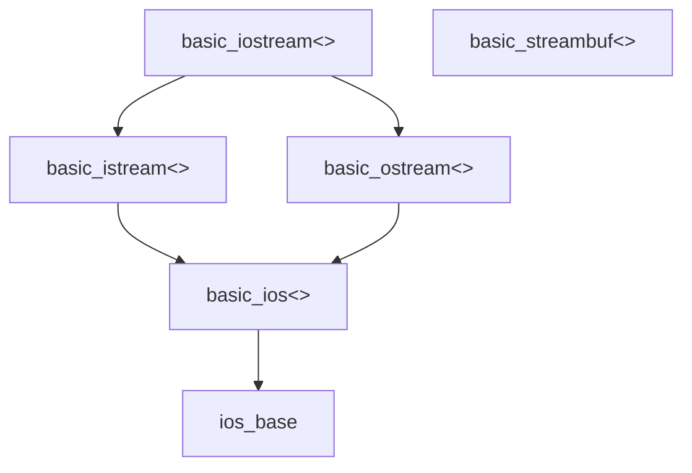


| 类                 | 说明                                               |
| ------------------ | -------------------------------------------------- |
| ios                | 流基类                                             |
| istream            | 通用输入数据流类，是其他输入流的基类               |
| ifstream           | 输入文件数据流类                                   |
| istream_withassign | cin对应的输入数据流类                              |
| istream            | 字符串输入数据流类                                 |
| ostream            | 通用输出数据流类，是其他输出数据流的基类           |
| ofstream           | 输出文件数据流类                                   |
| ostream_withassign | cout、cerr和clog对应的数据数据流类                 |
| ostrstream         | 字符串输出数据流类                                 |
| iostream           | 通用输入/输出数据流类，是其他输入/输出数据流的基类 |
| fstream            | 输入/输出文件数据流类                              |
| strstream          | 输入/输出字符串数据流类                            |
| stdiostream        | 标准I/O对应的输入/输出数据流类                     |
| streambuf          | 数据流缓冲区抽象基类                               |
| filebuf            | 磁盘文件数据流缓冲区类                             |
| strstreambuf       | 字符串数据流缓冲区类                               |
| stdiobuf           | 标准I/O文件数据流缓冲区类                          |
| iostream_init      | 预定义流的初始化类                                 |

## 流和缓冲区

C++程序把输入和输出看做字节流.输入时,程序从输入流中抽取字节;输出时,程序将字节插入到输出流中.

流充当了程序和流源或流目标之间的桥梁.

管理输入包含

*    将流与输入去向的程序关联起来
*    将流与文件连接起来

缓冲区是用作中介的内存块,将信息从设备传输到程序或从程序传输给设备的临时存储工具.

输出时,程序首先填满缓冲区,然后把整块数据传输给硬盘,并清空缓冲区,以备下一批输出使用.这被称为**刷新缓冲区**.

### 输出和指针

```cpp
char name[20]="Dudly Diddlemore";
cout<<name;
char *pn="Violet D'Amore";
cout<<pn;
```

## 输入用成员函数

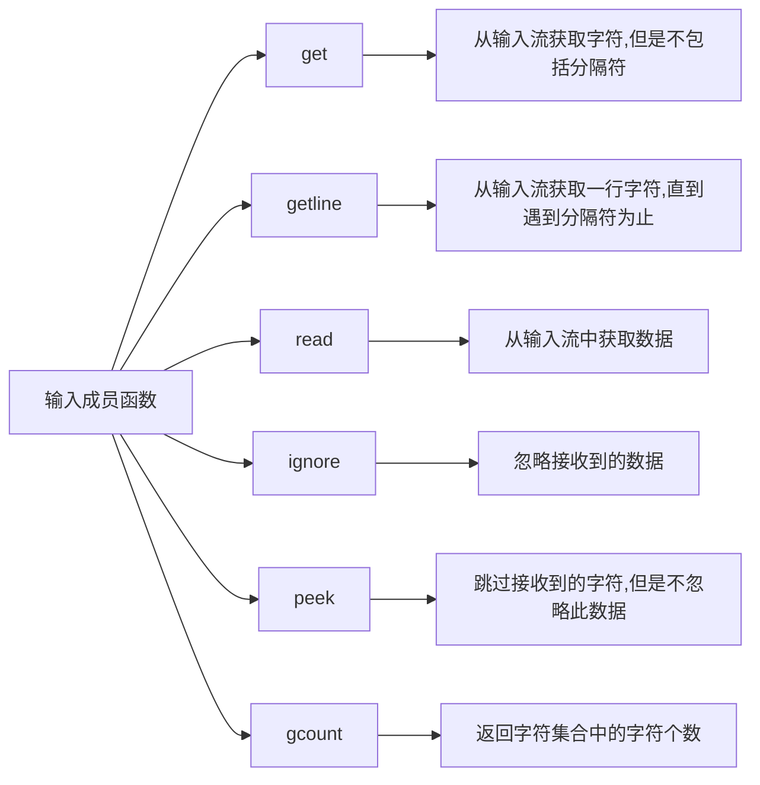

| 成员函数         | 读取直到            | 字符数    | 添加结束符号 | 返回值  |
| ---------------- | ------------------- | --------- | ------------ | ------- |
| get(s,num)       | 不包括new line或EOF | 最多num-1 | 是           | istream |
| get(s,num,t)     | 不包括t或EOF        | 最多num-1 | 是           | istream |
| getline(s,num)   | 包括new line或EOF   | 最多num-1 | 是           | istream |
| getline(s,num,t) | 包括t或EOF          | 最多num-1 | 是           | istream |
| read(s,num)      | EOF                 | num       | 否           | istream |
| readsome(s,num)  | EOF(end-of-file)    | 最多num   | 否           | count   |

### int istream::get()

*    读入下一个字符
*    返回读入的字符,或EOF
*    通常返回型别是traits:in_type.traits::eof()会返回EOF.对istream而言,返回型别是int,EOF则为常数EOF.因此对istream来说,此函数对应于C语言的getchar()或getc().
*    注意,返回值不一定是字符型别,可以是一种范围更大的数值型别,否则就不能根据相应实值区分EOF和一般字符.

### istream& istream::get(char& c)

*    把下一个字符设给参数c
*    返回stream; stream的状态可说明是否读取成胁

### istream& istream::get(char* str, streamsize count)

### istream& istream::get(char* str, streamsize count, char delim)

*    两种形式均可读取多达count-1个字符,并存入str所指的字符序列中
*    第一种形式的读取终止条件是,下一字符是相应字符集中的换行符号
*    第二种形式的读取终止条件是:下一字符是delim
*    两种形式均返回stream: strearm的状态可说明读入是否成功
*    不会读入终止符号delim
*    读入的字将序列以字符串终止符号为结尾
*    调用者必须保证str足够存入count个字符

### istream& istream::getline(char* str, streamsize count)

### istream& istream::getline(char* str, streamsize count, char delim)

*    读取count个字符,并存入字符申str中
*    返回stream, stream的状态可以说明读取是否成功
*    str内的字符串不会自动以字符串终止符号结束
*    调用者必须确保str有足够空间储存count个字符
*    读入过程中如果遇到end-of-file会出错,此时failbit会被设立(当然eofbit也有份)

### streamsize istream::readsome(char* str, streamsize count)

*    可读入多达count个字符,存入字符串str中
*    返回读取的字符个数
*    str内的字符串不会自动以字符串终止符号结束
*    调用者必须确保str有足够空间储存count个字符
*    与read()相反,readsome ()会读入stream buffer内的所有有效字符(利用buffer的成员函数in_avail() )
*    当我们不希望等待输入时,这很有用,因为输入来自键盘或其它行程(processes).遭遇end-of-file并不算错,也不会因此设立eofbit或failbit

### streamsize istream::gcount() const

*    返回上次“非格式化读取操作”所读入的字符个数.

### istream& istream::ignore()

### istream& istream::ignore(streamsize count)

### istream& istream::ignore(streamsize count, int delim)

*    所有形式均提取(exract)字符并舍弃不用
*    第一形式忽略(ignores)一个字符
*    第二形式可忽略多达count个字符
*    第三形式可忽略多达count个字符,直到提取并舍弃掉delim
*    如果count的值等于std::numeric_limits\<std::streamsize>::max() (这是型别std::streamsize的最大值),那么delim或end-of-file之前的所有字符均被舍弃
*    上述形式均返回strearm

### int istream::peek()

*    返回stream之内下一个将被读入的字符,但不真的把它读出来
*    下一次读取结果便是该字符(除非改变了读取位置) 
*    如果不能再读入任何字符,返回EOF
*    EOF即traits::eof( )的返回值;对istream来说就是常量EOF

### istream& istream::unget()

### istream& istream::putback(char c)

*    两者均把上一次读取字符放回stream,使之可被下一次读取(除非改变了读取位置)
*    两者的区别在于, putback()会检查传入的c是否确是上一次读取的字符
*    如果无法放回字符,或者putback ()发现待放字符不正确,就设立badbit,相应的异常可能被抛出
*    两函数可放回的最大字符数,由实作版本决定.C++ Stardard保证在两次读取之间允许你调用上述任一函数一次,并且具有可移植性

## 输出用成员函数

| 函数名  | 功能                   |
| ------- | ---------------------- |
| put()   | 向输出流插入单个字符   |
| write() | 向输出流插入一系列字符 |
| flush() | 缓冲输出流中的数据     |
| seekp() | 移动数据流中的指针位置 |
| tellp() | 获取输出流当前指针位置 |

### ostream& ostream::put(char c)

*    将参数c写至stream
*    返回stream.stream的状态可说明改写是否成功

### ostream& ostream::write(const char* str, streamsize count)

*    把字符串str中的count个字符写入stream
*    返回stream, stream的状态可说明改写操作是否成功
*    字符串终止符号并不会终止改写操作,它本身也会被写入steam
*    调用者必须确保str的确包含至少count个字符,否则可能导致无法预期的行为

### ostream& ostream::flush()

*    刷新(flushes) stream的缓冲区,也就是把所有缓冲数据强制写入其所属的设备或IO通道

## 布尔值的显示

| 标志        | 意义                                         |
| ----------- | -------------------------------------------- |
| boolalpha   | 若被设置，便以文字显示，否则以数字表示       |
| noboolalpha | 强制使用数字表示法（清除标志ios::boolalpha） |

## 数值进制

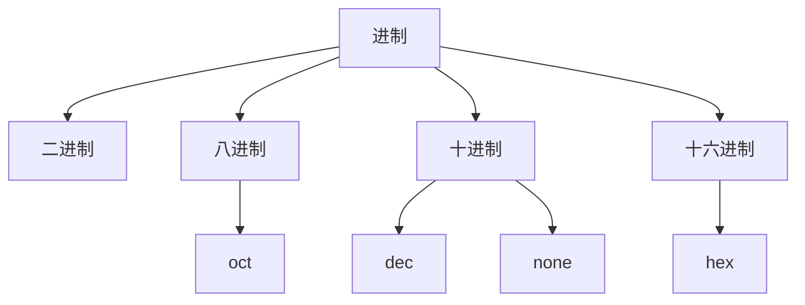

| 掩码      | 标志 | 意义                                 |
| --------- | ---- | ------------------------------------ |
| basefield | oct  | 以八进制进行读写                     |
|           | dec  | 以十进制进行读写                     |
|           | hex  | 以十六进制进行读写                   |
|           | none | 以十进制输出，读取时则视起始字符而定 |

### 切换进制

*    清除某个标志,然后设置另一个

```cpp
std::cout.numsetf(std::ios::dec);
std::cout.setf(std::ios::hex);
```

*    设置一个标志,同时自动清理同组的其他标志

```cpp
std::cout.setf(std::ios::hex,std::ios::basefield);
```

### 显示数字进制

| 标志       | 意义                                    |
| ---------- | --------------------------------------- |
| showbase   | 如果设置，就显示出数字进制              |
| noshowbase | 不显示数值进制（清除标志ios::showbase） |

## 拼接输出

```cpp
ostream&operator<<(type);
```

```cpp
string name="Mark";
cout<<"My name is "<<name<<endl;
```

## 流、缓冲区和iostream文件

iostream文件中包含一些专门设计用来实现、管理流和缓冲区的类.

*    streambuf类为缓冲区提供了内存,并提供了用于填充缓冲区、访问缓冲区内容、刷新缓冲区和管理缓冲区内存的类方法;
*    ios_base类表示流的一般特征,如是否可读取、是二进制流还是文本流等;
*    ios类基于ios-base,其中包括了一个指向streambuf对象的指针成员;
*    ostream类是从ios类派生而来的,提供了输出方法;
*    istream类也是从ios类派生而来的,提供了输入方法;
*    iostream类是基于istream和ostream类的,因此继承了输入方法和输出方法

---

*    cin对象对应于标准输入流.在默认情况下,这个流被关联到标准输入设备(通常为键盘).wcin对象与此类似,但处理的是whar_t类型.

```cpp
extern ostream cout;
```

*    cout对象与标准输出流相对应.在默认情况下,这个流被关联到标准输出设备(通常为显示器).wcout对象与此类似,但处理的是wchar_t类型.

```cpp
extern istream cin;
```

*    cerr对象与标准错误流相对应,可用于显示错误消息.在默认情况下,这个流被关联到标准输出设备(通常为显示器).这个流没有被缓冲,这意味着信息将被直接发送给屏幕,而不会等到缓冲区填满或新的换行符.wcerr对象与此类似,但处理的是whar_t类型.

```cpp
extern ostream cerr;
```

*    clog对象也对应着标准错误流.在默认情况下,这个流被关联到标准输出设备(通常为显示器).这个流被缓冲.wclog对象与此类似,但处理的是wchar_t类型.
*    对象代表流.当iostream文件为程序声明一个cout对象时,该对象将包含存储了与输出有关的信息的数据成员,如显示数据时使用的字段宽度、小数位数、显示整数时采用的计数方法以及描述用来处理输出流的缓冲区的streambuf对象的地址.下面的语句通过指向的streambuf对象将字符串"Bjarna free"中的字符放到cout管理的缓冲区中.

## 重载的<<运算符

|  头文件  |   使用方法   |            原型            |
| :------: | :----------: | :------------------------: |
| iostream | cout<<value; | ostream & operator<<(int); |

## put

|         原型         |       调用        |
| :------------------: | :---------------: |
| ostream & put(char); | cout.put().put(); |

## write

|                             原型                             |
| :----------------------------------------------------------: |
| basic_ostream<charT,traits>& write(const char_type* s, streamsize n); |

write()方法并不会在遇到空字符时自动停止打印字符,而只是打印指定数目的字符,即使超出了字符串的边界

## 刷新输入缓冲区

将换行符发送到缓冲区后,将刷新缓冲区.

如果实现不能在所希望时刷新输出,可以使用两个控制符中的一个来强制进行刷新.

| 控制符 |               含义               |     使用     |
| :----: | :------------------------------: | :----------: |
| flush  |            刷新缓冲区            | cout<<flush; |
|  endl  | 刷新缓冲区，并插入一个换行符('') | cout<<endl;  |

控制符也是函数

```c++
flush(cout);
```

ostream类对<<插入运算符进行了重载,使得下述表达式将被替换为函数调用flush(cout)

```c++
cout<<flush;
```

## 操控器

| 操控器 | 类别    | 意义                         |
| ------ | ------- | ---------------------------- |
| endl   | ostream | 输出'\n'，并刷新output缓冲区 |
| ends   | ostream | 输出'\0'                     |
| flush  | ostream | 刷新output缓冲区             |
| ws     | ostream | 读入并忽略空格               |

### ostream的output操作

```cpp
ostream& ostream::operator<<(ostream& (*op)(ostream&))
{
    return (*op)(*this);
}
```

### ostream的endl

```cpp
std::ostream& std::endl(std::ostream& strm){
    strm.put('\n');
    strm.flush();
    return strm;
}
```

### 自定义ignoreLine

```cpp
/*
 * io ignore
 */
template<class CharT, class traits>
inline basic_istream<CharT, traits> &ignoreLine(basic_istream<CharT, traits> &strm) {
    /*
     * skip until end-of-line
     */
    strm.ignore(numeric_limits<int>::max(), strm.widen('\n'));

    /*
     * return stream for concatenation
     */
    return strm;
}
```

## 用cout进行格式化

ostream插入运算符将值转换为文本格式.在默认情况下,格式化值的方式如下.

*    对于char值,如果它代表的是可打印字符,则将被作为一个字符显示在宽度为一个字符的字段中.

*    对于数值整型,将以十进制方式显示在一个刚好容纳该数字及负号(如果有的话)的字段中.

*    字符串被显示在宽度等于该字符串长度的字段中.

浮点数的默认行为有变化.下面详细说明了老式实现和新实现之间的区别.

*    **新式**:浮点类型被显示为6位,末尾的0不显示(注意,显示的数字位数与数字被存储时精度没有任何关系).数字以定点表示法显示还是以科学计数法表示(参见第3章),取决于它的值.具体来说,当指数大于等于6或小于等于一5时,将使用科学计数法表示.另外,字段宽度恰好容纳数字和负号(如果有的话).默认的行为对应于带%g说明符的标准C库函数fprintf().
*    **老式**:浮点类型显示为带6位小数,末尾的0不显示(注意,显示的数字位数与数字被存储时的精度没有任何关系).数字以定点表示法显示还是以科学计数法表示,取决于它的值.另外,字段宽度恰好容纳数字和负号(如果有的话).

### 访问格式标志的成员函数

| 成员函数         | 意义                                                      |
| ---------------- | --------------------------------------------------------- |
| setf(flags)      | 添设格式标志flags，返回所有标志的原本状态                 |
| setf(flags,mask) | 添设格式标志flags（配合掩码mask），返回所有标志的原本状态 |
| unsetf(flags)    | 清除flags                                                 |
| flags()          | 返回所有已设立的格式标志                                  |
| flags(flags)     | 将flags设为新的格式标志，返回所有标志的原本状态           |
| copyfmt(stream)  | 从stream中复制所有格式定义                                |
| width(w)         | 指定输出宽度为w个字符                                     |

### fmtfl 和 mask 参数可选值

| 标 志           | 作 用                                                        |
| --------------- | ------------------------------------------------------------ |
| ios::boolapha   | 把 true 和 false 输出为字符串                                |
| ios::left       | 输出数据在本域宽范围内向左对齐                               |
| ios::right      | 输出数据在本域宽范围内向右对齐                               |
| ios::internal   | 数值的符号位在域宽内左对齐，数值右对齐，中间由填充字符填充   |
| ios::dec        | 设置整数的基数为 10                                          |
| ios::oct        | 设置整数的基数为 8                                           |
| ios::hex        | 设置整数的基数为 16                                          |
| ios::showbase   | 强制输出整数的基数（八进制数以 0 开头，十六进制数以 0x 打头） |
| ios::showpoint  | 强制输出浮点数的小点和尾数 0                                 |
| ios::uppercase  | 在以科学记数法格式 E 和以十六进制输出字母时以大写表示        |
| ios::showpos    | 对正数显示“+”号                                              |
| ios::scientific | 浮点数以科学记数法格式输出                                   |
| ios::fixed      | 浮点数以定点格式（小数形式）输出                             |
| ios::unitbuf    | 每次输出之后刷新所有的流                                     |

### 用于存取格式标志的操控器

| 操控器              | 作用                                                     |
| ------------------- | -------------------------------------------------------- |
| setiosflags(flags)  | 将flags设为格式标志（调用相应的stream的setf(flags)）     |
| resetiosflags(mask) | 清除mask所标识的一组标志（调用相应stream的setf(0,mask)） |

### 修改显示时使用的计数系统

| 十进制 | 十六进制 | 八进制 |
| :----: | :------: | :----: |
|  dex   |   hex    |  oct   |

ostream类是从ios类派生而来的,而后者是从ios_base类派生而来的

>    ios_base类存储了描述格式状态的信息

```c++
hex(cout);
dex(cout);
oct(cout);
```

## 全局性的stream对象

| 类型     | 名称  | 用途                                |
| -------- | ----- | ----------------------------------- |
| istream  | cin   | 从标准input通道读入数据             |
| ostream  | cout  | 将一般数据写至标准output通道        |
| ostream  | cerr  | 将错误信息写至标准error通道         |
| ostream  | clog  | 将日志信息写至标准logging通道       |
| wistream | wcin  | 从标准Input通道读入宽字符数据       |
| wostream | wcout | 将宽字符一般数据写至标准output通道  |
| wostream | wcerr | 将宽字符错误信息写至标准error通道   |
| wostream | wclog | 将宽字符日志信息写至标准logging通道 |

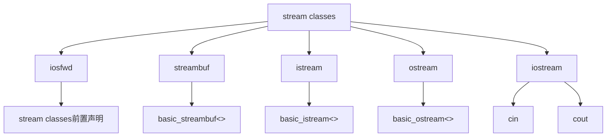

## 调整字段宽度

| 成员函数   | 意义                                        |
| ---------- | ------------------------------------------- |
| width()    | 返回当前的字段宽度                          |
| width(val) | 设立val为当前字段宽度，并返回先前的字段宽度 |

width()方法只影响将显示的下一个项目,然后字段宽度将恢复为默认值.

>    c++**永远不会截短数据**,如果试图在宽度为2的字段中打印一个7位值,c++将增宽字段,以容纳该数据

## 填充字符

用fill()成员函数来改变填充字符

| 成员函数 | 意义                                      |
| -------- | ----------------------------------------- |
| fill()   | 返回当前的充填字符                        |
| fill(c)  | 定义c为当前填充字符，并返回先前的充填字符 |

## 位置调整

| 掩码        | 标志     | 意义                       |
| ----------- | -------- | -------------------------- |
| adjustfield | left     | 靠右对齐                   |
|             | right    | 靠右对齐                   |
|             | internal | 符号靠左对齐，数值靠右对齐 |
|             | None     | 靠右对齐（缺省）           |

| 操控器     | 意义                              |
| ---------- | --------------------------------- |
| setw(val)  | 令val为I/O字段宽度，相当于width() |
| setfill(c) | 将c定义为充填字符，相当于fill()   |
| left       | 靠左对齐                          |
| right      | 靠右对齐                          |
| internal   | 符号靠左对齐，数值靠右对齐        |

## 正记号

| 标志      | 意义                   |
| --------- | ---------------------- |
| showpos   | 在正数前加上正记号     |
| noshowpos | 强制省略正数前的正记号 |

## 大写字符

| 标志        | 意义               |
| ----------- | ------------------ |
| uppercase   | 数值中强制字母大写 |
| nouppercase | 数值中强制字母小写 |

## 浮点数表示法

| 掩码       | 标志       | 意义                                   |
| ---------- | ---------- | -------------------------------------- |
| floatfield | fixed      | 使用小数计数法                         |
|            | scientific | 使用科学计数法                         |
|            | none       | 使用上述两者中最适合者（这是缺省情况） |

### 设置浮点数的显示精度

| 成员函数    | 意义                                  |
| ----------- | ------------------------------------- |
| precision() | 返回当前的浮点数精度                  |
| precision() | 令val为新的浮点数精度，并返回原设置值 |
| showpoint() | 总是书写小数点                        |

### 操控器

| 操控器            | 意义            |
| ----------------- | --------------- |
| showpoint         | 总是输出小数点  |
| noshowpoint       | 不需要小数点    |
| setprecision(val) | 以val为新的精度 |
| fixed             | 使用小数计数法  |
| scientific        | 使用科学计数法  |

## 打印末尾的0和小数点

```c++
cout.setf(ios_base::showpoint);
```

showpoint是ios_base类声明中定义的类级静态常量.必须加上作用域运算符(::)

## setf()

|                原型                |
| :--------------------------------: |
|      fmtflags setf(fmtflags);      |
| fmtflags setf(fmtflags, fmtflags); |

### fmtflags setf(fmtflags);

| 常量                | 含义                                  |
| ------------------- | ------------------------------------- |
| ios_base::boolalpha | 输入和输出bool值，可以为true或false   |
| ios_base::showbase  | 对于输出，使用c++基数前缀(0,0x)       |
| ios_base::showpoint | 显示末尾的小数点                      |
| ios_base::uppercase | 对于16进制输出，使用大写字母，E表示法 |
| ios_base::showpos   | 在正数前面加上+                       |

### fmtflags setf(fmtflags, fmtflags);

|      第一个参数      |      第二个参数       |              含义              |
| :------------------: | :-------------------: | :----------------------------: |
|    ios_base::dec     |  ios_base::basefield  |           使用基数10           |
|    ios_base::oct     |  ios_base::basefield  |           使用基数8            |
|    ios_base::hex     |  ios_base::basefield  |           使用基数16           |
|   ios_base::fixed    | ios_base::floatfield  |         使用定点计数法         |
| ios_base::scientific | ios_base::floatfield  |         使用科学计数法         |
|    ios_base::left    | ios_base::adjustfield |           使用左对齐           |
|   ios_base::right    | ios_base::adjustfield |           使用右对齐           |
|  ios_base::internal  | ios_base::adjustfield | 符号或基数前缀左对齐，值右对齐 |

在c++标准中,定点表示法和科学表示法都有下面两个特征

*    精度指的是小数位数,而不是总位数
*    显示末尾的0

setf()函数是ios_base类的一个成员函数.由于这个类是ostream类的基类,因此可以使用cout对象来调用该函数

```c++
ios_base::fmtflags old = cout.setf(,ios::adjustfield);
```

要恢复以前的设置,可以这样做

```c++
cout.setf(old,ios::adjustfield);
```

调用setf()的效果可以通过unsetf()消除,原型如下：

```c++
void unsetf(fmtflags mask);
```

mask是位模式,mask中所有的位都设置为1,将使得对应的位被复位.

>    setf()将位设置为1,unsetf()将位恢复为0

## skipws

*    调用>>读取数值时,自动跳过起始空格

## nounitbuf

*    每次输出后,清空output缓冲区

## 特殊类型的I/O

### bool

缺省情况下,布尔值(Boolean)的读入和打印均以数字表示.false对应0,true对应1.如果读入值既非0亦非1,就被认为错误,此时会设立ios::failbit,并可能抛出相应的异常.

### char和wchar_t

经由>>读入一个char或wchar_t字符时,缺省情况下会跳过起头的空格.,如果你想读入所有字符(包括空格) ,可清除skipws标志或利用成员函数get () 

### char*

C++标准程序库的string可根据需要扩张,能够容纳下相当长的字符串.以string代替char*可以让程序更轻松也更安全.此外string还提供了一个很方便的函数,可以一行一行读入.所以请尽量避免使用C字符串,多使用string.

### void*

操作符<<和>>为指针的打印和读入提供了一种可能.如果一个型别为void*的参数被传递至output操作符,其地址将被打印出来

形式则视实作版本而定.

### Stream Buffers (串流缓冲区)

操作符>>和<<可以直接用于读取或改写stream buffer

## 标准控制符

|   控制符    |                      调用                      |
| :---------: | :--------------------------------------------: |
|  boolalpha  |           setf(ios_base::boolalpha)            |
| noboolalpha |         unsetf(ios_base::noboolalpha)          |
|  showbase   |            setf(ios_base::showbase)            |
| noshowbase  |          unsetf(ios_base::noshowbase)          |
|  showpoint  |           setf(ios_base::showpoint)            |
| noshowpoint |         unsetf(ios_base::noshowpoint)          |
|   showpos   |            setf(ios_base::showpos)             |
|  noshowpos  |          unsetf(ios_base::noshowpos)           |
|  uppercase  |           setf(ios_base::uppercase)            |
| nouppercase |         unsetf(ios_base::nouppercase)          |
|  internal   | setf(ios_base::internal,ios_base::adjustfield) |
|    left     |   setf(ios_base::left,ios_base::adjustfield)   |
|    right    |  setf(ios_base::right,ios_base::adjustfield)   |
|     dec     |    setf(ios_base::dec,ios_base::basefield)     |
|     hex     |    setf(ios_base::hex,ios_base::basefield)     |
|     oct     |    setf(ios_base::oct,ios_base::basefield)     |
|    fixed    |   setf(ios_base::fixed,ios_base::basefield)    |
| scientific  | setf(ios_base::scientific,ios_base::basefield) |

## 头文件iomanip

|     控制符     |     含义     |
| :------------: | :----------: |
| setprecision() |   设置精度   |
|   setfill()    |   填充字符   |
|     setw()     | 设置字段宽度 |

## 流状态

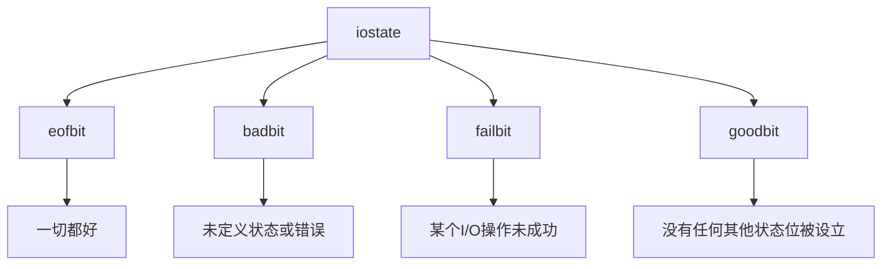

| 成员                     | 描述                                                         |
| ------------------------ | ------------------------------------------------------------ |
| eofbit                   | 如果到达文件尾，则设置为1                                    |
| badbit                   | 如果流被破坏，则设置为1                                      |
| failbit                  | 如果输入操作未能读取预期的字符或输出操作没有写入预期的字符，则设置为1 |
| goodbit                  | 另一种表示0的方法                                            |
| good()                   | 如果流可以使用（所有的位都被清除），则返回true               |
| eof()                    | 如果eofbit被设置，则返回true                                 |
| bad()                    | 如果badbit被设置，则返回true                                 |
| fail()                   | 如果badbit或failbit被设置，则返回true                        |
| rdstate()                | 返回流状态                                                   |
| exceptions()             | 返回一个位掩码，指出哪些标记导致异常被引发                   |
| exceptions( isostate ex) | 设置哪些状态将导致clear()引发异常；例如，如果ex是eofbit，则如果eofbit被设置，clear()将引发异常 |
| clear( iostate s)        | 将流状态设置为s；s的默认值为0（goodbit）；如果(restate()& exceptions())!= 0，则引发异常basic_ ios:: failure |
| setstate( iostate s)     | 调用clear（ rdstate()｜ s）。这将设置与s中设置的位对应的流状态位，其他流状态位保持不变 |

### 处理状态

| 成员函数        | 意义                                          |
| --------------- | --------------------------------------------- |
| good()          | 若stream正常无误,返回true (表示goodbit设立)   |
| eof()           | 若遭遇end-of-file,返回true (表示eofbit设立)   |
| fail()          | 若发生错误,返回true (表示failbit或badbit设立) |
| bad()           | 若发生毁灭性错误,返回true (表示badbit设立)    |
| rdstate()       | 返回当前已设立的所有标志                      |
| clear()         | 清除所有标志                                  |
| clear(state)    | 清除所有标志后,设立state标志                  |
| setstate(state) | 加设state标志                                 |

### I/O和异常

exceptions()方法返回一个位字段,它包含3位,分别对应于eofbit,failbit和badbit.修改流状态涉及clear()或setstate(),这都将使用clear().

修改流状态后, clear()方法将当前的流状态与exceptions ()返回的值进行比较.如果在返回值中某一位被设置,而当前状态中的对应位也被设置,则clear ()将引发ios_base:: failure异常.如果两个值都设置了badbit,将发生这种情况.如果exceptions ()返回goodbit,则不会引发任何异常.ios base:: failure异常类是从std::exception类派生而来的,因此包含一个what()方法.

#### Stream的状态和异常

##### Stream的异常相关成员函数

| 成员函数         | 意义                   |
| ---------------- | ---------------------- |
| exception(flags) | 设定“会引发异常”的标志 |
| exception()      | 返回引发异常的标志     |

*    要求stream对所有标志均抛出异常

```cpp
strm.exceptions(std::ios::eofbit | std::ios::failbit | std::ios::badbit);
```

### 流状态的影响

只有在流状态良好(所有的位都被清除)的情况下,才返回true

设置流状态位有一个非常重要的后果:流将对后面的输入或输出关闭,直到位被清除.

如果希望程序在流状态位被设置后能够读取后面的输入,就必须将流状态重置为良好.这可以通过调用clear()方法来实现

```c++
cin.clear();
```

### istream类方法

#### 使用cin进行输入

```c++
cin>>value_holder;
```

基本类型

|      基本类型      |
| :----------------: |
|   signed char &    |
|  unsigned char &   |
|       char &       |
|  unsigned short &  |
|       int &        |
|   unsigned int &   |
|       long &       |
|  unsigned long &   |
| long long &(c++11) |
|      float &       |
|      double &      |
|   long double &    |


典型运算符函数原型

```c++
istream & operator>>(int &);
```

可以将hex、oct和dec控制符与cin一起使用,来指定将整数输入解释为十六进制、八进制还是十进制格式.

```c++
cin>>hex;
```

在单字符模式下,>>运算符将读取该字符,将它放置到指定的位置.在其他模式下,>>运算符将读取一个指定类型的数据.也就是说,它读取从非空白字符开始,到与目标类型不匹配的第一个字符之间的全部内容.

#### cin方法

|          方法          |                             含义                             |
| :--------------------: | :----------------------------------------------------------: |
|       cin.get();       |         从输入流中读取一个字符，输入流的数据被取走。         |
|   cin.ignore(n,ch);    | 将输入流中取出一个一个字符，并且每取出一个字符都会进行比较操作，如果取出字符个数等于n停止操作，如果遇到ch字符也停止操作，这个函数可以用来比如消除上一次输入对下一次输入的影响。 |
| cin.getline(str,n,ch); | 从输入流从接收n个字符到str变量中，ch是结束字符如果不给出这个参数那就默认为'\0'，就是当遇到ch这个字符的时候停止接收。 |
|     cin.gcount();      |            获取一个字符变量中包括空白字符的个数。            |
|      cin.read();       |                      只能读取一行的内容                      |
|     cin.getlie();      |               不限定行数直到到达结束标志为止。               |
|      cin.peek();       | 假设要读取输入,直到遇到换行*或句点,则可以用peek ()查看输入流中的下一个字符,以此来判断是否继续读取: |
|      cin.gcount()      |           返回最后一个非格式化抽取方法读取的字符数           |
|     cin.putback()      | 将一个字符插入到输入字符串中，被插入的字符将是下一条输入语句读取的第一个字符。 |


#### 单字符输入

方法get (char&)和get (void)提供**不跳过空白**的单字符输入功能

函数get (char *, int, char)和getline(char *, int, char)在默认情况下**读取整行**而不是一个单词.

*    get(char &)

在使用char参数或没有参数的情况下, get()方法读取下一个输入字符,即使该字符是空格、制表符或换行符.get (char &ch)版本将输入字符赋给其参数,而get (void)版本将输入字符转换为整型(通常是int),并将其返回.

*    get(void)

get(void)成员函数读取空白,但使用返回值来输入传递给程序,返回类型为int,因此

```c++
char c1,c2,c3;
cin.get().get()>>c3;//not valid
```

cin.get()将返回一个int值,由于返回值不是类对象,因此不能对它应用成员运算符.会出现语法错误.

```c++
char c1;
cin.get(c1).get();//valid
```

cin.get(c1)返回cin,因此可以放在get()的前面

到达文件尾后,cin.get(void)都将返回EOF值,使得

```c++
int ch;
while((ch = cin.get())!=EOF){
//process input
}
```

##### cin.get(ch)与cin.get()

|           特征           |      cin.get(ch)      |   ch=cin.get()    |
| :----------------------: | :-------------------: | :---------------: |
|    传输输入字符的方法    |      赋给参数ch       | 将函数返回赋给ch  |
|  字符输入时函数的返回值  | 指向istream对象的引用 | 字符编码（int值） |
| 达到文件尾时函数的返回值 |      转换为false      |        EOF        |

###### 采用哪种单字符输入形式

*    首先,应确定是否希望跳过空白.如果跳过空白更方便,则使用抽取运算符>>.例如,提供菜单选项时,跳过空白更为方便.

*    如果希望程序检查每个字符,请使用get ()方法.在get()方法中, get (char &)的接口更佳.get (void)的主要优点是,它与标准c语言中的getchar ()函数极其类似,这意味着可以通过包含iostream (而不是stdio.h),并用cin. get()替换所有的getchar(),用cout. put(ch)替换所有的putchar(ch),来将C程序转换为C++程序.

#### 字符串输入getline()、get()和ignore()

```c++
istream & get(char *, int, char);
istream & get(char *, int);
istream & getline(char *, int, char);
istream & getline(char *, int);
```

*    第一个参数是用于放置输入字符串的内存单元的地址.

*    第二个参数比要读取的最大字符数大1(额外的一个字符用于存储结尾的空字符,以便将输入存储为一个字符串).

*    第三个参数指定用作分界符的字符,只有两个参数的版本将换行符用作分界符.

上述函数都在读取最大数目的字符或遇到换行符后为止.

get()和getline()之间的主要区别在于,

*    get()将换行符留在输入流中,这样接下来的输入操作首先看到是将是换行符
*    getline()抽取并丢弃输入流中的换行符

```c++
cin.ignore();
```

该函数接受两个参数:一个是数字,指定要读取的最大字符数;另一个是字符,用作输入分界符.

原型为

```c++
istream & ignore(int = 1, int = EOF);
```

#### 意外字符串输入

get (char *, int)和getline ()的某些输入形式将影响流状态.与其他输入函数一样,这两个函数在

*    遇到文件尾时将设置eofbit
*    遇到流被破坏(如设备故障)时将设置badbit
*    另外两种特殊情况是无输入以及输入到达或超过函数调用指定的最大字符数

| 方法                  | 行为                                                         |
| --------------------- | ------------------------------------------------------------ |
| getline( char *, int) | 如果没有读取任何字符（但换行符被视为读取了一个字符），则设置failbit如果读取了最大数目的字符，且行中还有其他字符，则设置failbit |
| get( char *, int)     | 如果没有读取任何字符，则设置failbit                          |

## 简单的文件I/O

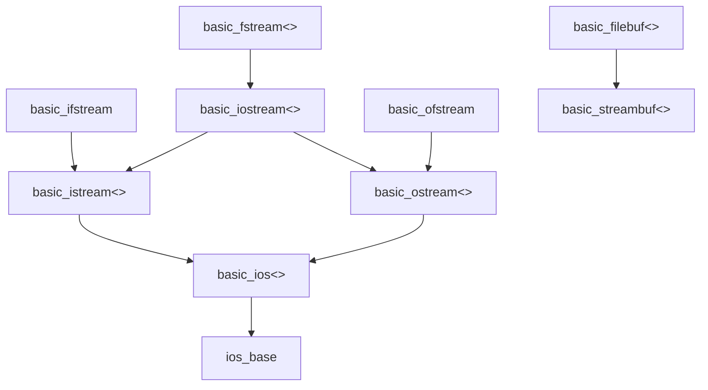

| 函数名    | 功能                                         |
| --------- | -------------------------------------------- |
| open()    | 打开文件并将其附加到filebuf对象              |
| close()   | 缓冲输出并关闭流对应的文件                   |
| setbuf()  | 将指定的预留区域附加到流的filebuf对象        |
| setmode() | 设置文件流的数据模式为二进制模式还是文本模式 |
| attach()  | 通过filebuf对象将数据流附加到打开的文件      |
| rdbuf()   | 获取数据流对应的filebuf对象                  |
| fd()      | 返回与数据流相连的文件描述                   |
| is_open() | 判断数据流对应的文件是否打开                 |

让程序写入文件

*    创建一个ofstream对象来管理输出流
*    将该对象与特定的文件关联起来
*    以使用cout的方式使用该对象,唯一的区别是输出将进入文件,而不是屏幕

读取文件

*    创建一个ifstream对象来管理输入流
*    将该对象与特定的文件关联起来
*    以使用cin的方式使用该对象

```c++
fin.close();
fout.close();
```

### 流状态检查is_open()

```c++
if(!fin.isopen()){...};
```

### rdbuf()

函数功能

rdbuf()可以实现一个流对象指向的内容用另一个流对象来输出

```cpp
cout << infile.rdbuf();//上面的代码就把infile流对象中的流重定向到标准输出cout上,您可以在屏幕上看到test.txt的内容.
```

### 命令行处理技术

文件处理程序通常使用命令行参数来指定文件.

命令行参数是用户在输入命令时,在命令行中输入的参数.

```c++
int main(int argc, char *argv []){...}
```

*    很多Windows IDE (集成开发环境)都有一个提供命令行参数的选项.通常,必须选择一系列菜单,才能打开一个可以输入命令行参数的对话框.具体的步骤随厂商和升级版本而异,因此请查看文档.
*    很多Windows IDE都可以生成可执行文件,这些文件能够在Windows命令提示符模式下运行.

### 文件模式

文件模式常量

| 常量             | 含义                     |
| ---------------- | ------------------------ |
| ios_base::in     | 打开文件，以便读取       |
| ios_base::out    | 打开文件，以便写入       |
| ios_base::ate    | 打开文件，并移到文件尾   |
| ios_base::app    | 追加到文件尾             |
| ios_base::trunc  | 如果文件存在，则截短文件 |
| ios_base::binary | 二进制文件               |

*    binary使得stream能够封锁特殊字符或字符序列(例如end-of-line或end-of-file)的转换.某些操作系统(例如MS-DOS或OS/2)的文字文件,每一行结束时以两个字符(CR和LF)表示.正常模式下(未设置binary)将以上述两个字符替换newline(换行)字符,反之亦然.如果处于二迸制模式(设置了binazy),就不会进行这样的转换

### C++文件开启意义

| ios_base       | 意义                                     | C模式 |
| -------------- | ---------------------------------------- | ----- |
| in             | 读取                                     | "r"   |
| out            | 清空而后改写（有必要时才产生）           | "w"   |
| out\|trunc     | 清空而后改写（有必要时才产生）           | "w"   |
| out\|app       | 添加（有必要时才产生）                   | "a"   |
| in\|out        | 读和写；最初位置在起始点（文件必须存在） | "r+"  |
| in\|out\|trunc | 先清空，再读写（有必要才产生）           | "w+"  |

### 打开关闭文件

| 成员函数         | 意义                       |
| ---------------- | -------------------------- |
| open(name)       | 以缺省模式打开file stream  |
| open(name,flags) | 以flags模式打开file stream |
| close()          | 关闭stream file            |
| is_open()        | 判断文件是否被打开         |

### 随机存取

随机存取指的是直接移动(不是依次移动)到文件的任何位置.随机存取常被用于数据库文件,程序维护一个独立的索引文件,该文件指出数据在主数据文件中的位置.这样,程序便可以直接跳到这个位置,读取(还可能修改)其中的数据.

如果文件由长度相同的记录组成,这种方法实现起来最简单.每条记录表示一组相关的数据.

```c++
finout.open(file,ios_base::in|ios_base::out|ios_base::binary);
```

| 类别            | 方法               | 意义                                   |
| --------------- | ------------------ | -------------------------------------- |
| basic_istream<> | tellg()            | 返回读取位置，返回-1代表错误           |
|                 | seekg()            | 设置“绝对读取位置”                     |
|                 | seekg(offset,rpos) | 设置“相对读取位置”                     |
| basic_ostream<> | tellp()            | 检查输出指针的当前位置，返回-1代表错误 |
|                 | seekp()            | 设置“绝对写入位置”                     |
|                 | seekp(offset,rpos) | 设置“相对写入位置”                     |

```c++
basic_istream<charT, traits>& seekg(off_type, ios_base::seekdir);
basic_istream<charT, traits>& seekg(pos_type);

istream &seekg(streamoff, ios_base::seekdir);
istream & seekg(streampos);
```

第一个原型定位到离第二个参数指定的文件位置特定距离(单位为字节)的位置

第二个原型定位到离文件开头特定距离(单位为字节)的位置

-    来看seekg ()的第一个原型的参数.

streamoff值被用来度量相对于文件特定位置的偏移量(单位为字节).streamoff参数表示相对于三个位置之一的偏移量为特定值(以字节为单位)的文件位置(类型可定义为整型或类).

seek_dir参数是ios_base类中定义的另一种整型,有3个可能的值.

常量ios_base : : beg指相对于文件开始处的偏移量.

常量ios_base: : cur指相对于当前位置的偏移量;常量ios base : : end指相对于文件尾的偏移量.下面是一些调用示例,这里假设fin是一个ifstream对象:

-    下面来看第二个原型.

streampos类型的值定位到文件中的一个位置.它可以是类,但如果是这样的话,这个类将包含一个接受streamoff参数的构造函数和一个接受整数参数的构造函数,以便将两种类型转换为streampos值.

streampos值表示文件中的绝对位置(从文件开始处算起).可以将streampos位置看作是相对于文件开始处的位置(以字节为单位,第一个字节的编号为0).

#### 相对位置常数

| 常数 | 意义                             |
| ---- | -------------------------------- |
| beg  | 位置是相对于开头(begginning)而言 |
| cur  | 位置是当前位置(current)而言      |
| end  | 位置是相对于结尾(end)而言        |

## 文件操作

### 创建文件

```cpp
#include <fstream>
std::fstream fout;
fout.open(FILENAME,OPTION);
```

### 删除文件

```cpp
#include <cstdio>
int remove(const char * filename);// 如果成功返回 0,失败返回“EOF”
```

```cpp
#include <io.h>
_unlink("delete_test.txt"); //删除这个文件
```

### 对文件重命名

```cpp
int rename(const char *old_filename, const char *new_filename)
```

### 打开文件

```cpp
FILE *fopen(const char *filename, const char *mode);// C样式
fstream fopen(const string filename, ios_mode);// C++样式
```

| mode | 含义                                                         |
| ---- | ------------------------------------------------------------ |
| r    | 读取文件打开。如果文件不存在或查找不到，则fopenO函数调用失败。 |
| w    | 打开空文件写入。如果指定的文件存在，则内容会被删除。         |
| a    | 打开文件，从文件尾开始添加内容，在向文件中写入新数据前不删除EOF标记。如果文件不存在，则创建文件。 |
| r+   | 打开文件，既可以从文件中读取，也可以向文件中写入，但是文件必须存在。 |
| w+   | 打开空文件，既可以从文件中读取，也可以向文件中写入，如果文件存在，则会删除其中的数据。 |
| a+   | 打开文件，既可以从文件中读取，也可以向文件中写入。在新数据被写入文件之前会移除EOF标记。当写入操作完成时，会恢复EOF标记。如果文件不存在， 则会创建新文件。 |

### 从文件读取数据

```cpp
size_t fread(
	void *buffer,//指定存储数据的本地存储空阔的指针
	size_t size,//指定存储区的大小
	size_t count,//指定要读取的数据项的最大个数
	FILE *stream//指向FILE结构的指针,是使用fopen（）函数打开的文件句柄
);
```

### 向文件写入数据

```cpp
size_t fwrite(
	const void *buffer,//指定存储数据的本地存储空阔的指针
    size_t size,//指定存储区的大小
    size_t count,//指定要读取的数据项的最大个数
    FILE *stream//指向FILE结构的指针,是使用fopen（）函数打开的文件句柄
);
```

### 关闭文件

```cpp
int fclose(FILE *stream);//如果成功关闭文件流, 则 fcloseO函数返回 0.
int _fcloseall(void);//_fcloseall()函数用于返回关闭的文件流的个数. 当关闭文件流发生错误时, 函数会返回 EOF.
```

## 使用文件描述符(File Descriptors)

文件描述符是个整数,用来辨识某个开启的I/O通道.在UNIX族系的操作系·统中,文件描述符被用于低层界面:操作系统提供的I/O函数.有三个文件描述符是预先定义好的

1.   0代表标准输入通道(standard input channe))
2.   1代表标准输出通道(standard output channel)
3.   2代表标准错误信息通道(standard eror channel)

### 连接Input Streams和Output Streams

#### 以tie()完成“松耦合” (Loose Coupling)

你可以把一个stream连接到一个output stream身上.这意味两者的缓冲区是同步的,其具体作法是: output stream将在另一个stream执行输入或输出操作前先清空自己的缓冲区.也就是说对output stream而言,其flush ()函数会被调用.

*    将一个strearm连接到另一个stream身上

| 成员               | 意义                                                         |
| ------------------ | ------------------------------------------------------------ |
| tie()              | 返回一个指针，指向一个output stream，该output stream将被连接到当前stream身上 |
| tie(ostream* strm) | 将strm所指的output stream连接到当前stream身上，并返回一个指针指向先前所连接的output stream |

#### 以stream缓冲区完成“紧糊合" (Tight Coupling)

rdbuf ()允许数个stream对象从同一个input通道读取信息,或者对同一个output通道写入信息,而不必困扰于I/O次序.

*    Stream缓冲区的存取

| 成员函数          | 意义                                                         |
| ----------------- | ------------------------------------------------------------ |
| rdbuf()           | 返回一个指针，指向stream缓冲区                               |
| rdbuf(streambuf*) | 将参数所指的stream缓冲区安装(installed)到当前stream身上，并指向一个指针，指向安装前的stream缓冲区 |

#### 将标准Streams重新定向(Redirecting)

IOstream程序库的早期实作版本中,全局性的streams如cin, cout,cerr和clog都是隶属于istream_withassign和ostream_withassign的全局对象.因此我们才有可能把这些streams赋值给其它streams,用以将streams重新定向. C++标准程序库已经将这种可能性别除,但仍然保留重定向的可能性,并扩及所有streams.现在,只要透过“设置stream缓冲区”就可以重定向某个stream

```cpp
std::ofstream file("[filename]");
std::cout.rdbuf(file.rdbuf);
```

#### 用于读写的Streams

```cpp
filebuf buffer;
ostream output(&buffer);
istream input(&buffer);
```

## String Stream Classes

### 继承关系


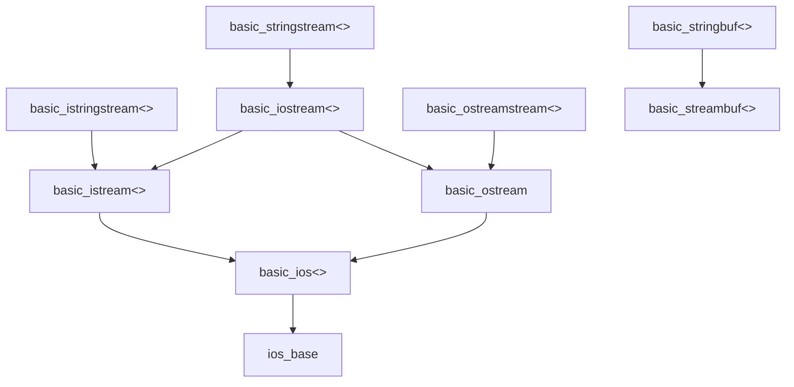

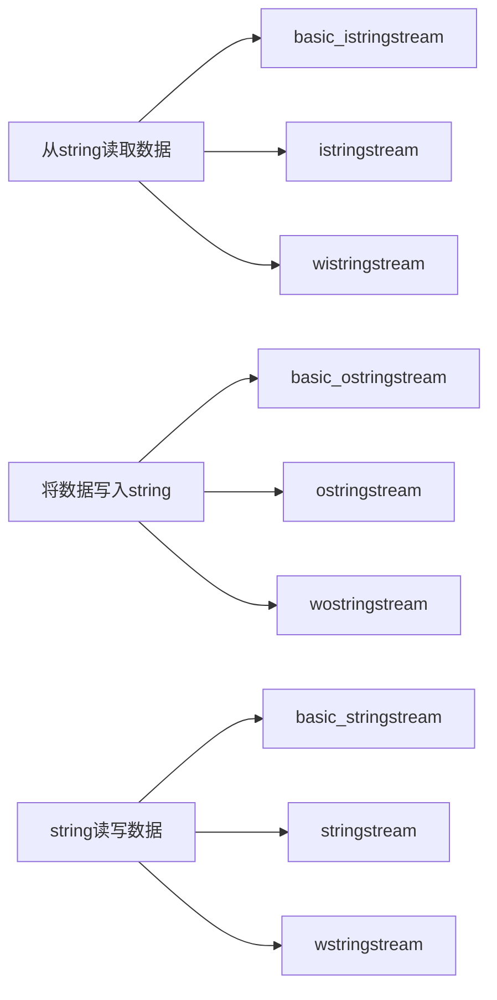

### str()

| 成员函数    | 意义                           |
| ----------- | ------------------------------ |
| str()       | 将缓冲区内容当做一个string返回 |
| str(string) | 将string设为缓冲区内容         |

* input string stream主要用途是“按格式,从现有字符串中读取数据”

### char* Stream Classes

char* stream classes只是为了向下兼容才被保留下来.它们的接口容易出错,不容易正确使用

本节采用术语“字符序列character sequence" ,而不说字符串string.是因为char*streamn classes所维护的字符序列并不总是以字符串终止符号作为结束,因此不能说它是一个真正的string

char* stream classes是特别为字符型别char而定义的,包括:

* class istrstream,用来从字符序列中读取数据.是一种input string stream
* class ostrstream,用来将数据写入字符序列.是一种output string stream
* class strstream,用来对字符序列进行读写操作
* class strstreambuf,用来当做char* streams的缓冲区

所有char* stream classes都在头文件<strstream\>中定义

使用char* stream作为字符串时必须十分小心,因v为它和string strearm不同,它并不负责储存字符序列所需的内存.

#### 原则

利用成员函数str(),字符序列可以和其调用者一起共同管理内存.除非stream被初始化为定长缓冲区(这么一来stream就不必负责) ,否则必须遵守下面三条原则:

1. 由于内存的拥有权移转给了调用者,所以如果strearm没有被初始化为定长缓冲区,那么字符序列将被释放.但我们无法确定内存是如何被分配的,在此情况下使用delete[]来释放字符序列并不安全.最安全的作法是调用成员函数freeze ()并给予参数false,将内存回传给stream
2. 如果调用str() , stream便不能再修改字符序列. Stream会暗中调用成员函数freeze (),它会冻结字符序列.当缓冲区不够大以至于需要分配新缓冲区时,这么做可以避免事情变得复杂
3. 成员函数str()不会附加字符串终止符号('\0') ,我们只有直接在stream内加上该特殊字符,才能结束字符序列.这可通过操控器(manipulator) ends完成.某些实作版本会自动添加字符串终止符号,但这种行为不具可移植性

## 二进制

### 读取文件

```cpp
///<summary>
///读取文件
///</summary>
///<returns></returns>
while (fin.read((char*)&pl, sizeof(pl))){
 cout << setw(20)<< pl.name << ": "<< setprecision(0)<< setw(6)<< pl.g << endl;
}
fin.close();
```

### 输入文件

```cpp
///<summary>
///输出文件
///</summary>
///<returns></returns>
fout.write((char*)&pl, sizeof(pl));
```
## 打印二进制文件内容

```cpp
while (fin.read((char*)&pl, sizeof(pl))){
 cout << setw(20)<< pl.name << ": "<< pl.population << setprecision(2)<< setw(6)<< pl.g << endl;
}
```

## 内核格式化

iostream族(family)支持程序与终端之间的1/0,而fstream族使用相同的接口提供程序和文件之间的1/0. C++库还提供了sstream族,它们使用相同的接口提供程序和string对象之间的1/0.也就是说,可以使用于cout的ostream方法将格式化信息写入到string对象中,并使用istream方法(如getline())来读取string对象中的信息.读取string对象中的格式化信息或将格式化信息写入string对象中被称为**内核格式化**(incoreformatting).下面简要地介绍一下这些工具(string的sstream族支持取代了char数组的strstream.h族支持).

头文件sstream定义了一个从ostream类派生而来的ostringstream类(还有一个基于wostream的wostringstream类,这个类用于宽字符集).如果创建了一个ostringstream对象,则可以将信息写入其中,它将存储这些信息.可以将可用于cout的方法用于ostringstream对象.

>    istringstream和ostringstream类使得能够使用istream和ostream类的方法来管理存储在字符串中的字符数据.

## "使用者自定义型别”之I/O操作符

### output和input操作符

在一个带有output操作符的表达式中,左操作数是stream,右操作数是待写对象:

```cpp
stream << object;
```

根据语法规则,上式有两种解释:

1. stream.operator << (object)
2. operator << (stream, object)

第一种方式用于内建(基本)型别.至于使用者自定义型别必须采用第二种方式,你需要做的就是针对你的自定义型别实作出全局性的operator<<

第一种方式缺点：

1. 由于标记式(signature)中使用了ostream,所以这个函数只适用于“字符型别为char”的streams.如果这个函数要在西欧或者北美使用,当然毫无问题.
2. 如果字段宽度(field width)被设定,会产生新的问题：得到的结果可能和预期不同.字段宽度会施行与紧随其后的改写操作中,此处将会施行于分子身上

* output操作符

```cpp
template<class charT, class traits>
inline basic_ostream<charT, traits> &operator<<(basic_ostream<charT, traits> &strm, const ClassObject &obj) {
    basic_ostringstream<charT,traits> s;
    s.copyfmt(strm);
    s.width(0);
    ...
    return strm;
}
```

* input操作符

```cpp
template<class charT, class traits>
inline basic_istream<charT, traits> &operator>>(basic_istream<charT, traits> &strm, ClassObject object) {
    ...
    return strm;
}
```

### 以非格式化函数完成使用者自定义操作符

C++标准程序库中的I/O操作符各有定义.面对这些操作符,普遍适用的方案是：先备妥经过处理的stream(准备用于实际I/O),再完成实际I/O及后续处理

Class basic_istream和basic_ostream都定义有一个辅助类别sentry(岗哨),其构造函数负责进行预处理,析构函数负责对应的后处理

如果某个I/O操作符使用了一个非格式化的I/O函数,或是直接对stream缓冲区进行操作,那么第一件事情就应该是构建一个对应的sentry(岗哨)对象,其余处理应该取决于该对象的状态

将sentry对象转换为bool,便可检测其状态

```cpp
sentry se(strm);		// indirect pre- and postprocessing
if(se){
    ...				   // the actual processing
}
```

### 使用者自定义格式标志(Format Flags)

Stream对象提供一种机制,可将数据关联到stream身上.这样的机制可以用来将相应数据关联起来,之后再取回.此一机制即可支持上述技术

Class ios_base定义有两个函数iword()和pword(),两者都以int参数为索引,分别存取特定的long&或void*&

其想法是以iword()/pword()分别存取储存在数组中的long/void*对象：将stream格式标志放在一个特定的位置上,该位置对所有stream而言都相同

iword()和pword()会返回int对象或void*对象的reference.这些references将持续有效,除非你针对相应的stream对象再次调用iword()或pword(),或是你销毁了stream对象.通常iword()和pword()返回的结果不需要保存.一般的共识是：这是一个速度很快的存取操作,尽管并无明确要求非采用数组不可

函数copyfmt ()会复制所有格式信息,包括iword ()和pword ()存取的数组.这可能会给某些对象带来问题——那些对象系储存于某个曾经运用pword ()的stream内).举个例子,如果某值为对象地址,那么被复制的将是地址而不是对象.如果只复制地址,一旦stream格式发生改变,其它stream的格式也会受影响.此外,如果一个stream用上pwora(),那么当它被销毁时,它所关联的对象最好一并销毁.所以对这样的对象而言,应该使用深拷贝(deep copy)而不是浅拷贝(shallow copy) 

los_base定义了一个回调(callback)机制,用以支持两种行为: (1)必要时执行深拷贝, (2)销毁stream时连带删除某个对象.函数register_callback()可用来注册某个函数,该函数会在某些特定操作发生于ios_base对象身上时被调用

```cpp
//get index for new ostream date
static const int iword_index = ios_base::xalloc();

//define manipulator that sets this data
ostream &fraction_spaces(ostream &strm) {
    strm.iword(iword_index) = true;
    return strm;
}
```


#### 调时间的发生原因

| 事件                   | 发生原因                            |
| ---------------------- | ----------------------------------- |
| ios_base::imbue_event  | 程序使用imbue()设定了一个locale     |
| ios_base::erease_event | stream被摧毁，或copyfmt()被执行起来 |
| ios_base::copy_event   | copyfmt()被执行                     |

### 惯例

* 你的输出格式应该让其它使用者能够以一个Input操作符无损地读取数据.尤其是strings,由于空格符的问题,几乎不可能实现这一点.是的, "strings内的空格符”很难和“两个string之间的空格符”区分开来.
* 进行I/O时,应考虑现有的stream格式规范,尤其在处理改写宽度的时候
* 如果产生错误,应设置相应的状态位(state flag)
* 如果发生错误,原对象不该有任何改变.如果读取多笔数据,读入的数据应该在被设为“被当做参数传递”的对象前,先储存于辅助对象中
* 输出不应该以new line符号结束,否则就不能在同一行输出其它对象了
* 即使数值太大,也应该完全读入.读完后再设置相应的错误标志.此时的返回值应具备特定意义,例如返回可容许的最大值
* 如果检测到某个格式错误(format error) ,应该尽可能不读取任何字符

## Stream Buffer Classes

stream并不负责实际读写操作,而是委托给stream buffer(缓冲区)完成

### 写入字符

| 成员函数   | 意义                                   |
| ---------- | -------------------------------------- |
| sputc(c)   | 将字符c送入stream缓冲区                |
| sputn(s,n) | 将字符序列s中的n个字符送入stream缓冲区 |

### 读取字符

| 成员函数     | 意义                                         |
| ------------ | -------------------------------------------- |
| in_avail()   | 返回有效字符的下界(lower bound)              |
| sgetc()      | 返回当前字符，不耗用它(without consuming it) |
| sbumpc()     | 返回当前字符并耗用它(consuming it)           |
| snextc()     | 耗用当前字符并返回下一个字符                 |
| sgetn(b,n)   | 读取n个字符，并将它们存储到缓冲区b           |
| sputbackc(c) | 将字符c返回stream缓冲区                      |
| sungetc()    | 退回至前一个字符                             |

### 其他Stream Buffer public函数

| 成员函数                      | 意义                                    |
| ----------------------------- | --------------------------------------- |
| pubimbue(loc)                 | 为stream缓冲区安装locale loc            |
| getloc()                      | 返回当前(current)的locale               |
| pubseekpos(pos)               | 将当前(current)位置重新设定为某决定位置 |
| pubseekpos(pos,which)         | 与上同，并可指定I/O方向                 |
| pubseekoff(offset,rpos)       | 将当前位置重新设定为另一位置的相对位置  |
| pubseekoff(offset,rpos,which) | 与上同，并可指定I/O方向                 |
| pubsetbuf(b,n)                | 影响缓冲行为                            |

### stream缓冲区迭代器

针对“无格式IO"使用stream成员函数的另一种做法就是:采用stream缓冲区的迭代器类别(iterator classes) .这些类别所提供的迭代器(1)符合input选代器和output迭代器的规格、(2)从stream缓冲区读取或写入单一字符.

```cpp
namespace std{
    template<class charT, class traits = char_traits<charT>>
        istreambuf_iterator;
    template<class charT, class traits = char_traits<charT>>
        ostreambuf_iterator;
}
```

#### Output Stream缓冲区迭代器

| 算式                                  | 效果                                                     |
| ------------------------------------- | -------------------------------------------------------- |
| ostreambuf_iterator<char>(ostream)    | 为ostream产生一个output stream缓冲区迭代器               |
| ostreambuf_iterator<char>(buffer_ptr) | 为buffer_ptr所指的缓冲区产生一个outputstream缓冲区迭代器 |
| *iter                                 | 无操作(no-op)，返回iter                                  |
| iter=c                                | 调用sputc(c)，对缓冲区写入字符c                          |
| ++iter                                | 无操作(no-op)，返回iter                                  |
| iter++                                | 无操作(no-op)，返回iter                                  |
| failed()                              | 判断output stream迭代器是否能够执行改写操作              |

#### Input Stream缓冲区迭代器

| 算式                                  | 效果                                                         |
| ------------------------------------- | ------------------------------------------------------------ |
| istreambuf_iterator<char>()           | 产生一个end-of-stream迭代器                                  |
| istreambuf_iterator<char>(istream)    | 为istream建立一个input stream缓冲区迭代器，并尽可能调用sgetc()读取第一个字符 |
| istreambuf_iterator<char>(buffer_ptr) | 为buffer_ptr所指向的input stream产生一个input stream缓冲区迭代器，并可能调用sgetc()读取第一个字符 |
| *iter                                 | 返回当前字符，也就是先前以sgetc()读取的字符（如果构造函数未执行读取操作，这里执行） |
| ++iter                                | 以submpc()读取下一字符，并返回其位置                         |
| iter++                                | 以submpc()读取下一字符，返回一个迭代器                       |
| iter1.equal(iter2)                    | 判断是否两个迭代器相等                                       |
| iter1 == iter2                        | 判断是否两个迭代器相等                                       |
| iter1 != iter2                        | 判断是否两个迭代器不相等                                     |

#### 使用者自定义的Stream缓冲区

##### 使用者自定义output缓冲区

| 指针    | 意义                                                       |
| ------- | ---------------------------------------------------------- |
| pbase() | output stream缓冲区的开始                                  |
| pptr()  | 当前写入位置                                               |
| epptr() | output缓冲区的结尾，指向“得被缓冲之最后一个字符”的下一位置 |

* pbase()至pptr()之间的序列字符（不包括pptr()所指字符）已被写至相应的输出通道,但尚未清空(flush)
* 成员函数spuc()可以写入一个字符,如果当时有个空的改写位置,字符就被复制到该位置上,然后,指向当前改写位置的那个指针值就会加1.如果缓冲区是空的(pptr()==epptr()),就调用虚函数overflow()将output缓冲区的内容发送到对应的输出通道去.这个函数能有效地把字符送至某种“外部表述”
* 基类basic_streambuf所实作的overflow只返回end-of-file,表示没有更多字符可被写入
* 成员函数sputn()可用来一次写入多个字符,这个函数把实际任务委派给虚函数xsputn(),后者可针对“多个字符”作出更有效的操作.通常“同时写入多个字符”会比“一次写入一个字符”效率高得多,所以sputn()可用来优化对字符序列的处理
* 对着一个stream缓冲区写入数据时不必一定得采取缓冲行为,而是可以令字符一到达就写入.此时default构造函数会自动将“维护write缓冲区”的指针被设为0或NULL

```cpp
#include <streambuf>
#include <locale>
#include <cstdio>
template<class charT, class traits = char_traits<charT>>
class 类名:public std::streambuf<charT,traits>{
protected:
    /*
    * central output function
    */
    virtual typename traits::int_type overflow(typename traits::int_type c){
        // TODO
    }
}
```

```cpp
#include <iostream>
#include <streambuf>

using namespace std;

class 类名 : public streambuf {
protected:
//    size of data buffer
    static const int bufferSize = 10;

//    data buffer
    char buffer[bufferSize];

public:
    /**
     * constructor
     * - initialize data buffer
     * - one character less to let the bufferSizeth character
     * cause a call of overflow
     */
    outbuf();

    /**
     * destructor
     * - flush data buffer
     */
    ~outbuf() override;

protected:
    /**
     * flush the characters in the buffer
     * @return
     */
    int flushBuffer();

    /**
     * buffer full
     * - write c and all previous characters
     * @param c
     * @return
     */
    int_type overflow(int_type c) override;

    /**
     * synchronize data with file/destination
     * * flush the data in the buffer
     * @return
     */
    int sync() override;
};
```

##### 使用者自定义Input缓冲区

函数sungetc()或sputbackc()可用来储存stream缓冲区最后一次读取前的状态.此外也可能需要读取下一字符而不移动读取位置.所以如果要实作出"从stream缓冲区读取"操作,那么和实作出"向stream缓冲区写入数据"的操作相比,你必须改写(override)更多函数

| 指针    | 意义                                                         |
| ------- | ------------------------------------------------------------ |
| eback() | input缓冲区起始位置,或者回退区的尾端.如果不采取特殊措施,字符最多只能被回退到这个位置 |
| gptr()  | 当前的读取位置                                               |
| egptr() | input缓冲区的尾端                                            |

* 函数sgetc()或sbumpc()可以读取单一字符,两者的差别在于后者会令"读取指针"前进,而前者不会.如果缓冲区读取完毕,就不再有可用字符了,此时缓冲区必须重新获得补给.这项工作可由虚函数underflow()完成,会负责读取数据.如果没有可用字符,函数sbumpc()会调用虚函数uflow(),而uflow()的缺省行为就是调用underflow(),并移动(前进)"读取指针".基类basic_streambuf的underflow()的缺省行为是令它返回EOF,意味着不可能以此缺省版本读取字符
* 函数sgetn()用于一次读取多个字符.这个函数把任务委派给虚函数xsgetn(),后者的缺省做法是简单地对每个字符调用sbumpc()
* 和output截然不同的是,对input而言,仅仅改写一个函数是不够的.要么就必须建立一个缓冲区,要么就至少实作出underflow()和uflow().这是因为underflow()不会将"读取指针"移到当前字符之后,但它可以被sgetc()调用.移至下一字符,需要以缓冲区操作函数或uflow()完成.无论如何,任何一个具备字符读取功能的stream缓冲区,都必须实作出underflow().如果underflow()和uflow()都实作了,就没有必要建立缓冲区

成员函数setg()可以建立一个read缓冲区,该函数有三个参数

| 指针    | 意义             |
| ------- | ---------------- |
| eback() | 指向缓冲区头部   |
| gptr()  | 指向当前读取位置 |
| egptr() | 指向缓冲区尾部   |

* 定义用来储存"将被回退给stream"的字符空间

## 与C标准串流同步

缺省情况下,八个C++标准stream(四个窄字符stream:cin,cout,cerr,clog,以及相应的宽字符版本)和C标准程序库中的相应文件(stdin,stdout,stderr)是同步的.clog和wclog缺省采用cerr,wcerr相同的stream缓冲区

C++标准程序库为ios_base定义了一个静态成员函数sync_with_stdio(),允许我们该用更好的实作法

| 静态函数               | 含义                                                         |
| ---------------------- | ------------------------------------------------------------ |
| sync_with_stdio()      | 判断标准的stream对象是否与标准的C streams同步,以一个可有可无的布尔值为参数,用以决定是否和标准C stream同步.如果要取消同步,可以false为参数(必须在任何I/O之前取消同步,否则会导致未定义的行为) |
| sync_with_stdio(false) | 取消C++ streams和C streams的同步:前提是必须在任何I/O操作前被调用 |

### stream缓冲区内的缓冲区机制

I/O是否具备缓冲能力,很大程度上影响了效率.格式化I/O操作所使用的函数,以stream缓冲迭代器(buffer iterators)来存取stream;而对stream缓冲迭代器做操作,比对指针做操作要慢.虽然差别不大,但也足够证明有必要对频繁的操作进行改善

#### 高效缓冲冲突因素

1. 不采用缓冲机制来实作stream缓冲区,往往更简单.如果stream并不常被使用,或只用于输出,那么缓冲机制也就不那么重要.但是一旦面对大量被使用的stream缓冲区,就应该毫不犹豫地实现缓冲机制
2. 每次输出操作完成后,标志unitbuf会提示output streams清空自己的stream.操控器flush和endl也会清空各自的stream.若为求得最佳性能,三者都应当避免
3. 运用函数tie()绑定某个stream,也会非必要地清空stream.因此非必要请勿绑定stream

#### 直接使用Stream缓冲区

class basic_istream和basic_ostream中,所有用于读写字符的成员函数都以同样方式在运作:首先构造相应的sentry对象,然后执行实际操作.sentry对象的构造可能导致:暴露潜在的绑定对象,忽略空格,一些与实作无关的行为

# Qt

## 下载地址

https://download.qt.io/

### 文件树结构

| 目录                 | 说明                                                         |
| -------------------- | ------------------------------------------------------------ |
| archive              | 各种 Qt 开发工具安装包，新旧都有（可以下载 Qt 开发环境和源代码）。 |
| community_releases   | 社区定制的 Qt 库，Tizen 版 Qt 以及 Qt 附加源码包。           |
| development_releases | 开发版，有新的和旧的不稳定版本，在 Qt 开发过程中的非正式版本。 |
| learning             | 有学习 Qt 的文档教程和示范视频。                             |
| ministro             | 迷你版，目前是针对 [Android](http://m.biancheng.net/android/) 的版本。 |
| official_releases    | 正式发布版，是与开发版相对的稳定版 Qt 库和开发工具（可以下载Qt开发环境和源代码）。 |
| online               | Qt 在线安装源。                                              |
| snapshots            | 预览版，最新的开发测试中的 Qt 库和开发工具。                 |

### 路径

archive->qt->qt版本

### 配置Clion环境

1. Tool chains Environment->D:\Qt5.14.0\Tools\mingw730_64
2. 设置环境变量->PATH添加qt\版本号\bin
3. https://blog.csdn.net/xiaoyou625/article/details/111710749配置教程

## Qt项目

* Qt Widgets Application,支持桌面平台的有图形用户界面(Graphic User Interface, GUI)界面的应用程序.GUI的设计完全依据C++语言,采用Qt提供的一套C++类库
* Qt Console Application,控制台应用程序,无GUI界面,一般用于学习C/C++语言,只需要简单的输入输出操作时可创建此类项目
* Qt Quick Application,创建可部署的Qt Quick应用程序
* Qt Canvas 3D Application,创建Qt Canvas 3D QML项目,也是基于QML语言的界面设计,支持3D画布
* QMainWindow是主窗口类,主窗口具有主菜单栏/工具栏和状态栏,类似于一般的应用程序的主窗口
* QWidget是所有具有可视化界面类的基类,选择QWidget创建的界面对各种界面组件都可以支持
* QDialog是对话框类,可建立一个基于对话框的界面

## UI文件设计和运行机制

### 项目文件组成

| 文件           | 后缀 | 含义                                        |
| -------------- | ---- | ------------------------------------------- |
| 项目组织文件   | .pro | 存储项目设置的文件                          |
| 主程序入口文件 | .cpp | 实现main()函数的程序文件                    |
| 窗体界面文件   | .ui  | 一个XML格式存储的窗体上的元件及其布局的文件 |

* .h是所设计的窗体类的头文件,.cpp是.h里定义类的实现文件
* 在C++里,任何窗体或界面组件都是用类封装的,一个类一般有一个头文件和一个源程序文件

### 项目设置文件

后缀为“.pro”的文件是项目的管理文件,文件名就是项目的名称

Qt类库以模块的形式组织各种功能的类,根据项目设计的功能需求,在项目中添加适当的类库模块支持

“Qt += core gui”表示项目中加入core gui模块.core gui是Qt用于GUI设计的类库模块,如果创建的是控制台(Console)应用程序,就不需要添加core gui

### 界面文件

* 组件面板
* 中间主要区域是待设计的窗体
* Signals和Slots编辑器与Action编辑器是位与待设计窗体下方的两个编辑器
* 布局和界面设计工具栏
* 对象浏览器
* 属性编辑器

### 主函数文件

main()函数是应用程序的入口.主要功能是创建应用程序,显示窗口,并运行应用程序,开始应用程序的消息循环和事件处理

### 窗体相关文件

| 文件        | 功能                                                         |
| ----------- | ------------------------------------------------------------ |
| widget.h    | 定义窗体类的头文件,定义了类Widget                            |
| widget.cpp  | Widget类的功能                                               |
| widget.ui   | 窗体界面文件,由UI设计器自动生成,存储了窗体上各个组件的属性设置和布局 |
| ui_widget.h | 编译后,根据窗体上的组件及其属性/信号与槽的关联等自动生成的一个类的定义文件,类的名称是Ui_Widget |


# 数据库开发

## 数据库发展史

1. 人工管理阶段
2. 文件系统阶段
3. 数据库系统阶段
4. 数据仓库阶段

> 数据仓库之父Bill Inmon对其定义为:数据仓库是一个面向主题的/集成的/相对稳定的/反映历史变化的数据集合,用于支持管理决策

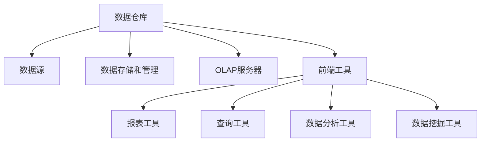

## 环境配置

1. 下载MySQL Community Server
   1. Windows (x86, 64-bit), ZIP Archive
   2. 选择 "No thanks, just start my download"
2. 安装MySQL
   1. 解压
   2. 添加环境变量PATH-"D:\MySQL\mysql-8.0.25-winx64\bin"
3. 安装数据库
   1. 管理员身份运行cmd
   2. 输入"mysqld --initialize --console" 
   3. 2021-07-03T04:20:27.416797Z 6 [Note] [MY-010454] [Server] A temporary password is generated for root@localhost: mIufXrjuc0+c,密码为mIufXrjuc0+c
   4. 输入"mysqld -install"
   5. "Service successfully installed."
   6. 输入"net start mysql"
   7. MySQL 服务正在启动 .
      MySQL 服务已经启动成功。
   8. (关闭服务输入"net stop mysql")
   9. (卸载服务输入"sc delete mysql")
   10. (删除MySQL)
       1. 删除MySQL文件
       2. 删除环境变量PATH
   11. 登录MySQL
       1. 输入"mysql -uroot -p"
       2. 输入密码"mIufXrjuc0+c"
       3. 初次修改密码
          1. 输入"alter user root@localhost identified by '1607575130';"
   12. 退出
       1. 输入"exit"
4. 安装可视化管理工具
   1. 安装SQLyog或者Navicat MySQL

## 数据库常见概念

* 数据(Data)是对现实世界事物的抽象.人们将现实世界中的事物进行抽象,定义成数据,并通过数据进行沟通.数据库处理的对象就是数据
* 数据库(Database)是存放数据的“库”.由数据和数据库对象组成.数据库对象指数据库中存储操作数据的对象
* 数据库管理系统(DBMS)是管理数据库的系统.可以实现数据库的创建/数据库的管理/数据库的存取和数据库的维护功能.使用数据库管理系统可以简化数据库设计的工作,提高开发效率
* 数据库系统由硬件/操作系统/数据库/数据库管理系统/编译系统/应用程序开发工具/数据库管理员/程序员和用户组成

### 数据库作用

* 结构化存储数据
* 使用数据库存储数据,数据冗余小,易扩充
* 保护数据的安全性
* 保护数据的完整性
* 并发控制

### 关系模型

* 关系:一个关系可以看作一张表
* 元组:也成为记录,表示表中一行
* 属性:称为字段,表示表中一列,列的名字成为属性名或字段名
* 主码:也称为关键字,唯一地标识一个元组的属性
* 域:属性的取值范围
* 分量:元组中的一个属性值,也称为字段值
* 关系模式:用关系名(属性名1,属性名2, …属性名n)方式描述关系

### 数据库的体系结构

* 外模式:也称为子模式或用户模式,是数据库用户看到的数据视图,它是呈现给应用的数据集合
* 模式:也称为逻辑模式,是数据在数据库中的逻辑结构和描述,是所有用户使用的公共数据视图,不会根据用户的不同发生变化
* 内模式:成为存储模式,是数据在数据库中的内部表示,即数据的物理结构和存储方式.独立于用户数据视图的


<center>数据库系统的体系结构</center>

### 基于关系模型的数据库

* 表:关系和数据库使用二维表格存储数据,将数据按照行和列相结合的方式存储
* 字段:关系表中的每一列成为字段.表是由多个字段共同组成的,每个字段表示某个方面的含义
* 记录:关系表中的每一行称为记录
* 主键:用于唯一标识每条记录的一个或多个字段的组合,表中任意两条记录的主键不可以重复
* 索引:表中单列或多列数据的排序列表,主要用在数据查询中,可以提高查询速度
* 关系:数据库中的各个表之间存在一定的关系,通过关系将各个表之间的数据联系起来

## 规范化理论

### 数据依赖

* X->Y,但是X函数不依赖于Y,则称X->Y是非平凡的函数依赖.默认情况下,都是指非平凡的函数依赖
* X->Y,则X叫做决定因素
* X->Y,Y->X,则记作X<->Y,
* 若Y不依赖于X,则记作X-/->Y
* 若X->Y,并且对于X的任何一个真子集X',都有X'->Y,则称Y对X完全函数依赖,记作X(f)->Y

> 函数依赖是针对一个关系模式下的所有可能的关系取值都必须满足的条件,并且这种依赖必须在任何时刻都成立,才可以成为关系模式满足函数依赖

### 范式

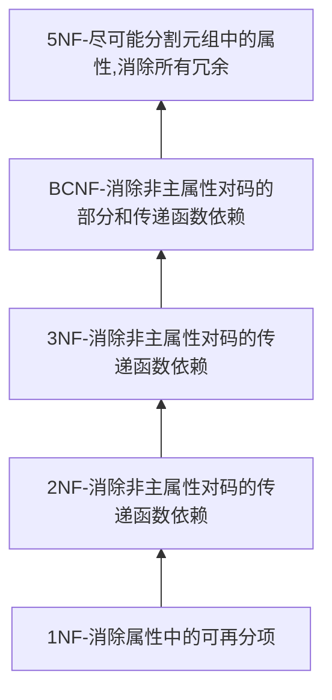

## E-R模型

### 设计

1. 抽象出需要的实体
2. 抽象出系统中的关系实体
3. 抽象细化实体的属性
4. 抽象细化关系实体的属性
5. 确定各个实体的主键
6. 确定各个实体之间的关系
7. 确定需要建立的索引

## 结构化查询语言SQL

### 特点

* 一体化
* 支持联机交互和嵌入语言两种使用方式,并且这两种方式的语法是统一的,为用户的使用和程序调试提供了方便
* 语言简洁,简单易学

### DDL

| 定义对象 | 创建         | 删除       | 修改        |
| -------- | ------------ | ---------- | ----------- |
| 表       | CREATE TABLE | DROP TABLE | ALTER TABLE |
| 视图     | CREATE VIEW  | DROP VIEW  |             |
| 索引     | CREATE INDEX | DROP INDEX |             |

### DML

SQL数据操纵语句(Data Manipulation Language, DML)用于完成数据查询和数据更新两种功能

数据查询功能包括查询语句(SELECT)

数据更新功能包括插入语句(INSERT)/删除语句(DELETE)和修改语句(UPDATE)

### DCL

| 对象类型 | 对象   | 操作权限                                               |
| -------- | ------ | ------------------------------------------------------ |
| TABLE    | 列     | SELECT/INSERT/UPDATE/DELETE/ALL PRIVILEGES             |
| TABLE    | 表     | SELECT/INSERT/UPDATE/DELETE/ALTER/INDEX/ALL PRIVILEGES |
| TABLE    | 视图   | SELECT/INSERT/UPDATE/DELETE/ALL PRIVILEGES             |
| DATABASE | 数据库 | CREATE TABLE                                           |

对于列和视图的操作权限有查询(SELECT)/插入(INSERT)/更新(UPDATE)和删除(DELETE)以及这四种权限总和

对于表的操作权限有查询(SELECT)/插入(INSERT)/更新(UPDATE)/删除(DELETE)/修改表(ALTER)和索引管理(INDEX)这六种权限总和

对于数据库的操作权限有创建表(CREATE TABLE)权限

在数据库中,使用DCL的GRANT语句授予用户对指定对象的指定权限

```mysql
GRANT <权限>[,<权限>...]
	[ON <对象类型><对象名>...]
	TO <用户>[,<用户>...]
	[WITH GRANT OPTION]
```

数据库管理员可以根据需要使用TEVOKE语句随时收回用户对指定对象的指定权限

```mysql
REVOKE <权限>{,<权限>...]
	[ON <对象类型><对象名>...]
	FROM <用户>[,<用户>...]
```

### 操作视图

视图是基于表的数据库外模式层次上的对象,所以操作最终会转换成对基本表的操作

* 视图可以简化用户查询数据的操作
* 视图可以使用户从不同角度查询同一数据
* 视图对保持数据的逻辑独立性提供了方法
* 视图能够保持对机密数据的保密

## Visual C++数据库接口

### 面向对象技术

关系型数据库的核心是将概念模型中的实体和关系都抽象成实体

### Windows平台下的数据访问接口

通用数据访问不需要将不同DMBS中的数据存储到单个数据库中,也不需要将数据库局限于单个数据库提供商.通用数据访问是具有广泛工业支持的开放的工业标准

#### ODBC

Microsoft Open Database Connectivity,开放数据互联,是一组工业标准,并且是Windows开放服务架构WOSA(Microsoft Windows Open Services Architecture)的一个组件

ODBC接口提供到各种不同的关系型数据库的接口,提供了极大的可操作性,即应用程序可以通过单个接口从数据源中访问数据,这使得应用程序可以独立于DBMS访问数据

#### OLE DB&ODBC

OLE DB跨组织的系统级数据编程接口,是访问所有数据种类的公开标准

ODBC用于访问关系数据库,而OLE DB设计用于访问包括关系型和非关系型数据源在内的所有数据种类,包括大型机ISAM/VSAM/层次数据库/E-mail和文件系统/文本/图像/地理数据/自定义业务等

ODBC定义了一组COM接口,这些接口完成对数据源的访问

#### ADO

Microsoft ActiveX Data Objects, ActiveX数据对象是对OLE DB接口的封装,以COM组件的形式供用户使用,提供统一的高效数据访问接口,支持多种开发环境(可以在主流的开发工具/数据库工具/开发语言和开发工具上使用)

优点是使用方便/速度快/占用内存小

#### DAO

Data Access Object,数据访问对象是微软特意为Microsoft Jet引擎数据库而设计的数据访问对象,对Microsoft Jet引擎的数据访问是非常高效的,同时还提供对ODBC的访问

#### RDO

Remote Data Object,远程数据对象是对ODBC接口的封装,以COM组件的形式供用户使用,主要是为远程数据访问而设计的

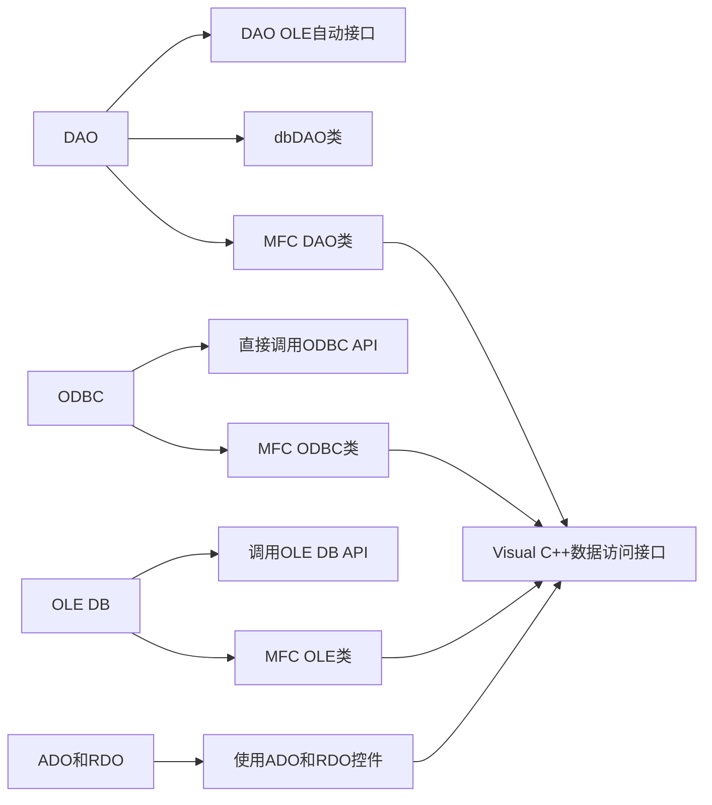

#### 用Visual C++访问数据库的优点

* 简单性:VC为数据访问提供了很多自定义接口,这些接口简单,易用,简化了程序开发的工作量
* 灵活性:VC根据数据源的不同,微数据访问提供了多种接口,用户可以根据自己的需要选择合适的接口
* 速度快
* 可拓展:VC提供的这些数据访问接口,大部分是独立于不同数据源的,因此用户可以抛开底层数据源的限制,编写统一的数据库应用程序,即使当数据源发生变化时,也不需要改动应用程序

## Visual C++中SQL Server访问技术


# 多线程

## 线程

在传统的操作系统中,每个进程都有自己的地址空间和一个执行线程,该线程通常叫<u>主线程</u>(primary thread).一般而言,运行在同一个进程中的多个线程具有相同的地址空间(即进程的地址空间),在准并行上下文中,这些线程就像是多个单独运行的进程,只不过它们的地址空间相同.

## _tmain()和 main()

首先,这个_tmain()是为了支持unicode所使用的main一个别名而已.

既然是别名,应该有宏定义过的,在哪里定义的呢？就在那个让你困惑的<stdafx.h>里,有这么两行：

```c++
#include <stdio.h>
#include <tchar.h>
```

我们可以在头文件<tchar.h>里找到_tmain的宏定义

```c++
#define  _tmain  main
```

所以,经过预编译以后, _tmain就变成main了

main()是标准C++的函数入口.标准C++的程序入口点函数,默认字符编码格式ANSI

函数签名为：

```c++
int main();
int main(int argc, char* argv[]);
```

<u>_tmain()是windows提供的对unicode字符集和ANSI字符集进行自动转换用的程序入口点函数</u>

函数签名为:

```c++
int _tmain(int argc, _TCHAR *argv[])
```

(1)当你程序当前的字符集为unicode时,int _tmain(int argc, TCHAR *argv[])会被翻译成

```c++
int wmain(int argc, wchar_t *argv[])
```

wmain也是main的另一个别名,是为了支持二个字节的语言环境

(2)当你程序当前的字符集为ANSI时,int _tmain(int argc, TCHAR *argv[])会被翻译成

```c++
int main(int argc, char *argv[])
```

>    我们需要实现一个程序的入口点: main函数.前面提到过, ANSI签名用main.Unicode签名用wmain,编译器根据项目属性页的预处理器定义确定签名用tmain.对于控制台应用程序, main函数有以下4种不同的原型:
>
>    -    int tmain(int argc, TCHAR* argv[])
>    -    void tmain(int argc, TCHAR* argv[])
>    -    int tmain (void)
>    -    void tmain (void)

## 事件处理器和消息传递窗口

事件处理器是操作系统调用的一个函数,每次都发送某种类型的消息

大多数应用程序都有窗口或窗体,每个窗口都要有自己的事件处理器,一旦在窗口中发生事件都要调用事件处理器.

```cpp
#include <windows.h>
```

## WinMain函数

-    声明窗口过程原型

```cpp
IRESUTT CALLBACK WndProc (HWND hWnd, UINT uMsg. WPARAM wParam, LPARAM lParam);
```

-    程序入口点

```cpp
int WINAPI WinMain(HINSTANCE hThis, HINSTANCE hPrev, LPSTR szCmdLine, int iCmdShow)
```

注意,在返回类型(int)后面有一个WINAPI宏,它表示一种调用约定(calling convention).

WTNAPI或stdcall意味着栈的清理工作由被调函数来完成.WinMain是函数名,该函数必须有4个参数,而且参数的顺序要与声明中的顺序相同.

|   参数    | 含义                                                         |
| :-------: | :----------------------------------------------------------- |
|   hThis   | 应用程序当前实例的句柄                                       |
|   hPrev   | 应用程序上一个实例的句柄。hPrev参数一定是NULL，应该是为了兼容旧版本的windows操作系统,所以没有写明当前版本的值。 |
| scCmdLine | szCndLine或应用程序的命令行,包括该程序的名称                 |
| iCmdShow  | 控制如何显示窗口                                             |

接下来,在WinMain的函数体中,用UNREFPERENCED RARAMETER宏告诉编译器不使用某些参数,方便编译器进行一些额外的优化.

```cpp
UNREFERENCED_PARAMETER( hPrev );
UNREFERENCED_PARAMETER( szCmdLine );
```

-    WINDCLASSEX窗口结构的实例化代码wndx

```cpp
WNDCLASSEX wndEx={0 };
```

-    下面的代码定义了在实例化窗口类后分配的额外字节数cbClsExtra

     ```cpp
     wndEx.cbClsExtra = 0;
     ```

-    窗口结构的大小cbsize

```
wndEx.cbsize = sizeof( wndEx)
```

-    实例化窗口实例后分配的额外字节数cbwndExtra

```cpp
wndEx.cbWndExtra = 0;
```

-    窗口类背景画刷的句柄hbrBackground

```cpp
wndEx.hbrBackground = (HBRUSH)(COLOR_WINDOW +1);
```

-    窗口类光标的句柄hCursor

```cpp
wndEx.hCursor = LoadCursor( NULL, IDC_ARROW );
```

-    窗口类图标的句柄hIcon/hIconSm

```cpp
wndEx.hIcon = LoadIcon( NULL, IDI_APPLICATION );
wndEx.hIconSm = LoadIcon( NULL, IDI_APPLICATION );
```

-    包含窗口过程的实例句柄hInstance

```cpp
wndEx.hInstance = hThis;
```

-    指向窗口过程的指针lpfnWndProc

```cpp
wndEx.lpfnWndProc = WndProc;
```

-    指向以空字符结尾的字符串或原子的指针lpszClassName

```cpp
wndEx.lpszClassName = TEXT ("GUIProject");
```

-    指向以空字符结尾的字符串的指针,该字符串指定了窗口类菜单的资源名lpszMenuName

```cpp
wndEx.lpszMenuName = NULL;
```

-    窗口类的样式

```cpp
wndEx.style = CS_HREDRAW | CS_VREDRAM;
```

-    注册一个窗口类,供CreateWindow或CreateWindowEx函数稍后使用

```cpp
if(!RegisterClassEx(&wndEx)){
 return -1;
}
```

-    CreateWindowAPI创建一个重叠、弹出的窗口或子窗口.它指定该窗口类、窗口标题、窗口样式、窗口的初始位置和大小(可选的).该函数还指定了窗口的父窗口或所有者(如果有的话),以及窗口的菜单.

```cpp
HWND hWnd = CreateWindow( wndEx.lpszClassName, TEXT("GUI Project"), WS_OVERLAPPEDWINDOW,200,200,400,300, HWND_DESKTOP, NULL, hThis,0);
if (!hwnd ){
 return -1;
}
```

-    如果指定窗口的更新域未被填满,UpdateWindow函数就向窗口发送一条WM_PAINT消息,更新指定窗口的客户区.该函数绕过应用程序的消息队列,向指定窗口的窗口过程直接发送一条WM_PAINT消息.

     ```cpp
     UpdateWindow( hWnd );
     ```

-    下面的代码设置指定窗口的显示状态

```
Showwindow( hwnd, icmdshow);
```

-    我们还需要一个MsG结构的实例来表示窗口消息

```cpp
MSG msg = {0 };
```

接下来,进入一个消息循环.

>    Windows中的应用程序是事件驱动的,它们不会显式调用函数来获得输入,而是等待系统把输入传递给它们.系统把所有的输入传递给应用程序的不同窗口.每个窗口都有一个叫做窗口过程的函数,当有输入需要传递给窗口时,系统调用会调用该函数.窗口过程处理输入,并把控制权返回系统.

-    GetMessageAPI从主调线程的消息队列中检索信息

```cpp
while ( GetMessage(&msg, NULL, NULL, NULL )){
	//把虚拟键消息翻译成字符消息
 TranslateMessage(&msg);
//分发一条消息给窗口过程
 DispatchMessage(&msg);
}
```

>    当关闭应用程序或发送一些触发其退出的命令时,系统会释放应用程序消息队列.这意味着该应用程序不会再有消息,而且while循环也将结束.

-    DestroyWindowAPI销毁指定的窗口.该函数向指定窗口发送WM_DESTROY和WM_NCDESTROY消息,使窗口无效并移除其键盘焦点(keyboard focus).此外,该函数还将销毁指定窗口的菜单,清空线程的消息队列,销毁与窗口过程相关的计时器,解除窗口对剪切板的所有权,如果该窗口在查看器链的顶端,还将打断剪切板的查看器链.

```cpp
DestroyWindow( hWnd );
```

-    注销窗口类,释放该类占用的内存

```cpp
UnregisterClass( wndEx.lpszClassName, hThis );
```

-    下面的return函数从应用程序消息队列中返回一个成功退出代码或最后一个消息代码

```cpp
return (int) msg.wParam;
```

## CreateProcess

```cpp
#define CreateProcess  CreateProcessW
CreateProcessW(
 _In_opt_ LPCWSTR lpApplicationName,
 _Inout_opt_ LPWSTR lpCommandLine,
 _In_opt_ LPSECURITY_ATTRIBUTES lpProcessAttributes,
 _In_opt_ LPSECURITY_ATTRIBUTES lpThreadAttributes,
 _In_ BOOL bInheritHandles,
 _In_ DWORD dwCreationFlags,
 _In_opt_ LPVOID lpEnvironment,
 _In_opt_ LPCWSTR lpCurrentDirectory,
 _In_ LPSTARTUPINFOW lpStartupInfo,
 _Out_ LPPROCESS_INFORMATION lpProcessInformation
);
```

example:

```cpp
STARTUPINFO startupInfo = {0 };
PROCESS_INFORMATION processInformation = {0 };
BOOL bSuccess = CreateProcess(TEXT("C:\\Windows\\notepad.exe"), NULL, NULL, NULL, FALSE, NULL, NULL, NULL,&startupInfo,&processInformation);
```

createProcess函数用于创建一个新进程及其主线程.新进程在主调进程的安全上下文中运行.

操作系统为进程分配进程标识符.集成标识符用于标识进程,在进程终止之前有效.

最初线程的线程标识符由进程分配,该标识符可用于在OpenThread中打开一个线程的句柄.线程标识符在线程终止之前有效,可作为系统中线程的唯一标识.这些标识符都返回<u>PROCESS_INFORMATION</u>结构中.

主调线程可以使用<u>WaitForInputIdle</u>函数,在新进程完成其初始化且正在等待用户输入时等待.

CreateProcess不会等到新进程完成初始化才返回

ExitProcess函数用于终止进程,给所属进程中的所有DLL发送一条即将终止的通知.

>    只要进程中有一个线程调用ExitProcess函数,<u>该进程的其他线程都会立即终止</u>,根本没机会执行其他代码

## 进程和线程的概念

进程是执行程序的实例.每个进程都有自己的虚拟地址空间和控制线程.

线程是操作系统调度器分配处理器时间的基础单元.

<u>随着时间的推移,虽然进程有不同程度的进展,但是在每一时刻,单核CPU只运行一个进程.</u>

并行实体能共享一个地址空间和它们的所有数据,这是执行并发的必要条件.

引发创建进程的主要事件：

-    系统初始化
-    正在运行的进程执行创建过程的系统调用
-    用户要求创建新进程
-    启动批处理作业

## 进程处于的3种状态

-    运行

该进程正在使用CPU

-    就绪

该进程可运行,但是它暂时停止让其他进程运行

-    阻塞

在某些外部事件发生前,该进程不能运行

>    运行和就绪,处于这两种状态的进程都可以运行,只是在就绪状态中,进程暂时没哟CPU可用.阻塞状态,即使CPU空闲,进程也不能运行.

### 进程的实现

进程控制块储存了高效管理进程所需的许多不同数据项

PCB是操作系统为了管理进程,在内核中设置的一种数据结构.绝大多数操作系统程序都要访问和修改它.通常,要根据PCB为进程构建数据.

-    进程标识数据
-    进程状态数据
-    进程控制数据

#### Winternl.h

winternl.h头文件包含了大部分Windows内部函数的原型和数据表示

## 进程间通信(IPC)

两个或更多实体读取或写入某共享数据的情况,最终的结果取决于进程的执行顺序,称为<u>竞态条件</u>.

程序中能被访问共享内存的部分叫做<u>临界区</u>.为了避免竞态条件,必须确保一次只能有一个进程进入临界区.

要使用共享数据,必须处理好下面4个条件：

-    不允许同时有两个进程在临界区内
-    不得对CPU的速度或数量进行假设
-    在临界区外运行的进程不得阻碍其他进程
-    不得有任何进程处于永远等待进入临界区

# 参考

*    Stephen Prata. C++ Primer Plus（第6版）中文版（异步图书）(C和C++实务精选).人民邮电出版社.
*    [黑山共和国]米洛斯·留莫维奇（Milos Ljumovic）. C++多线程编程实战.人民邮电出版社.
*    visual C++ 编程实战宝典
*    C++标准程序库(中文版)

# 附录

## 使用CMake缺少libstdc++-6.dl

在CMakeLists.txt中加入 

```cpp
set(CMAKE_EXE_LINKER_FLAGS "-static")
```

## 万能头文件<bits/stdc++.h>

```cpp
#include <bits/stdc++.h>
```

## 中文乱码

在CMakeLists.txt中加入 

```cpp
set(CMAKE_CXX_FLAGS "${CMAKE_CXX_FLAGS} -Wall -fexec-charset=GBK")
```

