[toc]

# course AZNQ

## 启动 <u>*Vivado*</u>

运行下列命令，启动 Vivado

```
source /opt/Xilinx/Vivado/2017.4/settings64.sh
vivado &
```


# TSN相关标准

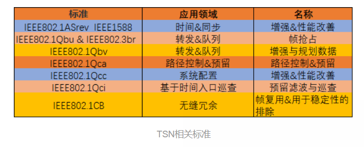

TSN是由IEEE 802.1 TSN任务组制定的一系列IEEE 802以太网子标准集，该任务组成立于2012年，由IEEE 802.1 AVB(audio video bridging，音视频桥接）任务组改名而成。AVB工作组致力于解决音频视频数据在以太网介质上传输时的时延较高、抖动较大、传输不确定等问题。TSN通过`无缝冗余等机制`扩展了AVB技术的性能，为网络提供有界低时延、低抖动和极低数据丢失率的能力。

时间敏感型网络( time sensitive network，TSN) 是 目前国际产业界正在积极推动的全新工业通信技术。时间敏感型网络允许`周期性与非周期性数据`在同一网络中传输，使得标准以太网具有确定性传输的优势，并通过厂商独立的标准化进程，已成为广泛聚焦的关键技术。

# 实时通信技术的发展

## 总线时代

早在 20 世 纪 70 年 代，随着可编程逻辑控制器 ( programmable logic controller，PLC) 的产生，为了分布 式控制所需的总线也诞生。至今，总线技术已经发展 了近 50 年，各始创公司开发了多种总线，其在介质、信 号电平、校验方式、物理接口、波特率等多个指标方面 都有不同。20 世纪 90 年代，随着竞争的加剧，各公司 在 IEC 争取主导地位，产生了“总线之争”。IEC 因此 产生了多达 18 个总线标准，对访问造成很大障碍。 

## 实时以太网阶段

进入 21 世纪，随着标准以太网成本的下降，总线开始进入基于以太网的实时网络时代。2001 年，贝加莱推出了工业应用的 Ethernet POWEＲLINK; 2003 年， 在 Profibus 基 础 上，Siemens 开 发 了 PＲOFINET， Ｒockwell、ABB 开发了基于 DeviceNet 应用层协议的 Ethernet /IP，Beckhoff 开发了 EtherCAT，Ｒexroth 开发了 基于 SEＲCOS 的 SEＲCOSIII。这些网络均采用了标准以太网介质，即在物理层和数据链路层统一了标准，而在应用层仍然保持原有的应用层，旨在保护用户的软件资产投入。 

## 在智能时代的网络融合需求

2014 年以后，随着工业 4． 0 的提出，工业物联网、 智能制造的需求逐渐变得迫切，对于连接的需求产生 了变化。传统的以太网通常不支持交换机网络( 考虑 到延时，通常采用 HUB 的透传方式) ，其轮询机制( 如 Profinet、POWEＲLINK、Ethernet /IP) 或集束帧技术( 如 EtherCAT、SEＲCOSIII) 使得标准以太网和实时以太网无法在同一网络中进行数据的传输。但是，对于 边缘计算、工业物联网、智能制造的全局优化而言， 制造现场控制所需的实时性数据和生产管理与优化层所需的非实时性数据要通过统一网络进行集中， 在统一的数据平台进行数据处理与分析，并能够下发到各个控制器执行; 而一些全局优化的工作并不需要通过层级的控制器，而是希望直接到边缘侧或者云端。这使得同一网络的需求变得迫切。另外， 对于制造业的终端用户而言，生产系统往往由来自不同企业的设备与系统构成，必须有统一的网络与协议规范。因此，独立于厂商的总线在智能时代变得更为必要。

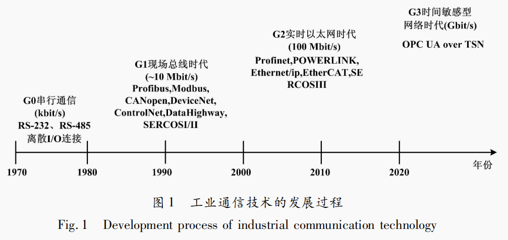

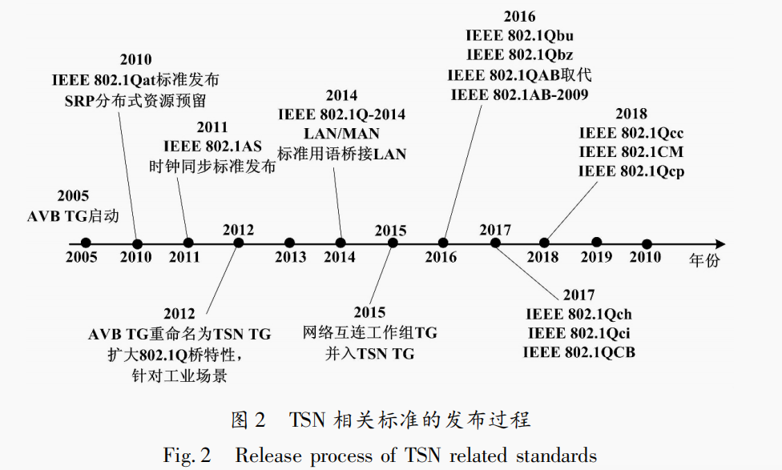

# TSN 基本概念

TSN 由一系列技术标准构成。其主要分为时钟同 步、数据流调度策略( 即整形器) 以及 TSN 网络与用户 配置三个部分相关标准

## VLAN 技术

按照网络架构，网络通常分为标准以太网、确定性以太网。TSN 实现了混合网络的数据传输能力，满足标准以太网的分布式对等架构、确定性网络所采用的轮询/集束帧技术各自的存在的要求，并使得网络能够发挥各自的优势功能。TSN 基于 IEEE 802．1Q的虚拟局域网( virtual local area network，VLAN) 和优先级标准。 

IEEE 802． 1Q 支持服务质量( quality of service，QoS) 。 QoS 是一种基础网络技术，用于为网络通信提供更好的 服务。它是一种网络安全机制，用于解决网络延时与拥 塞的问题。最初的 Internet 并未设计 QoS 机制。为满足 用户不同应用的服务质量需求，需要网络能够根据用户 需求进行配置与资源调度。IEEE 802． 1Q 标准是一种 包含了 QoS 机制的网络，能够提供网络性能的可预知 性，并有效分配网络带宽，以便合理利用资源。 

### TSN

TSN 是 IEEE 802． 1Q 标准的 VLAN。该标准在标 准以太网帧中插入 4 个字节用于定义其特征。TSN 的 标签位定义如图 3 所示。 

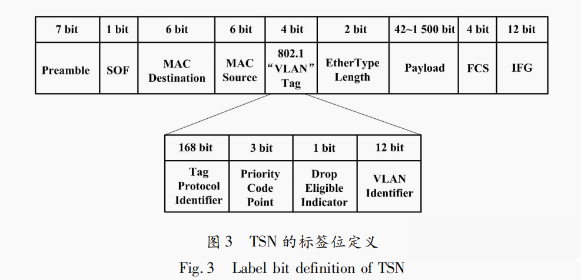

①标签协议识别: 网络类型识别，代表这是一个 TSN网络，标记 0X8100。 

②优先级代码( priority code point，PCP) 由 3 位代码构成。 

③丢弃标志位: 对于网络低 QoS 要求的数据，可以丢弃，以确保高优先级数据的 QoS。 

④VLAN Identifier( VID) : VLAN 网络的识别号，12 位表示可支持的子网数量，2 的 12 次方即 4 096，VID = 0 用于识别帧优先级，4 095 ( FFF) 作为预留值。所以， VID 最多可以表示 4 094 个子网。这表明 TSN 是为了 大型的数据传输而设计的。 

### 优先级的定义

TSN 有一个服务等级( class of service，CoS) 的概念。对 TSN 网络而言，不同优先级的服务对应图 3 中 的 PCP 码。3 位 PCP 码定义了 0( 最低) ～ 7( 最高) 这 8 个优先级，传输类型分别对应基础、最大努力、卓越努力、严苛应用、延时和抖动小于 100 ms 的视频、延时 和抖动小于 10 ms 的音频、内部网络控制、网络控制。 其会对网络场景进行不同的匹配，是后续调度、配置设计中会考虑到的数据流调度因素。 

### TSN 在 ISO/OSI 模型中的位置

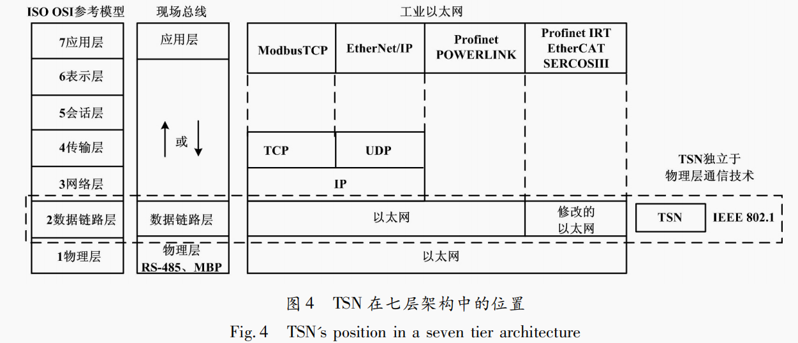

## 精确时钟同步与延时计算

对于通信、工业控制等领域而言，所有的任务都是 基于时间基准的。因此，精确时钟同步是基础的标准。 TSN 首先要解决网络中的时钟同步与延时计算问题， 以确保整个网络的任务调度具有高度一致性。 

### 时钟同步机制

IEEE 802．1AS 是基于 IEEE 1588 V2 精确时钟同步协议发展的，称为 gPTP-广义时钟同步协议。gPTP 是一个分布式主从结构，它对所有 gPTP 网络中的时钟与主时钟进行同 步。首先由`最佳主时钟算法` ( best clock master algrothms，BCMA) 建立主次关系，分别称 为主时 钟 ( clock master，CM) 和 从 时 钟 ( clock slave， CS) 。每 个 gPTP 节 点 会 运 行 一 个 gPTP Engine。 IEEE1588 所采用的 PTP 是由网络的 L3 和 L4 层的 IP 网络传输，通过 IPv4 或 IPv6 的多播或单播进行分发时 钟信息。而 gPTP 则是嵌入在 MAC 层硬件中，只在 L2 工作，直接对数据帧插入时间信息，并随着数据帧传输 到网络每个节点。 

gPTP 应用 `快速生成树协议` ( papid spanning tree protocol，ＲSTP) 。这是一种`网络中的节点路径规划`，网 络配置后生成一个最优路径。其由 TSN 桥接节点计 算并以表格形式分发给每个终端节点存储。当一个TSN 节点要发送数据时，它会先检查这个表格，计算最 短路径，整个网络以最短路径传送至需要接收的节点。 

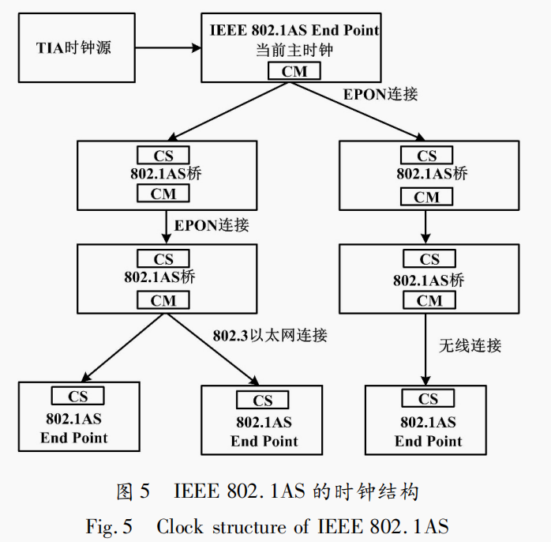

802． 1AS 的核心在于`时间戳机制`( Timestamping) 。 PTP 消息在进出具备 802． 1AS 功能的端口时，会根据协议触发对本地实时时钟( real time clock，ＲTC) 采样，并 将自己的 ＲTC 值与来自该端口相对应的 CM 信息进行 比较; 利用路径延时测算和补偿技术，将 ＲTC 时钟值匹 配到 PTP 域的时间。当 PTP 同步机制覆盖整个 AVB 局域网，各网络节点设备间就可以通过周期性的 PTP 消息 的交换，精确地实现时钟调整和频率匹配算法。最终， 所有的PTP节点都将同步到相同的“挂钟”( Wall Clock) 时间，即主节点时间。在最大7跳的网络环境 中，理论上 PTP 能够保证时钟同步误差在1 μs 以内。

IEEE 802．1AS-rev 则是一种`多主时钟体系`，主要 优势是支持新的连接类型( 如 WiFi) 、改善冗余路径的 支持能力、增强了时间感知网络的主时钟切换时间等 性能。当有一个 GrandMaster 宕机时，其可确保快速切 换到一个新的主时钟，以便实现高可用性系统。对于 车载系统而言，采用 IEEE 802． 1AS 即可; 而对于工业 领域则考虑高可用性，采用 AS-Ｒev 版本。 

###  TSN 网络中的延时测量方法

对于网络时钟而言，其时`钟同步精度`主要取决于 `驻留时间`( residence time) 和`链路延时`( link latency) 。 

在 gPTP 中，时 间 同 步 的 过 程 与 IEEE Std 1588- 2008 采用相同的方式: 主时钟发送同步时间信息给所 有直接与其连接的时间感知系统。这些时间感知系统 在收到这个同步时间信息后必需通过加上信息从主时 钟传播到本节点的传输时间来修正同步时间信息。如 果这个时间感知系统是一个时间感知网桥，则它必需向与它连接的其他时间感知系统转发修正后的同步时间信息( 包含额外的转发过程的延时) 。

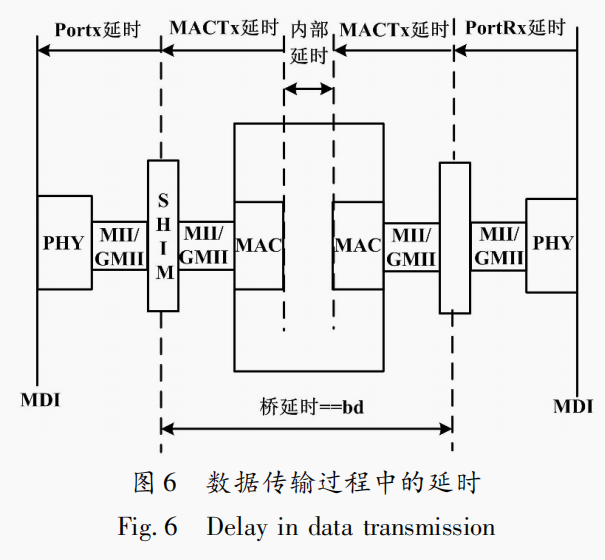

为了保证上述过程正常工作，整个过程中有两个 时间间 隔 必 需 精 确 已 知: 

- `转发延时`(驻留时间); 
- 同步时间信息在两个时间感知系统之间的`传输路径的延时`。

驻留时间是在时间感知网桥内部测量的，比 较简单; 而传输路径上的延时则取决于诸多因素，包括 介质相关属性和路径长度等。

对于每一类型的局域网或传输路径，有不同的方 法来测量传播时间。`但这些方法都基于同一原理: 测 量从一个设备发送某个消息的时间以及另一个设备接 收到此消息的时间，然后以相反方向发送另一个消息， 并执行相同的测量。`

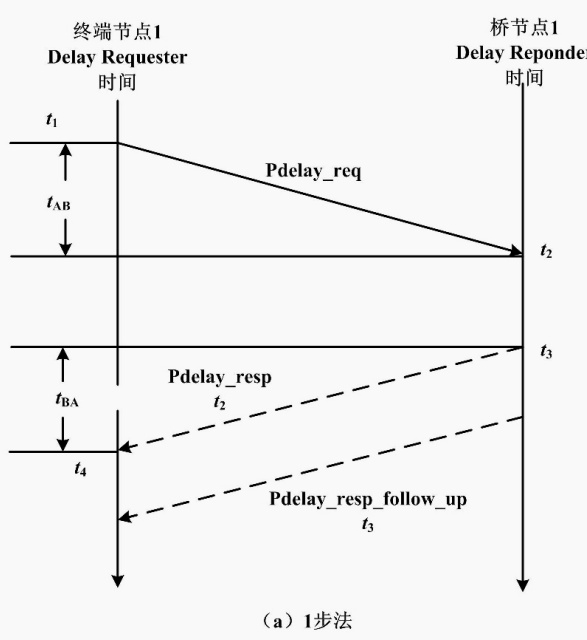

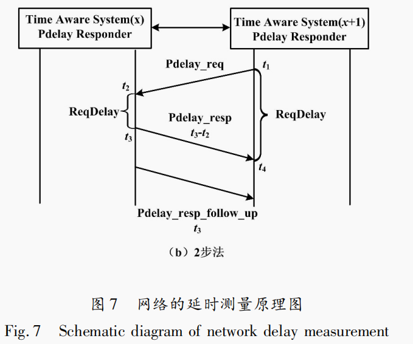

即
$$
P_{delay}=\frac{(t4-t1)-r(t3-t2)}{2},其中r=\frac{f_{requestor}}{f_{responder}}
$$
`网络的延时测量有 1 步法和 2 步法两种。`因为在这个网络中可能有一个节点无法提供准确的时钟。对于时间感知型节点而言，由于时间信息是随着数据载荷发送的，因此每个节点都会带有时间信息。而对于有一些非时间感知网络，则需要在发送数据帧后再向另一个节点发送一个发送的时间信息。因此，IEEE 802. 1AS-Ｒev 增强了对1步法的支持，使得实时性得以提高。 

## 网络传输过程

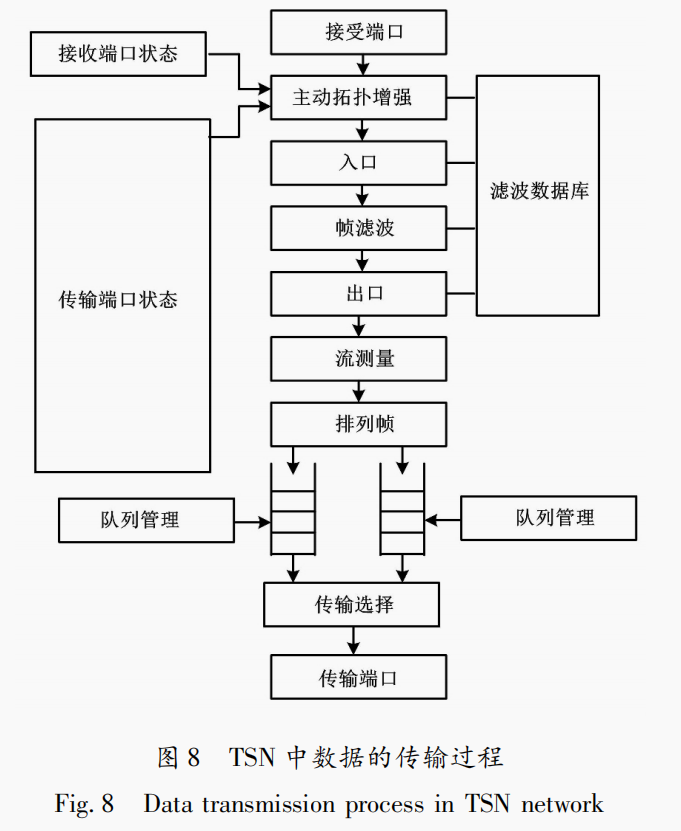

对于 TSN 而言，其`数据调度机制`是关键。

网络数据通过接收端口，进行帧滤波、流量计量、帧排队。在传输选择部分，TSN 的调度机制将发挥作用。IEEE 802． 1Q工作组定义了不同的`整形器`( Shaper) 机制来实现这些调度。 它是一种传输选择算法 ( transmission selection algorithm，TSA) 。每种算法对应一种调度机制，适用于不同的应用场景。

## 流预留协议

网络存在`滤波数据库`、`传输端口` `状态监测`、`队列管理`。这些都用于解决网络资源分配与调度问题。而 IEEE 802． 1Qat所采用的`流预留协议 ( stream reservation protocol，SＲP) `机制是一个对 TSN 进行配置的标准。其在 2010 年 SＲP 标准化成为 IEEE 802． 1Qat，并入 IEEE 802． 1Q-2011 标准中。SＲP定义 了OSI 模型第2层的流概念。 

SＲP 的工作在于建立 AVB 域、注册流路径、制定 AVB 转发规则、计算延时最差情况、为 AVB 流分配带 宽。`SＲP在于让网络中的发言者( Talker)用合适的网络资源将数据发送给听者( Listener)，并在网络中传播这些信息。`而在终端节点之间的网桥则维护一个发言者 对一个或多个听者注册的相同数据流的路径带宽等资源的需求记录。SＲP是在原有 IEEE 802． 1Qak-MＲP 多 注册协议之上的一个实现。SＲP标准则提供了一个新的`多协议注册协议`( multiple multicast registration protocol，MMＲP) 来管理相关流带宽服务的属性，MSＲP、 MVＲP、MMＲP 提供了整个 SＲP 协议的网络信号处理过程。

# 流控制相关标准

`IEEE 802． 1Qav 定义了时间敏感流转发与排队 ( forwarding and queuing for time-sensitive streams， FQTSS) 的数据敏感性转发机制，并成为了 IEEE 802．1Q的标准。`作为一个主要对于传统以太网 排队转发机制的增强标准，最初它的开发主要用于限 制 A/V 信息缓冲。增强的突发多媒体数据流会导致 较大的缓冲拥堵，并产生丢包。丢包会产生重新发包， 使得服务体验下降。它采用了基于信用的整形器 ( credit-based shaper，CBS) ，以应对数据突发和聚集，可限制爆发的信息。 

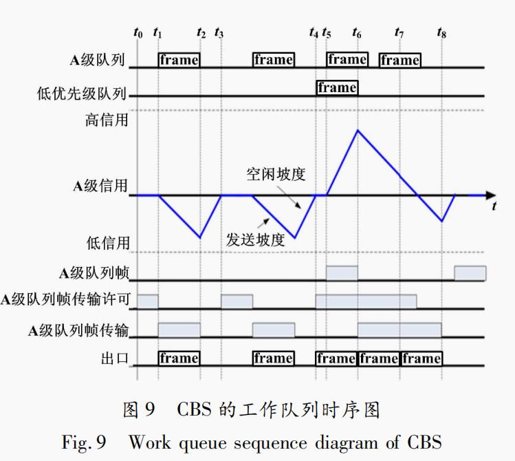

CBS 将 队 列 分 为 Class A( Tight delay bound) 和 Class B( Loose delay bound) 。如果没有数据传输，队列的信用设置为 0，`A 队列的信用非负时可以传输`。如果有数据传输，其信用将按照 SendSlope 下降，而另一 个队列则IdelSlope 速度上升，idleSlope 是 实际带宽 ( bit /s) ，而 SendSlope 是端口传输率，由 MAC 服务支 持。CBS 控制每个队列最大数据流不超过配置的带宽 限制( 75% 最大带宽) 。

## 时间感知整形器机制TAS

`时间感知整形器( time awareness shaper，TAS)` 是 为了更低的时间粒度、更为严苛的工业控制类应用而设计的调度机制，目前被工业自动化领域的企业所采用。TAS 由 IEEE 802． 1Qbv 定义，是基于预先设定的周期性门控制列表，动态地为出口队列提供开/关控制的机制。Qbv 定义了一个时间窗口，是一个`时间触发型网络`( Time-trigged) 。这个窗口在这个机制中是被预先确定的。这个门控制列表被周期性的扫描，并按预先定义的次序为不同的队列开放传输端口。

出口硬件有 8 个软件队列，每个都有唯一的传输选择算法。传输由门控制列表( gate control list，GCL) 控制。它是多个门控制实体确定软件的队列开放。 

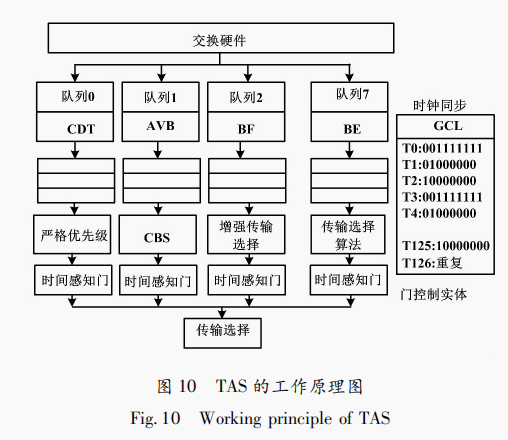

在 TAS 机制中，为了确保数据传输前网络是空闲的，在整个启动传输前需要设置一个`保护带宽`( Guardbound)。Guardband 占用最大的以太网帧传输长度，以确保最差情况———即使前面有一个标准以太网帧正在传输，也不会让 GCL 在重启下一个周期前 被占用网络。 

## 抢占式 MAC 机制

在 TAS 机制中，会存在两个问题: 

①保护带宽消耗了一定的采样时间; 

②低优先级反转的风险。

因此， TSN 的 802． 1Qbu 和 IEEE 802． 3 工作组共同开发了 IEEE 802． 3br，即 可 抢 占 式 MAC 机 制。其采用了 802． 3TG 中的帧抢占机制，将给定的出口分为 2 个 MAC 服务接 口，分别称为`可被抢占 MAC`( pAMC-Preemptable MAC) 和 `快 速 MAC` ( eMAC-express MAC) 。pMAC 可 以 被 eMAC 抢占，进入数据堆栈后等待 eMAC 数据传输完 成，再传输。

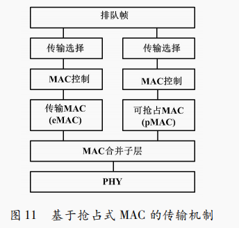

## 周期性排队与转发机制CQF

TSN 工作组推进了`周期性排队与转发 ( cyclic quening forwarding，CQF)机制( 又称蠕动整形器) `。

作为一个同步入队和出队的方 法，CQF 使得运行允许 LAN 桥与帧传输在一个周期内实现同步，以获得零堵塞丢包以及有边界的延时，并能够独立于网络拓扑结构而存在。IEEE 802． 1Qch 标准定义了CQF 要与 IEEE 802． 1Qci 标准相互配合使用。 IEEE 802． 1Qci-t 表明，它会根据达到时间、速度、带宽， 对桥节点输入的每个队列进行滤波和监管，用于保护过大的带宽使用、突发的传输尺寸以及错误或恶意端点。 IEEE 802． 1Qch 所采用的 CQF 机制遵循了一个“每周期走一步”的策略，为数据传输赋予了确定性。 

## 异步流整形机制ATS

CQF 和 TAS 提供了用于超低延时的数据，依赖网 络高度时间协同，以及在强制的周期中增强的包传输。 但其对带宽的使用效率并不高。因此，TSN 工作组提出` IEEE 802．1Qcr 异步流整形( asynchronous traffic shaper，ATS)机制`。

ATS 基于紧急度的调度器设计。 其通过重新对每个跳转的 TSN 流整形，以获得流模式的平滑，实现每个流排队，并使得优先级紧急的数据流可以优先传输。ATS 以异步形式运行，桥和终端节点无需同步时间。ATS 可以更高效地使用带宽，可运行在高速连接应用的混合负载时间，如周期和非周期数据流。 

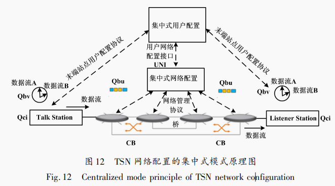

对于 IEEE 802． 1Qat 所提供的 SＲP 机制而言，这 是一种分布式方式的网络需求与资源分配机制。新的注册或退出注册、任何变化与请求都将导致网络延时和超负荷，降低网络的传输效率。因此，TSN 工作组又 提供了 `IEEE 802． 1Qcc 支持集中式的注册与流预留服务，称为 SＲP 增强模式`。在这种模式下，系统通过降低预留消息的大小与频率( 放宽计时器) ，以便在链路状态和预留变更时触发更新

对于完全集中式网络，可选的 CUC 节点通过标准API 与 CNC 通信，用于发现终端节点、检索终端节点 功能和用户需求，以及配置优化的 TSN 终端节点的功 能。其与更高级的流预留协议( 例如 ＲSVP) 的交互是无缝的，类似于 AVB 利用现有的 SＲP 机制。 

IEEE 802． 1Qcc 仍然支持原有的 SＲP 的全分布式配置模式，允许集中式管理的系统与分布式系统间共存。此外，IEEE 802． 1Qcc 支持一种称为混合配置模式，从而为旧式设备提供迁移服务。这个配置管理机制与 IEEE 802． 1Qca 路径控制与预留，以及 TSN 整形器相结合，可以实现端到端传输的零堵塞损失
