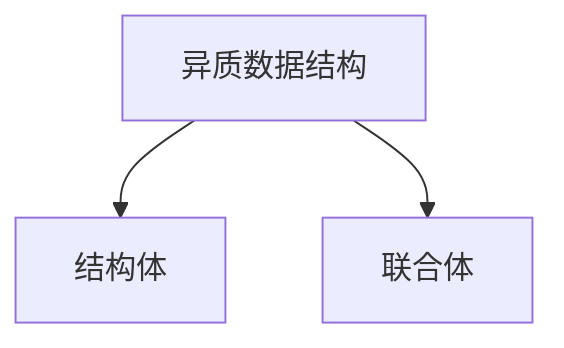
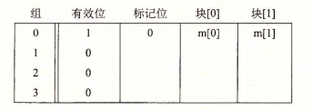

[TOC]

# 计算机系统漫游

* 计算机系统是由硬件和系统软件组成的

## 信息就是位+上下文

大部分的现代操作系统都使用ASCII标准类表示文本字符,这种方式实际上就是用一个唯一的单字节大小的整数值来表示每个字符

> C语言是贝尔实验室的Dennis Ritchie于1969年~1973年间创建的.美国国家标准学会(American National Standards Institute, ANSI)在1989年颁布了ANSI C的标准,后来C语言的标准化成了国际标准化组织(International Standards Organization, ISO)的责任.这些标准定义了C语言和一系列函数库,即所谓的C标准库.Kernighan和Ritchie在他们的经典著作中描述了ANSI C,这本著作被人们满怀感情地称为"K&R" .用Ritchie的话·来说, C语言是“古怪的、有缺陷的,但同时也是一个巨大的成功”.为什么会成功呢?
>
> * c语言与Unix操作系统关系密切.C从一开始就是作为一种用于Unix系统的程序语言开发出来的.大部分Unix内核(操作系统的核心部分),以及所有支撑工具和函数库都是用C语言编写的.20世纪70年代后期到80年代初期, Unix风行于高等院校,许多人开始接触C语言并喜欢上它.因为Unix几乎全部是用C编写的,它可以很为便地移植到新的机器上,这种特点为C和Unix赢得丁更为广泛的支特.
> * C语言小而简单.C语言的设计是由一个人而非一个协会掌控的,因此这是一个简洁明了、没有什么冗赘的设计. K&R这本书用大量的例子和练习描述了完整的C语言及其标准库,而全书不过261页.C语言的简单使它相对而言易于学习,也易于移植到不同的计算机上.
> * C语言是为实践目的设计的.C语言是设计用来实现Unix操作系统的.后来,其他人发现能够用这门语言无障碍地编写他们想要的程序.

## 程序被其他程序翻译成不同的格式


* 预处理阶段.预处理器(cpp)根据以字符#开头的命令,修改原始的C程序.比如hello.c中第1行的#include <stdio.h>命令告诉预处理器读取系统头文stdio.h的内容,并把它直接插入程序文本中.结果就得到了另一个C程序,通是以.i作为文件扩展名.
* 编译阶段.编译器(ccl)将文本文件hello.i翻译成文本文件hello.s,它包含一个汇编语言程序.
* 汇编阶段.接下来,汇编器(as)将hello.s翻译成机器语言指令,把这些指令打包成一种叫做可重定位目标程序(relocatable object program)的格式,并将结果保存在目标文件hello.o中.hello.o文件是一个二进制文件,它包含的17个字节是函数main的指令编码.如果我们在文本编辑器中打开hello.o文件,将看到一堆乱码.
* 链接阶段.请注意, hello程序调用了printf函数,它是每个C编译器都提供的标准C库中的一个函数.printf函数存在于一个名为printf.o的单独的预编译好了的目标文件中,而这个文件必须以某种方式合并到我们的hello..程序中.链接器(ld)就负责处理这种合并.结果就得到hello文件,它是一个可执行目标文件(或者简称为可执行文件),可以被加载到内存中,由系统执行.

> GCC是GNU(GNU是GNU's Not Unix的缩写)项目开发出来的众多有用工具之一. GNU项目是1984年由Richard Stallman发起的一个免税的慈善项目.该项目的目标非常宏大,就是开发出一个完整的类Unix的系统,其源代码能够不受限制地被修改和传播.GNU项目已经开发出了一个包含Unix操作系统的所有主要部件的环境,但内核除外, 内核是由Linux项目独立发展而来的.GNU环境包括EMACS编辑器、GCC编译器、GDB调试器、汇编器、链接器、处理二进制文件的工具以及其他一些部件.GCC编译器已经发展到支持许多不同的语言,能够为许多不同的机器生成代码.支持的语言包括C. C++、Fortran, Java, Pascal、面向对象C语言(Objective-C)和Ada.
>
> GNU项目取得了非凡的成绩,但是却常常被忽略.现代开放源码运动(通常和Linux联系在一起)的思想起源是GNU项目中自由软件(free software)的概念.(此处的free为自由言论(free speech)中的“自由”之意,而非免费啤酒(free beer)中的“免费”之意.)而且, Linux如此受欢迎在很大程度上还要归功于GNU工具,它们给Linux内核提供了环境.

## 了解编译系统如何工作是大有益处的

* 优化程序性能
* 理解链接时出现的错误
* 避免安全漏洞

## 处理器读并解释储存在内存中的指令

shell是一个命令行解释器,它输出一个提示符,等待输入一个命令行,然后执行这个命令.如果该命令行的第一个单词不是一个内置的shell命令,那么shell就会假设这是一个可执行文件的名字,它将加载并运行这个文件.

### 系统的硬件组成

#### 总线

贯穿整个系统的是一组电子管道,称作总线,它携带信息字节并负责在各个部件间传递.通常总线被设计成传送定长的字节块,也就是字(word).字中的字节数(即字长)是·个基本的系统参数,各个系统中都不尽相同.现在的大多数机器字长要么是4个字节(32位),要么是8个字节(64位)

#### I/O设备

I/0(输入/输出)设备是系统与外部世界的联系通道.

#### 主存

主存是一个临时存储设备,在处理器执行程序时,用来存放程序和程序处理的数据.从物理上来说,主存是由一组动态随机存取存储器(DRAM)芯片组成的.从逻辑上来说,存储器是一个线性的字节数组,每个字节都有其唯一的地址(数组索引),这些地址是从零开始的.一般来说,组成程序的每条机器指令都由不同数量的字节构成.与C程序变量相对应的数据项的大小是根据类型变化的.

#### 处理器

中央处理单元(CPU) ,简称处理器,是解释(或执行)存储在主存中指令的引擎.处理器的核心是一个大小为一个字的存储设备(或寄存器),称为程序计数器(PC).在任何时刻, PC都指向主存中的某条机器语言指令(即含有该条指令的地址),e从系统通电开始,直到系统断电,处理器一直在不断地执行程序计数器指向的指令,再更新程序计数器,使其指向下一条指令.处理器看上去是按照一个非常简单的指令执行模型来操作的,这个模型是由指令集架构决定的.在这个模型中,指令按照严格的顺序执行,而执行一条指令包含执行一系列的步骤.处理器从程序计数器指向的内存处读取指令,解释指令中的位,执行该指令指示的简单操作,然后更新PC,使其指向下一条指令,而这条指令并不一定和在内存中刚刚执行的指令相邻.

* 加载:从主存复制一个字节或者一个字到寄存器,以覆盖寄存器原来的内容.
* 存储:从寄存器复制一个字节或者一个字到主存的某个位置,以覆盖这个位置上原来的内容.
* 操作:把两个寄存器的内容复制到ALU, ALU对这两个字做算术运算,并将结果存放到一个寄存器中,以覆盖该寄存器中原来的内容.
* 跳转:从指令本身中抽取一个字,并将这个字复制到程序计数器(PC)中,以覆盖PC中原来的值.

## 高速缓存

根据机械原理,较大的存储设备要比较小的存储设备运行得慢,而快速设备的造价远高于同类的低速设备


类似地,一个典型的寄存器文件只存储几百字节的信息,而主存里可存放几十亿字节.然而,处理器从寄存器文件中读数据比从主存中读取几乎要快100倍.更麻烦的是,随着这些年半导体技术的进步,这种处理器与主存之间的差距还在持续增大.加快处理器的运行速度比加快主存的运行速度要容易和便宜得多.

针对这种处理器与主存之间的差异,系统设计者采用了更小更快的存储设备,称为高速缓存存储器(cache memory,简称为cache或高速缓存),作为暂时的集结区域,存放处理器近期可能会需要的信息.

高速缓存的局部性原理,即程序具有访问局部区域里的数据和代码的趋势.通过让高速缓存里存放可能经常访问的数据,大部分的内存操作都能在快速的高速缓存中完成.


<center>存储器层次结构</center>

## 操作系统管理硬件

我们可以把操作系统看成是应用程序和硬件之间插入的一层软件.

所有应用程序对硬件的操作尝试都必须通过操作系统.

操作系统有两个基本功能: (1)防止硬件被失控的应用程序滥用; (2)向应用程序提供简单一致的机制来控制复杂而又通常大不相同的低级硬件设备.操作系统通过几个基本的抽象概念(进程、虚拟内存和文件)来实现这两个功能.

### 进程

程序在现代系统上运行时,操作系统会提供一种假象,就好像系统上只有这个程序在运行.程序看上去是独占地使用处理器、主存和I/O设备.处理器看上去就像在不间断地一条接一条地执行程序中的指令,即该程序的代码和数据是系统内存中唯一的对象.这些假象是通过进程的概念来实现的,进程是计算机科学中最重要和最成功的概念之一

进程是操作系统对一个正在运行的程序的一种抽象.在一个系统上可以同时运行多个进程,而每个进程都好像在独占地使用硬件.而并发运行,则是说一个进程的指令和另一个进程的指令是交错执行的.在大多数系统中,需要运行的进程数是多于可以运行它们的CPU个数的.传统系统在一个时刻只能执行一个程序,而先进的多核处理器同时能够执行多个程序.无论是在单核还是多核系统中,一个CPU看上去都像是在并发地执行多个进程,这是通过处理器在进程间切换来实现的.操作系统实现这种交错执行的机制称为上下文切换.

操作系统保持跟踪进程运行所需的所有状态信息.这种状态,也就是上下文,包括许多信息,比如PC和寄存器文件的当前值,以及主存的内容.在任何一个时刻,单处理器系统都只能执行一个进程的代码.当操作系统决定要把控制权从当前进程转移到某个新进程时,就会进行上下文切换,即保存当前进程的上下文、恢复新进程的上下文,然后将控制权传递到新进程.新进程就会从它上次停止的地方开始.

### 线程

尽管通常我们认为一个进程只有单一的控制流,但是在现代系统中,一个进程实际上可以由多个称为线程的执行单元组成,每个线程都运行在进程的上下文中,并共享同样的代码和全局数据

由于网络服务器中对并行处理的需求,线程成为越来越重要的编程模型,因为多线程之间比多进程之间更容易共享数据,也因为线程一般来说都比进程更高效.当有多处理器可用的时候,多线程也是一种使得程序可以运行得更快的方法

### 虚拟内存

虚拟内存是一个抽象概念,它为每个进程提供了一个假象,即每个进程都在独占地使用主存.每个进程看到的内存都是一致的,称为虚拟地址空间

* 程序代码和数据.对所有的进程来说,代码是从同一固定地址开始,紧接着的是和C全局变量相对应的数据位置.
* 堆.代码和数据区后紧随着的是运行时堆.代码和数据区在进程一开始运行时就被指定了大小,与此不同,当调用像malloc和free这样的C标准库函数时,堆可以在运行时动态地扩展和收缩.
* 共享库.大约在地址空间的中间部分是一块用来存放像C标准库和数学库这样的共享库的代码和数据的区域.共享库的概念非常强大,也相当难懂.
* 栈.位于用户虚拟地址空间顶部的是用户栈,编译器用它来实现函数调用.和堆一样,用户栈在程序执行期间可以动态地扩展和收缩.特别地,每次我们调用一个函数时,栈就会增长;从一个函数返回时,栈就会收缩.
* 内核虚拟内存.地址空间顶部的区域是为内核保留的.不允许应用程序读写这个区域的内容或者直接调用内核代码定义的函数.相反,它们必须调用内核来执行这些操作.虚拟内存的运作需要硬件和操作系统软件之间精密复杂的交互,包括对处理器生成的每个地址的硬件翻译.基本思想是把一个进程虚拟内存的内容存储在磁盘上,然后用主存作为磁盘的高速缓存.

#### 虚拟地址的由来

在早期的计算机中，程序是直接运行到物理内存（可以理解为内存条上的内存）上的.也就是说，程序运行的时候直接访问的就是物理地址.如果，我们的一个计算机只运行一个程序，那么只有这个程序所需要的内存空间不超过物理内存空间的大小，就不会有问题.但是，我们正在希望的是在某个时候同时运行多个程序.那么这个时候，就会有个一个问题，`计算机如何把有限的物理内存分配给多个程序使用`呢？

某台计算机总的内存大小是128M，现在同时运行两个程序A和B，A需占用内存10M，B需占用内存110.计算机在给程序分配内存时会采取这样的方法：先将内存中的前10M分配给程序A，接着再从内存中剩余的118M中划分出110M分配给程序B.这种分配方法可以保证程序A和程序B都能运行，但是这种简单的内存分配策略问题很多.

* 问题1：进程地址空间不隔离.由于程序都是直接访问物理内存，所以恶意程序可以随意修改别的进程的内存数据，以达到破坏的目的.有些非恶意的，`但是有bug的程序也可能不小心修改了其它程序的内存数据，就会导致其它程序的运行出现异常`.这种情况对用户来说是无法容忍的，因为用户希望使用计算机的时候，其中一个任务失败了，至少不能影响其它的任务.
* 问题2：`内存使用效率低`.在A和B都运行的情况下，如果用户又运行了程序C，而程序C需要20M大小的内存才能运行，而此时系统只剩下8M的空间可供使用，所以此时系统必须在已运行的程序中选择一个将该程序的数据暂时拷贝到硬盘上，释放出部分空间来供程序C使用，然后再将程序C的数据全部装入内存中运行.可以想象得到，在这个过程中，有大量的数据在装入装出，导致效率十分低下.
* 问题3：程序运行的地址不确定.当内存中的剩余空间可以满足程序C的要求后，`操作系统会在剩余空间中随机分配一段连续的20M大小的空间给程序C使用，因为是随机分配的，所以程序运行的地址是不确定的`.但是我们的某些硬件是需要在固定的地址上去开始运行的，但是如果这个地址后边被我们的程序占有，那么我们对这块内存的修改，就可能导致某些硬件不可用了.

为了解决上述问题，人们想到了一种变通的方法，就是增加一个中间层，利用一种间接的地址访问方法访问物理内存.按照这种方法，程序中访问的内存地址不再是实际的物理内存地址，而是一个虚拟地址，然后由操作系统将这个虚拟地址映射到适当的物理内存地址上.这样，只要操作系统处理好虚拟地址到物理内存地址的映射，就可以保证不同的程序最终访问的内存地址位于不同的区域，彼此没有重叠，就可以达到内存地址空间隔离的效果.

#### 虚拟地址和物理地址映射

物理地址：物理地址空间是实在的存在于计算机中的一个实体，在每一台计算机中保持唯一独立性.我们可以称它为物理内存；如在32位的机器上，物理空间的大小理论上可以达到2^32字节(4GB)，但如果实际装了512的内存，那么其物理地址真正的有效部分只有512MB = 512 * 1024 KB = 512 * 1024 * 1024 B（0x00000000~0x1fffffff）.其他部分是无效的

`虚拟地址：虚拟地址并不真实存在于计算机中.每个进程都分配有自己的虚拟空间，而且只能访问自己被分配使用的空间`.理论上，虚拟空间受物理内存大小的限制，如给有4GB内存，那么虚拟地址空间的地址范围就应该是0x00000000~0xFFFFFFFF.每个进程都有自己独立的虚拟地址空间.这样每个进程都能访问自己的地址空间，这样做到了有效的隔离

在上面我们提到了合理的内存管理机制.我们这里虚拟地址和物理地址之间的映射是通过`MMU（内存管理单元）`来完成的


我们平时操作的内存其实都是通过操作虚拟地址的内存单元.通过通过MMU的映射来间接的操作我们的物理地址

## 系统之间利用网络通信

系统漫游至此,我们一直是把系统视为一个孤立的硬件和软件的集合体.实际上,系统经常通过网络和其他系统连接到一起.从一个单独的系统来看,网络可视为一个I/O设备.当系统从主存复制一串字节到网络适配器时,数据流经过网络到达另一台机器,而不是比如说到达本地磁盘驱动器.相似地,系统可以读取从其他机器发送来的数据,并把数据复制到自己的主存.


随着Internet这样的全球网络的出现,从一台主机复制信息到另外一台主机已经成为计算机系统最重要的用途之一.比如,像电子邮件、即时通信、万维网、FTP和telnet这样的应用都是基于网络复制信息的功能.

## Amdahl定律

Gene Amdahl,计算领域的早期先锋之一,对提升系统某一部分性能所带来的效果做出了简单却有见地的观察.这个观察被称为Amdahl定律(Amdahl's law),该定律的主要思想是,当我们对系统的某个部分加速时,其对系统整体性能的影响取决于该部分的重要性和加速程度.若系统执行某应用程序需要时间为$T_{old}$.假设系统某部分所需执行时间与该时间的比例为$\alpha$,而该部分性能提升比例为k.即该部分初始所需时间为$aT_{old}$,现在所需时间为$aT_{old}/k$.因此,总的执行时间应为
$$
T_{new}=(1-\alpha)T_{old}+(\alpha T_{old})/k=T_{old}[(1-\alpha)+\alpha/k]
$$
加速比:$S=\frac{T_{old}}{T_{new}}$
$$
S=\frac{1}{(1-\alpha)+\alpha/k}
$$
一个主要部分做出了重大改进,但是获得的系统加速比却明显小于这部分的加速比.这就是Amdahl定律的主要观点-要想显著加速整个系统,必须提升全系统中相当大的部分的速度

### 并发和并行

数字计算机的整个历史中,有两个需求是驱动进步的持续动力:一个是我们想要计算机做得更多,另一个是我们想要计算机运行得更快.当处理器能够同时做更多的事情时,这两个因素都会改进.我们用的术语并发(concurrency)是一个通用的概念,指一个同时具有多个活动的系统;而术语并行( parallelism)指的是用并发来使一个系统运行得更快.并行可以在计算机系统的多个抽象层次上运用.在此,我们按照系统层次结构中由高到低的顺序重点强调三个层次

#### 线程级并发

构建在进程这个抽象之上,我们能够设计出同时有多个程序执行的系统,这就导致了并发.使用线程,我们甚至能够在一个进程中执行多个控制流.自20世纪60年代初期出现时间共享以来,计算机系统中就开始有了对并发执行的支持.传统意义上,这种并发执行只是模拟出来的,是通过使一台计算机在它正在执行的进程间快速切换来实现的.在以前,即使处理器必须在多个任务间切换,大多数实际的计算也都是由一个处理器来完成的.这种配置称为单处理器系统

超线程,有时称为同时多线程(simultaneous multi-threading),是一项允许一个CPU执行多个控制流的技术.它涉及CPU某些硬件有多个备份,比如程序计数器和寄存器文件,而其他的硬件部分只有一份,比如执行浮点算术运算的单元.常规的处理器需要大约20000个时钟周期做不同线程间的转换,而超线程的处理器可以在单个周期的基础上决定要执行哪一个线程.这使得CPU能够更好地利用它的处理资源.


多处理器的使用可以从两方面提高系统性能.首先,它减少了在执行多个任务时模拟并发的需要.正如前面提到的,即使是只有一个用户使用的个人计算机也需要并发地执行多个活动.其次,它可以使应用程序运行得更快,当然,这必须要求程序是以多线程方式来书写的,这些线程可以并行地高效执行.因此,虽然并发原理的形成和研究已经超过50年的时间了,但是多核和超线程系统的出现才极大地激发了一种愿望,即找到书写应用程序的方法利用硬件开发线程级并行性.

#### 指令级并行

在较低的抽象层次上,现代处理器可以同时执行多条指令的属性称为指令级并行.

如果处理器可以达到比一个周期一条指令更快的执行速率,就称之为超标量(superscalar)处理器.大多数现代处理器都支持超标量操作

#### 单指令、多数据并行

在最低层次上,许多现代处理器拥有特殊的硬件,允许一条指令产生多个可以并行执行的操作,这种方式称为单指令、多数据,即SIMD并行.

提供这些SIMD指令多是为了提高处理影像、声音和视频数据应用的执行速度.

虽然有些编译器会试图从C程序中自动抽取SIMD并行性,但是更可靠的方法是用编译器支持的特殊的向量数据类型来写程序,比如GCC就支持向量数据类型.

### 计算机系统中抽象的重要性


抽象的使用是计算机科学中最为重要的概念之一

不同的编程语言提供不同形式和等级的抽象支持.在处理器里,指令集架构提供了对实际处理器硬件的抽象.使用这个抽象,机器代码程序表现得就好像运行在一个一次只执行一条指令的处理器上.底层的硬件远比抽象描述的要复杂精细,它并行地执行多条指令,但又总是与那个简单有序的模型保持一致.只要执行模型一样,不同的处理器实现也能执行同样的机器代码,而又提供不同的开销和性能.

# 程序结构和执行

## 信息的表示和处理

现代计算机存储和处理的信息以二值信号表示.这些微不足道的二进制数字,或者称为位(bit),形成了数字革命的基础.使用十进制表示法是很自然的事情,但是当构造存储和处理信息的机器时,二进制值工作得更好.二值信号能够很容易地被表示、存储和传输.

对二值信号进行存储和执行计算的电子电路非常简单和可靠,制造商能够在一个单独的硅片上集成数百万甚至数十亿个这样的电路.

孤立地讲,单个的位不是非常有用.然而,当把位组合在一起,再加上某种解释(interpretation),即赋予不同的可能位模式以含意,我们就能够表示任何有限集合的元素.通过使用标准的字符码,我们能够对文档中的字母和符号进行编码.

我们研究三种最重要的数字表示.无符号(unsigned)编码基于传统的二进制表示法,表示大于或者等于零的数字.补码(two's-complement)编码是表示有符号整数的最常见的方式,有符号整数就是可以为正或者为负的数字.浮点数(floating-point)编码是表示实数的科学记数法的以2为基数的版本.计算机用这些不同的表示方法实现算术运算,例如加法和乘法,类似于对应的整数和实数运算

通过研究数字的实际表示,我们能够了解可以表示的值的范围和不同算术运算的属性.为了使编写的程序能在全部数值范围内正确工作,而且具有可以跨越不同机器、操作系统和编译器组合的可移植性,了解这种属性是非常重要的.后面我们会讲到,大量计算·机的安全漏洞都是由于计算机算术运算的微妙细节引发的.在早期,当人们碰巧触发了程序漏洞,只会给人们带来一些不便,但是现在,有众多的黑客企图利用他们能找到的任何漏洞,不经过授权就进入他人的系统.这就要求程序员有更多的责任和义务,去了解他们的程序如何工作,以及如何被迫产生不良的行为

## 信息存储

大多数计算机使用8位的块,或者字节(byte),作为最小的可寻址的内存单位,而不是访问内存中单独的位.机器级程序将内存视为一个非常大的字节数组,称为虚拟内存(virtual memory),内存的每个字节都由一个唯一的数字来标识,称为它的地址(address),所有可能地址的集合就称为虚拟地址空间(virtual address space).顾名思义,这个虚拟地址空间只是一个展现给机器级程序的概念性映像.实际的实现是将动态随机访问存储器(DRAM)、闪存、磁盘存储器、特殊硬件和操作系统软件结合起来,为程序提供一个看上去统一的字节数组.

C编译器还把每个指针和类型信息联系起来,这样就可以根据指针值的类型,生成不同的机器级代码来访问存储在指针所指向位置处的值.尽管C编译器维护着这个类型信息,但是它生成的实际机器级程序并不包含关于数据类型的信息.每个程序对象可以简单地视为一个字节块,而程序本身就是一个字节序列.

> C语言中指针的作用指针是C语言的一个重要特性.它提供了引用数据结构(包括数组)的元素的机制.与变量类似,指针也有两个方面:值和类型.它的值表示某个对象的位置,而它的类型表示那个位置上所存储对象的类型(比如整数或者浮点数)

### 十六进制表示法

一个字节由8位组成.在二进制表示法中,它的值域是$000000_2 \backsim 11111111_2$ 如果看成十进制整数,它的值域就是$0_{10}\backsim255_{10}$.两种符号表示法对于描述位模式来说都不是非常方便.二进制表示法太冗长,而十进制表示法与位模式的互相转化很麻烦.替代的方法是以16为基数,或者叫做十六进制(hexadecimal)数,来表示位模式.

十六进制(简写为"hex")使用数字’0’, ~ ‘9’,以及字符’A’ ~ ‘F’,来表示16个可能的值

在C语言中,以0x或0x开头的数字常量被认为是十六进制的值

### 字数据大小

每台计算机都有一个字长(word size) ,指明指针数据的标称大小(nominal size),因为虚拟地址是以这样的一个字来编码的,所以字长决定的最重要的系统参数就是虚拟地址空间的最大大小.也就是说,对于一个字长为$w$位的机器而言,虚拟地址的范围为$0\backsim2^w-1$,程序最多访问$2^w$个字节


为了避免由于依赖“典型”大小和不同编译器设置带来的奇怪行为, ISO C99引入了一类数据类型,其数据大小是固定的,不随编译器和机器设置而变化.其中就有数据类型int32_t和int64_t,它们分别为4个字节和8个字节.使用确定大小的整数类型是程序员准确控制数据表示的最佳途径

程序员应该力图使他们的程序在不同的机器和编译器上可移植.可移植性的一个方面就是使程序对不同数据类型的确切大小不敏感.C语言标准对不同数据类型的数字范围设置了下界,但是却没有上界

### 寻址和字节顺序

对于跨越多字节的程序对象,我们必须建立两个规则:这个对象的地址是什么,以及在内存中如何排列这些字节.在几乎所有的机器上,多字节对象都被存储为连续的字节序列,对象的地址为所使用字节中最小的地址

对于大多数应用程序员来说,其机器所使用的字节顺序是完全不可见的.无论为哪种类型的机器所编译的程序都会得到同样的结果.不过有时候,字节顺序会成为问题.在不同类型的机器之间通过网络传送二进制数据时,一个常见的问题是当小端法机器产生的数据被发送到大端法机器或者反过来时,接收程序会发现,字里的字节成了反序的.为了避免这类问题,网络应用程序的代码编写必须遵守已建立的关于字节顺序的规则,以确保发送方机器将它的内部表示转换成网络标准,而接收方机器则将网络标准转换为它的内部表示


对于int类型的数据,除了字节顺序以外,我们在所有机器上都得到相同的结果.特别地,我们可以看到在Linux 32、 Windows和Linux 64上,最低有效字节值0x39最先输出,这说明它们是小端法机器;而在Sun上最后输出,这说明Sun是大端法机器.同样地, float数据的字节,除了字节顺序以外,也都是相同的.另一方面,指针值却是完全不同的.不同的机器/操作系统配置使用不同的存储分配规则.一个值得注意的特性是Linux 32, Windows和Sun的机器使用4字节地址,而Linux 64使用8字节地址

> 使用printf格式化输出
>
> printf函数(还有它的同类fprintf和sprintf)提供了一种打印信息的方式,这种方式对格式化细节有相当大的控制能力.第一个参数是格式串(format string),而其余的参数都是要打印的值.在格式串里,每个以“%”开始的字符序列都表示如何格式化下一个参数

> 文字编码的Unicode标准
>
> ASCII字符集适合于编码英语文档,但是在表达一些特殊字符方面并没有太多办法,例如法语的“Ç".它完全不适合编码希腊语、俄语和中文等语言的文档.这些年提出了很多方法来对不同语言的文字进行编码.Unicode联合会(Unicode Consortium)修订了最全面且广泛接受的文字编码标准.当前的Unicode标准(7.0版)的字库包括将近100000个字符,支持广泛的语言种类,包括古埃及和巴比伦的语言.为了保持信用, Unicode技术委员会否决了为Klingon(即电视连续剧《星际迷航》中的虚构文明)编写语言标准的提议.
>
> 基本编码,称为Unicode的“统一字符集”,使用32位来表示字符.这好像要求文本串中每个字符要占用4个字节.不过,可以有一些替代编码,常见的字符只需要1个或2个字节,而不太常用的字符需要多一些的字节数.特别地, UTF-8表示将每个字符编码为一个字节序列,这样标准ASCII字符还是使用和它们在ASCII中一样的单字节编码,这也就意味着所有的ASCII字节序列用ASCII码表示和用UTF-8表示是一样的.Java编程语言使用Unicode来表示字符串.对于C语言也有支持Unicode的程序库

### 表示代码

我们发现指令编码是不同的.不同的机器类型使用不同的且不兼容的指令和编码方·式.即使是完全一样的进程,运行在不同的操作系统上也会有不同的编码规则,因此二进制代码是不兼容的.二进制代码很少能在不同机器和操作系统组合之间移植

### 布尔代数简介

二进制值是计算机编码、存储和操作信息的核心,所以围绕数值0和1的研究已经演化,出了丰富的数学知识体系.这起源于1850年前后乔治·布尔(George Boole, 1815-1864)的工作,因此也称为布尔代数(Boolean algebra),布尔注意到通过将逻辑值TRUE (真)和FALSE(假)编码为二进制值1和0,能够设计出一种代数,以研究逻辑推理的基本原则

### C语言中的位级运算

C语言的一个很有用的特性就是它支持按位布尔运算.事实上,我们在布尔运算中使用的那些符号就是C语言所使用的:|就是OR(或), &就是AND(与), ~就是NOT(取反),而^就是EXCLUSIVE-OR(异或)

| 逻辑 | 符号 |
| ---- | ---- |
| 或   | \|   |
| 与   | &    |
| 非   | ~    |
| 异或 | ^    |

### c语言中的逻辑运算

C语言还提供了一组逻辑运算符||、 &&和!,分别对应于命题逻辑中的OR,AND和NOT运算.逻辑运算很容易和位级运算相混淆,但是它们的功能是完全不同的

逻辑运算认为所有非零的参数都表示TRUE,而参数0表示FALSE,它们返回1或者0,分别表示结果为TRUE或者为FALSE

逻辑运算符&&和||与它们对应的位级运算&和|之间第二个重要的区别是,如果对第一个参数求值就能确定表达式的结果,那么逻辑运算符就不会对第二个参数求值

### c语言言中的移位运算

C语言还提供了一组移位运算,向左或者向右移动位模式.

有一个相应的右移运算x>>k,但是它的行为有点微妙.一般而言,机器支持两种形式的右移:逻辑右移和算术右移.


斜体的数字表示的是最右端(左移)或最左端(右移)填充的值.可以看到除了一个条目之外,其他的都包含填充0.唯一的例外是算术右移[10010101]的情况.因为操作数的最高位是1,填充的值就是1

与C相比, Java对于如何进行右移有明确的定义.表达是x>>k会将x算术右移k个位置,而x>>>k会对x做逻辑右移

## 整数表示


### 整型数据类型

C语言支持多种整型数据类型-表示有限范围的整数.

每种类型都能用关键字来指定大小,这些关键字包括char, short, long,同时还可以指示被表示的数字是非负数(声明为unsigned),或者可能是负数(默认).为这些不同的大小分配的字节数根据程序编译为32位还是64位而有所不同.根据字节分配,不同的大小所能表示的值的范围是不同的


> C、 C++和Java中的有符号和无符号数
>
> C和C++都支持有符号(默认)和无符号数.Java只支持有符号数

### 无符号数的编码

对向量$\vec{x}=[x_{w-1},x_{w-2},\cdots,x_0]:$
$$
B2U_w(\vec x)\approx \sum^{w-1}_{i=0}{x_i2^i}
$$
无符号数的二进制表示有一个很重要的属性,也就是每个介于$0\sim2^n-1$之间的数都·有唯一一个w位的值编码

原理:无符号数编码的唯一性

函数$B2U_w$是一个双射

数学术语双射是指一个函数f有两面:它将数值x映射为数值y,即y=f(x),但它也可以反向操作,因为对每一个y而言,都有唯一一个数值x使得f(x)=y,这可以用反函数$f^{-1}$来表示.函数$B2U_w$将每一个长度为w的位向量都映射为$0\backsim2^n-1$之间的一个唯一值;反过来,我们称其为$U2B_w$(即“无符号数到二进制"),在$0\backsim2^n-1$之间的每一个整数都可以映射为一个唯一的长度为w的位模式

### 补码编码

对于许多应用,我们还希望表示负数值.最常见的有符号数的计算机表示方式就是补码(two' s-complement)形式.在这个定义中,将字的最高有效位解释为负权(negativeweight),我们用函数$B2T_w$(Binary to Two's-complement的缩写,长度为w)来表示

补码编码定义

对向量$\vec x=[x_{w-1},x_{w-2},\cdots,x_0]$
$$
B2T_w(\vec x)\approx -x_{w-1}w^{w-1}+\sum^{w-2}_{i=0}x_iw^i
$$
最高有效位$x_{w-1}$也称为符号位,它的“权重”为$-2^{w-1}$,是无符号表示中权重的负数.符号位被设置为1时,表示值为负,而当设置为0时,值为非负

原理:补码编码的唯一性

函数$B2T_w$是一个双射

我们定义函数$T2B_w$. (即“补码到二进制”)作为$B2T_w$的反函数.也就是说,对于每个数x,满足$TMin_w\leq x\leq TMax_w$,则$T2B_w(x)$是x的(唯一的)w位模式

### 有符号数和无符号数之间的转换

C语言允许在各种不同的数字数据类型之间做强制类型转换.很明显,对于在两种形式中都能表示的值,我们是想要保持不变的.另一方面,将负数转换成无符号数可能会得到0.如果转换的无符号数太大以至于超出了补码能够表示的范围,可能会得到$TMax$,不过,对于大多数C语言的实现来说,对这个问题的回答都是从位级角度来看的,而不是数的角度

对于大多数C语言的实现,处理同样字长的有符号数和无符号数之间相互转换的一般规则是:数值可能会改变,但是位模式不变.让我们用更数学化的形式来描述这个规则.我们定义函数$U2B_w$和$T2B_w$,它们将数值映射为无符号数和补码形式的位表示.也就是说,给定$0\leq x\leq UMax_w$范围内的一个整数x,函数$U2B_w(x)$会给出x的唯一的w位无符号表示.相似地,当满足$TMin_w\leq x\leq TMax_w$,函数$T2B_w(x)$会给出x的唯一的w位补码表示

无符号表示中的UMar有着和补码表示的-1相同的位模式.我们在这两个数之间也能看到这种关系: $1+UMax_w=2^w$

补码转换为无符号数
$$
B2U_w(T2B_w(x))=T2U_w(x)=x+x_{w-1}2^w
$$
当将一个有符号数映射为它相应的无符号数时,负数就被转换成了大的正数,而非负数会保持不变

无符号数转换为补码
$$
U2T_w(u)=-u_{w-1}2^w+u
$$


### C语言中的有符号数与无符号数

C语言支持所有整型数据类型的有符号和无符号运算.尽管C语言标准没有指定有符号数要采用某种表示,但是几乎所有的机器都使用补码.通常,大多数数字都默认为是有符号的.要创建一个无符号常量,必须加上后缀字符"u'或者'u'

C语言允许无符号数和有符号数之间的转换.虽然C标准没有精确规定应如何进行这种转换,但大多数系统遵循的原则是底层的位表示保持不变.因此,在一台采用补码的机器上,当从无符号数转换为有符号数时,效果就是应用函数$U2T_w$,而从有符号数转换为无符号数时,就是应用函数$T2U_w$,,其中w表示数据类型的位数

### 扩展一个数字的位表示

一个常见的运算是在不同字长的整数之间转换,同时又保持数值不变.当然,当目标数据类型太小以至于不能表示想要的值时,这根本就是不可能的.然而,从一个较小的数据类型转换到一个较大的类型,应该总是可能的

要将一个无符号数转换为一个更大的数据类型,我们只要简单地在表示的开头添加0.这种运算被称为零扩展(zero extension)

无符号数的零扩展

定义宽度为w的位向量$\vec u=[u_{w-1}, u_{w-2},\cdots,u_0]$和宽度为$w'$的位向量$\vec u'=[0,\cdots,0,u_{w-1}, u_{w-2},\cdots,u_o]$,其中$w'>w$.则$B2U_w(\vec u)=B2U_{w'}(\vec u')$

补码数的符号扩展

定义宽度为w的位向量$\vec x=[x_{w-1}, x_{w-2},\cdots,x_0]$和宽度为w的位向量$\vec x'=[x_{w-1},\cdots,x_{w-1},x_{w-1},x_{w-2},\cdots,x_0]$,其中$w'>w$.则$B2U_w(\vec u)=B2U_{w'}(\vec u')$

### 截断数字

原理:截断无符号数

令$\vec x$等于位向量$[x_{w-1}, x_{w-2},\cdots,x_0]$,而$\vec x'$是将其截断为k位的结果:$\vec x'=[x_{k-1},x_{k-2},\cdots,x_0]$.令$x=B2U_w(\vec x)),$ $x'=B2U_k(\vec x')$.则$x'=x mod 2^k$

原理:截断补码数值

令$\vec x$ 等于位向量$[x_{w-1} , x_{w-2},\cdots,x_0]$,而$\vec x'$是将其截断为k位的结果: $\vec x'=[x_{k-1},x_{k-2},\cdots,x_0]$.令$x=B2U_w(\vec x)$,$x'=B2T_k(\vec x')$,则$x'=U2T_k(x mod 2^k)$

### 关于有符号数与符号数的建议

有符号数到无符号数的隐式强制类型转换导致了某些非直观的行为.而这些非直观的特性经常导致程序错误,并且这种包含隐式强制类型转换的细微差别的错误很难被发现.因为这种强制类型转换是在代码中没有明确指示的情况下发生的,程序员经常忽视了它的影响

我们已经看到了许多无符号运算的细微特性,尤其是有符号数到无符号数的隐式转换,会导致错误或者漏洞的方式.避免这类错误的一种方法就是绝不使用无符号数.实际上,除了C以外很少有语言支持无符号整数.很明显,这些语言的设计者认为它们带来的麻烦要比益处多得多.比如, Java只支持有符号整数,并且要求以补码运算来实现.正常的右移运算符>>被定义为执行算术右移.特殊的运算符>>>被指定为执行逻辑右移.

## 整数运算

### 无符号加法


对满足0<x, y<$2^w$的x和y有
$$
x+^u_wy=\begin{cases}
x+y&x+y<2^w\\
x+y-2^w&2^w\leq x+y< 2^{w+1}
\end{cases}
$$


​	模数加法形成了一种数学结构,称为阿贝尔群(Abelian group),这是以丹麦数学家Niels Henrik Abel( 1802~1829)的名字命名.也就说,它是可交换的和可结合的.它有一个单位元0,并且每个元素有一个加法逆元

原理:无符号数求反

对满足$0\leq x<2^w$的任意x ,其w位的无符号逆元$-^u_wx$由下式给出
$$
-^u_wx=\begin{cases}x&x=0\\2^w-x&x>0\end{cases}
$$

### 补码加法

对满足$-2^{w-1}\leq x,y\leq 2^{w-1}-1$的整数x和y,有:
$$
x+^t_wy=\begin{cases}
x+y-2^w&w^{w-1}\leq x+y&正溢出\\
x+y&-2^{w-1}\leq x+y<2^{w-1}&正常\\
x+y+2^w&x+y<-w^{w-1}&负溢出
\end{cases}
$$


### 无符号乘法

范围在$0\leq x, y\leq 2^w-1$内的整数x和y可以被表示为w位的无符号数,但是它们的乘积$x\cdot y$的取值范围为0到$(2^w-1)^2=2^{2w}-2^{w+1}+1$之间.这可能需要2w位来表示.不过, C语言中的无符号乘法被定义为产生w位的值,就是2w位的整数乘积的低w位表示的值.我们将这个值表示为$x*^u_wy$

对满足$0\leq x, y\leq UMax_w$的x和y有:
$$
x*^u_wy=(x\cdot y)\mod 2^w
$$

### 补码的非

对满足$TMin_w\leq x\leq TMax_w$的x,其补码的非$-^t_wx$由下式給出
$$
-^t_wx=\begin{cases}TMin_w&x=TMin_w\\-x&x>TMin_w\end{cases}
$$

### 无符号乘法

对满足$0\leq x,y\leq UMax_w$的x和y,有
$$
x*^u_wy=(x\cdot y)\mod 2^w
$$

### 补码乘法

对满足$TMin_w\leq x,y\leq TMax_w$的x和y,有
$$
x*^t_wy=U2T_w((x\cdot y)\mod 2^w)
$$
给定长度为w的位向量$\vec x$和$\vec y$,用补码形式的位向量表示来定义整数x和y:$x=B2T_w(\vec x),y'=B2T_w(\vec y)$.用无符号形式的位向量表示来定义非负整数x'和y':$x'=B2U_w(\vec x),y'=B2U_w(\vec y)$.则
$$
T2B_w(x*^t_wy)=U2B_w(x'*^u_wy')
$$

### 乘以常数

设x为位模式$[x_{w-1},x_{w-2},\cdots,x_0]$表示的无符号整数,那么对于任何$k\geq 0$,我们都认为$[x_{w-1},x_{w-2},\cdots,x_0,0,\cdots,0]$给出了$x2^k$的w+k位的无符号表示,这里的右边增加了k个0

### 除以2的幂

除以2的幂也可以用移位运算来实现,只不过我们用的是右移,而不是左移.无符号和补,码数分别使用逻辑移位和算术移位来达到目的

除以2的幂的无符号除法,C变量x和k有无符号数值x和k,且$0\leq k<w$,则C表达式x>>k产生数值$\lfloor \frac{x}{2^k}\rfloor$

除以2 的幂的补码除法,向下舍入,C变量x和k分别由补码值x和无符号数值k,且$0\leq k<w$,则当执行算术移位时,C表达式x>>k产生数值$\lfloor \frac{x}{2^k}\rfloor$

## 浮点数

大约在1985年,这些情况随着IEEE标准754的推出而改变了,这是一个仔细制订的表示浮点数及其运算的标准.这项工作是从1976年开始由Intel赞助的,与8087的设计同时进行, 8087是一种为8086处理器提供浮点支持的芯片.他们请William Kahan(加州大学伯克利分校的一位教授)作为顾问,帮助设计未来处理器浮点标准.他们支持Kahan加入一个IEEE资助的制订工业标准的委员会.这个委员会最终采纳的标准非常接近于Kahan为Intel设计的标准.目前,实际上所有的计算机都支持这个后来被称为IEEE浮点的标准.这大大提高了科学应用程序在不同机器上的可移植性.

### 二进制小数

十进制表示法
$$
d_md_{m-1}\cdots d_1d_0.d_{-1}d_{-2}\cdots d_{-n}
$$
其中每个十进制数$d_i$的取值范围是0~9,定义为
$$
d=\sum^m_{i=-n}10^i\times d_i
$$
数字权的定义与十进制小数点符号(‘.’)相关,这意味着小数点左边的数字的权是10的正幂,得到整数值,而小数点右边的数字的权是10的负幂,得到小数值


### IEЕE 浮点表示

* 符号(sign) s决定这数是负数(s=1)还是正数(s=0),而对于数值0的符号位解释作为特殊情况处理
* 尾数(significand) M是一个二进制小数,它的范围是$1\sim2-\epsilon$ ,或者是$0\sim1-\epsilon$
* 阶码(exponent) E的作用是对浮点数加权,这个权重是2的E次幂(可能是负数)

浮点数的位表示划分为三个字段,分别对这些值进行编码

* 一个单独的符号位s直接编码符号s.
* k位的阶码字段$exp=e_{k-1}\cdots e_1e_0$编码阶码E
* n位小数字段$frac=f_{n-1}\cdots f_1f_0$编码尾数M,但是编码出来的值也依赖于阶码字段的值是否等于0


#### 规格化的值

小数字段frac被解释为描述小数值f,其中$0\leq f<1$,其二进制表示为$0,f_{n-1}\cdots f_1f_0$,也就是二进制小数点在最高有效位的左边.尾数定义为M=1+f,有时,这种方式也叫做隐含的以1开头的(implied leading 1)表示,因为我们可以把M看成一个二进制表达式为$1.f_{n-1}f-{n-2}\cdots f_0$的数字.既然我们总是能够调整阶码E,使得尾数M在范围$1\leq M<2$之中(假设没有溢出),那么这种表示方法是一种轻松获得一个额外精度位的技巧.既然第一位总是等于1,那么我们就不需要显式地表示它

#### 非规格化的值

当阶码域为全0时,所表示的数是非规格化形式.在这种情况下,阶码值是E=1-Bias,而尾数的值是M=f,也就是小数字段的值,不包含隐含的开头的1

非规格化数有两个用途.首先,它们提供了一种表示数值0的方法,因为使用规格化数,我们必须总是使M>1,因此我们就不能表示0.实际上, +0.0的浮点表示的位模式为全0:符号位是0,阶码字段全为0(表明是一个非规格化值),而小数域也全为0,这就得到$M=f=0$,令人奇怪的是,当符号位为1,而其他域全为0时,我们得到值-0.0.根据IEEE的浮点格式,值+0.0和-0.0在某些方面被认为是不同的,而在其他方面是相同的

非规格化数的另外一个功能是表示那些非常接近于0.0的数.它们提供了一种属性,称为逐渐溢出(gradual underflow),其中,可能的数值分布均匀地接近于0.0

#### 特殊值

最后一类数值是当指阶码全为1的时候出现的.当小数域全为0时,得到的值表示无穷,当s=0时是十∞,或者当s=1时是-∞.当我们把两个非常大的数相乘,或者除以零时,无穷能够表示溢出的结果.当小数域为非零时,结果值被称为"NaN",即“不是一个数(Not a Number)"的缩写.一些运算的结果不能是实数或无穷,就会返回这样的NaN值,比如当计算$\sqrt{-1}$或∞-∞时


### 舍入

因为表示方法限制了浮点数的范围和精度,所以浮点运算只能近似地表示实数运算.因此,对于值x,我们一般想用一种系统的方法,能够找到“最接近的”匹配值x',它可以用期望的浮点形式表示出来.这就是舍入(rounding)运算的任务.一个关键问题是在两个可能值的中间确定舍入方向.一种可选择的方法是维持实际数字的下界和上界.例如,我们可以确定可表示的值$x^-$和$x^+$,使得x的值位于它们之间: $x^-\leq x\leq x^+$.IEEE浮点格式定义了四种不同的舍入方式.默认的方法是找到最接近的匹配,而其他三种可用于计算上界和下界


其他三种方式产生实际值的确界(guaranteed bound).向零舍入方式把正数向下舍人,把负数向上舍人,得到值立,使得12<lxl..向下舍入方式把正数和负数都向下舍人,得到值x,,使得x<x.向上舍入方式把正数和负数都向上舍入,得到值xt ,满足x<x

### 浮点运算

IEEE标准中指定浮点运算行为方法的一个优势在于,它可以独立于任何具体的硬件或者软件实现.因此,我们可以检查它的抽象数学属性,而不必考虑它实际上是如何实现的.

实数上的加法也形成了阿贝尔群,但是我们必须考虑舍人对这些属性的影响.我们将$x+^fy$定义为$Round(x+y)$.这个运算的定义针对x和y的所有取值,但是虽然x和y都是实数,由于溢出,该运算可能得到无穷值.对于所有x和y的值,这个运算是可交换的,也就是说$x+^fy=y+^fx$.另一方面,这个运算是不可结合的.作为阿贝尔群,大多数值在浮点加法下都有逆元,也就是说$x+^f-x=0$,无穷(因为+∞-∞=NaN)和NaN是例外情况,因为对于任何x,都有$NaN+^fx=NaN$

### C语言中的浮点数

所有的C语言版本提供了两种不同的浮点数据类型: float和double.在支持IEEE浮点格式的机器上,这些数据类型就对应于单精度和双精度浮点.另外,这类机器使用向偶数舍人的舍入方式.不幸的是,因为C语言标准不要求机器使用IEEE浮点,所以没有标准的方法来改变舍入方式或者得到诸如-0,+∞,-∞或者NaN之类的特殊值

* 从int转换成float,数字不会溢出,但是可能被舍人
* 从int或float转换成double,因为double有更大的范围(也就是可表示值的范围),也有更高的精度(也就是有效位数),所以能够保留精确的数值
* 从double转换成float,因为范围要小一些,所以值可能溢出成+∞或-∞.另外,由于精确度较小,它还可能被舍人
* 以float或者double转换成int,值将会向零舍入

# 程序的机器级表示

计算机执行机器代码,用字节序列编码低级的操作,包括处理数据、管理内存、读写存储设备上的数据,以及利用网络通信.编译器基于编程语言的规则、目标机器的指令集和操作系统遵循的惯例,经过一系列的阶段生成机器代码.GCC C语言编译器以汇编代码的形式产生输出,汇编代码是机器代码的文本表示,给出程序中的每一条指令.然后GCC调用汇编器和链接器,根据汇编代码生成可执行的机器代码.在本章中,我们会近距离地观察机器代码,以及人类可读的表示-汇编代码

即使编译器承担了生成汇编代码的大部分工作,对于严谨的程序员来说,能够阅读和理解汇编代码仍是一项很重要的技能.以适当的命令行选项调用编译器,编译器就会产生一个以汇编代码形式表示的输出文件.通过阅读这些汇编代码,我们能够理解编译器的优化能力,并分析代码中隐含的低效率.试图最大化一段关键代码性能的程序员,通常会尝试源代码的各种形式,每次编译并检查产生的汇编代码,从而了解程序将要运行的效率如何.此外,也有些时候,高级语言提供的抽象层会隐藏我们想要了解的程序的运行时行为.例如,用线程包写并发程序时,了解不同的线程是如何共享程序数据或保持数据私有的,以及准确知道如何在哪里访问共享数据,都是很重要的.这些信息在机器代码级是可见的.另外再举一个例子,程序遭受攻击(使得恶意软件侵扰系统)的许多方式中,都涉及程序存储运行时控制信息的方式的细节.许多攻击利用了系统程序中的漏洞重写信息,从而获得了系统的控制权.了解这些漏洞是如何出现的,以及如何防御它们,需要具备程序机器级表示的知识.程序员学习汇编代码的需求随着时间的推移也发生了变化,开始时要求程序员能直接用汇编语言编写程序,现在则要求他们能够阅读和理解编译器产生的代码.

> 摩尔定律(Moore's Law)
>
> 如果我们画出各种不同的Intel处理器中晶体管的数量与它们出现的年份之间的图(y轴为晶体管数量的对数值),我们能够看出,增长是很显著的.画一条拟合这些数据的线,可以看到晶体管数量以每年大约37%的速率增加,也就是说,晶体管数量每26个月就会翻一番.在x86微处理器的历史上,这种增长已经持续了好几十年.
>
> 
>
> 1965年, Gordon Moore, Intel公司的创始人,根据当时的芯片技术(那时他们能够在,一个芯片上制造有大约64个晶体管的电路)做出推断,预测在未来10年,芯片上的晶体管数量每年都会翻一番.这个预测就称为摩尔定律.正如事实证明的那样,他的预测有点乐观,而且短视.在超过50年中,半导体工业一直能够使得晶体管数目每18个月翻一倍.

## 程序编码

假设一个C程序,有两个文件p1.c和p2.c.我们用Unix命令行编译这些代码:

```
linux> gcc -Og -S p1.c p2.c
```

命令gcc指的就是GCC C编译器.因为这是Linux上默认的编译器,我们也可以简单地用cc来启动它.编译选项-0g告诉编译器使用会生成符合原始C代码整体结构的机器代码的优化等级.使用较高级别优化产生的代码会严重变形,以至于产生的机器代码和初始源代码之间的关系非常难以理解.因此我们会使用-0g优化作为学习工具,然后当我们增加优化级别时,再看会发生什么.

实际上gcc命令调用了一整套的程序,将源代码转化成可执行代码.首先, C预处理器扩展源代码,插入所有用#include命令指定的文件,并扩展所有用#define声明指定的宏.其次,编译器产生两个源文件的汇编代码,名字分别为p1.s和p2.s,接下来,汇编器会将汇编代码转化成二进制目标代码文件p1.o和p2.0,目标代码是机器代码的一种形式,它包含所有指令的二进制表示,但是还没有填入全局值的地址.最后,链接器将两个目标代码文件与实现库函数(例如printf)的代码合并,并产生最终的可执行代码文件p(由命令行指示符-o p指定的).可执行代码是我们要考虑的机器代码的第二种形式,也就是处理器执行的代码格式.

### 机器级代码

计算机系统使用了多种不同形式的抽象,利用更简单的抽象模型来隐藏实现的细节.对于机器级编程来说,其中两种抽象尤为重要.

第一种是由指令集体系结构或指令集架构(Instruction Set Architecture, ISA)来定义机器级程序的格式和行为,它定义了处理器状态、指令的格式,以及每条指令对状态的影响.大多数ISA,包括x86-64,将程序的行为描述成好像每条指令都是按顺序执行的,一条指令结束后,下一条再开始.处理器的硬件远比描述的精细复杂,它们并发地执行许多指令,但是可以采取措施保证整体行为与ISA指定的顺序执行的行为完全一致.

第二种抽象是,机器级程序使用的内存地址是虚拟地址,提供的内存模型看上去是一个非常大的字节数组.存储器系统的实际实现是将多个硬件存储器和操作系统软件组合起来.

在整个编译过程中,编译器会完成大部分的工作,将把用C语言提供的相对比较抽象的执行模型表示的程序转化成处理器执行的非常基本的指令.汇编代码表示非常接近于机器代码.与机器代码的二进制格式相比,汇编代码的主要特点是它用可读性更好的文本格式表示.能够理解汇编代码以及它与原始C代码的联系,是理解计算机如何执行程序的关键一步.

x86-64的机器代码和原始的C代码差别非常大.一些通常对C语言程序员隐藏的处理器状态都是可见的

* 程序计数器(通常称为"PC",在x86-64中用%rip表示)给出将要执行的下一条指令在内存中的地址
* 整数寄存器文件包含16个命名的位置,分别存储64位的值.这些寄存器可以存储地址(对应于C语言的指针)或整数数据.有的寄存器被用来记录某些重要的程序状态,而其他的寄存器用来保存临时数据,例如过程的参数和局部变量,以及函数的返回值
* 条件码寄存器保存着最近执行的算术或逻辑指令的状态信息.它们用来实现控制或数据流中的条件变化,比如说用来实现if和while语句
* 一组向量寄存器可以存放一个或多个整数或浮点数值

程序内存包含:程序的可执行机器代码,操作系统需要的一些信息,用来管理过程调用和返回的运行时栈,以及用户分配的内存块(比如说用malloc库函数分配的).正如前面提到的,程序内存用虚拟地址来寻址.在任意给定的时刻,只有有限的一部分虚拟地址被认为是合法的.在目前的实现中,这些地址的高16位必须设置为0,所以一个地址实际上能够指定的是$2^{48}$或$64TB$范围内的一个字节.较为典型的程序只会访问几兆字节或几千兆字节的数据.操作系统负责管理虚拟地址空间,将虚拟地址翻译成实际处理器内存中的物理地址

一条机器指令只执行一个非常基本的操作

#### 产生汇编代码

```
linux> gcc -Og -S mstore.c
```

这会使GCC运行编译器,产生一个汇编文件mstore.s,但是不做其他进一步的工作.(通常情况下,它还会继续调用汇编器产生目标代码文件)

```
linux> gcc -Og -c mstore.c
```

这就会产生目标代码文件mstore.o,它是二进制格式的,所以无法直接查看

#### 产生机器代码

要查看机器代码文件的内容,有一类称为反汇编器(disassembler)的程序非常有用.这些程序根据机器代码产生一种类似于汇编代码的格式.在Linux系统中,带‘-d’命令行标志的程序OBJDUMP(表示"object dump")可以充当这个角色

```
linux> objdump -d mstore.o
```

其中一些关于机器代码和它的反汇编表示的特性值得注意:

* x86-64的指令长度从1到15个字节不等.常用的指令以及操作数较少的指令所需的字节数少,而那些不太常用或操作数较多的指令所需字节数较多
* 设计指令格式的方式是,从某个给定位置开始,可以将字节唯一地解码成机器指令
* 反汇编器只是基于机器代码文件中的字节序列来确定汇编代码.它不需要访问该程序的源代码或汇编代码
* 反汇编器使用的指令命名规则与GCC生成的汇编代码使用的有些细微的差别

### 关于格式的注解

所有以‘.’开头的行都是指导汇编器和链接器工作的伪指令.我们通常可以忽略这些行.另一方面,也没有关于指令的用途以及它们与源代码之间关系的解释说明

通常我们只会给出与讨论内容相关的代码行.每一行的左边都有编号供引用,右边是·注释,简单地描述指令的效果以及它与原始C语言代码中的计算操作的关系.这是一种汇编语言程序员写代码的风格

> 把C程序和汇编代码结合起来
>
> 虽然C编译器在把程序中表达的计算转换到机器代码方面表现出色,但是仍然有一些机器特性是C程序访问不到的.例如,每次x86-64处理器执行算术或逻辑运算时,如果得到的运算结果的低8位中有偶数个1,那么就会把一个名为PF的1位条件码(condition code)标志设置为1,否则就设置为0.这里的PF表示"parity flag(奇偶标志)”.在C语言中计算这个信息需要至少7次移位、掩码和异或运算.即使作为每次算术或逻辑运算的一部分,硬件都完成了这项计算,而C程序却无法知道PF条件码标志的值.在程序中插入几条汇编代码指令就能很容易地完成这项任务
>
> 在C程序中插入汇编代码有两种方法.第一种是,我们可以编写完整的函数,放进一个独立的汇編代码文件中,让汇编器和链接器把它和用C语言书写的代码合并起来.第二种方法是,我们可以使用GCC的内联汇编(inline assembly)特性,用asm伪指令可以在C程序中包含简短的汇編代码.这种方法的好处是减少了与机器相关的代码量
>
> 当然,在C程序中包含汇编代码使得这些代码与某类特殊的机器相关(例如x8664),所以只应该在想要的特性只能以此种方式才能访问到时才使用它

## 访问信息

一个x86-64的中央处理单元(CPU)包含一组16个存储64位值的通用目的寄存器.这些寄存器用来存储整数数据和指针.它们的名字都以%r开头,不过后面还跟着一些不同的命名规则的名字,这是由于指令集历史演化造成的.最初的8086中有8个16位的寄存器,即%ax到%bp.每个寄存器都有特殊的用途,它们的名字就反映了这些不同的用途.扩展到1A32架构时,这些寄存器也扩展成32位寄存器,标号从%eax到%ebp.扩展到x86-64后,原来的8个寄存器扩展成64位,标号从%rax到%rbp.除此之外,还增加了8个新的寄存器,它们的标号是按照新的命名规则制定的:从%r8到%r15


字节级操作可以访问最低的字节, 16位操作可以访问最低的2个字节, 32位操作可以访问最低的4个字节,而64位操作可以访问整个寄存器

### 操作数指示符

大多数指令有一个或多个操作数(operand),指示出执行一个操作中要使用的源数据值,以及放置结果的目的位置.x86-64支持多种操作数格式,源数据值可以以常数形式给出,或是从寄存器或内存中读出.结果可以存放在寄存器或内存中.因此,各种不同的操作数的可能性被分为三种类型.

* 第一种类型是立即数(immediate),用来表示常数值.在ATT格式的汇编代码中,立即数的书写方式是'$'后面跟一个用标准C表示法表示的整数,不同的指令允许的立即数值范围不同,汇编器会自动选择最紧凑的方式进行数值编码.
* 第二种类型是寄存器(register),它表示某个寄存器的内容, 16个寄存器的低位1字节、2字节、4字节或8字节中的一个作为操作数,这些字节数分别对应于8位、16位、32位或64位.我们用符号$a_r$来表示任意寄存器a,用引用$R[r_a]$来表示它的值,这是将寄存器集合看成一个数组R,用寄存器标识符作为索引
* 第三类操作数是内存引用,它会根据计算出来的地址(通常称为有效地址)访问某个内存位置.因为将内存看成一个很大的字节数组,我们用符号$M_b[Addr]$表示对存储在内存中从地址Addr开始的b个字节值的引用.为了简便,我们通常省去下标b.有多种不同的寻址模式,允许不同形式的内存引用


### 数据传送指令

最频繁使用的指令是将数据从一个位置复制到另一个位置的指令.操作数表示的通用性使得一条简单的数据传送指令能够完成在许多机器中要好几条不同指令才能完成的功能


* 常规的movq指令只能以表示为32位补码数字的立即数作为源操作数,然后把这个值符号扩展得到64位的值,放到目的位置
* movabsq指令能够以任意64位立即数值作为源操作数,并且只能以寄存器作为目的


### 压入和弹出栈数据


栈是一种数据结构,可以添加或者删除值,不过要遵循“后进先出”的原则.通过push操作把数据压入栈中,通过pop操作删除数据;它具有一个属性:弹出的值永远是最近被压入而且仍然在栈中的值.栈可以实现为一个数组,总是从数组的一端插入和删除元素.这一端被称为栈页.在x86-64中,程序栈存放在内存中某个区域.栈向下增长,这样一来,栈顶元素的地址是所有栈中元素地址中最低的.(根据惯例,我们的栈是倒过来画的,栈“顶”在图的底部.)栈指针 rsp保存着栈顶元素的地址.


pushq指令的功能是把数据压人到栈上,而popq指令是弹出数据.这些指令都只有一个操作数-压入的数据源和弹出的数据目的

* 将一个四字值压人栈中,首先要将栈指针减8,然后将值写到新的栈顶地址.因此,指令pushq grbp的行为等价于下面两条指令:

  ```
  subq $8,%rsp
  movq %rbp,(%rsp)
  ```

* 弹出一个四字的操作包括从栈顶位置读出数据,然后将栈指针加8,因此,指令popq %rax等价于下面两条指令

  ```
  movq (%rsp),%rax
  addq $8,%rsp
  ```

## 算术和逻辑操作


### 加载有效地址

加载有效地址(load effective address)指令leaq实际上是movq指令的变形.它的指令形式是从内存读数据到寄存器,但实际上它根本就没有引用内存.它的第一个操作数看上去是一个内存引用,但该指令并不是从指定的位置读入数据,而是将有效地址写入到目的操作数

### 一元和二元操作

第二组中的操作是一元操作,只有一个操作数,既是源又是目的.这个操作数可以是一个寄存器,也可以是一个内存位置.

第三组是二元操作,其中,第二个操作数既是源又是目的.源操作数是第一个, 目的操作数是第二个,对于不可交换操作来说,这看上去很奇特.第一个操作数可以是立即数、寄存器或是内存位置.第二个操作数可以是寄存器或是内存位置.注意,当第二个操作数为内存地址时,处理器必须从内存读出值,执行操作,再把结果写回内存

### 移位操作

最后一组是移位操作,先给出移位量,然后第二项给出的是要移位的数.可以进行算术和逻辑右移.移位量可以是一个立即数,或者放在单字节寄存器%cl中.(这些指令很特别,因为只允许以这个特定的寄存器作为操作数.)原则上来说, 1个字节的移位量使得移位量的编码范围可以达到$2^8-1=255$, x86-64中,移位操作对w位长的数据值进行操作,移位量是由%cl寄存器的低m位决定的,这里$2^m=w$,高位会被忽略

### 特殊的算术操作


两个64位有符号或无符号整数相乘得到的乘积需要128位来表示.x86-64指令集对128位(16字节)数的操作提供有限的支持.延续字(2字节)、双字(4字节)和四字(8字节)的命名惯例, Intel把16字节的数称为八字(oct word)

imulq指令有两种不同的形式.其中一种,是一个“双操作数”乘法指令.它从两个64位操作数产生一个64位乘积

此外, x86-64指令集还提供了两条不同的“单操作数”乘法指令,以计算两个64位值的全128位乘积-一个是无符号数乘法(mulq),而另一个是补码乘法(imulq).这两条指令都要求一个参数必须在寄存器 %rax中,而另一个作为指令的源操作数给出.然后乘积存放在寄存器%rdx(高64位)和%rax(低64位)中.虽然imulq这个名字可以用于两个不同的乘法操作,但是汇编器能够通过计算操作数的数目,分辨出想用哪条指令

有符号除法指令idivl将寄存器%rdx(高64位)和%rax(低64位)中的128位数作为被除数,而除数作为指令的操作数给出.指令将商存储在寄存器%rax中,将余数存储在寄存器%rdx中.

对于大多数64位除法应用来说,除数也常常是一个64位的值.这个值应该存放在%rax中,%rdx的位应该设置为全0(无符号运算)或者%rax的符号位(有符号运算).后面这个操作可以用指令cqto来完成.这条指令不需要操作数–它隐含读出%rax的符号位,并将它复制到%rdx的所有位

## 控制

到目前为止,我们只考虑了直线代码的行为,也就是指令一条接着一条顺序地执行.C语言中的某些结构,比如条件语句、循环语句和分支语句,要求有条件的执行,根据数据测试的结果来决定操作执行的顺序.机器代码提供两种基本的低级机制来实现有条件的行为:测试数据值,然后根据测试的结果来改变控制流或者数据流.与数据相关的控制流是实现有条件行为的更一般和更常见的方法,所以我们先来介绍它.通常, C语言中的语句和机器代码中的指令都是按照它们在程序中出现的次序,顺序执行的.用jump指令可以改变一组机器代码指令的执行顺序, jump指令指定控制应该被传递到程序的某个其他部分,可能是依赖于某个测试的结果.编译器必须产生构建在这种低级机制基础之上的指令序列,来实现C语言的控制结构

### 条件码

除了整数寄存器, CPU还维护着一组单个位的条件码(condition code)寄存器,它们描述了最近的算术或逻辑操作的属性.可以检测这些寄存器来执行条件分支指令.最常用的条件码有:

CF:进位标志.最近的操作使最高位产生了进位.可用来检查无符号操作的溢出

ZF:零标志.最近的操作得出的结果为0

SF:符号标志.最近的操作得到的结果为负数

OF:溢出标志.最近的操作导致一个补码溢出–正溢出或负溢出


CMP指令根据两个操作数之差来设置条件码.除了只设置条件码而不更新目的寄存器之外, CMP指令与SUB指令的行为是一样的.在ATT格式中,列出操作数的顺序是相反的,这使代码有点难读.如果两个操作数相等,这些指令会将零标志设置为1,而其他的标志可以用来确定两个操作数之间的大小关系.TEST指令的行为与AND指令一样,除了它们只设置条件码而不改变目的寄存器的值

### 访问条件码

条件码通常不会直接读取,常用的使用方法有三种: 

* 可以根据条件码的某种组合,将一个字节设置为0或者1
* 可以条件跳转到程序的某个其他的部分
* 可以有条件地传送数据

对于第一种情况,指令根据条件码的某种组合,将一个字节设置为0或者1.我们将这一整类指令称为SET指令;它们之间的区别就在于它们考虑的条件码的组合是什么,这些指令名字的不同后缀指明了它们所考虑的条件码的组合.这些指令的后缀表示不同的条件而不是操作数大小,了解这一点很重要.

一条SET指令的目的操作数是低位单字节寄存器元素之一,或是一个字节的内存位置,指令会将这个字节设置成0或者1.为了得到一个32位或64位结果,我们必须对高位清零


某些底层的机器指令可能有多个名字,我们称之为“同义名(synonym)".比如说,setg(表示“设置大于”)和setnle(表示“设置不小于等于”)指的就是同一条机器指令.编译器和反汇编器会随意决定使用哪个名字

虽然所有的算术和逻辑操作都会设置条件码,但是各个SET命令的描述都适用的情况是:执行比较指令

注意到机器代码如何区分有符号和无符号值是很重要的.同C语言不同,机器代码不会将每个程序值都和一个数据类型联系起来.相反,大多数情况下,机器代码对于有符号和无符号两种情况都使用一样的指令,这是因为许多算术运算对无符号和补码算术都有一样的位级行为.有些情况需要用不同的指令来处理有符号和无符号操作

### 跳转指令

正常执行的情况下,指令按照它们出现的顺序一条一条地执行.跳转(jump)指令会导致执行切换到程序中一个全新的位置.在汇编代码中,这些跳转的目的地通常用一个标号(label)指明


### 跳转指令的编码

在汇编代码中,跳转目标用符号标号书写.汇编器以及后来的链接器,会产生跳转目标的适当编码.跳转指令有,几种不同的编码,但是最常用都是PC相对的(PCrelative),也就是,它们会将目标指令的地址与紧跟在跳转指令后面那条指令的地址之间的差作为编码.这些地址偏移量可以编码为1、2或4个字节.第二种编码方法是给出“绝对”地址,用4个字节直接指定目标.汇编器和链接器会选择适当的跳转目的编码

### 用条件控制来实现条件分支


将条件表达式和语句从C语言翻译成机器代码,最常用的方式是结合有条件和无条件跳转

### 用条件传送来实现条件分支

实现条件操作的传统方法是通过使用控制的条件转移.当条件满足时,程序沿着一条执行路径执行,而当条件不满足时,就走另一条路径.这种机制简单而通用,但是在现代处理器上,它可能会非常低效.

一种替代的策略是使用数据的条件转移.这种方法计算一个条件操作的两种结果,然后再根据条件是否满足从中选取一个.只有在一些受限制的情况中,这种策略才可行,但是如果可行,就可以用一条简单的条件传送指令来实现它,条件传送指令更符合现代处理器的性能特性


为了理解为什么基于条件数据传送的代码会比基于条件控制转移的代码性能要好,我们必须了解一些关于现代处理器如何运行的知识.处理器通过使用流水线(pipelining)来获得高性能,在流水线中,条指令的处理要经过一系列的阶段,每个阶段执行所需操作的一小部分(例如,从内存取指令、确定指令类型、从内存读数据、执行算术运算、向内存写数据,以及更新程序计数器).这种方法通过重叠连续指令的步骤来获得高性能.要做到这一点,要求能够事先确定要执行的指令序列,这样才能保持流水线中充满了待执行的指令.当机器遇到条件跳转(也称为“分支”)时,只有当分支条件求值完成之后,才能决定分支往哪边走.处理器采用非常精密的分支预测逻辑来猜测每条跳转指令是否会执行.只要它的猜测还比较可靠(现代微处理器设计试图达到90%以上的成功率),指令流水线中就会充满着指令.另一方面,错误预测一个跳转,,要求处理器丢掉它为该跳转指令后所有指令已做的工作,然后再开始用从正确位置处起始的指令去填充流水线.正如我们会看到的,这样一个错误预测会招致很严重的惩罚,浪费大约15~30个时钟周期,导致程序性能严重下降


同条件跳转不同,处理器无需预测测试的结果就可以执行条件传送.处理器只是读源"值(可能是从内存中),检查条件码,然后要么更新目的寄存器,要么保持不变

使用条件传送也不总是会提高代码的效率.编译器必须考虑浪费的计算和由于分支预测错误所造成的性能处罚之间的相对性能.说实话,编译器并不具有足够的信息来做出可靠的决定;例如,它们不知道分支会多好地遵循可预测的模式.我们对GCC的实验表明,只有当两个表达式都很容易计算时.根据我们的经验,即使许多分支预测错误的开销会超过更复杂的计算, GCC还是会使用条件控制转移.所以,总的来说,条件数据传送提供了一种用条件控制转移来实现条件操作的替代策略.它们只能用于非常受限制的情况,但是这些情况还是相当常见的,而且与现代处理器的运行方式更契合

### 循环

C语言提供了多种循环结构,即do-while, while和for,汇编中没有相应的指令存在,可以用条件测试和跳转组合起来实现循环的效果.GCC和其他汇编器产生的循环代码主要基于两种基本的循环模式.我们会循序渐进地研究循环的翻译,从do-while开始,然后再研究具有更复杂实现的循环,并覆盖这两种模式

#### do-while循环

通用形式

```cpp
do
    body-statemant
    while(test-expr);
```

这个循环的效果就是重复执行body-statement,对testexpr求值,如果求值的结果为非零,就继续循环.可以看到, body-statement至少会执行一次


> 逆向工程循环
>
> 理解产生的汇编代码与原始源代码之间的关系,关键是找到程序值和寄存器之间的映射关系.对对于更复杂的程序来说,就可能是更具挑战性的任务.C语言编译器常常会重组计算, 因此有些C代码中的变量在机器代码中没有对应的值;而有时,机器代码中又会引入源代码中不存在的新值.此外,编译器还常常试图将多个程序值映射到一个寄存器上,来最小化寄存器的使用率

#### while循环

通用形式如下

```cpp
while(test-expr)
    body-statement
```

与do-while的不同之处在于,在第一次执行body-statement之前,它会对test-expr求值,循环有可能就中止了.有很多种方法将while循环翻译成机器代码, GCC在代码生成中使用其中的两种方法.这两种方法使用同样的循环结构,与do-while一样,不过它"们实现初始测试的方法不同.第一种翻译方法,我们称之为跳转到中间(jump to middle),它执行一个无条件跳转跳到循环结尾处的测试,以此来执行初始的测试

```c++
	goto test;
loop:
	body-statement
test:
	t=test-expr;
	if(t)
    goto loop;
```


#### for循环

通用形式如下:

```cpp
for(init-expr;test-expr;update-expr)
    body-statement
```

与while相似

```cpp
init-expr;
while(test-expr){
    body-statement
    update-expr;
}
```

#### switch语句

switch(开关)语句可以根据一个整数索引值进行多重分支(multiway branching).在处理具有多种可能结果的测试时,这种语句特别有用.它们不仅提高了C代码的可读性,而且通过使用跳转表(jump table)这种数据结构使得实现更加高效.跳转表是一个数组,表项i是一个代码段的地址,这个代码段实现当开关索引值等于i时程序应该采取的动作.程序代码用开关索引值来执行一个跳转表内的数组引用,确定跳转指令的目标.和使用组很长的if-else语句相比,使用跳转表的优点是执行开关语句的时间与开关情况的数量无关.GCC根据开关情况的数量和开关情况值的稀疏程度来翻译开关语句.当开关情况数量比较多(例如4个以上),并且值的范围跨度比较小时,就会使用跳转表

执行switch语句的关键步骤是通过跳转表来访问代码位置. GCC支持计算goto(computed goto),是对C语言的扩展.

## 过程

过程是软件中一种很重要的抽象.它提供了一种封装代码的方式,用一组指定的参数和一个可选的返回值实现了某种功能.然后,可以在程序中不同的地方调用这个函数.设计良好的软件用过程作为抽象机制,隐藏某个行为的具体实现,同时又提供清晰简洁的接口定义,说明要计算的是哪些值,过程会对程序状态产生什么样的影响.不同编程语言中,过程的形式多样:函数(function)、方法(method)、子例程(subroutine)、处理函数(handler)等等,但是它们有一些共有的特性

要提供对过程的机器级支持,必须要处理许多不同的属性.为了讨论方便,假设过程P调用过程Q, Q执行后返回到P.这些动作包括下面一个或多个机制:

* 传递控制.在进入过程Q的时候,程序计数器必须被设置为Q的代码的起始地址,然后在返回时,要把程序计数器设置为P中调用Q后面那条指令的地址
* 传递数据.P必须能够向Q提供一个或多个参数, Q必须能够向P返回一个值
* 分配和释放内存.在开始时, Q可能需要为局部变量分配空间,而在返回前,又必须释放这些存储空间

x86-64的过程实现包括一组特殊的指令和一些对机器资源(例如寄存器和程序内存)使用的约定规则.人们花了大量的力气来尽量减少过程调用的开销.所以,它遵循了被认为是最低要求策略的方法,只实现上述机制中每个过程所必需的那些

### 运行时栈


C语言过程调用机制的一个关键特性(大多数其他语言也是如此)在于使用了栈数据结构提供的后进先出的内存管理原则.在过程P调用过程Q的例子中,可以看到当Q在执行时, P以及所有在向上追溯到P的调用链中的过程,都是暂时被挂起的.当Q运行时,它只需要为局部变量分配,新的存储空间,或者设置到另一个过程的调用.另一方面,当Q返回时,任何它所分配的局部存储空间都可以被释放.因此,程序可以用栈来管理它的过程所需要的存储空间,栈和程序寄存器存放着传递控制和数据、分配内存所需要的信息.当P调用Q时,控制和数据信息添加到栈尾.当P返回时,这些信息会释放掉

### 转移控制

将控制从函数P转移到函数Q只需要简单地把程序计数器(PC)设置为Q的代码的起始位置.不过,当稍后从Q返回的时候,处理器必须记录好它需要继续P的执行的代码位置.在86-64机器中,这个信息是用指令call Q调用过程Q来记录的.该指令会把地址A压入栈中,并将PC设置为Q的起始地址.压人的地址A被称为返回地址,是紧跟在call指令后面的那条指令的地址


### 数据传送

当调用一个过程时,除了要把控制传递给它并在过程返回时再传递回来之外,过程调用还可能包括把数据作为参数传递,而从过程返回还有可能包括返回一个值.x86-64中,大部分过程间的数据传送是通过寄存器实现的.例如,我们已经看到无数的函数示例,参数在寄存器%rdi,%rsi和其他寄存器中传递.当过程P调用过程Q时, P的代码必须首先把参数复制到适当的寄存器中.类似地,当Q返回到P时, P的代码可以访问寄存器号%rax中的返回值

x86-64中,可以通过寄存器最多传递6个整型(例如整数和指针)参数.寄存器的使用是有特殊顺序的,寄存器使用的名字取决于要传递的数据类型的大小.会根据参数在参数列表中的顺序为它们分配寄存器.可以通过64位寄存器适当的部分访问小于64位的参数


我们可以看到根据操作数的大小,使用了ADD指令的不同版本: al(long)使用addq,a2(int)使用addl, a3(short)使用addw,而a4(char)使用addb

### 栈上的局部存储

到目前为止我们看到的大多数过程示例都不需要超出寄存器大小的本地存储区域.不过有些时候,局部数据必须存放在内存中,常见的情况包括:

* 寄存器不足够存放所有的本地数据
* 对一个局部变量使用地址运算符'&',因此必须能够为它产生一个地址
* 某些局部变量是数组或结构,因此必须能够通过数组或结构引用被访问到

一般来说,过程通过减小栈指针在栈上分配空间.分配的结果作为栈帧的一部分,标号为“局部变量”

### 寄存器中的局部存储空间

寄存器组是唯一被所有过程共享的资源.虽然在给定时刻只有一个过程是活动的,我们仍然必须确保当一个过程(调用者)调用另一个过程(被调用者)时,被调用者不会覆盖调用者稍后会使用的寄存器值.为此, x86-64采用了一组统一的寄存器使用惯例,所有的过程(包括程序库)都必须遵循

根据惯例,寄存器号%rbx,&rbp和%r12~%r15被划分为被调用者保存寄存器.当过程P调用过程Q时, Q必须保存这些寄存器的值,保证它们的值在Q返回到P时与Q被调用时是一样的.过程Q保存一个寄存器的值不变,要么就是根本不去改变它,要么就是把原始值压入栈中,改变寄存器的值,然后在返回前从栈中弹出旧值.压入寄存器的值会在栈帧中创建标号为“保存的寄存器”的一部分.有了这条惯例, P的代码就能安全地把值存在被调用者保存寄存器中(当然,要先把之前的值保存到栈上),调用Q,然后继续使用寄存器中的值,不用担心值被破坏

所有其他的寄存器,除了栈指针&rsp,都分类为调用者保存寄存器.这就意味着任何函数都能修改它们.可以这样来理解“调用者保存”这个名字:过程P在某个此类寄存器中有局部数据,然后调用过程Q.因为Q可以随意修改这个寄存器,所以在调用之前首先保存好这个数据是P(调用者)的责任

## 数组分配和访问

C语言中的数组是一种将标量数据聚集成更大数据类型的方式.C语言实现数组的方式非常简单,因此很容易翻译成机器代码.C语言的一个不同寻常的特点是可以产生指向数组中元素的指针,并对这些指针进行运算.在机器代码中,这些指针会被翻译成地址计算.优化编译器非常善于简化数组索引所使用的地址计算.不过这使得C代码和它到机器代码的翻译之间的对应关系有些难以理解

### 基本原则

对于数据类型T和整型常数N,声明如下

```c
T A[N];
```

起始位置表示为$x_A$.这个声明有两个效果.首先,它在内存中分配一个$L\cdot N$字节的连续区域,这里L是数据类型 的大小(单位为字节).其次,它引入了标识符A,可以用A来作为指向数组开头的指针,这个指针的值就是$x_A$.可以用0~N-1的整数索引来访问该数组元素.数组元素i会被存放在地址为$x_A+L\cdot i$的地方

### 指针运算

C语言允许对指针进行运算,而计算出来的值会根据该指针引用的数据类型的大小进·行伸缩.也就是说,如果p是一个指向类型为T的数据的指针, p的值为x,那么表达式$p+i$的值为$x_p+L\cdot i$,这里1是数据类型T的大小

单操作数操作符‘&’,和“*” ,可以产生指针和间接引用指针.对于一个表示某个对象的表达式Expr, &Expr是给出该对象地址的一个指针.对于一个表示地址的表达式AExpr, *AExpr给出该地址处的值.因此,表达式Expr与 *&Expr是等价的.可以对数组和指针应用数组下标操作.数组引用A[i]等同于表达式 *(A+ i).它计算第i个数组元素的地址,然后访问这个内存位置

### 嵌套的数组


要访问多维数组的元素,编译器会以数组起始为基地址,(可能需要经过伸缩的)偏移量为索引,产生计算期望的元素的偏移量,然后使用某种MOV指令.通常来说,对于一个,声明如下的数组:

```C
T D[R][C];
```

它的数组元素D[i] [j]的内存地址为

```C
&D[i][j]=xo+L(C·i+j)
```

### 定长数组

当程序要用一个常数作为数组的维度或者缓冲区的大小时,最好通过#define声明将这个常数与一个名字联系起来,然后在后面一直使用这个名字代替常数的数值.这样一来,如果需要修改这个值,只用简单地修改这个#define声明就可以了

### 变长数组

在变长数组的C版本中,我们可以将一个数组声明如下:

```c
int A [expr1][expr2]
```

它可以作为一个局部变量,也可以作为一个函数的参数,然后在遇到这个声明的时候,通过对表达式expr1和expr2求值来确定数组的维度.

```c
int var_ele(long n, int A[n][n] , long i, long j) {
    return A[i][j];
}
```

## 异质的数据结构




C语言提供了两种将不同类型的对象组合到一起创建数据类型的机制:结构(structure),用关键字struct来声明,将多个对象集合到一个单位中;联合(union),用关键字union来声明,允许用几种不同的类型来引用一个对象

### 结构

C语言的struct声明创建一个数据类型,将可能不同类型的对象聚合到一个对象中.用名字来引用结构的各个组成部分.类似于数组的实现,结构的所有组成部分都存放在内存中一段连续的区域内,而指向结构的指针就是结构第一个字节的地址.编译器维护关于每个结构类型的信息,指示每个字段(field)的字节偏移.它以这些偏移作为内存引用指令中的位移,从而产生对结构元素的引用

为了访问结构的字段,编译器产生的代码要将结构的地址加上适当的偏移

### 联合

联合提供了一种方式,能够规避C语言的类型系统,允许以多种类型来引用一个对象.联合声明的语法与结构的语法一样,只不过语义相差比较大.它们是用不同的字段来引用相同的内存块

在一些下上文中,联合十分有用.但是,它也能引起一些讨厌的错误,因为它们绕过了C语言类型系统提供的安全措施.一种应用情况是,我们事先知道对一个数据结构中的两个不同字段的使用是互斥的,那么将这两个字段声明为联合的一部分,而不是结构的一部分,会减小分配空间的总量

联合还可以用来访问不同数据类型的位模式

当用联合来将各种不同大小的数据类型结合到一起时,字节顾序问题就变得很重要了

### 数据对齐

许多计算机系统对基本数据类型的合法地址做出了一些限制,要求某种类型对象的地址必须是某个值K(通常是2、4或8)的倍数.这种对齐限制简化了形成处理器和内存系统之间接口的硬件设计

无论数据是否对齐, x86-64硬件都能正确工作.不过, Intel还是建议要对齐数据以提高内存系统的性能.对齐原则是任何K字节的基本对象的地址必须是K的倍数

确保每种数据类型都是按照指定方式来组织和分配,即每种类型的对象都满足它的对齐限制,就可保证实施对齐.编译器在汇编代码中放入命令,指明全局数据所需的对齐

对于包含结构的代码,编译器可能需要在字段的分配中插入间隙,以保证每个结构元素都满足它的对齐要求.而结构本身对它的起始地址也有一些对齐要求

另外,编译器结构的未尾可能需要一些填充,这样结构数组中的每个元素都会满足它的对齐要求

| 数据类型          | 16位字节 | 32位字节 | 64位字节 |
| ----------------- | -------- | -------- | -------- |
| bite              | 1        | 1        | 1        |
| char              | 1        | 1        | 1        |
| short             | 2        | 2        | 2        |
| int(unsigned int) | 2        | 4        | 4        |
| float             | 4        | 4        | 4        |
| double            | 8        | 8        | 8        |
| long              | 4        | 4        | 8        |
| unsigned long     | 4        | 4        | 8        |
| long long         | 8        | 8        | 8        |

> 强制对齐的情况
>
> 对于大多数x86-64指令来说,保持数据对齐能够提高效率,但是它不会影响程序的行为.另一方面,如果数据没有对齐,某些型号的Intel和AMD处理器对于有些实现多媒体操作的SSE指令,就无法正确执行.这些指令对16字节数据块进行操作,在SSE单元和内存之间传送数据的指令要求内存地址必须是16的倍数.任何试图以不满足对齐要求的地址来访问内存都会导致异常,默认的行为是程序终止
>
> 因此,任何针对x86-64处理器的编译器和运行时系统都必须保证分配用来保存可能会被SSE寄存器读或写的数据结构的内存,都必须满足16字节对齐.这个要求有两个后果:·
>
> * 任何内存分配函数(alloca, malloc, calloc或realloc)生成的块的起始地址都必须是16的倍数
> * 大多数函数的栈帧的边界都必须是16字节的倍数
>
> 较近版本的x86-64处理器实现了AVX多媒体指令.除了提供SSE指令的超集,支持AVX的指令并没有强制性的对齐要求

## 在机器级程序中将控制与数据结合起来

### 理解指针

指针是C语言的一个核心特色.它们以一种统一方式,对不同数据结构中的元素产生引用

* 每个指针都对应一个类型.这个类型表明该指针指向的是哪一类对象
* 每个指针都有一个值.这个值是某个指定类型的对象的地址.特殊的NULL(0)值表示该指针没有指向任何地方
* 指针用‘&’运算符创建.这个运算符可以应用到任何lvalue类的C表达式上,lvalue意指可以出现在赋值语句左边的表达式.这样的例子包括变量以及结构、联合和数组的元素.因为leaq指令是设计用来计算内存引用的地址的, &运算符的机器代码实现常常用这条指令来计算表达式的值
* *操作符用于间接引用指针.其结果是一个值,它的类型与该指针的类型一致.间接引用是用内存引用来实现的,要么是存储到一个指定的地址,要么是从指定的地址读取
* 数组与指针紧密联系.一个数组的名字可以像一个指针变量一样引用(但是不能修改).数组引用与指针运算和间接引用有一样的效果.数组引用和指针运算都需要用对象大小对偏移量进行伸缩.当我们写表达式p+i,这里指针p的值为$p$,得到的地址计算为$p+L\cdot i$,这里L是与p相关联的数据类型的大小
* 将指针从一种类型强制转换成另一种类型,只改变它的类型,而不改变它的值.强制类型转换的一个效果是改变指针运算的伸缩
* 指针也可以指向函数.这提供了一个很强大的存储和向代码传递引用的功能,这些引用可以被程序的某个其他部分调用

### 使用GDB调试器

启动GDB:

```
linux> gab prog
```

通常的方法是在程序中感兴趣的地方附近设置断点.断点可以设置在函数入口后面,或是一个程序的地址处.程序在执行过程中遇到一个断点时,程序会停下来,并将控制返回给用户.在断点处,我们能够以各种方式查看各个寄存器和内存位置.我们也可以单步跟踪程序,一次只执行几条指令,或是前进到下一个断点


### 内存越界引用和缓冲区溢出

C对于数组引用不进行任何边界检查,而且局部变量和状态信息(例如保存的寄存器值和返回地址)都存放在栈中.这两种情况结合到一起就能导致严重的程序错误,对越界的数组元素的写操作会破坏存储在栈中的状态信息.当程序使用这个被破坏的状态,试图重新加载寄存器或执行ret指令时,就会出现很严重的错误

一种特别常见的状态破坏称为缓冲区溢出(buffer overflow),通常,在栈中分配某个字符数组来保存一个字符串,但是字符串的长度超出了为数组分配的空间

> 蠕虫和病毒
>
> 蠕虫和病毒都试图在计算机中传播它们自己的代码段.蠕虫(worm)可以自己运行,并且能够将自己的等效副本传播到其他机器.病毒(virus)能将自己添加到包括操作系统在内的其他程序中,但它不能独立运行.在一些大众媒体中, “病毒”用来指各种在系统间传播攻击代码的策略,所以你可能会听到人们把本来应该叫做“蠕虫”的东西称为“病毒”

### 对抗缓冲区溢出攻击

缓冲区溢出攻击的普遍发生给计算机系统造成了许多的麻烦.现代的编译器和操作系统实现了很多机制,以避免遭受这样的攻击,限制入侵者通过缓冲区溢出攻击获得系统控制的方式

#### 栈随机化

为了在系统中插入攻击代码,攻击者既要插入代码,也要插入指向这段代码的指针,这个指针也是攻击字符串的一部分.产生这个指针需要知道这个字符串放置的栈地址.在过去,程序的栈地址非常容易预测.对于所有运行同样程序和操作系统版本的系统来说,在不同的机器之间,栈的位置是相当固定的.因此,如果攻击者可以确定一个常见的Web服务器所使用的栈空间,就可以设计一个在许多机器上都能实施的攻击.以传染病来打个比方,许多系统都容易受到同一种病毒的攻击,这种现象常被称作安全单一化(securitymonoculture)

栈随机化的思想使得栈的位置在程序每次运行时都有变化.因此,即使许多机器都运行同样的代码,它们的栈地址都是不同的.实现的方式是:程序开始时,在栈上分配一段0~1字节之间的随机大小的空间,例如,使用分配函数alloca在栈上分配指定字节数量的空间.程序不使用这段空间,但是它会导致程序每次执行时后续的栈位置发生了变化.分配的范围n必须足够大,才能获得足够多的栈地址变化,但是又要足够小,不至于浪费程序太多的空间

然而,一个执著的攻击者总是能够用蛮力克服随机化,他可以反复地用不同的地址进行攻击.一种常见的把戏就是在实际的攻击代码前插入很长一段的nop(读作"no op", no operatioin的缩写)指令.执行这种指令除了对程序计数器加一,使之指向下一条指令之外,没有任何的效果.只要攻击者能够猜中这段序列中的某个地址,程序就会经过这个序列,到达攻击代码.这个序列常用的术语是“空操作雪橇(nop sled)",意思是程序会“滑过”这个序列

#### 栈破坏检测

计算机的第二道防线是能够检测到何时栈已经被破坏.破坏通常发生在当超越局部缓冲区的边界时.在C语言中,没有可靠的方法来防止对数组的越界写.但是,我们能够在发生了越界写的时候,在造成任何有害结果之前,尝试检测到它

最近的GCC版本在产生的代码中加人了一种栈保护者(stack protector)机制,来检测缓冲区越界.其思想是在栈帧中任何局部缓冲区与栈状态之间存储一个特殊的金丝雀(canary)值,这个金丝雀值,也称为哨兵值(guard value),是在程序每次运行时随机产生的,因此,攻击者没有简单的办法能够知道它是什么.在恢复寄存器状态和从函数返回之前,程序检查这个金丝雀值是否被该函数的某个操作或者该函数调用的某个函数的某个操作改变了.如果是的,那么程序异常中止


#### 限制可执行代码区域

最后一招是消除攻击者向系统中插入可执行代码的能力.一种方法是限制哪些内存区域能够存放可执行代码.在典型的程序中,只有保存编译器产生的代码的那部分内存才需要是可执行的.其他部分可以被限制为只允许读和写.虚拟内存空间在逻辑上被分成了页(page),典型的每页是2048或者4096个字节.硬件支持多种形式的内存保护,能够指明用户程序和操作系统内核所允许的访问形式.许多系统允许控制三种访问形式:读(从内存读数据)、写(存储数据到内存)和执行(将内存的内容看作机器级代码).以前, x86体系结构将读和执行访问控制合并成一个1位的标志,这样任何被标记为可读的页也都是可执行的.栈必须是既可读又可写的,因而栈上的字节也都是可执行的.已经实现的很多机制,能够限制一些页是可读但是不可执行的,然而这些机制通常会带来严重的性能损失

最近, AMD为它的64位处理器的内存保护引入了"NX" (No-Execute,不执行)位,将读和执行访问模式分开, Intel也跟进了.有了这个特性,栈可以被标记为可读和可写,但是不可执行,而检查页是否可执行由硬件来完成,效率上没有损失

有些类型的程序要求动态产生和执行代码的能力. “即时(just-in-time)”编译技术为解释语言(例如Java)编写的程序动态地产生代码,以提高执行性能.是否能够将可执行代码限制在由编译器在创建原始程序时产生的那个部分中,取决于语言和操作系统

随机化、栈保护和限制哪部分内存可以存储可执行代码是用于最小化程序缓冲区溢出攻击漏洞三种最常见的机制.它们都具有这样的属性,即不需要程序员做任何特殊的努力,带来的性能代价都非常小,甚至没有.单独每一种机制都降低了漏洞的等级,而组合起来,它们变得更加有效.不幸的是,仍然有方法能够攻击计算机,因而端虫和病毒继续危害着许多机器的完整性

### 支持变长栈帧

到目前为止,我们已经检查了各种函数的机器级代码,但它们有一个共同点,即编译器能够预先确定需要为栈帧分配多少空间.但是有些函数,需要的局部存储是变长的

为了管理变长栈帧, x86-64代码使用寄存器%rbp作为帧指针(frame pointer) (有时称为基指针(base pointer),这也是 %rbp中bp两个字母的由来),当使用帧指针时,栈帧的组织结构与函数vframe的情况一样.可以看到代码必须把%rbp之前的值保存到栈中,因为它是一个被调用者保存寄存器.然后在函数的整个执行过程中,都使得%rbp指向那个时刻栈的位置,然后用固定长度的局部变量相对于%rbp的偏移量来引用它们


在函数的开始,代码建立栈帧,并为数组分配空间.首先把%rbp的当前值压入栈中,将%rbp设置为指向当前的栈位置,然后,在栈上分配16个字节,其中前8个字节用于存储局部变量i,而后8个字节是未被使用的.接着,为数组分配空间

## 浮点代码

处理器的浮点体系结构包括多个方面,会影响对浮点数据操作的程序如何被映射到机器上,包括:

* 如何存储和访问浮点数值.通常是通过某种寄存器方式来完成
* 对浮点数据操作的指令
* 向函数传递浮点数参数和从函数返回浮点数结果的规则
* 函数调用过程中保存寄存器的规则

1997年出现了Pentium/MMX, Intel和AMD都引入了持续数代的媒体(media)指令,支持图形和图像处理.这些指令本意是允许多个操作以并行模式执行,称为单指令多数据或SIMD(读作sim-dee).在这种模式中,对多个不同的数据并行执行同一个操作.名字经过了一系列大的修改,从MMX到SSE (Streaming SIMD Extension,流式SIMD扩展),以及最新的AVX(Advanced Vector Extension,高级向量扩展).每一代中,都有一些不同的版本.每个扩展都是管理寄存器组中的数据,这些寄存器组在MMX中称为"MM"寄存器, SSE中称为"XMM"寄存器,而在AVX中称为"YMM"寄存器;MM寄存器是64位的, XMM是128位的,而YMM是256位的.所以,每个YMM寄存器可以存放8个32位值,或4个64位值,这些值可以是整数,也可以是浮点数

2000年Pentium 4中引入了SSE2,媒体指令开始包括那些对标量浮点数据进行操作的指令,使用XMM或YMM寄存器的低32位或64位中的单个值.这个标量模式提供了一组寄存器和指令,它们更类似于其他处理器支持浮点数的方式.所有能够执行x86-64代码的处理器都支持SSE2或更高的版本,因此x86-64浮点数是基于SSE或AVX的,包括传递过程参数和返回值的规则

AVX浮点体系结构允许数据存储在16个YMM寄存器中,它们的名字为%ymm0~%ymm15.每个YMM寄存器都是256位(32字节).当对标量数据操作时,这些寄存器只保存浮点数,而且只使用低32位(对于float)或64位(对于double),江编代码用寄存器的SSE XMM寄存器名字&xmmno~8xmm15来引用它们,每个XMM寄存器都是对应的YMM寄存器的低128位(16字节)


### 浮点传送和转换操作

引用内存的指令是标量指令,意味着它们只对单个而不是一组封装好的数据值进行操作.数据要么保存在内存中(由表中的$M_{32}$和$M_{64}$,指明),要么保存在XMM寄存器中,无论数据对齐与否,这些指令都能正确执行,不过代码优化规则建议32位内存数据满足4字节对齐, 64位数据满足8字节对齐.内存引用的指定方式与整数MOV指令的一样,包括偏移量、基址寄存器、变址寄存器和伸缩因子的所有可能的组合


GCC只用标量传送操作从内存传送数据到XMM寄存器或从XMM寄存器传送数据到内存.对于在两个XMM寄存器之间传送数据, GCC会使用两种指令之一,即用vmovaps传送单精度数,用vmovapd传送双精度数.对于这些情况,程序复制整个寄存器还是只复制低位值既不会影响程序功能,也不会影响执行速度,所以使用这些指令还是针对标量数据的指令没有实质上的差别.指令名字中的字母‘a’,表示"aligned(对齐的)"当用于读写内存时,如果地址不满足16字节对齐,它们会导致异常.在两个寄存器之间传送数据,绝不会出现错误对齐的状况


```cpp
// Conversion from single to double precision
vunpcklps %xmm0,%xmm0,%xmm0		Replicate first vector element
vcvtps2pd %xmm0,%xmm0			Convert two elements to double
```

vunpcklps指令通常用来交叉放置来自两个XMM寄存器的值,把它们存储到第三个寄存器中.也就是说,如果一个源寄存器的内容为字$[s_3 , s_2, s_1, s_0]$,另一个源寄存器为字$[d_3, d_2, d_1, d_0]$,那么目的寄存器的值会是$[s_1 , d_1, s_0, d_0]$.三个操作数使用同一个寄存器,所以如果原始寄存器的值为$[x_1, x_2, x_3, x_4]$,那么该指令会将寄存器的值更新为值$[x_1, x_1, x_0, x_0]$

vcvtps2pd指令把源XMM寄存器中的两个低位单精度值扩展成目的XMM寄存器中的两个双精度值.对前面vunpcklps指令的结果应用这条指令会得到值$[dx0, dxo]$,这里$dxo$是将x转换成双精度后的结果

```cpp
// Conversion from double to single percision
vmovddup %xmm0,%xmm0		Replicate first vector element
vevtpd2psx %xmm0,%xmm0		Convert two vector elements to single
```

### 过程中的浮点代码

在x86-64中, XMM寄存器用来向函数传递浮点参数,以及从函数返回浮点值

* XMM寄存器%xmmo~%xmm7最多可以传递8个浮点参数.按照参数列出的顺序使用这些寄存器.可以通过栈传递额外的浮点参数
* 函数使用寄存器%xmm0来返回浮点值
* 所有的XMM寄存器都是调用者保存的.被调用者可以不用保存就覆盖这些寄存器中任意一个

### 浮点运算操作


### 定义和使用浮点常数

和整数运算操作不同, AVX浮点操作不能以立即数值作为操作数.相反,编译器必须为所有的常量值分配和初始化存储空间.然后代码在把这些值从内存读入

### 在浮点代码中使用位级操作


有时GCC生成的代码会在XMM寄存器上执行位级操作,得到有用的浮点结果

### 浮点比较操作


这些指令类似于CMP指令,它们都比较操作数$S_1$和$S_2$(但是顺序可能与预计的相反),并且设置条件码指示它们的相对值.与cmpq一样,它们遵循以相反顺序列出操作数的ATT格式惯例.参数$S_2$必须在XMM寄存器中,而$S_1$可以在XMM寄存器中,也可以在内存中

浮点比较指令会设置三个条件码:零标志位ZF、进位标志位CF和奇偶标志位PF.奇偶标志位对于整数操作,当最近的一次算术或逻辑运算产生的值的最低位字节是偶校验的(即这个字节中有偶数个1),那么就会设置这个标志位.不过对于浮点比较,当两个操作数中任一个是$NaN$时,会设置该位.根据惯例, C语言中如果有个参数为$NaN$,就认为比较失败了,这个标志位就被用来发现这样的条件

条件码的设置条件如下:


当任一操作数为NaN时,就会出现无序的情况.可以通过奇偶标志位发现这种情况.通常jp(jump on parity)指令是条件跳转,条件就是浮点比较得到一个无序的结果.除了这种情况以外,进位和零标志位的值都和对应的无符号比较一样:当两个操作数相等时,设置ZF;当$S_2$<$S_1$时,设置CF,像ja和jb这样的指令可以根据标志位的各种组合进行条件跳转

# 处理器体系结构

到目前为止,我们看到的计算机系统只限于机器语言程序级.我们知道处理器必须执行一系列指令,每条指令执行某个简单操作.指令被编码为由一个或多个字节序列组成的二进制格式.一个处理器支持的指令和指令的字节级编码称为它的指令集体系结构(Instruction-Set Architecture, ISA),不同的处理器“家族”,例如Intel IA32和x86-64,IBM/Freescale Power和ARM处理器家族,都有不同的ISA,`一个程序编译成在一种机器上运行,就不能在另一种机器上运行`

另外,同一个家族里也有很多不同型号的处理器.虽然每个厂商制造的处理器性能和复杂性不断提高,但是不同的型号在ISA级别上都保持着兼容.一些常见的处理器家族(例如x86-64)中的处理器分别由多个厂商提供.因此, ISA在编译器编写者和处理器设计人员之间提供了一个概念抽象层,编译器编写者只需要知道允许哪些指令,以及它们是如何编码的;而处理器设计者必须建造出执行这些指令的处理器

创建一个流水线化的处理器(pipelined processor).这个处理器将每条指令的执行分解成五步,每个步骤由一个独立的硬件部分或阶段(stage)来处理.指令步经流水线的各个阶段,且每个时钟周期有一条新指令进人流水线.所以,处理器可以同时执行五条指令的不同阶段.为了使这个处理器保留Y86-64 ISA的顺序行为,就要求处理很多冒险或冲突(hazard)情况,`冒险就是一条指令的位置或操作数依赖于其他仍在流水线中的指令`

## Y86-64指令集体系结构

定义一个指令集体系结构(例如Y86-64)包括定义各种状态单元、指令集和它们的编码、一组编程规范和异常事件处理

### 程序员可见的状态

Y86-64程序中的每条指令都会读取或修改处理器状态的某些部分.这称为程序员可见状态,这里的“程序员”既可以是用汇编代码写程序的人,也可以是产生机器级代码的编译器.在处理器实现中,只要我们保证机器级程序能够访问程序员可见状态,就不需要完全按照ISA暗示的方式来表示和组织这个处理器状态.Y86-64的状态类似于x86-64,`有15个程序寄存器:%rax、%rcx、%rdx、%rbx、%rsp、%rbp、%rsi、%rdi和 %r8到%r14`

每个程序寄存器存储一个64位的字.`寄存器%rsp被入栈、出栈、调用和返回指令作为栈指针`.除此之外,寄存器没有固定的含义或固定值.有3个一位的条件码:`ZF、SF和OF`,它们保存着最近的算术或逻辑指令所造成影响的有关信息.`程序计数器(PC)存放当前正在执行指令的地址`

内存从概念上来说就是一个很大的字节数组,保存着程序和数据.Y86-64程序用虚拟地址来引用内存位置.硬件和操作系统软件联合起来将虚拟地址翻译成实际或物理地址,指明数据实际存在内存中哪个地方

### Y86-64指令

这个指令集就是我们处理器实现的目标.Y86-64指令集基本上是x86-64指令集的一个子集.它只包括8字节整数操作,寻址方式较少,操作也较少.因为我们只有8字节数据,所以称之为“字(word)"不会有任何歧义

* x86-64的movq指令分成了4个不同的指令: irmovq, rrmovq, mrmovq和rmmovq,分别显式地指明源和目的的格式.源可以是立即数(i)、寄存器(r)或内存(m).指令名字的第一个字母就表明了源的类型.目的可以是寄存器(r)或内存(m),指令名字的第二个字母指明了目的的类型.在决定如何实现数据传送时,显式地指明数据传送的1这4种类型是很有帮助的
* 有4个整数操作指令.它们是addg, subq, anda和xorg.它们只对寄存器数据进行操作,而x86-64还允许对内存数据进行这些操作.这些指令会设置3个条件码ZF, SE和OF(零、符号和溢出)
* 7个跳转指令是jmp,jle, jl, je, jne, jge和jg.根据分支指令的类型和条件代码的设置来选择分支.分支条件和x86-64的一样
* 有6个条件传送指令: cmovle,cmovl, cmove,cmovne,cmovge 和 cmovg.这些指令的格式与寄存器-寄存器传送指令rrmovq一样,但是只有当条件码满足所需要的约束时,才会更新目的寄存器的值
* call指令将返回地址入栈,然后跳到目的地址.ret令从这样的调用中返回
* pushq和popq指令实现了入栈和出栈,就像在x86-64中一样
* halt指令停止指令的执行.x86-64中有一个与之相当的指令hlt, x86-64的应用程序不允许使用这条指令,因为它会导致整个系统暂停运行.对于Y86-64来说,执行halt指令会导致处理器停止,并将状态码设置为HLT

### 指令编码

每条指令需要1 ~ 10个字节不等,这取决于需要哪些字段.每条指令的第一个字节表明指令的类型.这个字节分为两个部分,每部分4位:高4位是代码(code)部分,低4位是功能(function)部分.功能值只有在一组相关指令共用一个代码时才有用


15个程序寄存器中每个都有一个相对应的范围在0到0xE之间的寄存器标识符(register ID), Y86-64中的寄存器编号跟x86-64中的相同.程序寄存器存在CPU中的一个寄存器文件中,这个寄存器文件就是一个小的、以寄存器ID作为地址的随机访问存储器.在指令编码中以及在我们的硬件设计中,当需要指明不应访问任何寄存器时,就用ID值OxF来表示


有的指令只有一个字节长,而有的需要操作数的指令编码就更长一些.首先,可能有附加的寄存器指示符字节(register specifier byte),指定一个或两个寄存器.从指令的汇编代码表示中可以看到,根据指令类型,指令可以指定用于数据源和目的的寄存器,或是用于地址计算的基址寄存器.没有寄存器操作数的指令,就没有寄存器指示符字节.那些只需要一个寄存·器操作数的指令(irmovq, pushq和popq)将另一个寄存器指示符设为OxF,这种约定在我们的处理器实现中非常有用

有些指令需要一个附加的4字节常数字(constant word).这个字能作为irmovq的立即数数据, rmmovq和mrmovq的地址指示符的偏移量,以及分支指令和调用指令的目的地址.处理器使用PC相对寻址方式,分支指令的编码会更简洁,同时这样也能允许代码从内存的一部分复制到另一部分而不需要更新所有的分支目标地址

指令集的一个重要性质就是字节编码必须有唯一的解释.任意一个字节序列要么是一个唯一的指令序列的编码,要么就不是一个合法的字节序列.Y86-64就具有这个性质,因为每条指令的第一个字节有唯一的代码和功能组合,给定这个字节,我们就可以决定所有其他附加字节的长度和含义.这个性质保证了处理器可以无二义性地执行目标代码程序.即使代码嵌入在程序的其他字节中,只要从序列的第一个字节开始处理,我们仍然可以很容易地确定指令序列.反过来说,如果不知道一段代码序列的起始位置,我们就不能准确地确定怎样将序列划分成单独的指令.对于试图直接从目标代码字节序列中抽取出机器级程序的反汇编程序和其他一些工具来说,这就带来了问题

> RISC和CISC指令集
>
> 

### Y86-64异常


对Y86-64来说,程序员可见的状态包括状态码stat,它描述程序执行的总体状态.代码值1,命名为AOK,表示程序执行正常,而其他一些代码则表示发生了某种类型的异常.代码2,命名为HLT,表示处理器执行了一条halt指令.代码3,命名为ADR,表示处理器试图从一个非法内存地址读或者向一个非法内存地址写,可能是当取指令的时候,也可能是当读或者写数据的时候.代码4,命名为INS,表示遇到了非法的指令代码

对于Y86-64,当遇到这些异常的时候,我们就简单地让处理器停止执行指令.在更完整的设计中,处理器通常会调用一个异常处理程序(exception handler),这个过程被指定用来处理遇到的某种类型的异常.异常处理程序可以被配置成不同的结果,例如,中止程序或者调用一个用户自定义的信号处理程序(signal handler)

x86-64代码是由GCC编译器产生的.Y86-64代码与之类似,但有以下不同点

* Y86-64将常数加载到寄存器,因为它在算术指令中不能使用立即数
* 要实现从内存读取一个数值并将其与一个寄存器相加, Y86-64代码需要两条指令,而x86-64只需要一条addq指令

以“.”开头的词是汇编器伪指令(assembler directives),它们告诉汇编器调整地址,以便在那儿产生代码或插入一些数据

### 一些Y86-64指令的详情

大多数Y86-64指令是以一种直接明了的方式修改程序状态的,所以定义每条指令想要达到的结果并不困难.不过,两个特别的指令的组合需要特别注意一下

pushq指令会把栈指针减8,并且将一个寄存器值写入内存中.因此,当执行pushq &rsp指令时,处理器的行为是不确定的,因为要入栈的寄存器会被同一条指令修改.通常有两种不同的约定: 

1.  压入sp的原始值
2. 压入减去8的rsp的值

## 逻辑设计和硬件控制语言HCL

在硬件设计中,用电子电路来计算对位进行运算的函数,以及在各种存储器单元中存储位.大多数现代电路技术都是用信号线上的高电压或低电压来表示不同的位值.在当前的技术中,逻辑1是用1.0伏特左右的高电压表示的,而逻辑0是用0.0伏特左右的低电压表示的.`要实现一个数字系统需要三个主要的组成部分:计算对位进行操作的函数的组合逻辑、存储位的存储器单元,以及控制存储器单元更新的时钟信号`

> 现代逻辑设计
>
> 曾经,硬件设计者通过描绘示意性的逻辑电路图来进行电路设计(最早是用纸和笔,后来是用计算机图形终端).现在,大多数设计都是用硬件描述语言(Hardware Description Language, HDL)来表达的.HDL是一种文本表示,看上去和编程语言类似,但是它是用来描述硬件结构而不是程序行为的.`最常用的语言是Verilog,它的语法类似于C;另一种是VHDL,它的语法类似于编程语言Ada`,这些语言本来都是用来表示数字电路的模拟模型的.20世纪80年代中期,研究者开发出了逻辑合成(logic synthesis)程序,:它可以根据HDL的描述生成有效的电路设计.现在有许多商用的合成程序,已经成为产生数字电路的主要技术.从手工设计电路到合成生成的转变就好像从写汇编程序到写高级语言程序,再用编译器来产生机器代码的转变一样
>
> 我们的HCL语言只表达硬件设计的控制部分,只有有限的操作集合,也没有模块化.不过,正如我们会看到的那样,控制逻辑是设计微处理器中最难的部分.我们已经开发出了将HCL直接翻译成Verilog的工具,将这个代码与基本硬件单元的Verilog代码结合起来,就能产生HDL描述,根据这个HDL描述就可以合成实际能够工作的微处理器.通过小心地分离、设计和测试控制逻辑,再加上适当的努力,我们就能创建出一个可以工作的微处理器

### 逻辑门


逻辑门是数字电路的基本计算单元.它们产生的输出,等于它们输入位值的某个布尔函数.图是布尔函数AND,OR和NOT的标准符号, C语言中运算符的逻辑门下面是对应的HCL表达式: AND用&&表示, OR用||表示,而NOT用!表示.我们用这些符号而不用C语言中的位运算符&、|和~,这是因为逻辑门只对单个位的数进行操作,而不是整个字

逻辑门总是活动的(active),一旦一个门的输入变化了,在很短的时间内,输出就会相应地变化

### 组合电路和HCL布尔表达式

将很多的逻辑门组合成一个网,就能构建计算块(computational block),称为组合电路(combinational circuits),如何构建这些网有几个限制

* 每个逻辑门的输入必须连接到下述选项之一: 1)一个系统输入(称为主输人), 2)某个存储器单元的输出, 3)某个逻辑门的输出
* 两个或多个逻辑门的输出不能连接在一起.否则它们可能会使线上的信号矛盾,可能会导致一个不合法的电压或电路故障
* 这个网必须是无环的.也就是在网中不能有路径经过一系列的门而形成一个回路,这样的回路会导致该网络计算的函数有歧义

`多路复用器(multiplexor,通常称为"MUX")`.多路复用器根据输入控制信号的值,从一组不同的数据信号中选出一个.在这个单个位的多路复用器中,两个数据信号是输入位a和b,控制信号是输入位s.当s为1时,输出等于a;而当s为0时,输出等于b,在这个电路中,我们可以看出两个AND门决定了是否将它们相对应的数据输入传送到OR门.当s为0时,上面的AND门将传送信号b(因为这个门的另一个输入是!s),而当s为1时,下面的AND门将传送信号a

HCL表达式很清楚地表明了组合逻辑电路和C语言中逻辑表达式的对应之处.它们都是用布尔操作来对输入进行计算的函数.值得注意的是,这两种表达计算的方法之间有以下区别:

* 因为组合电路是由一系列的逻辑门组成,它的属性是输出会持续地响应输人的变化.如果电路的输入变化了,在一定的延迟之后,输出也会相应地变化.相比之下, C表达式只会在程序执行过程中被遇到时才进行求值
* C的逻辑表达式允许参数是任意整数, `0表示FALSE,其他任何值都表示TRUE`.而逻辑门只对位值0和1进行操作
* c的逻辑表达式有个属性就是它们可能只被部分求值.如果一个AND或OR操作的结果只用对第一个参数求值就能确定,那么就不会对第二个参数求值了

### 字级的组合电路和HCL整数表达式

通过将逻辑门组合成大的网,可以构造出能计算更加复杂函数的组合电路.通常,我们设计能对数据字(word)进行操作的电路.有一些位级信号,代表一个整数或一些控制模式

执行字级计算的组合电路根据输入字的各个位,用逻辑门来计算输出字的各个位

在HCL中,我们将所有字级的信号都声明为int,不指定字的大小.这样做是为了简单.在全功能的硬件描述语言中,每个字都可以声明为有特定的位数


允许不互斥的选择表达式使得HCL代码的可读性更好.实际的硬件多路复用器的信号必须互斥,它们要控制哪个输入字应该被传送到输出.要将个HCL情况表达式翻译成硬件,逻辑合成程序需要分析选择表达式集合,并解决任何可能的冲突,确保只有第一个满足的情况才会被选中


组合逻辑电路可以设计成在字级数据上执行许多不同类型的操作.`算术/逻辑单元(ALU)`是一种很重要的组合电路.这个电路有三个输入:标号为A和B的两个数据输入,以及一个控制输人.根据控制输入的设置,电路会对数据输入执行不同的算术或逻辑操作.这个ALU中画的四个操作对应于Y86-64指令集支持的四种不同的整数操作,而控制值和这些操作的功能码相对应,减法的操作数顺序,是输入B减去输入A之所以这样做,是为了使这个顺序与subq指令的参数顺序一致

### 集合关系


在处理器设计中,很多时候都需要将一个信号与许多可能匹配的信号做比较,以此来检测正在处理的某个指令代码是否属于某一类指令代码

### 存储器和时钟

组合电路从本质上讲,不存储任何信息.相反,它们只是简单地响应输入信号,产生等于输入的某个函数的输出.为了产生`时序电路`(sequential circuit),也就是有状态并且在这个状态上进行计算的系统,我们必须引入按位存储信息的设备.存储设备都是由同一个时钟控制的,时钟是一个周期性信号,决定什么时候要把新值加载到设备中

* 时钟寄存器(简称寄存器)存储单个位或字.时钟信号控制寄存器加载输入值
* 随机访问存储器(简称内存)存储多个字,用地址来选择该读或该写哪个字.随机访问存储器的例子包括: 1)处理器的虚拟内存系统,硬件和操作系统软件结合起来使处理器可以在一个很大的地址空间内访问任意的字; 2)寄存器文件,在此,寄存器标识符作为地址.在IA32或Y86-64处理器中,寄存器文件有15个程序寄存器(%rax~%r14)

硬件和机器级编程, “寄存器”这个词是两个有细微差别的事情.在硬件中,寄存器直接将它的输入和输出线连接到电路的其他部分.`在机器级编程中,寄存器代表的是CPU中为数不多的可寻址的字,这里的地址是寄存器ID`.这些字通常都存在寄存器文件中,虽然我们会看到硬件有时可以直接将一个字从一个指令传送到另一个指令,以避免先写寄存器文件再读出来的延迟.需要避免歧义时,我们会分别称呼这两类寄存器为“硬件寄存器”和“程序寄存器”

大多数时候,寄存器都保持在稳定状态(用x表示),产生的输出等于它的当前状态.信号沿着寄存器前面的组合逻辑传播,这时,产生了一个新的寄存器输入(用y表示),但只要时钟是低电位的,寄存器的输出就仍然保持不变.当时钟变成高电位的时候,输入信号就加载到寄存器中,成为下一个状态y,直到下一个时钟上升沿,这个状态就一直是寄存器的新输出.关键是寄存器是作为电路不同部分中的组合逻辑之间的屏障.每当每个时钟到达上升沿时,值才会从寄存器的输入传送到输出.我们的Y86-64处理器会用时钟寄存器保存程序计数器(PC)、条件代码(CC)和程序状态(Stat)


向寄存器文件写入字是由时钟信号控制的,控制方式类似于将值加载到时钟寄存器.每次时钟上升时,输入的值会被写入寄存器ID指示的程序寄存器

> 现实的存储器设计
>
> 真实微处理器中的存储器系统是由几种形式的硬件存储器组成的,包括几种随机访问存储器和磁盘,以及管理这些设备的各种硬件和软件机制

## Y86-64的顺序实现

SEQ("sequential"顺序的)处理器.每个时钟周期上, SEQ执行处理一条完整指令所需的所有步骤.不过,这需要一个很长的时钟周期时间,因此时钟周期频率会低到不可接受

### 将处理组织成阶段

通常,处理一条指令包括很多操作.将它们组织成某个特殊的阶段序列,即使指令的动作差异很大,但所有的指令都遵循统一的序列.每一步的具体处理取决于正在执行的指令.创建这样一个框架,我们就能够设计一个充分利用硬件的处理器.下面是关于各个阶段以及各阶段内执行操作的简略描述:


* `取指(fetch)`:取指阶段从内存读取指令字节,地址为程序计数器(PC)的值.从指令中抽取出指令指示符字节的两个四位部分,称为icode(指令代码)和ifun(指令功能).它可能取出一个寄存器指示符字节,指明一个或两个寄存器操作数指示符rA和rB.它还可能取出一个四字节常数字valC,它按顺序方式计算当前指令的下一条指令的地址valP.也就是说, valP等于PC的值加上已取出指令的长度
* `译码(decode)`:译码阶段从寄存器文件读入最多两个操作数,得到值va1A和/或valB.通常,它读入指令rA和rB字段指明的寄存器,不过有些指令是读寄存器%rsp的
* `执行(execute)`:在执行阶段,算术/逻辑单元(ALU)要么执行指令指明的操作(根据ifun的值),计算内存引用的有效地址,要么增加或减少栈指针.得到的值我们称为valE.在此,也可能设置条件码.对一条条件传送指令来说,这个阶段会检验条件码和传送条件(由ifun给出),如果条件成立,则更新目标寄存器.同样,对一条跳转指令来说,这个阶段会决定是不是应该选择分支
* `访存(memory)`:访存阶段可以将数据写入内存,或者从内存读出数据.读出的值valM
* `写回(write back)`:写回阶段最多可以写两个结果到寄存器文件
* `更新PC(PC update)`:将PC设置成下一条指令的地址

处理器无限循环,执行这些阶段.在我们简化的实现中,发生任何异常时,处理器就会停止:它执行halt指令或非法指令,或它试图读或者写非法地址.在更完整的设计中,处理器会进入异常处理模式,开始执行由异常的类型决定的特殊代码.

执行一条指令是需要进行很多处理.不仅必须执行指令所表明的操作,还必须计算地址、更新栈指针,以及确定下一条指令的地址.幸好每条指令的整个流程都比较相似.因为我们想使硬件数量尽可能少,并且最终将把它映射到一个二维的集成电路芯片的表面,在设计硬件时,一个非常简单而一致的结构是非常重要的.降低复杂度的一种方法是让不同的指令共享尽量多的硬件.每个处理器设计都只含有一个算术/逻辑单元,根据所执行的指令类型的不同,它的使用方式也不同.在硬件上复制逻辑块的成本比软件中有重复代码的成本大得多.而且在硬件系统中处理许多特殊情况和特性要比用软件来处理困难得多


### SEQ硬件结构


实现所有Y86-64指令所需要的计算可以被组织成6个基本阶段:取指、译码、执行、访存、写回和更新PC.程序计数器放在寄存器中,在图中左下角(标明为"PC").然后,信息沿着线流动(多条线组合在一起就用宽一点的灰线来表示),先向上,再向右.同各个阶段相关的硬件单元(hardwareunits)负责执行这些处理.在右边,反馈线路向下,包括要写到寄存器文件的更新值,以及更新的程序计数器值.在SEQ中,所有硬件单元的处理都在一个时钟周期内完成

* `取指`:将程序计数器寄存器作为地址,指令内存读取指令的字节.PC增加器(PC incre-tmenter)计算valp,即增加了的程序计数器
* `译码`:寄存器文件有两个读端口A和B,从这两个端口同时读寄存器值valA和valB
* `执行`:执行阶段会根据指令的类型,将算术/逻辑单元(ALU)用于不同的目的.对整数操作,它要执行指令所指定的运算.对其他指令,它会作为一个加法器来计算增加或减少栈指针,或者计算有效地址,或者只是简单地加0,将一个输入传递到输出
  条件码寄存器(CC)有三个条件码位.ALU负责计算条件码的新值.当执行条件传送指令时,根据条件码和传送条件来计算决定是否更新目标寄存器.同样,当执行一条跳转指令时,会根据条件码和跳转类型来计算分支信号Cnd
* `访存`:在执行访存操作时,数据内存读出或写入一个内存字.指令和数据内存访问的是相同的内存位置,但是用于不同的目的
* `写回`:寄存器文件有两个写端口.端口E用来写ALU计算出来的值,而端口M用来写从数据内存中读出的值
* `PC更新`:程序计数器的新值选择自: valP,下一条指令的地址; valc,调用指令或跳转指指定的目标地址:valM,从内存读取的返回地址


### SEQ的时序

SEQ的实现包括组合逻辑和两种存储器设备:时钟寄存器(程序计数器和条件码寄存器),随机访问存储器(寄存器文件、指令内存和数据内存),组合逻辑不需要任何时序或控制-只要输人变化了,值就通过逻辑门网络传播

现在还剩四个硬件单元需要对它们的时序进行明确的控制-程序计数器、条件码寄存器、数据内存和寄存器文件.这些单元通过一个时钟信号来控制,它触发将新值装载到寄存器以及将值写到随机访问存储器.每个时钟周期,程序计数器都会装载新的指令地址.只有在执行整数运算指令时,才会装载条件码寄存器.只有在执行rmmovq, pushq或call指令时,才会写数据内存.寄存器文件的两个写端口允许每个时钟周期更新两个程序寄存器,不过可以用特殊的寄存器ID 0xF作为端口地址,来表明在此端口不应该执行写操作.要控制处理器中活动的时序,只需要寄存器和内存的时钟控制

原则:从不回读

处理器从来不需要为了完成一条指令的执行而去读由该指令更新了的状态

### SEQ阶段的实现


#### 取指阶段


取指阶段包括指令内存硬件单元.以PC作为第一个字节(字节0)的地址,这个单元一次从内存读出10个字节.第一个字节被解释成指令字节, (标号为"Split"的单元)分为两个4位的数.然后,标号为"icode"和"ifun'的控制逻辑块计算指令和功能码,或者使之等于从内存读出的值,或者当指令地址不合法时(由信号imem_error指明),使这些值对应于nop指令

(当指令地址越界时会产生的)信号instr_valid和imem_error在访存阶段被用来产生状态码

#### 译码和写回阶段


寄存器文件有四个端口.它支持同时进行两个读(在端口A和B上)和两个写(在端口E和M上).每个端口都有一个地址连接和一个数据连接,地址连接是一个寄存器ID,而数据连接是一组64根线路,既可以作为寄存器文件的输出字(对读端口来说),也可以作为它的输入字(对写端口来说).两个读端口的地址输入为srcA和srcB,而两个写端口的地址输入为dstE和dstM,如果某个地址端口上的值为特殊标识符OxF(RNONE),则表明不需要访问寄存器

### 执行阶段


执行阶段包括算术/逻辑单元(ALU).这个单元根据alufun信号的设置,对输入aluA和aluB执行ADD/SUBTRACT/AND或EXCLUSIVEOR运算

#### 访存阶段


访存阶段的任务就是读或者写程序数据

#### 更新PC阶段


SEQ中最后一个阶段会产生程序计数器的新值,依据指令的类型和是否要选择分支,新的PC可能是valC, valM或valP

## 流水线的通用原理

### 计算流水线


在现代逻辑设计中,电路延迟以微微秒或皮秒(picosecond,简写成"ps"),也就是$10^{-12}$秒为单位来计算.流水线图(pipeline diagram),在图中,时间从左向右流动.从上到下写着一组操作.实心的长方形表示这些指令执行的时间.这个实现中,在开始下一条指令之前必须完成前一个.因此,这些方框在垂直方向上并没有相互重叠

### 流水线操作的详细说明

减缓时钟不会影响流水线的行为.信号传播到流水线寄存器的输入,但是直到时钟上升时才会改变寄存器的状态.

另一方面,如果时钟运行得太快,就会有灾难性的后果.值可能会来不及通过组合逻辑,因此当时钟上升时,寄存器的输人还不是合法的值.根据对SEQ处理器时序的讨论,这种在组合逻辑块之间采用时钟寄存器的简单机制,足够控制流水线中的指令流.随着时钟周而复始地上升和下降,不同的指令就会通过流水线的各个阶段,不会相互干扰

### 流水线的局限性

理想的流水线化的系统,在这个系统中,我们可以将计算分成三个相互独立的阶段,每个阶段需要的时间是原来逻辑需要时间的三分之一.不幸的是,会出现其他一些因素,降低流水线的效率

#### 不一致的划分

运行时钟的速率是由最慢的阶段的延迟限制的


对硬件设计者来说,将系统计算设计划分成一组具有相同延迟的阶段是一个严峻的挑战.通常,处理器中的某些硬件单元,如ALU和内存,是不能被划分成多个延迟较小的单元的.这就使得创建一组平衡的阶段非常困难

#### 流水线过深,收益反而下降


为了提高时钟频率,现代处理器采用了很深的(15或更多的阶段)流水线.处理器架构师将指令的执行划分成很多非常简单的步骤,这样一来每个阶段的延迟就很小.电路设计者小心地设计流水线寄存器,使其延迟尽可能得小.芯片设计者也必须小心地设计时钟传播网络,以保证时钟在整个芯片上同时改变

### 带反馈的流水线系统


## Y86-64的流水线实现

### SEQ+:重新安排计算阶段

作为实现流水线化设计的一个过渡步骤,我们必须稍微调整一下SEQ中五个阶段的顺序,使得更新PC阶段在一个时钟周期开始时执行,而不是结束时才执行.只需要对整体硬件结构做最小的改动,对于流水线阶段中的活动的时序,它能工作得更好.我们称这种修改过的设计为“`SEQ+`”


移动PC阶段,使得它的逻辑在时钟周期开始时活动,使它计算当前指令的PC值.在SEQ中, PC计算发生在时钟周期结束的时候,根据当前时钟周期内计算出的信号值来计算PC寄存器的·新值.在SEQ+中 ,创建状态寄存器来保存在一条指令执行过程中计算出来的信号.然后,当一个新的时钟周期开始时,这些信号值通过同样的逻辑来计算当前指令的PC,我们将这些寄存器标号为"plcode"、 "pCnd"等等,来指明在任一给定的周期,它们保存的是前一个周期中产生的控制信号

SEQ到SEQ+中对状态单元的改变是一种很通用的改进的例子,这种改进称为`电路重定时(circuit retiming)`.重定时改变了一个系统的状态表示,但是并不改变它的逻辑行为.通常用它来平衡一个流水线系统中各个阶段之间的延迟

> SEQ +中的PC
>
> SEQ+有一个很奇怪的特色,那就是没有硬件寄存器来存放程序计数器.而是根据从前一条指令保存下来的一些状态信息动态地计算PC,这就是一个小小的证明一我们可以以一种与ISA隐含着的概念模型不同的方式来实现处理器,只要处理器能正确执行任意的机器语言程序.我们不需要将状态编码成程序员可见的状态指定,的形式,只要处理器能够为任意的程序员可见状态(例如程序计数器)产生正确的值

### 插入流水线寄存器

在创建一个流水线化的Y86-64处理器的最初尝试中,我们要在SEQ+的各个阶段之间插入流水线寄存器,并对信号重新排列,得到PIPE-处理器,这里的“一”代表这个处理器和最终的处理器设计相比,性能要差一点.PIPE-的抽象结构如图所示


流水线寄存器在该图中用黑色方框表示,每个寄存器包括不同的字段,用白色方框表示.正如多个字段表明的那样,每个流水线寄存器可以存放多个字节和字,同两个顺序处理器的硬件结构中的圆角方框不同,这些白色的方框表示实际的硬件组成

可以看到, PIPE-使用了与顺序设计SEQ几乎一样的硬件单元,但是有流水线寄存器分隔开这些阶段.流水线寄存器按如下方式标号:

| 标号 | 含义                                                         |
| ---- | ------------------------------------------------------------ |
| F    | 保存程序计数器的预测值                                       |
| D    | 位于取指和译码阶段之间.它保存关于最新取出的指令的信息,即将由译码阶段进行处理 |
| E    | 位于译码和执行阶段之间.它保存关于最新译码的指令和从寄存器文件读出的值的信息,即将由执行阶段进行处理 |
| M    | 位于执行和访存阶段之间.它保存最新执行的指令的结果,即将由访存阶段进行处理.它还保存关于用于处理条件车分支条件和分支目标的信息 |
| W    | 位于访存阶段和反馈路径之间,反馈踏径将计算出来的值提供给寄存器文件写,而当完成ret指令时,它还在联识别并翻,供返回地址 |


### 对信号进行重新排列和标号

顺序实现SEQ和SEQ+在一个时刻只处理一条指令,因此诸如valC, srcA和valE这样的信号值有唯一的值

在流水线化的设计中,与各个指令相关联的这些值有多个版本,会随着指令一起流过系统.我们需要很小心以确保使用的是正确版本的信号,否则会有很严重的错误

通过在信号名前面加上大写的流水线寄存器名字作为前缀,存储在流水线寄存器中的信号可以唯一地被标识.例如, 4个状态码可,以被命名为D_stat, E_stat,M_stat和w_stat

还需要引用某些在一个阶段内刚刚计算出来的信号.它们的命名是在信号名前面加上小写的阶段名的第一个字母作为前缀.因而,这些块的输出被命名为f_stat和m_stat,我们还可以看到整个处理器的实际状态stat是根据流水线寄存器W中的状态值,由写回阶段中的块计算出来的

> 信号M-stat和m-stat的差别
>
> 在命名系统中,大写的前缀"D"、 "E"、"M"和"W"指的是流水线寄存器,所以M_stat指的是流水线寄存器M的状态码字段.小写的前缀"f"、"d"、 "e"、"m"和“w”指的是流水线阶段,所以m_stat指的是在访存阶段中由控制逻辑块产生出的状态信号

SEQ+和PIPE-的译码阶段都产生信号dstE和dstM,它们指明值valE和valM的目的寄存器.在SEQ+中,我们可以将这些信号直接连到寄存器文件写端口的地址输人.在PIPE-中,会在流水线中一直携带这些信号穿过执行和访存阶段,直到写回阶段才送到寄存器文件(如各个阶段的详细描述所示).我们这样做是为了确保写端口的地址和数据输入是来自同一条指令.否则,会将处于写回阶段的指令的值写入,而寄存器ID却来自于处于译码阶段的指令.作为一条通用原则,我们要保存处于一个流水线阶段中的指令的所有信息

PIPE-中有一个块在相同表示形式的SEQ+中是没有的,那就是译码阶段中标号为"Select A"的块.我们可以看出,这个块会从来自流水线寄存器D的valP或从寄存器文件A端口中读出的值中选择一个,作为流水线寄存器E的值valA,包括这个块是为了减少要携带给流水线寄存器E和M的状态数量.在所有的指令中,只有call在访存阶段需要valP的值.只有跳转指令在执行阶段(当不需要进行跳转时)需要valP的值.而这些指令又都不需要从寄存器文件中读出的值.因此我们合并这两个信号,将它们作为信号valA携带穿过流水线,从而可以减少流水线寄存器的状态数量.这样做就消除了SEQ和SEQ+中标号为"Data"的块,这个块完成的是类似的功能.`在硬件设计中,像这样仔细确认信号是如何使用的,然后通过合并信号来减少寄存器状态和线路的数量,是很常见的`

### 预测下一个PC

在PIPE-设计中,我们采取了一些措施来正确处理控制相关.流水线化设计的目的就是每个时钟周期都发射一条新指令,也就是说每个时钟周期都有一条新指令进入执行阶段并最终完成.要是达到这个目的也就意味着吞吐量是每个时钟周期一条指令.要做到这一点,我们必须在取出当前指令之后,马上确定下一条指令的位置.不幸的是,如果取出的指令是条件分支指令,要到几个周期后,也就是指令通过执行阶段之后,我们才能知道是否要选择分支.类似地,如果取出的指令是ret,要到指令通过访存阶段,才能确定返回地址

除了条件转移指令和ret以外,根据取指阶段中计算出的信息,我们能够确定下一条指令的地址.对于call和jmp(无条件转移)来说,下一条指令的地址是指令中的常数字valc,而对于其他指令来说就是va1P,因此,通过预测PC的下一个值,在大多数情况下,我们能达到每个时钟周期发射一条新指令的目的.对大多数指令类型来说,我们的预测是完全可靠的.对条件转移来说,我们既可以预测选择了分支,那么新PC值应为valc,也可以预测没有选择分支,那么新PC值应为valP,无论哪种情况,我们都必须以某种方式来处理预测错误的情况,因为此时已经取出并部分执行了错误的指令

猜测分支方向并根据猜测开始取指的技术称为`分支预测`.实际上所有的处理器都采用了某种形式的此类技术

> 使用栈的返回地址预测
>
> 对大多数程序来说,预测返回值很容易,因为过程调用和返回是成对出现的.大多数函数调用,会返回到调用后的那条指令.高性能处理器中运用了这个属性,在取指单元中放入一个硬件栈,保存过程调用指令产生的返回地址.每次执行过程调用指令时,都将其返回地址压入栈中.当取出一个返回指令时,就从这个栈中弹出顶部的值,作为预测的返回值.同分支预测一样,在预测错误时必须提供一个恢复机制,因为还是有调用和返回不匹配的时候.通常,这种预测很可靠.这个硬件栈对程序员来说是不可见的

### 流水线冒险

1. 数据相关,下一条指令会用到这一条指令计算出的结果
2. 控制相关,一条指令要确定下一条指令的位置,例如在执行跳转、调用或返回指令时.这些相关可能会导致流水线产生计算错误,称为冒险(hazard),同相关一样,冒险也可以分为两类:数据冒险(data hazard)和控制冒险(control hazard).我们首先关心的是数据冒险,然后再考虑控制冒险


#### 数据冒险的类型

##### 程序寄存器

出现这种冒险是因为寄存器文件的读写是在不同的阶段进行的,导致不同指令之间可能出现不希望的相互作用

##### 程序计数器

更新和读取程序计数器之间的冲突导致了控制冒险.当我们的取指阶段逻辑在取下一条指令之前,正确预测了程序计数器的新值时,就不会产生冒险

##### 内存

对数据内存的读和写都发生在访存阶段.在一条读内存的指令到达这个阶段之前,前面所有要写内存的指令都已经完成这个阶段了.另外,在访存阶段中写数据的指令和在取指阶段中读指令之间也有冲突,因为指令和数据内存访问的是同一个地址空间.只有包含自我修改代码的程序才会发生这种情况,在这样的程序中,指令写内存的一部分,过后会从中取出指令.有些系统有复杂的机制来检测和避免这种冒险,而有些系统只是简单地强制要求程序不应该使用自我修改代码.为了简便,假设程序不能修改自身,因此我们不需要采取特殊的措施,根据在程序执行过程中对数据内存的修改来修改指令内存

##### 条件码寄存器

在执行阶段中,整数操作会写这些寄存器.条件传送指令会在执行阶段以及条件转移会在访存阶段读这些寄存器.在条件传送或转移到达执行阶段之前,前面所有的整数操作都已经完成这个阶段了.所以不会发生冒险

##### 状态寄存器

指令流经流水线的时候,会影响程序状态.我们采用流水线中的每条指令都与一个状态码相关联的机制,使得当异常发生时,处理器能够有条理地停止

#### 处理方法

##### 用暂停来避免数据冒险

暂停(stalling)是避免冒险的一种常用技术,暂停时,处理器会停止流水线中一条或多条指令,直到冒险条件不再满足.让一条指令停顿在译码阶段,直到产生它的源操作数的指令通过了写回阶段,这样我们的处理器就能避免数据冒险

暂停技术就是让一组指令阻塞在它们所处的阶段,而允许其他指令继续通过流水线.使用的处理方法是:每次要把一条指令阻塞在译码阶段,就在执行阶段插入一个气泡.气泡就像一个自动产生的nop指令,它不会改变寄存器、内存、条件码或程序状态


##### 用转发来避免数据冒险

PIPE-的设计是在译码阶段从寄存器文件中读入源操作数,但是对这些源寄存器的写有可能要在写回阶段才能进行.与其暂停直到写完成,不如简单地将要写的值传到流水线寄存器E作为源操作数.译码阶段逻辑发现,寄存器%rax是操作数valB的源寄存器,而在写端口E上还有一个对%rax的未进行的写.它只要简单地将提供到端口E的数据字(信号w_valE)作为操作数valB的值,就能避免暂停.`这种将结果值直接从一个流水线阶段传到较早阶段的技术称为数据转发(data forwarding,或简称转发,有时称为旁路(bypassing)`)


为了充分利用数据转发技术,我们还可以将新计算出来的值从执行阶段传到译码阶段,以避免程序所需要的暂停,如图所示.在周期4中,译码阶段逻辑发现在访存阶段中有对寄存器%rdx未进行的写,而且执行阶段中ALU正在计算的值稍后也会写入寄存器%rax,它可以将访存阶段中的值(信号M_valE)作为操作数valA,也可以将ALU的输出(信号e_vale)作为操作数valB,注意,使用ALU的输出不会造成任何时序问题.译码阶段只要在时钟周期结束之前产生信号valA和valB,这样在时钟上升开始下一个周期时,流水线寄存器E就能装载来自译码阶段的值了.而在此之前ALU的输出已经是合法的了


#### 流水线化的最终实现硬件结构


#### 加载/使用数据冒险

有一类数据冒险不能单纯用转发来解决,因为内存读在流水线发生的比较晚


可以将暂停和转发结合起来,避免加载/使用数据冒险.这个需要修改控制逻辑,但是可以使用现有的旁路路径.当mrmovq指令通过执行阶段时,流水线控制逻辑发现译码阶段中的指令(addq)需要从内存中读出的结果.它会将译码阶段中的指令暂停一个周期,导致执行阶段中插入一个气泡


这种用暂停来处理加载/使用冒险的方法称为`加载互锁(load interlock)`.加载互锁和转发技术结合起来足以处理所有可能类型的数据冒险.因为只有加载互锁会降低流水线的吞吐量,我们几乎可以实现每个时钟周期发射一条新指令的吞吐量目标

#### 避免控制冒险

当处理器无法根据处于取指阶段的当前指令来确定下一条指令的地址时,就会出现控制冒险.在流水线化处理器中,控制冒险只会发生在ret指令和跳转指令.而且,后一种情况只有在条件跳转方向预测错误时才会造成麻烦

对控制冒险的讨论表明,通过慎重考虑流水线的控制逻辑,控制冒险是可以被处理的.在出现特殊情况时,暂停和往流水线中插入气泡的技术可以动态调整流水线的流程.对基本时钟寄存器设计的简单扩展就可以让我们暂停流水段,并向作为流水线控制逻辑一部分的流水线寄存器中插入气泡

### 异常处理

处理器中很多事情都会导致异常控制流,此时,程序执行的正常流程被破坏掉.异常可以由程序执行从内部产生,也可以由某个外部信号从外部产生.指令集体系结构包括三种不同的内部产生的异常: 

1. halt指令
2. 有非法指令和功能码组合的指令
3. 取指或数据读写试图访问一个非法地址

一个更完整的处理器设计应该也能处理外部异常.正确处理异常是任何微处理器设计中很有挑战性的一方面.异常可能出现在不可预测的时间,需要明确地中断通过处理器流水线的指令流

我们把导致异常的指令称为`异常指令(excepting instruction)`.在使用非法指令地址的情况中,没有实际的异常指令,但是想象在非法地址处有一种“虚拟指令”会有所帮助.在简化的ISA模型中,我们希望当处理器遇到异常时,会停止设置适当的状态码.看上去应该是到异常指令之前的所有指令都已经完成,而其后的指令都不应该对程序员可见的状态产生任何影响.在一个更完整的设计中,处理器会继续调用异常处理程序(exception handler),这是操作系统的一部分

在一个流水线化的系统中,异常处理包括一些细节问题

* 首先,可能同时有多条指令会引起异常.我们必须确定处理器应该向操作系统报告哪个异常.`基本原则是:由流水线中最深的指令引起的异常,优先级最高`

* 第二个细节问题是,当首先取出一条指令,开始执行时,导致了一个异常,而后来日于分支预测错误,取消了该指令
* 第三个细节问题的产生,是因为流水线化的处理器会在不同的阶段更新系统状态的不同部分.有可能会出现这样的情况,一条指令导致了一个异常,它后面的指令在异常指令完成之前改变了部分状态

一般地,通过在流水线结构中加入异常处理逻辑,我们既能够从各个异常中做出正确的选择,也能够避免出现由于分支预测错误取出的指令造成的异常.这就是为什么我们会在每个流水线寄存器中包括一个状态码stat.如果一条指令在其处理中于某个阶段产生了一个异常,这个状态字段就被设置成指示异常的种类.异常状态和该指令的其他信息一起沿着流水线传播,直到它到达写回阶段.在此,流水线控制逻辑发现出现了异常,并停止执行

为了避免异常指令之后的指令更新任何程序员可见的状态,当处于访存或写回阶段中的指令导致异常时,流水线控制逻辑必须禁止更新条件码寄存器或是数据内存

当流水线中有一个或多个阶段出现异常时,信息只是简单地存放在流水线寄存器的状态字段中.异常事件不会对流水线中的指令流有任何影响,除了会禁止流水线中后面的指令更新程序员可见的状态(条件码寄存器和内存),直到异常指令到达最后的流水线阶段.因为指令到达写回阶段的顺序与它们在非流水线化的处理器中执行的顺序相同,所以我们可以保证第一条遇到异常的指令会第一个到达写回阶段,此时程序执行会停止,流水线寄存器W中的状态码会被记录为程序状态.如果取出了某条指令,过后又取消了,那么所有关于这条指令的异常状态信息也都会被取消.所有导致异常的指令后面的指令都不能改变程序员可见的状态.携带指令的异常状态以及所有其他信息通过流水线的简单原则是处理异常的简单而可靠的机制

### PIPE各阶段的实现

`PIPE是使用了转发技术的流水线化的Y86-64处理器`.它使用了一组与前面顺序设计相同的硬件单元,另外增加了一些流水线寄存器、一些重新配置了的逻辑块,以及增加的流水线控制逻辑

许多逻辑块与SEQ和SEQ+中相应部件完全相同,除了我们必须从来自不同流水线寄存器(用大写的流水线寄存器的名字作为前缀)或来自各个阶段计算(用小写的阶段名字的第一个字母作为前缀)的信号中选择适当的值

#### PC选择和取指阶段


PC选择逻辑从三个程序计数器源中进行选择.当一条预测错误的分支进入访存阶段时,会从流水线寄存器M(信号M_valA)中读出该指令valP的值(指明下一条指令的地址).当ret指令进入写回阶段时,会从流水线寄存器W(信号W_valM)中读出返回地址

同SEQ中不一样,我们必须将指令状态的计算分成两个部分.在取指阶段,可以测试由于指令地址越界引起的内存错误,还可以发现非法指令或halt指令.必须推迟到访存阶段才能发现非法数据地址

#### 译码和写回阶段


标号为"dstE"、 "dstM"、"srcA"和“srcB"的块非常类似于它们在SEQ的实现中的相应部件.=提供给写端口的寄存器ID来自于写回阶段(信号w_dstE和w_dstM),而不是来自于译码阶段=.这是因为我们希望进行写的目的寄存器是由写回阶段中的指令指定的

这个阶段的复杂性主要是跟转发逻辑相关.就像前面提到的那样,标号为"Sel+FwdA"的块扮演两个角色.它为后面的阶段将valP信号合并到valA信号,这样可以减少流水线寄存器中状态的数量.它还实现了源操作数valA的转发逻辑

合并信号valA和valP的依据是,只有call和跳转指令在后面的阶段中需要valP的值,而这些指令并不需要从寄存器文件A端口中读出的值.这个选择是由该阶段的icode信号来控制的.当信号D_icode与call或jXX的指令代码相匹配时,这个块就会选择D_valP作为它的输出

有5个不同的转发源,每个都有一个数据字和一个目的寄存器ID:


上述HCL代码中赋予这5个转发源的优先级是非常重要的.`这种优先级是由HCL代码中检测5个目的寄存器ID的顺序来确定的`.如果选择了其他任何顺序,对某些程序来说,流水线就会出错.`要求对执行和访存阶段中的转发源设置正确的优先级`


写回阶段的一小部分是保持不变的.整个处理器的状态stat是一个块根据流水线寄存器w中的状态值计算出来的.由于流水线寄存器w保存着最近完成的指令的状态,很自然地要用这个值来表示整个处理器状态.唯一要考虑的特殊情况是当写回阶段有气泡时.这是正常操作的一部分,因此对于这种情况,我们也希望状态码是AOK

#### 执行阶段


这些硬件单元和逻辑块同SEQ中的相同,使用的信号做适当的重命名.我们可以看到信号e-valE和e-dstE作为转发源,指向译码阶段.一个区别是标号为"Set CC"的逻辑以信号m stat和w-stat作为输入,这个逻辑决定了是否要更新条件码.这些信号被用来检查一条导致异常的指令正在通过后面的流水线阶段的情况,因此,任何对条件码的更新都会被禁止

#### 访存阶段


将这个逻辑与SEQ的访存阶段相比较,我们看到,正如前面提到的那样, PIPE中没有SEQ中标号为"Data"的块.这个块是用来在数据源valP(对call指令来说)和valA中进行选择的,但是这个选择现在由译码阶段中标号为"Sel+Fwd A"的块来执行.这个阶段中的其他块都和SEQ中相应的部件相同,采用的信号做适当的重命名.在图中,你还可以看到许多流水线寄存器M和w中的值作为转发和流水线控制逻辑的一部分,提供给电路中其他部分

### 流水线控制逻辑

加载/使用冒险:在一条从内存中读出一个值的指令和一条使用该值的指令之间,流水线必须暂停一个周期

处理ret:流水线必须暂停直到ret指令到达写回阶段

预测错误的分支:在分支逻辑发现不应该选择分支之前,分支目标处的几条指令已经进入流水线了.必须取消这些指令,并从跳转指令后面的那条指令开始取指

异常:当一条指令导致异常,我们想要禁止后面的指令更新程序员可见的状态,并且在异常指令到达写回阶段时,停止执行

#### 特殊控制情况所期望的处理

* 对加载/使用冒险所期望的流水线操作,只有mrmovq和popq指令会从内存中读数据.当这两条指令中的任一条处于执行阶段,并且需要该目的寄存器的指令正处在译码阶段时,我们要将第二条指令阻塞在译码阶段,并在下一个周期往执行阶段中插入一个气泡.此后,转发逻辑会解决这个数据冒险.可以将流水线寄存器D保持为固定状态,从而将一个指令阻塞在译码阶段.这样做还可以保证流水线寄存器F保持为固定状态,由此下一条指令会被再取一次.总之,实现这个流水线流需要发现冒险的情况,保持流水线寄存器F和D固定不变,并且在执行阶段中插入气泡
* 对ret指令的处理,流水线要停顿3个时钟周期,直到ret指令经过访存阶段,读出返回地址
* 当分支预测错误发生时,跳转指令到达执行阶段时就可以检测到预测错误.然后在下一个时钟周期,控制逻辑就会在译码和执行段插入气泡,取消两条不正确的已取指令.在同一个时钟周期,流水线将正确的指令读取到取指阶段.对于导致异常的指令,我们必须使流水线化的实现符合期望的ISA行为,也就是在前面所有的指令结束前,后面的指令不能影响程序的状态.一些因素会使得想达到这些效果比较麻烦: 1)异常在程序执行的两个不同阶段(取指和访存)被发现的, 2)程序状态在三个不同阶段(执行、访存和写回)被更新
* 每个流水线寄存器中会包含一个状态码stat,随着每条指令经过流水线阶段,它会记录指令的状态.当异常发生时,我们将这个信息作为指令状态的一部分记录下来,并且继续取指、译码和执行指令,就好像什么都没有出错似的.当异常指令到达访存阶段时,我们会采取措施防止后面的指令修改程序员可见的状态: 1)禁止执行阶段中的指令设置条件码, 2)向内存阶段中插入气泡,以禁止向数据内存中写入,3)当写回阶段中有异常指令时,暂停写回阶段,因而暂停了流水线

#### 发现特殊控制条件


#### 流水线控制机制

假设每个流水线寄存器有两个控制输入:暂停(stall)和气泡(bubble),这些信号的设置决定了当时钟上升时该如何更新流水线寄存器.在正常操作下,这两个输入都设为0,使得寄存器加载它的输入作为新的状态.当暂停信号设为1时,禁止更新状态.相反,寄存器会保持它以前的状态.这使得它可以将指令阻塞在某个流水线阶段中.当气泡信号设置为1时,寄存器状态会设置成某个固定的复位配置(resetconfiguration),得到一个等效于nop指令的状态.一个流水线寄存器的复位配置的0、1模式是由流水线寄存器中字段的集合决定的.例如,要往流水线寄存器D中插入一个气泡,我们要将icode字段设置为常数值INOP.要往流水线寄存器E中插入一个气泡,我们要将icode字段设为INOP,并将dstE, dstM, srcA和srcB字段设为常数RNONE.我们会将气泡和暂停信号都设为1看成是出错


#### 控制条件的组合

在设计系统时,一个常见的缺陷是不能处理同时出现多个特殊情况的情形.加载/使用冒险要求执行阶段中的指令将一个值从内存读到寄存器中,同时译码阶段中的指令要以该寄存器作为源操作数.预测错误的分支要求执行阶段中的指令是一个跳转指令.对ret来说有三种可能的情况-指令可以处在译码、执行或访存阶段.当ret指令通过流水线时,前面的流水线阶段都是气泡


大多数控制条件是互斥的.例如,不可能同时既有加载/使用冒险又有预测错误的分支,因为加载/使用冒险要求执行阶段中是加载指令(mrmovq或popq),而预测错误的分支要求执行阶段中是一条跳转指令.类似地,第二个和第三个ret组合也不可能与加载/使用冒险或预测错误的分支同时出现.只有用箭头标明的两种组合可能同时出现


合并组合B条件的控制动作,得到以下流水线控制动作:


#### 控制逻辑实现

根据来自流水线寄存器和流水线阶段的信号,控制逻辑产生流水线寄存器的暂停和气泡控制信号,同时也决定是否要更新条件码寄存器


> 测试设计
>
> 正如我们看到的,即使是对于一个很简单的微处理器,设计中还是有很多地方会出现问题.使用流水线处于不同流水线阶段的指令之间有许多不易察觉的交互.我们看到一些设计上的挑战来自于不常见的指令(例如弹出值到栈指针),或是不常见的指令组合(例如不选择分支的跳转指令后面跟一条ret指令).还看到异常处理增加了一类全新的可能的流水线行为.那么怎样确定我们的设计是正确的呢?对于硬件制造者来说,这是主要关心的问题,因为他们不能简单地报告一个错误,让用户通过Internet下载代码补丁.即使是简单的逻辑设计错误都可能有很严重的后果,特别是随着微处理器越来越多地用于对我们的生命和健康至关重要的系统的运行中,例如汽车防抱死制动系统、心脏起搏器以及航空控制系统.简单地模拟设计运行一些“典型的”程序,不足以用来测试一个系统.相反,全面的测试需要设计一些方法,系统地产生许多测试尽可能多地使用不同指令和指令组合
>
> 在创建Y86-64处理器的过程中,我们还设计了很多测试脚本,每个脚本都产生出很多不同的测试运行处理器模拟,并且比较得到的寄存器和内存值和我们YIS指令集模拟器产生的值.
>
> 以下是这些脚本的简要介绍:
>
> * optest:运行49个不同的Y86-64指令测试,具有不同的源和目的寄存器
> * jtest:运行64个不同的跳转和函数调用指令的测试,具有不同的是否选择分支的组合
> * mtest:运行28个不同的条件传送指令的测试,具有不同的控制组合
> * htest:运行600个不同的数据冒险可能性的测试,具有不同的源和目的的指令的组合,在这些指令对之间有不同数量的nop指令
> * ctest : 测试22个不同的控制组合
> * etest:测试12种不同的导致异常的指令和跟在后面可能改变程序员可见状态的指令组合
>
> 这种测试方法的关键思想是我们想要尽量的系统化,生成的测试会创建出不同的可能导致流水线错误的条件

> 形式化地验证我们的设计
>
> 即使一个设计通过了广泛的测试,我们也不能保证对于所有可能的程序,它都能正确运行.即使只考虑由短的代码段组成的测试,可以测试的可能的程序的数量也大得难以想象.不过,形式化验证(formal verification)的新方法能够保证有工具能够严格地考虑一个系统所有可能的行为,并确定是否有设计错误.,我们能够形式化验证Y86-64处理器较早的一个版本.建立一个框架,比较流水线化的设计PIPE和非流水线化的版本SEQ,也就是,它能够证明对于任意Y86-64程序,两个处理器对程序员可见的状态有完全一样的影响.当然,我们的验证器不可能真的运行所有可能的程序,因为这样的程序的数量是无穷大的.相反,它使用了归纳法来证明,表明两个处理器之间在一个周期到一个周期的基础上都是一致的.进行这种分析要求用符号方法(symbolic methods)来推导硬件,在符号方法中,我们认为所有的程序值都是任意的整数,将ALU抽象成某种“黑盒子”,根据它的参数计算某个未指定的函数.我们只假设SEQ和PIPE的ALU计算相同的函数
>
> 用控制逻辑的HCL描述来产生符号处理器模型的控制逻辑, 因此我们能发现HCI代码中的问题.能够证明SEQ和PIPE是完全相同的,也不能保证它们忠实地实现了Y86-64指令集体系结构.不过,它能够发现任何由于不正确的流水线设计导致的错误,这是设计错误的主要来源

> 流水线化的Y86-64处理器的Verilog实现
>
> 现代的逻辑设计包括用硬件描述语言书写硬件设计的文本表示.然后,可以通过模拟和各种形式化验证工具来测试设计.一旦对设计有了信心,我们就可以使用逻辑合成(logic synthesis)工具将设计翻译成实际的逻辑电路.我们用Verilog硬件描述语言开发了Y86-64处理器设计的模型.这些设计将实现处理器基本构造块的模块和直接从HCI描述产生出来的控制逻辑结合了起来.我们能够合成这些设计的一些,将逻辑电路描述下载到字段可编程的门阵列(FPGA)硬件上,可以在这些处理器上运行实际的Y86-64程序

### 性能分析

所有需要流水线控制逻辑进行特殊处理的条件,都会导致流水线不能够实现每个时钟周期发射一条新指令的目标.`我们可以通过确定往流水线中插入气泡的频率,来衡量这种效率的损失,因为插入气泡会导致未使用的流水线周期`.一条返回指令会产生三个气泡,一个加载/使用冒险会产生一个,而一个预测错误的分支会产生两个.我们可以通过计算PIPE执行一条指令所需要的平均时钟周期数的估计值,来量化这些处罚对整体性能的影响,这种衡量方法称为CPI(Cycles Per Instruction,每指令周期数).这种衡量值是流水线平均吞吐量的倒数,不过时间单位是时钟周期,而不是微微秒.这是一个设计体系结构效率的很有用的衡量标准.如果我们忽略异常带来的性能损失(异常的定义表明它是很少出现的),另一种思考CPI的方法是,假设我们在处理器上运行某个基准程序,并观察执行阶段的运行.每个周期,执行阶段要么会处理一条指令,然后这条指令继续通过剩下的阶段,直到完成;要么会处理个由于三种特殊情况之一而插入的气泡.如果这个阶段一共处理了$C_i$条指令和$C_b$个气泡,那么处理器总共需要大约$C_i+C_b$个时钟周期来执行$C_i$条指令.我们说“大约”是因为忽路了启动指令通过流水线的周期.于是,可以用如下方法来计算这个基准程序的CPI
$$
CPI=\frac{C_i+C_b}{C_i}=1.0+\frac{C_b}{C_i}
$$
也就是说, CPI等于1.0加上一个处罚项$\frac{C_b}{C_i}$,这个项表明执行一条指令平均要插入多少个气泡.因为只有三种指令类型会导致插入气泡,我们可以将这个处罚项分解成三个部分
$$
CPI=1.0+lp+mp+rp
$$
这里, lp(load penalty,加载处罚)是当由于加载/使用冒险造成暂停时插入气泡的平均数, mp(mispredicted branch penalty,预测错误分支处罚)是当由于预测错误取消指令时插入气泡的平均数,而rp(return penalty,返回处罚)是当由于ret指令造成暂停时插人气泡的平均数.每种处罚都是由该种原因引起的插入气泡的总数(CG的一部分)除以执行指令的总数($C_i$)

### 未完成的工作

#### 多周期指令

Y86-64指令集中的所有指令都包括一些简单的操作,例如数字加法.这些操作可以在执行阶段中一个周期内处理完.在一个更完整的指令集中,我们还将实现一些需要更为复杂操作的指令,例如,整数乘法和除法,以及浮点运算.在一个像PIPE这样性能中等的处理器中,这些操作的典型执行时间从浮点加法的3或4个周期到整数除法的64个周期.为了实现这些指令,我们既需要额外的硬件来执行这些计算,还需要一种机制来协调这些指令的处理与流水线其他部分之间的关系

实现多周期指令的一种简单方法就是简单地扩展执行阶段逻辑的功能,添加一些整数和浮点算术运算单元.一条指令在执行阶段中逗留它所需要的多个时钟周期,会导致取指和译码阶段暂停.这种方法实现起来很简单,但是得到的性能并不是太好

通过采用独立于主流水线的特殊硬件功能单元来处理较为复杂的操作,可以得到更好的性能.通常,有一个功能单元来执行整数乘法和除法,还有一个来执行浮点操作.当一条指令进入译码阶段时,它可以被发射到特殊单元.在这个特殊单元执行该操作时,流水线会继续处理其他指令.通常,浮点单元本身也是流水线化的,因此多条指令可以在主流水线和各个单元中并发执行.不同单元的操作必须同步,以避免出错.比如说,如果在不同单元执行的各个指令之间有数据相关,控制逻辑可能需要暂停系统的某个部分,直到由系统其他某个部分处理的操作的结果完成.经常使用各种形式的转发,将结果从系统的一个部分传递到其他部分,这和前面PIPE各个阶段之间的转发一样.虽然与PIPE相比,整个设计变得更为复杂,但还是可以使用暂停、转发以及流水线控制等同样的技术来使整体行为与顺序的ISA模型相匹配

#### 与存储系统的接口

在对PIPE的描述中,我们假设取指单元和数据内存都可以在一个时钟周期内读或是写内存中任意的位置.我们还忽略了由自我修改代码造成的可能冒险,在自我修改代码中,一条指令对一个存储区域进行写,而后面又从这个区域中读取指令.进一步说,我们是以存储器位置的虚拟地址来引用它们的,这要求在执行实际的读或写操作之前,要将虚拟地址翻译成物理地址.显然,要在一个时钟周期内完成所有这些处理是不现实的.更糟糕的是,要访问的存储器的值可能位于磁盘上,这会需要上百万个时钟周期才能把数据读人到处理器内存中.

处理器的存储系统是由多种硬件存储器和管理虚拟内存的操作系统软件共同组成的.存储系统被组织成一个层次结构,较快但是较小的存储器保持着存储器的一个子集,而较慢但是较大的存储器作为它的后备.最靠近处理器的一层是高速缓存(cache)存储器,它提供对最常使用的存储器位置的快速访问.一个典型的处理器有两个第一层高速缓存–一个用于读指令,一个用于读和写数据.另一种类型的高速缓存存储器,称为翻译后备缓冲器(Translation Look-aside Buffer, TLB),它提供了从虚拟地址到物理地址的快速翻译.将TLB和高速缓存结合起来使用,在大多数时候,确实可能在一个时钟周期内读指令并读或是写数据.因此,我们的处理器对访问存储器的简化看法实际上是很合理的

虽然高速缓存中保存有最常引用的存储器位置,但是有时候还会出现高速缓存不命中(miss),也就是有些引用的位置不在高速缓存中.在最好的情况中,可以从较高层的高速缓存或处理器的主存中找到不命中的数据,这需要3~20个时钟周期.同时,流水线会简单地暂停,将指令保持在取指或访存阶段,直到高速缓存能够执行读或写操作.至于流水线设计,通过添加更多的暂停条件到流水线控制逻辑,就能实现这个功能.高速缓存不命中以及随之而来的与流水线的同步都完全是由硬件来处理的,这样能使所需的时间尽可能地缩短到很少数量的时钟周期

在有些情况中,被引用的存储器位置实际上是存储在磁盘存储器上的.此时,硬件会产生一个缺页(page fault)异常信号.同其他异常一样,这个异常会导致处理器调用操作系统的异常处理程序代码.然后这段代码会发起一个从磁盘到主存的传送操作.一旦完成,操作系统会返回到原来的程序,而导致缺页的指令会被重新执行.这次,存储器引用将成功,虽然可能会导致高速缓存不命中.让硬件调用操作系统例程,然后操作系统例程又会将控制返回给硬件,这就使得硬件和系统软件在处理缺页时能协同工作.因为访问磁盘需要数百万个时钟周期, OS缺页中断处理程序执行的处理所需的几百个时钟周期对性能的影响可以忽略不计

从处理器的角度来看,将用暂停来处理短时间的高速缓存不命中和用异常处理来处理长时间的缺页结合起来,能够顾及到存储器访问时由于存储器层次结构引起的所有不可预测性

# 优化程序性能

写程序最主要的目标就是使它在所有可能的情况下都正确工作.一个运行得很快但是给出错误结果的程序没有任何用处.程序员必须写出清晰简洁的代码,这样做不仅是为了自己能够看懂代码,也是为了在检查代码和今后需要修改代码时,其他人能够读懂和理解代码

另一方面,在很多情况下,让程序运行得快也是一个重要的考虑因素.如果一个程序要实时地处理视频帧或者网络包,一个运行得很慢的程序就不能提供所需的功能.当一个计算任务的计算量非常大,需要执行数日或者数周,那么哪怕只是让它运行得快20%也会产生重大的影响

编写高效程序需要做到以下几点:第一,我们必须选择一组适当的`算法和数据结构`.第二,我们必须编写出编译器能够有效优化以转换成`高效可执行代码的源代码`.对于这第二点,理解优化编译器的能力和局限性是很重要的.编写程序方式中看上去只是一点小小的变动,都会引起编译器优化方式很大的变化.有些编程语言比其他语言容易优化.C语言的有些特性,例如执行指针运算和强制类型转换的能力,使得编译器很难对它进行优化.程序员经常能够以一种使编译器更容易产生高效代码的方式来编写他们的程序.第三项技术`针对处理运算量特别大的计算,将一个任务分成多个部分,这些部分可以在多核和多处理器的某种组合上并行地计算`

我们描述许多提高代码性能的技术.理想的情况是,编译器能够接受我们编写的任何代码,并产生尽可能高效的、具有指定行为的机器级程序.现代编译器采用了复杂的分析和优化形式,而且变得越来越好.然而,即使是最好的编译器也受到妨碍优化的因素(optimization blocker)的阻碍,妨碍优化的因素就是程序行为中那些严重依赖于执行环境的方面.程序员必须编写容易优化的代码,以帮助编译器

程序优化的第一步就是消除不必要的工作,让代码尽可能有效地执行所期望的任务.这包括消除不必要的函数调用、条件测试和内存引用.这些优化不依赖于目标机器的任何具体属性

为了使程序性能最大化,程序员和编译器都需要一个目标机器的模型,指明如何处理指别.例如,以命令行选项“-Og"调用GCC是让GCC使用一组基本的优化.以选项“O1"或更高(如“-O2"或“-O3")调用GCC会让它使用更大量的优化.这样做可以进一步提高程序的性能,但是也可能增加程序的规模,也可能使标准的调试工具更难对程序进行调试

编译器必须很小心地对程序只使用安全的优化,也就是说对于程序可能遇到的所有可能的情况,在C语言标准提供的保证之下,`优化后得到的程序和未优化的版本有一样的行为`.限制编译器只进行安全的优化,消除了造成不希望的运行时行为的一些可能的原因,但是这也意味着程序员必须花费更大的力气写出编译器能够将之转换成有效机器代码的程序

在各种编译器中,就优化能力来说, GCC被认为是胜任的,但是并不是特别突出.它完成基本的优化,但是它不会对程序进行更加“有进取心的”编译器所做的那种激进变换.因此,使用GCC的程序员必须花费更多的精力,以一种简化编译器生成高效代码的任务的方式来编写程序

## 表示程序性能

我们引入度量标准每元素的周期数(Cycles Per Element, CPE),作为一种表示程序性能并指导我们改进代码的方法.CPE这种度量标准帮助我们在更细节的级别上理解迭代程序的循环性能

处理器活动的顺序是由时钟控制的,时钟提供了某个频率的规律信号,通常用千兆赫兹($GH_Z$),即十亿周期每秒来表示.通常,是以纳秒(nanosecond, 1纳秒等于$10^{-9}$秒)或皮秒(picosecond, 1皮秒等于$10^{-12}$秒)为单位的.从程序员的角度来看,用时钟周期来表示度量标准要比用纳秒或皮秒来表示有帮助得多.用时钟周期来表示,度量值表示的是执行了多少条指令,而不是时钟运行得有多快

> 最小二乘拟合
>
> 对于一个数据点$(x_1, y_1),\cdots,(x_n, y_n)$的集合,我们常常试图画一条线,它能最接近于这些数据代表的$X-Y$趋势.使用最小二乘拟合,寻找一条形如$y=mx+b$的线,使得下面这个误差度量最小:
> $$
> E(m,b) =\sum_{i=1,n}(mx_i+b-y_i)^2
> $$
> 将E(m, b)分别对m和b求导,把两个导数函数设置为0,进行推导就能得出计算m和b的算法

## 消除循环的低效率


## 减少过程调用

过程调用会带来开销,而且妨碍大多数形式的程序优化

## 消除不必要的内存引用


## 理解现代处理器

到目前为止,我们运用的优化都不依赖于目标机器的任何特性.这些优化只是简单地降低了过程调用的开销,以及消除了一些重大的“妨碍优化的因素”,这些因素会给优化编译器造成困难

随着试图进一步提高性能,必须考虑利用处理器微体系结构的优化,也就是处理器用来执行指令的底层系统设计.要想充分提高性能,需要仔细分析程序,同时代码的生成也要针对目标处理器进行调整.尽管如此,我们还是能够运用一些基本的优化,在很大一类处理器上产生整体的性能提高.我们在这里公布的详细性能结果,对其他机器不一定有同样的效果,但是操作和优化的通用原则对各种各样的机器都适用.为了理解改进性能的方法,我们需要理解现代处理器的微体系结构

由于大量的晶体管可以被集成到一块芯片上,现代微处理器采用了复杂的硬件,试图使程序性能最大化.带来的一个后果就是处理器的实际操作与通过观察机器级程序所察觉到的大相径庭.在代码级上,看上去似乎是一次执行一条指令,每条指令都包括从寄存器或内存取值,执行一个操作,并把结果存回到一个寄存器或内存位置.`在实际的处理器中,是同时对多条指令求值的,这个现象称为指令级并行.

现代微处理器取得的了不起的功绩之一是:它们采用复杂而奇异的微处理器结构,其中,多条指令可以并行地执行,同时又呈现出一种简单的顺序执行指令的表象

我们会发现两种下界描述了程序最大性能.当一系列操作必须按照严格顺序执行时,就会遇到`延迟界限`(latencybound),因为在下一条指令开始之前,这条指令必须结束.当代码中的数据相关限制了处理器利用指令级并行的能力时,延迟界限能够限制程序性能.`吞吐量界限`(throughputbound)刻画了处理器功能单元的原始计算能力.这个界限是程序性能的终极限制

### 整体操作


我们假想的处理器设计是不太严格地基于近期的Intel处理器的结构.这些处理器在工业界称为`超标量`(superscalar),意思是它可以在每个时钟周期执行多个操作,而且是乱序的(out-of-order),意思就是指令执行的顺序不一定要与它们在机器级程序中的顺序一致.整个设计有两个主要部分:`指令控制单元`(Instruction Control Unit, ICU) 、`单元`(Execution Unit, EU).前者负责从内存中读出指令序列,并根据这些指令序列生成一组针对程序数据的基本操作;而后者执行这些操作

ICU从指令`高速缓存`(instruction cache)中读取指令,指令高速缓存是一个特殊的高速存储器,它包含最近访问的指令.通常, ICU会在当前正在执行的指令很早之前取指,这样它才有足够的时间对指令译码,并把操作发送到EU,不过,一个问题是当程序遇到分支时,程序有两个可能的前进方向.一种可能会选择分支,控制被传递到分支目标.另一种可能是,不选择分支,控制被传递到指令序列的下一条指令.现代处理器采用了一种称为`分支预测`(branch prediction)的技术,处理器会猜测是否会选择分支,同时还预测分支的目标地址.使用`投机执行`(speculative execution)的技术,处理器会开始取出位于它预测的分支会跳到的地方的指令,并对指令译码,甚至在它确定分支预测是否正确之前就开始执行这些操作.如果过后确定分支预测错误,会将状态重新设置到分支点的状态,并开始取出和执行另一个方向上的指令.标记为取指控制的块包括分支预测,以完成确定取哪些指令的任务.指令译码逻辑接收实际的程序指令,并将它们转换成一组基本操作(有时称为微操作)

每个这样的操作都完成某个简单的计算任务,例如两个数相加,从内存中读数据,或是向内存写数据.对于具有复杂指令的机器,比如x86处理器,一条指令可以被译码成多个操作

在ICU中,`退役单元`(retirement unit)记录正在进行的处理,并确保它遵守机器级程序的顺序语义.指令译码时,关于指令的信息被放置在一个先进先出的队列中.这个信息会一直保持在队列中,直到发生以下两个结果中的一个.`首先,一旦一条指令的操作完成了,而且所有引起这条指令的分支点也都被确认为预测正确,那么这条指令就可以退役(retired)了,所有对程序寄存器的更新都可以被实际执行了.`另一方面,如果引起该指令的某个分支点预测错误,这条指令会被清空(flushed),丢弃所有计算出来的结果.通过这种方法,预测错误就不会改变程序的状态了

任何对程序寄存器的更新都只会在指令退役时才会发生,只有在处理器能够确信导致这条指令的所有分支都预测正确了,才会这样做

控制操作数在执行单元间传送的最常见的机制称为`寄存器重命名`(register renaming),当一条更新寄存器r的指令译码时,产生标记t,得到一个指向该操作结果的唯一的标识符条目(r, t)被加入到一张表中,该表维护着每个程序寄存器r与会更新该寄存器的操作的标记t之间的关联.当随后以寄存器r作为操作数的指令译码时,发送到执行单元的操作会包含t作为操作数源的值.当某个执行单元完成第一个操作时,会生成一个结果(v, t),指明标记为t的操作产生值v,所有等待t作为源的操作都能使用v作为源值,这就是一种形式的数据转发.`通过这种机制,值可以从一个操作直接转发到另一个操作,而不是写到寄存器文件再读出来,使得第二个操作能够在第一个操作完成后尽快开始`.重命名表只包含关于有未进行写操作的寄存器条目.当一条被译码的指令需要寄存器r,而又没有标记与这个寄存器相关联,那么可以直接从寄存器文件中获取这个操作数.有了寄存器重命名,即使只有在处理器确定了分支结果之后才能更新寄存器,也可以预测着执行操作的整个序列

### 功能单元的性能

每个运算都是由以下这些数值来刻画的:一个是`延迟`(latency),它表示完成运算所需要的总时间;另一个是`发射时间`(issue time),它表示两个连续的同类型的运算之间需要的最小时钟周期数;还有一个是`容量`(capacity),它表示能够执行该运算的功能单元的数量


流水线化的功能单元实现为一系列的阶段(stage),每个阶段完成一部分的运算.算术运算可以连续地通过各个阶段,而不用等待一个操作完成后再开始下一个.只有当要执行的运算是连续的、逻辑上独立的时候,才能利用这种功能.发射时间为1的功能单元被称为完全流水线化的(fully pipelined):每个时钟周期可以开始一个新的运算.出现容量大于1的运算是由于有多个功能单元

我们还看到,除法器(用于整数和浮点除法,还用来计算浮点平方根)不是完全流水线化的-它的发射时间等于它的延迟.这就意味着在开始一条新运算之前,除法器必须完成整个除法.对于除法的延迟和发射时间是以范围的形式给出的,因为某些被除数和除数的组合比其他的组合需要更多的步骤.除法的长延迟和长发射时间使之成为了一个相对开销很大的运算

表达发射时间的一种更常见的方法是指明这个功能单元的最大吞吐量,定义为发射时间的倒数.一个完全流水线化的功能单元有最大的吞吐量,每个时钟周期一个运算,而发射时间较大的功能单元的最大吞吐量比较小.具有多个功能单元可以进一步提高吞吐量.对一个容量为C,发射时间为I的操作来说,处理器可能获得的吞吐量为每时钟周期C/I个操作

电路设计者可以创建具有各种性能特性的功能单元.创建一个延迟短或使用流水线的单元需要较多的硬件,特别是对于像乘法和浮点操作这样比较复杂的功能.因为微处理器芯片上,对于这些单元,只有有限的空间,所以CPU设计者必须小心地平衡功能单元的数量和它们各自的性能,以获得最优的整体性能.设计者们评估许多不同的基准程序,将大多数资源用于最关键的操作

### 处理器操作的抽象模型

作为分析在现代处理器上执行的机器级程序性能的一个工具,我们会使用程序的数据流(data-flow)表示,这是一种图形化的表示方法,展现了不同操作之间的数据相关是如何限制它们的执行顺序的.这些限制形成了图中的关键路径(critical path),这是执行一组机器指令所需时钟周期数的一个下界

#### 从机器级代码到数据流图

程序的数据流表示是非正式的.我们只是想用它来形象地描述程序中的数据相关是如何主宰程序的性能的.我们将注意力集中在循环执行的计算上,因为对于大向量来说,这是决定性能的主要因素


作为生成程序数据流图表示的一步,顶部的方框表示循环开始时寄存器的值,而底部的方框表示最后寄存器的值

对于形成循环的代码片段,我们可以将访问到的寄存器分为四类:

* 只读:这些寄存器只用作源值,可以作为数据,也可以用来计算内存地址,但是在循环中它们是不会被修改的
* 只写:这些寄存器作为数据传送操作的目的
* 局部:这些寄存器在循环内部被修改和使用,迭代与迭代之间不相关
* 循环:对于循环来说,这些寄存器既作为源值,又作为目的,一次迭代中产生的值会在另一次迭代中用到

循环寄存器之间的操作链决定了限制性能的数据相关


## 循环展开

循环展开是一种程序变换,通过增加每次迭代计算的元素的数量,减少循环的迭代次数.

循环展开能够从两个方面改进程序的性能.首先,它减少了不直接有助于程序结果的操作的数量.第二,它提供了一些方法,可以进一步变化代码,减少整个计算中关键路径上的操作数量


## 提高并行性

在此,程序的性能是受运算单元的延迟限制的.硬件具有以更高速率执行乘法和加法的潜力,但是代码不能利用这种能力,即使是使用循环展开也不能,这是因为我们将累积值放在一个单独的变量acc中.在前面的计算完成之前,都不能计算acc的新值.虽然计算acc新值的功能单元能够每个时钟周期开始一个新的操作,但是它只会每L个周期开始一条新操作,这里L是合并操作的延迟.现在我们要考察打破这种顺序相关,得到比延迟界限更好性能的方法.


### 多个累积变量

对于一个可结合和可交换的合并运算来说,比如说整数加法或乘法,我们可以通过将一组合并运算分割成两个或更多的部分,并在最后合并结果来提高性能


## 一些限制因素

### 寄存器溢出

循环并行性的好处受汇编代码描述计算的能力限制.如果我们的并行度$p$超过了可用的寄存器数量,那么编译器会诉诸`溢出`(spilling),将某些临时值存放到内存中,通常是在运行时堆栈上分配空间

一旦编译器必须要诉诸寄存器溢出,那么维护多个累积变量的优势就很可能消失.幸运的是, x86-64有足够多的寄存器,大多数循环在出现寄存器溢出之前就将达到吞吐量限制

### 分支预测和预测错误处罚

现代处理器的工作远超前于当前正在执行的指令,从内存读新指令,译码指令,以确定在什么操作数上执行什么操作.只要指令遵循的是一种简单的顺序,那么这种`指令流水线化`(instruction pipelining)就能很好地工作.当遇到分支的时候,处理器必须猜测分支该往哪个方向走.对于条件转移的情况,这意味着要预测是否会选择分支.对于像间接跳转(跳转到由一个跳转表条目指定的地址)或过程返回这样的指令,这意味着要预测目标地址

在一个使用`投机执行`(speculative execution)的处理器中,处理器会开始执行预测的分支目标处的指令.它会避免修改任何实际的寄存器或内存位置,直到确定了实际的结果.如果预测正确,那么处理器就会“提交”投机执行的指令的结果,把它们存储到寄存器或内存.如果预测错误,处理器必须丢弃掉所有投机执行的结果,在正确的位置,重新开始取指令的过程.这样做会引起预测错误处罚,因为在产生有用的结果之前,必须重新填充指令流水线

#### 不要过分关心可预测的分支

我们已经看到错误的分支预测的影响可能非常大,但是这并不意味着所有的程序分支都会减缓程序的执行.实际上,现代处理器中的分支预测逻辑非常善于辨别不同的分支指令的有规律的模式和长期的趋势

#### 书写适合用条件传送实现的代码

分支预测只对有规律的模式可行.程序中的许多测试是完全不可预测的,依赖于数据的任意特性,例如一个数是负数还是正数.对于这些测试,分支预测逻辑会处理得很糟糕.对于本质上无法预测的情况,如果编译器能够产生使用条件数据传送而不是使用条件控制转移的代码,可以极大地提高程序的性能.这不是C语言程序员可以直接控制的,但是有些表达条件行为的方法能够更直接地被翻译成条件传送,而不是其他操作

GCC能够为以一种更“功能性的”风格书写的代码产生条件传送,在这种风格的代码中,我们用条件操作来计算值,然后用这些值来更新程序状态,这种风格对立于一种更“命令式的”风格,这种风格中,我们用条件语句来有选择地更新程序状态

不是所有的条件行为都能用条件数据传送来实现,所以无可避免地在某些情况中,程序员不能避免写出会导致条件分支的代码,而对于这些条件分支,处理器用分支预测可能会处理得很糟糕.但是,正如我们讲过的,程序员方面用一点点聪明,有时就能使代码更容易被翻译成条件数据传送.这需要一些试验,写出函数的不同版本,然后检查产生的汇编代码,并测试性能

## 理解内存性能

所有的现代处理器都包含一个或多个高速缓存(cache)存储器,以对这样少量的存储器提供快速的访问

### 加载的性能

一个包含加载操作的程序的性能既依赖于流水线的能力,也依赖于加载单元的延迟


### 存储的性能

在迄今为止所有的示例中,我们只分析了大部分内存引用都是加载操作的函数,也就是从内存位置读到寄存器中.与之对应的是存储(store)操作,它将一个寄存器值写到内存.这个操作的性能,尤其是与加载操作的相互关系,包括一些很细微的问题

与加载操作一样,在大多数情况中,存储操作能够在完全流水线化的模式中工作,每个周期开始一条新的存储,存储操作并不影响任何寄存器值.因此,就其本性来说,一系列存储操作不会产生数据相关.只有加载操作会受存储操作结果的影响,因为只有加载操作能从由存储操作写的那个位置读回值

写/读相关(write/read dependency):一个内存读的结果依赖于一个最近的内存写

## 应用:性能提高技术

1)高级设计.为遇到的问题选择适当的算法和数据结构.要特别警觉,避免使用那些会渐进地产生糟糕性能的算法或编码技术

2)基本编码原则.避免限制优化的因素,这样编译器就能产生高效的代码

* 消除连续的函数调用.在可能时,将计算移到循环外.考虑有选择地妥协程序的模块性以获得更大的效率
* 消除不必要的内存引用.引入临时变量来保存中间结果.只有在最后的值计算出来时,才将结果存放到数组或全局变量中

3)低级优化.结构化代码以利用硬件功能

* 展开循环,降低开销,并且使得进一步的优化成为可能
* 通过使用例如多个累积变量和重新结合等技术,找到方法提高指令级并行
* 用功能性的风格重写条件操作,使得编译采用条件数据传送

## 确认和消除性能瓶颈

我们只考虑了优化小的程序,在这样的小程序中有一些很明显限制性能的地方,因此应该是集中注意力对它们进行优化.在处理大程序时,连知道应该优化什么地方都是很难的

Unix系统提供了一个剖析程序`GPROF`,这个程序产生两种形式的信息.首先,它确定程序中每个函数花费了多少CPU时间.其次,它计算每个函数被调用的次数,以执行调用的函数来分类.这两种形式的信息都非常有用.这些计时给出了不同函数在确定整体运行时间中的相对重要性.调用信息使得我们能理解程序的动态行为

1)程序必须为剖析而编译和链接.使用GCC(以及其他C编译器),就是在命令行上简单地包括运行时标志“-pg",确保编译器不通过内联替换来尝试执行任何优化是很重要的,否则就可能无法正确刻画函数调用.我们使用优化标志-Og,以保证能正确跟踪函数调用

```
linux> gcc -Og -pg prog.c -o prog
```

2)然后程序像往常一样执行

```
linux> ./prog file.txt
```

它运行得会比正常时稍微慢一点(大约慢2倍),不过除此之外唯一的区别就是它产生了一个文件gmon.out.

3)调用GPROF来分析gmon.out中的数据

```
linux> gprof prog
```

根据这个调用信息,我们通常可以推断出关于程序行为的有用信息

GPROF有些属性值得注意

* 计时不是很准确.它的计时基于一个简单的间隔计数(interval counting)机制,编译过的程序为每个函数维护一个计数器,记录花费在执行该函数上的时间.操作系统使得每隔某个规则的时间间隔$\delta$,程序被中断一次.$\delta$的典型值的范围为1.0~10.0毫秒.当中断发生时,它会确定程序正在执行什么函数,并将该函数的计数器值增加$\delta$.当然,也可能这个函数只是刚开始执行,而很快就会完成,却赋给它从上次中断以来整个的执行花费.在两次中断之间也可能运行其他某个程序,却因此根本没有计算花费(对于运行时间较长的程序,这种机制工作得相当好.从统计上来说,应该根据花费在执行函数上的相对时间来计算每个函数的花费.不过,对于那些运行时间少于1秒的程序来说,得到的统计数字只能看成是粗略的估计值)
* 假设没有执行内联替换,则调用信息相当可靠.编译过的程序为每对调用者和被调用者维护一个计数器.每次调用一个过程时,就会对适当的计数器加
* 默认情况下,不会显示对库函数的计时.相反,库函数的时间都被计算到调用它们的函数的时间中

# 存储器层次结构

`存储器系统`(memory system)是一个具有不同容量、成本和访问时间的存储设备的层次结构.CPU寄存器保存着最常用的数据.靠近CPU的小的、快速的`高速缓存存储器`(cache memory)作为一部分存储在相对慢速的主存储器(main memory)中数据和指令的缓冲区域.主存缓存存储在容量较大的、慢速磁盘上的数据,而这些磁盘常常又作为存储在通过网络连接的其他机器的磁盘或磁带上的数据的缓冲区域

存储器层次结构是可行的,这是因为与下一个更低层次的存储设备相比来说,一个编写良好的程序倾向于更频繁地访问某一个层次上的存储设备.所以,下一层的存储设备可以更慢速一点,也因此可以更大,每个比特位更便宜.整体效果是一个大的存储器池,其成本与层次结构底层最便宜的存储设备相当,但是却以接近于层次结构顶部存储设备的高速率向程序提供数据

这个思想围绕着计算机程序的一个称为`局部性`(locality)的基本属性.具有良好局部性的程序倾向于一次又一次地访问相同的数据项集合,或是倾向于访问邻近的数据项集合.具有良好局部性的程序比局部性差的程序更多地倾向于从存储器层次结构中较高层次处访问数据项,因此运行得更快

## 存储技术

随机访问存储器(Random-Access Memory, RAM)分为两类:静态的和动态的.`静态RAM(SRAM)`比`动态RAM(DRAM)`更快,但也贵得多.SRAM用来作为高速缓存存储器,既可以在CPU芯片上,也可以在片下.DRAM用来作为主存以及图形系统的帧缓冲区.典型地,一个桌面系统的SRAM不会超过几兆字节,但是DRAM却有几百或几千兆字节

### 静态RAM

SRAM将每个位存储在一个双稳态的(bistable)存储器单元里.每个单元是用一个六晶体管电路来实现的.`这个电路有这样一个属性,它可以无限期地保持在两个不同的电压配置(configuration)或状态(state)之一`.其他任何状态都是不稳定的—从不稳定状态开始,电路会迅速地转移到两个稳定状态中的一个

由于SRAM存储器单元的双稳态特性,只要有电,它就会永远地保持它的值.即使有干扰(例如电子噪音)来扰乱电压,当干扰消除时,电路就会恢复到稳定值

### 动态RAM

DRAM将每个位存储为对一个电容的充电.这个电容非常小,通常只有大约30毫微微法拉(femtofarad)—$30×10^{-15}$​​法拉.不过,回想一下法拉是一个非常大的计量单位.DRAM存储器可以制造得非常密集-每个单元由一个电容和一个访问晶体管组成.但是,与SRAM不同, DRAM存储器单元对干扰非常敏感.当电容的电压被扰乱之后,它就永远不会恢复了.暴露在光线下会导致电容电压改变.实际上,数码照相机和摄像机中的传感器本质上就是DRAM单元的阵列

很多原因会导致漏电,使得DRAM单元在$10\sim100$​毫秒时间内失去电荷.幸运的是,计算机运行的时钟周期是以纳秒来衡量的,所以相对而言这个保持时间是比较长的.内存系统必须周期性地通过读出,然后重写来刷新内存每一位.有些系统也使用纠错码,其中计算机的字会被多编码几个位(例如64位的字可能用72位来编码),这样一来,电路可以发现并纠正一个字中任何单个的错误位

### 传统的DRAM

DRAM芯片中的单元(位)被分成d个超单元(supercell),每个超单元都由w个DRAM单元组成.一个$d\times w$的DRAM总共存储了dw位信息.超单元被组织成一个r行c列的长方形阵列,这里rc=d,每个超单元有形如(i, j)的地址,这里i表示行,而j表示列


每个DRAM芯片被连接到某个称为内存控制器(memory controller)的电路,这个电路可以一次传送w位到每个DRAM芯片或一次从每个DRAM芯片传出w位.为了读出超单元(i, j)的内容,内存控制器将行地址i发送到DRAM,然后是列地址j.DRAM把超单元(i, j)的内容发回给控制器作为响应.行地址i称为$RAS$​​(Row Access Strobe,行访问选通脉冲)请求.列地址j称为$CAS$​​(Column Access Strobe,列访问选通脉冲)请求


电路设计者将DRAM组织成二维阵列而不是线性数组的一个原因是降低芯片上地址引脚的数量.二维阵列组织的缺点是必须分两步发送地址,这增加了访问时间

### 内存模块

DRAM芯片封装在内存模块(memory module)中,它插到主板的扩展槽上.Core i7系统使用的240个引脚的双列直插内存模块(Dual Inline Memory Module, DIMM),它以64位为块传送数据到内存控制器和从内存控制器传出数据


要取出内存地址A处的一个字,内存控制器将A转换成一个超单元地址(i, j),并将它发送到内存模块,然后内存模块再将i和j广播到每个DRAM,作为响应,每个DRAM输出它的(i, j)超单元的8位内容.模块中的电路收集这些输出,并把它们合并成一个64位字,再返回给内存控制器

### 增强的DRAM

* 快页模式DRAM(Fast Page Mode DRAM, FPM DRAM),传统的DRAM将超单元的一整行复制到它的内部行缓冲区中,使用一个,然后丢弃剩余的.FPM DRAM允许对同一行连续地访问可以直接从行缓冲区得到服务,从而改进了这一点.要从一个FPM DRAM的同一行中读取超单元,内存控制器发送第一个RAS/CAS请求,后面跟三个CAS请求.初始的RAS/CAS请求将行i复制到行缓冲区,并返回CAS寻址的那个超单元
* 扩展数据输出DRAM(Extended Data Out DRAM, EDO DRAM), FPM DRAM的一个增强的形式,它允许各个CAS信号在时间上靠得更紧密一点
* 同步DRAM(Synchronous DRAM, SDRAM),就它们与内存控制器通信使用一组显式白控制信号来说,常规的、FPM和EDO DRAM都是异步的.SDRAM用与驱动内存控制器相同的外部时钟信号的上升沿来代替许多这样的控制信号.我们不会深入讨论细节,最终效果就是SDRAM能够比那些异步的存储器更快地输出它的超单元的内容
* 双倍数据速率同步DRAM( Double Data-Rate Synchronous DRAM, DDR SDRAM).DDR SDRAM是对SDRAM的一种增强,它通过使用两个时钟沿作为控制信号,从而使DRAM的速度翻倍.不同类型的DDR SDRAM是用提高有效带宽的很小的预取缓冲区的大小来划分的: DDR(2位)、 DDR2(4位)和DDR(8位)
* 视频RAM(Video RAM, VRAM).它用在图形系统的帧缓冲区中.VRAM的思想与FPM DRAM类似.两个主要区别是: 1) VRAM的输出是通过依次对内部缓冲区的整个内容进行移位得到的; 2) VRAM允许对内存并行地读和写.因此,系统可以在写下一次更新的新值(写)的同时,用帧缓冲区中的像素刷屏幕(读)

### 非易失性存储器ROM

如果断电, DRAM和SRAM会丢失它们的信息,从这个意义上说,它们是易失的(volatile).另一方面,非易失性存储器(nonvolatile memory)即使是在关电后,仍然保存着它们的信息.现在有很多种非易失性存储器.由于历史原因,虽然ROM中有的类型既可以读也可以写,但是它们整体上都被称为只读存储器(Read-Only Memory, ROM),ROM是以它们能够被重编程(写)的次数和对它们进行重编程所用的机制来区分的

`PROM(Programmable ROM,可编程ROM)`只能被编程一次.PROM的每个存储器单元有一种熔丝(fuse),只能用高电流熔断一次

`可擦写可编程ROM (Erasable Programmable ROM, EPROM)`有一个透明的`石英`窗口,允许光到达存储单元.紫外线光照射过窗口, EPROM单元就被清除为0.对EPROM编程是通过使用一种把1写入EPROM的特殊设备来完成的. EPROM能够被擦除和重编程的次数的数量级可以达到1000次.电子可擦除PROM (Electrically ErasablePROM, EEPROM)类似于EPROM,但是它不需要一个物理上独立的编程设备,因此可以直接在印制电路卡上编程.EEPROM能够被编程的次数的数量级可以达到$10^5$​次

`闪存(flash memory)`是一类`非易失性存储器`,基于EEPROM,它已经成为了一种重要的存储技术.闪存无处不在,为大量的电子设备提供快速而持久的非易失性存储,包括数码相机、手机、音乐播放器、PDA和笔记本、台式机和服务器计算机系统

存储在ROM设备中的程序通常被称为`固件(firmware)`,当一个计算机系统通电以后,它会运行存储在ROM中的固件.一些系统在固件中提供了少量基本的输入和输出函数-例如PC的`BIOS(基本输入/输出系统)`例程.复杂的设备,像图形卡和磁盘驱动控制器,也依赖固件翻译来自CPU的I/O(输入/输出)请求

### 访问主存

数据流通过称为总线(bus)的共享电子电路在`处理器`和`DRAM`主存之间来来回回.每次CPU和主存之间的数据传送都是通过一系列步骤来完成的,这些步骤称为`总线事务`(bus transaction),`读事务(read transaction)`从主存传送数据到CPU,`写事务(write transaction)`从CPU传送数据到主存

总线是一组并行的导线,能携带地址、数据和控制信号.取决于总线的设计,数据和地址信号可以共享同一组导线,也可以使用不同的.同时,两个以上的设备也能共享同一总线.控制线携带的信号会同步事务,并标识出当前正在被执行的事务的类型


考虑当CPU执行一个如下加载操作时会发生什么

```
movq A,%rax
```

这里,地址A的内容被加载到寄存器%rax中.CPU芯片上称为总线接口(bus interface)的电路在总线上发起读事务.读事务是由三个步骤组成的.首先, CPU将地址A放到系统总线上.I/O桥将信号传递到内存总线.接下来,主存感觉到内存总线上的地址信号,从内存总线读地址,从DRAM取出数据字,并将数据写到内存总线.I/O桥将内存总线信号翻译成系统总线信号,然后沿着系统总线传递,最后, CPU感觉到系统总线上的数据,从总线上读数据,并将数据复制到寄存器%rax


```
movq %rax, A
```

这里,寄存器%rax的内容被写到地址A, CPU发起写事务.同样,有三个基本步骤.首先,CPU将地址放到系统总线上.内存从内存总线读出地址,并等待数据到达,接下来, CPU将%rax中的数据字复制到系统总线,最后,主存从内存总线读出数据字,并且将这些位存储到DRAM中


### 磁盘存储

磁盘是广为应用的保存大量数据的存储设备,存储数据的数量级可以达到几百到几千干兆字节,而基于RAM的存储器只能有几百或几千兆字节.不过,从磁盘上读信息的时间为毫秒级,比从DRAM读慢了10万倍,比从SRAM读慢了100万倍

#### 磁盘构造

磁盘是由盘片(platter)构成的.每个盘片有两面或者称为`表面(`surface),表面覆盖着磁性记录材料.盘片中央有一个可以旋转的`主轴`(spindle),它使得盘片以固定的旋转速率(rotational rate)旋转,通常是5400~15000转每分钟(Revolution Per Minute, RPM).磁盘通常包含一个或多个这样的盘片,并封装在一个密封的容器内

每个表面是由一组称为`磁道`(track)的同心圆组成的.每个磁道被划分为一组`扇区`(sector),每个扇区包含相等数量的数据位(通常是512字节),这些数据编码在扇区上的磁性材料中.扇区之间由一些`间隙`(gap)分隔开,这些间隙中不存储数据位.间隙存储用来标识扇区的格式化位磁盘是由一个或多个叠放在一起的盘片组成的,它们被封装在一个密封的包装里

整个装置通常被称为`磁盘驱动器`(disk drive),我们通常简称为`磁盘`(disk).有时,我们会称磁盘为`旋转磁盘`(rotating disk),以使之区别于基于闪存的固态硬盘(SSD), SSD是没有移动部分的.磁盘制造商通常用术语柱面(cylinder)来描述多个盘片驱动器的构造,这里,柱面是所有盘片表面上到主轴中心的距离相等的磁道的集合.例如,如果一个驱动器有三个盘片和六个面,每个表面上的磁道的编号都是一致的,那么柱面k就是6个磁道k的集合


#### 磁盘容量

一个磁盘上可以记录的最大位数称为它的最大容量,或者简称为容量.磁盘容量是由以下技术因素决定的:

* 记录密度(recording density) (位/英寸):磁道一英寸的段中可以放入的位数
* 磁道密度(track density) (道/英寸):从盘片中心出发半径上一英寸的段内可以有的磁道数
* 面密度(areal density)(位/平方英寸):记录密度与磁道密度的乘积

磁盘制造商不懈地努力以提高面密度(从而增加容量),而面密度每隔几年就会翻倍.最初的磁盘,是在面密度很低的时代设计的,将每个磁道分为数目相同的扇区,扇区的数目是由最靠内的磁道能记录的扇区数决定的.为了保持每个磁道有固定的扇区数,越往外的磁道扇区隔得越开.在面密度相对比较低的时候,这种方法还算合理.不过,随着面密度的提高,扇区之间的间隙(那里没有存储数据位)变得不可接受地大.因此,现代大容量磁盘使用一种称为`多区记录`(multiple zone recording)的技术,在这种技术中,柱面的集合被分割成不相交的子集合,称为`记录区`(recording zone).每个区包含一组连续的柱面.一个区中的每个柱面中的每条磁道都有相同数量的扇区,这个扇区的数量是由该区中最里面的磁道所能包含的扇区数确定的
$$
磁盘容量=\frac{字节数}{扇区}\times\frac{平均扇区数}{磁道}\times\frac{磁道数}{表面}\times\frac{表面数}{盘片}\times\frac{盘片数}{磁盘}
$$

### 磁盘操作

磁盘用读/写头(read/write head)来读写存储在磁性表面的位,而读写头连接到一个传动臂(actuator arm)一端.通过沿着半径轴前后移动这个传动臂,驱动器可以将读/写头定位在盘面上的任何磁道上.这样的机械运动称为`寻道`(seek).一旦读/写头定位到了期望的磁道上,那么当磁道上的每个位通过它的下面时,读/写头可以感知到这个位的值(读该位),也可以修改这个位的值(写该位).有多个盘片的磁盘针对每个盘面都有一个独立的读/写头.读/写头垂直排列,一致行动.在任何时刻,所有的读/写头都位于同一个柱面上


在传动臂末端的读/写头在磁盘表面高度大约0.1微米处的一层薄薄的气垫上飞翔(就是字面上这个意思),速度大约为80 km/h,这可以比喻成将一座摩天大楼(442米高)放倒,然后让它在距离地面2.5 cm(1英寸)的高度上环绕地球飞行,绕地球一天只需要8秒钟!在这样小的间隙里,盘面上一粒微小的灰尘都像一块巨石.如果读/写头碰到了这样的一块巨石,读/写头会停下来,撞到盘面—所谓的`读/写头冲撞(head crash)`.为此,`磁盘总是密封包装的`

* 寻道时间:为了读取某个目标扇区的内容,传动臂首先将读/写头定位到包含目标扇区的磁道上.移动传动臂所需的时间称为寻道时间.寻道时间$T_{seek}$​依赖于读/写头以前的位置和传动臂在盘面上移动的速度.现代驱动器中平均寻道时间$T_{avg~seek}$​是通过对几千次对随机扇区的寻道求平均值来测量的,通常为3~9ms,一次寻道的最大时间Tmaxsek可以高达20ms
* 旋转时间:一旦读/写头定位到了期望的磁道,驱动器等待目标扇区的第一个位旋转到读/写头下.这个步骤的性能依赖于当读/写头到达目标扇区时盘面的位置以及磁盘的旋转速度.在最坏的情况下,读/写头刚刚错过了目标扇区,必须等待磁盘转一整圈.因此,最大旋转延迟(以秒为单位)是

$$
T_{max~rotation}=\frac{1}{RPM}\times\frac{60s}{1min}
$$

* 传送时间:当目标扇区的第一个位位于读/写头下时,驱动器就可以开始读或者写该扇区的内容了.一个扇区的传送时间依赖于旋转速度和每条磁道的扇区数目.因此,我们可以粗略地估计一个扇区以秒为单位的平均传送时间如下

$$
T_{avg~transfer}=\frac{1}{RPM}\times\frac{1}{(平均扇区数/磁道)}\times\frac{60s}{1min}
$$

### 逻辑磁盘块

现代磁盘构造复杂,有多个盘面,这些盘面上有不同的记录区.为了对操作系统隐藏这样的复杂性,现代磁盘将它们的构造呈现为一个简单的视图,一个B个扇区大小的逻辑块的序列,编号为0, 1, , B-1,磁盘封装中有一个小的硬件/固件设备,称为磁盘控制器,维护着逻辑块号和实际(物理)磁盘扇区之间的映射关系

当操作系统想要执行一个I/O操作时,操作系统会发送一个命令到磁盘控制器,让它读某个逻辑块号.控制器上的固件执行一个快速表查找,将一个逻辑块号翻译成一个(盘面,磁道,扇区)的三元组,这个三元组唯一地标识了对应的物理扇区.控制器上的硬件会解释这个三元组,将读/写头移动到适当的柱面,等待扇区移动到读/写头下,将读/写头感知到的位放到控制器上的一个小缓冲区中,然后将它们复制到主存中

### 连接I/O设备

例如图形卡、监视器、鼠标、键盘和磁盘这样的输入/输出(I/O)设备,都是通过I/O总线,例如Intel的外围设备互连(Peripheral Component Interconnect, PCI)总线连接到CPU和主存的.系统总线和内存总线是与CPU相关的,与它们不同,诸如PCI这样的I/O总线设计成与底层CPU无关

* 通用串行总线(Universal Serial Bus, USB)控制器是一个连接到USB总线的设备的中转机构, USB总线是一个广泛使用的标准,连接各种外围I/O设备,包括键盘、鼠标、调制解调器、数码相机、游戏操纵杆、打印机、外部磁盘驱动器和固态硬盘.USB 3.0总线的最大带宽为625MB/s, USB 3.1总线的最大带宽为1250MB/s
* 图形卡(或适配器)包含硬件和软件逻辑,它们负责代表CPU在显示器上画像素
* 主机总线适配器将一个或多个磁盘连接到I/O总线,使用的是一个特别的主机总线接口定义的通信协议.两个最常用的这样的磁盘接口是SCSI(读作"scuzzy")和SATA(读作"sat-uh", SCSI磁盘通常比SATA驱动器更快但是也更贵.SCSI主机总线适配器(通常称为SCSI控制器)可以支持多个磁盘驱动器,与SATA适配器不同,它只能支持一个驱动器


### 访问磁盘

CPU使用一种称为内存映射I/O(memory-mapped I/O)的技术来向I/O设备发射命令,在使用内存映射I/O的系统中,地址空间中有一块地址是为与I/O设备通信保留的.每个这样的地址称为一个I/O端口(I/O port),当一个设备连接到总线时,它与一个或多个端口相关联(或它被映射到一个或多个端口)


假设磁盘控制器映射到端口0xa0,随后, CPU可能通过执行三个对地址0xao的存储指令,发起磁盘读:第一条指令是发送一个命令字,告诉磁盘发起一个读,同时还发送了其他的参数,例如当读完成时,是否中断CPU.第二条指令指明应该读的逻辑块号.第三条指令指明应该存储磁盘扇区内容的主存地址

当CPU发出了请求之后,在磁盘执行读的时候,它通常会做些其他的工作.回想一下,一个1GHz的处理器时钟周期为1ns,在用来读磁盘的16ms时间里,它潜在地可能执行1600万条指令.在传输进行时,只是简单地等待,什么都不做,是一种极大的浪费.在磁盘控制器收到来自CPU的读命令之后,它将逻辑块号翻译成一个扇区地址,读该扇区的内容,然后将这些内容直接传送到主存,不需要CPU的干涉,设备可以自己执行读或者写总线事务而不需要CPU干涉的过程,称为`直接内存访问`(Direct Memory Access, DMA),这种数据传送称为`DMA传送`(DMA transfer)

在DMA传送完成,磁盘扇区的内容被安全地存储在主存中以后,磁盘控制器通过给CPU发送一个中断信号来通知CPU,基本思想是中断会发信号到CPU芯片的一个外部引脚上.这会导致CPU暂停它当前正在做的工作,跳转到一个操作系统例程.这个程序会记录下I/O已经完成,然后将控制返回到CPU被中断的地方

### 固态硬盘

固态硬盘(Solid State Disk , SSD)是一种基于闪存的存储技术,在某些情况下是传统旋转磁盘的极有吸引力的替代产品.SSD封装插到I/O总线上标准硬盘插槽(通常是USB或SATA)中,行为就和其他硬盘一样,处理来自CPU的读写逻辑磁盘块的请求.一个SSD封装由一个或多个闪存芯片和闪存翻译层(flash translation layer)组成,闪存芯片替代传统旋转磁盘中的机械驱动器,而闪存翻译层是一个硬件/固件设备,扮演与磁盘控制器相同的角色,将对逻辑块的请求翻译成对底层物理设备的访问


注意,读SSD比写要快.随机读和写的性能差别是由底层闪存基本属性决定的.一个闪存由B个块的序列组成,每个块由P页组成.通常,页的大小是512字节\~4KB,块是由32\~128页组成的,块的大小为16KB~512KB,数据是以页为单位读写的.只有在一页所属的块整个被擦除之后,才能写这一页(通常是指该块中的所有位都被设置为1),不过,一旦一个块被擦除了,块中每一个页都可以不需要再进行擦除就写一次.在大约进行100000次重复写之后,块就会磨损坏.一旦一个块磨损坏之后,就不能再使用了

比起旋转磁盘, SSD有很多优点.它们由半导体存储器构成,没有移动的部件,因而随机访问时间比旋转磁盘要快,能耗更低,同时也更结实.不过,也有一些缺点.首先,因为反复写之后,闪存块会磨损,所以SSD也容易磨损.闪存翻译层中的`平均磨损`(wearleveling)逻辑试图通过将擦除平均分布在所有的块上来最大化每个块的寿命.实际上,平均磨损逻辑处理得非常好,要很多年SSD才会磨损坏.其次, SSD每字节比旋转磁盘贵大约30倍,因此常用的存储容量比旋转磁盘小100倍.不过,随着SSD变得越来越受欢迎,它的价格下降得非常快,而两者的价格差也在减少

### 存储技术趋势

不同的存储技术有不同的价格和性能折中,SRAM比DRAM快一点,而DRAM比磁盘要快很多.另一方面,快速存储总是比慢速存储要贵的.SRAM每字节的造价比DRAM高, DRAM的造价又比磁盘高得多.SSD位于DRAM和旋转磁盘之间

自从1985年以来, SRAM技术的成本和性能基本上是以相同的速度改善的.访问时间和每兆字节成本下降了大约100倍.不过, DRAM和磁盘的变化趋势更大,而且更不一致.DRAM每兆字节成本下降了44000倍(超过了四个数量级), 而DRAM的访问时间只下降了大约10倍,磁盘技术有和DRAM相同的趋势,甚至变化更大.从1985年以来,磁盘存储的每兆字节成本暴跌了3000 000倍,但是访问时间提高得很慢,只有25倍左右.`这些惊人的长期趋势突出了内存和磁盘技术的一个基本事实:增加密度(从而降低成本)比降低访问时间容易得多.`

虽然SRAM的性能滞后于CPU的性能,但还是在保持增长.`不过, DRAM和磁盘性能与CPU性能之间的差距实际上是在加大的.`直到2003年左右多核处理器的出"现,这个性能差距都是延迟的函数, DRAM和磁盘的访问时间比单个处理器的周期时间提高得更慢.不过,随着多核的出现,这个性能越来越成为了吞吐量的函数,多个处理器核并发地向DRAM和磁盘发请求.

## 局部性

一个编写良好的计算机程序常常具有良好的局部性(locality).也就是,它们倾向于引用邻近于其他最近引用过的数据项的数据项,或者最近引用过的数据项本身.这种倾向性,被称为局部性原理(principle of locality) ,是一个持久的概念,对硬件和软件系统的设计和性能都有着极大的影响.局部性通常有两种不同的形式:`时间局部性`(temporal locality)和`空间局部性`(spatiallocality),在一个具有良好时间局部性的程序中,被引用过一次的内存位置很可能在不远的将来再被多次引用.`在一个具有良好空间局部性的程序中,如果一个内存位置被引用了一次,那么程序很可能在不远的将来引用附近的一个内存位置`

程序员应该理解局部性原理,因为一般而言,有良好局部性的程序比局部性差的程序运行得更快.现代计算机系统的各个层次,从硬件到操作系统、再到应用程序,它们的设计都利用了局部性

在硬件层,局部性原理允许计算机设计者通过引入称为`高速缓存存储器`的小而快速的存储器来保存最近被引用的指令和数据项,从而提高对主存的访问速度.在操作系统级,局部性原理允许系统使用`主存`作为虚拟地址空间最近破引用块的高速缓存.类似地,操作系统用`主存`来缓存磁盘文件系统中最近被使用的磁盘块.局部性原理在应用程序的设计中也扮演着重要的角色.例如, Web浏览器将最近被引用的文档放在本地磁盘上,利用的就是时间局部性.大容量的web服务器将最近被请求的文档放在前端磁盘高速缓存中,这些缓存能满足对这些文档的请求,而不需要服务器的任何干预

### 对程序数据引用的局部性


### 取指令的局部性

因为程序指令是存放在内存中的, CPU必须取出(读出)这些指令,所以我们也能够评价一个程序关于取指令的局部性.for循环体里的指令是按照连续的内存顺序执行的,因此循环有良好的空间局部性.因为循环体会被执行多次,所以它也有很好的时间局部性.

代码区别于程序数据的一个重要属性是在运行时它是不能被修改的.当程序正在执行时, CPU只从内存中读出它的指令.CPU很少会重写或修改这些指令.

### 局部性小结

* 重复引用相同变量的程序有良好的时间局部性.
* 对于具有步长为k的引用模式的程序,步长越小,空间局部性越好.具有步长为l的引用模式的程序有很好的空间局部性.在内存中以大步长跳来跳去的程序空间局部性会很差.
* 对于取指令来说,循环有好的时间和空间局部性.循环体越小,循环迭代次数越多,局部性越好.

## 存储器层次结构

* 存储技术:不同存储技术的访问时间差异很大.速度较快的技术每字节的成本要比速度较慢的技术高,而且容量较小.
* CPU和主存之间的速度差距在增大.计算机软件:一个编写良好的程序倾向于展示出良好的局部性.


### 存储器层次结构中的缓存

一般而言,`高速缓存(cache,读作“cash")`是一个小而快速的存储设备,它作为存储在更大、也更慢的设备中的数据对象的缓冲区域.使用高速缓存的过程称为`缓存(caching,读作"cashing")`.

存储器层次结构的中心思想是,对于每个k,位于k层的更快更小的存储设备作为位于k+1层的更大更慢的存储设备的缓存.换句话说,层次结构中的每一层都缓存来自较低一层的数据对象.例如,本地磁盘作为通过网络从远程磁盘取出的文件(例如web页面)的缓存,主存作为本地磁盘上数据的缓存,依此类推,直到最小的缓存-CPU寄存器组.


类似地,第k层的存储器被划分成较少的块的集合,每个块的大小与k+1层的块的大小一样.在任何时刻,第k层的缓存包含第k+1层块的一个子集的副本.

数据总是以块大小为传送单元(transfer unit)在第k层和第k+1层之间来回复制的.虽然在层次结构中任何一对相邻的层次之间块大小是固定的,但是其他的层次对之间可以有不同的块大小

#### 缓存命中

当程序需要第k+1层的某个数据对象d时,它首先在当前存储在第k层的一个块中查找d.如果d刚好缓存在第k层中,那么就是我们所说的缓存命中(cache hit),该程序直接从第k层读取d,根据存储器层次结构的性质,这要比从第k+1层读取d更快

#### 缓存不命中

另一方面,如果第k层中没有缓存数据对象d,那么就是我们所说的缓存不命中(cache miss),当发生缓存不命中时,第k层的缓存从第k+1层缓存中取出包含d的那个块,如果第k层的缓存已经满了,可能就会覆盖现存的一个块

覆盖一个现存的块的过程称为`替换`( replacing)或`驱逐`(evicting)这个块.被驱逐的这个块有时也称为`牺牲块`(victim block),决定该替换哪个块是由缓存的`替换策略`(replacement policy)来控制的.例如,一个具有随机替换策略的缓存会随机选择一个牺牲块.一个具有最近最少被使用(LRU)替换策略的缓存会选择那个最后被访问的时间距现在最远的块

在第k层缓存从第k+1层取出那个块之后,程序就能像前面一样从第k层读出d了

#### 缓存不命中的种类

区分不同种类的缓存不命中有时候是很有帮助的。如果第k层的缓存是空的,那么对任何数据对象的访问都会不命中。一个空的缓存有时被称为`冷缓存`(cold cache),此类不命中称为强制性不命中(compulsory miss)或冷不命中(cold miss)。冷不命中很重要,因为它们通常是短暂的事件,不会在反复访问存储器使得缓存暖身(warmed up)之后的稳定状态中出现

只要发生了不命中,第k层的缓存就必须执行某个放置策略(placement policy),确定把它从第k+1层中取出的块放在哪里。最灵活的替换策略是允许来自第k+1层的任何块放在第k层的任何块中。对于存储器层次结构中高层的缓存(靠近CPU),它们是用硬件来实现的,而且速度是最优的,这个策略实现起来通常很昂贵,因为随机地放置块,定位起来代价很高

#### 缓存管理

存储器层次结构的本质是,每一层存储设备都是较低一层的缓存。在每一层上,某种形式的逻辑必须管理缓存。这里,我们的意思是指某个东西要将缓存划分成块,在不同的层之间传送块,判定是命中还是不命中,并处理它们。管理缓存的逻辑可以是硬件、软件,或是两者的结合。

在一个有虚拟内存的系统中, DRAM主存作为存储在磁盘上的数据块的缓存,是由操作系统软件和CPU上的地址翻译硬件共同管理的。对于一个具有像AFS这样的分布式文件系统的机器来说,本地磁盘作为缓存,它是由运行在本地机器上的AFS客户端进程管理的。在大多数时候,缓存都是自动运行的,不需要程序采取特殊的或显式的行动。

### 存储器层次结构概念小结

- 利用时间局部性:由于时间局部性,同一数据对象可能会被多次使用。一旦一个数据对象在第一次不命中时被复制到缓存中,我们就会期望后面对该目标有一系列的访问命中。因为缓存比低一层的存储设备更快,对后面的命中的服务会比最开始的不命中快很多。
- 利用空间局部性:块通常包含有多个数据对象。由于空间局部性,我们会期望后面对该块中其他对象的访问能够补偿不命中后复制该块的花费。


## 高速缓存存储器

早期计算机系统的存储器层次结构只有三层: CPU寄存器、DRAM主存储器和磁盘存储。不过,由于CPU和主存之间逐渐增大的差距,系统设计者被迫在CPU寄存器文件和主存之间插入了一个小的SRAM高速缓存存储器,称为L1高速缓存(一级缓存),如图6-24所示。L1高速缓存的访问速度几乎和寄存器一样快,典型地是大约4个时钟周期。


随着CPU和主存之间的性能差距不断增大,系统设计者在L1高速缓存和主存之间又插入了一个更大的高速缓存,称为L2高速缓存,可以在大约10个时钟周期内访问到它。有些现代系统还包括有一个更大的高速缓存,称为L3高速缓存,在存储器层次结构中,它位于L2高速缓存和主存之间,可以在大约50个周期内访问到它。虽然安排上有相当多的变化,但是通用原则是一样的。对于下一节中的讨论,我们会假设一个简单的存储器层次结构, CPU和主存之间只有一个L1高速缓存。

### 通用的高速缓存存储器组织结构


一般而言,高速缓存的结构可以用元组(S, E, B, m)来描述。高速缓存的大小(或容量)C指的是所有块的大小的和。标记位和有效位不包括在内。因此, C=SXEXB.

当一条加载指令指示CPU从主存地址A中读一个字时,它将地址A发送到高速缓存。如果高速缓存正保存着地址A处那个字的副本,它就立即将那个字发回给CPU,那么高速缓存如何知道它是否包含地址A处那个字的副本的呢?高速缓存的结构使得它能通过简单地检查地址位,找到所请求的字,类似于使用极其简单的哈希函数的哈希表。


### 直接映射高速缓存

根据每个组的高速缓存行数E,高速缓存被分为不同的类。每个组只有一行(E=1)的高速缓存称为直接映射高速缓存(direct-mapped cache)。


假设我们有这样一个系统,它有一个CPU、一个寄存器文件、一个L1高速缓存和一个主存。当CPU执行一条读内存字w的指令,它向L1高速缓存请求这个字。如果L1高速缓存有w的一个缓存的副本,那么就得到L1高速缓存命中,高速缓存会很快抽取出w,并将它返回给CPU,否则就是缓存不命中,当L1高速缓存向主存请求包含w的块的一个副本时, CPU必须等待。当被请求的块最终从内存到达时, L1高速缓存将这个块存放在它的一个高速缓存行里,从被存储的块中抽取出字w,然后将它返回给CPU,高速缓存确定一个请求是否命中,然后抽取出被请求的字的过程,分为三步: 1)组选择; 2)行匹配；3)字抽取。

#### 直接映射高速缓存中的组选择


在这一步中,高速缓存从w的地址中间抽取出s个组索引位。这些位被解释成一个对应于一个组号的无符号整数。换句话来说,如果我们把高速缓存看成是一个关于组的一维数组,那么这些组索引位就是一个到这个数组的索引。

#### 直接映射高速缓存中的行匹配


在上一步中我们已经选择了某个组i,接下来的一步就要确定是否有字w的一个副本存储在组i包含的一个高速缓存行中。在直接映射高速缓存中这很容易,而且很快,这是因为每个组只有一行。当且仅当设置了有效位,而且高速缓存行中的标记与w的地址中的标记相匹配时,这一行中包含w的一个副本。

#### 直接映射高速缓存中的字选择

一旦命中,我们知道w就在这个块中的某个地方。最后一步确定所需要的字在块中是从哪里开始的。就像我们把高速缓存看成一个行的数组一样,我们把块看成一个字节的数组,而字节偏移是到,这个数组的一个索引。在这个示例中,块偏移位是1002,它表明 的副本是从块中的字节4开始的(我们假设字长为4字节)。

#### 直接映射高速缓存中不命中时的行替换

如果缓存不命中,那么它需要从存储器层次结构中的下一层取出被请求的块,然后将新的块存储在组索引位指示的组中的一个高速缓存行中。一般而言,如果组中都是有效高速缓存行了,那么必须要驱逐出一个现存的行。对于直接映射高速缓存来说,每个组只包含有一行,替换策略非常简单:用新取出的行替换当前的行。

#### 运行中的直接映射高速缓存

高速缓存用来选择组和标识行的机制极其高单,因为硬件必须在几个纳秒的时间内完成这些工作。不过,用这种方式来处理位是很令人困惑的。一个具体的例子能帮助解释清楚这个过程。假设我们有一个直接映射高速缓存,描述如下(S,E, B,m) = (4,1,2,4).换句话说,高速缓存有4个组,每个组一行,每个块2个字节,而地址是4位的。我们还假设每个字都是单字节的。当然,这样一些假设完全是不现实的,但是它们能使示例保持简单


- 标记位和索引位连起来唯一地标识了内存中的每个块。
- 因为有8个内存块,但是只有4个高速缓存组,所以多个块会映射到同一个高速缓存组(即它们有相同的组索引)。例如,块0和4都映射到组0,块1和5都映射到组1,等等。
- 映射到同一个高速缓存组的块由标记位唯一地标识。例如,块0的标记位为0,而块4的标记位为1,块1的标记位为0,而块5的标记位为1,以此类推。

初始时,高速缓存是空的 即每个有效位都是0):


表中的每一行都代表一个高速缓存行。第一列表明该行所属的组,但是请记住提供这个位"只是为了方便,实际上它并不真是高速缓存的一部分。后面四列代表每个高速缓存行的实际的位。

1)读地址0的字。因为组0的有效位是0,是缓存不命中。高速缓存从内存(或低一层的高速缓存)取出块0,并把这个块存储在组0中。然后,高速缓存返回新取出的高速缓存行的块[0]的m[0] (内存位置0的内容)。



2)读地址1的字。这次会是高速缓存命中。高速缓存立即从高速缓存行的块[1]中返回m[1]。高速缓存的状态没有变化

3)读地址13的字。由于组2中的高速缓存行不是有效的,所以有缓存不命中。高速缓存把块6加载到组2中,然后从新的高速缓存行的块[1]中返回m[13]


4)读地址8的字。这会发生缓存不命中,组0中的高速缓存行确实是有效的,但是标记不匹配。高速缓存将块4加载到组0中(替换读地址0时读入的那一行),然后从新的高速缓存行的块[0]中返回m[8]


5)读地址0的字。又会发生缓存不命中,因为在前面引用地址8时,我们刚好替换了·块0,这就是冲突不命中的一个例子,也就是我们有足够的高速缓存空间,但是却交替地引用映射到同一个组的块。


#### 直接映射高速缓存中的冲突不命中

冲突不命中在真实的程序中很常见,会导致令人困惑的性能问题。当程序访问大小为2的幂的数组时,直接映射高速缓存中通常会发生冲突不命中

简要来说就是,即使程序有良好的空间局部性,而且我们的高速缓存中也有足够的空间来存放块,每次引用还是会导致冲突不命中,这是因为这些块被映射到了同个高速缓存组。这种抖动导致速度下降2或3倍并不稀奇。另外,还要注意虽然我们的示例极其简单,但是对于更大、更现实的直接映射高速缓存来说,这个问题也是很真实的。

> 用中间的位来做索引
>
> 你也许会奇怪,为什么高速缓存用中间的位来作为组索引,而不是用高位。为什么用中间的位更好,是有很好的原因的。图6-31说明了原因。如果高位用做索引,那么一些连续的内存块就会映射到相同的高速缓存块。例如,在图中,头四个块映射到第一个高速缓存组,第二个四个块映射到第二个组,依此类推。如果一个程序有良好的空间局部性,顺序扫描一个数组的元素,那么在任何时刻,高速缓存都只保存着一个块大小的数组内容。这样对高速缓存的使用效率很低。相比较而言,以中间位作为索引,相邻"的块总是映射到不同的高速缓存行。在这里的情况中,高速缓存能够存放整个大小为C的数组片,这里C是高速缓存的大小。
>
> 
>
> 

### 组相联高速缓存

直接映射高速缓存中冲突不命中造成的问题源于每个组只有一行(或者,按照我们的术语来描述就是E=1)这个限制。组相联高速缓存(set associative cache)放松了这条限制,所以每个组都保存有多于一个的高速缓存行。一个1<E<C/B的高速缓存通常称为E路组相联高速缓存。


#### 组相联高速缓存中的组选择

它的组选择与直接映射高速缓存的组选择一样,组索引位标识组。

#### 组相联高速缓存中的行匹配和字选择

组相联高速缓存中的行匹配比直接映射高速缓存中的更复杂,因为它必须检查多个行的标记位和有效位,以确定所请求的字是否在集合中。传统的内存是一个值的数组,以地址作为输入,并返回存储在那个地址的值。另一方面,`相联存储器是一个(key, value)对的数组`,以key为输入,返回与输入的key相匹配的(key, value)对中的value值。因此,我们可以把组相联高速缓存中的每个组都看成一个小的相联存储器, key是标记和有效位,而value就是块的内容。


这里的一个重要思想就是组中的任何一行都可以包含任何映射到这个组的内存块。所以高速缓存必须搜索组中的每一行,寻找一个有效的行,其标记与地址中的标记相匹配。如果高速缓存找到了这样一行,那么我们就命中,块偏移从这个块中选择一个字,和前面一样。


#### 组相联高速缓存中不命中时的行替换

如果CPU请求的字不在组的任何一行中,那么就是缓存不命中,高速缓存必须从内存中取出包含这个字的块。不过,一旦高速缓存取出了这个块,该替换哪个行呢?当然,如果有一个空行,那它就是个很好的候选。但是如果该组中没有空行,那么我们必须从中选择一个非空的行,希望CPU不会很快引用这个被替换的行。程序员很难在代码中利用高速缓存替换策略,所以在此我们不会过多地讲述其细节。最简单的替换策略是随机选择要替换的行。其他更复杂的策略利用了局部性原理,以使在比较近的将来引用被替换的行的概率最小。例如,最不常使用(Least-Frequently-Used,LFU)策略会替换在过去某个时间窗口内引用次数最少的那一行。最近最少使用(LeastRecently-Used, LRU)策略会替换最后一次访问时间最久远的那一行。所有这些策略都需要额外的时间和硬件。但是,越往存储器层次结构下面走,远离CPU,一次不命中的开销就会更加昂贵,用更好的替换策略使得不命中最少也变得更加值得了。

### 全相联高速缓存

全相联高速缓存(fully associative cache)是由一个包含所有高速缓存行的组(即E=C/B)组成的。


#### 全相联高速缓存中的组选择


#### 全相联高速缓存中的行匹配和字选择


因为高速缓存电路必须并行地搜索许多相匹配的标记,构造一个又大又快的相联高速缓存很困难,而且很昂贵。因此,全相联高速缓存只适合做小的高速缓存。

### 有关写的问题

假设我们要写一个已经缓存了的字w(写命中, write hit).在高速缓存更新了它的w的副本之后,怎么更新w在层次结构中紧接着低一层中的副本呢?最简单的方法,称为`直写`(write-through),就是立即将w的高速缓存块写回到紧接着的低一层中。虽然简单,但是`直写的缺点是每次写都会引起总线流量`。另一种方法,称为`写回`(write-back),`尽可能地推迟更新`,只有当替换算法要驱逐这个更新过的块时,才把它写到紧接着的低一层中。由于局部性,写回能显著地减少总线流量,但是它的`缺点是增加了复杂性`。高速缓存必须为每个高速缓存行维护一个额外的修改位(dirty bit),表明这个高速缓存块是否被修改过。

另一个问题是如何处理写不命中。一种方法,称为`写分配`(write-allocate),加载相应的低一层中的块到高速缓存中,然后更新这个高速缓存块。写分配试图利用写的空间局部性,但是缺点是每次不命中都会导致一个块从低一层传送到高速缓存。另一种方法,称为`非写分配`(not-write-allocate) ,避开高速缓存,直接把这个字写到低一层中。`直写高速缓存通常是非写分配的。写回高速缓存通常是写分配的。`

### 一个真实的高速缓存层次结构的解剖

到目前为止,我们一直假设高速缓存只保存程序数据。不过,实际上,高速缓存既保存数据,也保存指令。只保存指令的高速缓存称为i-cache。只保存程序数据的高速缓存称为d-cache。既保存指令又包括数据的高速缓存称为统一的高速缓存(unified cache)。`现代处理器包括独立的i-cache和d-cache。`这样做有很多原因。有两个独立的高速缓存,处理器能够同时读一个指令字和一个数据字。i-cache通常是只读的,因此比较简单。通常会针对不同的访问模式来优化这两个高速缓存,它们可以有不同的块大小,相联度和容量。使用不同的高速缓存也确保了数据访问不会与指令访问形成冲突不命中,反过来也是一样,代价就是可能会引起容量不命中增加。


### 高速缓存参数的性能影响

- 不命中率(miss rate),在一个程序执行或程序的一部分执行期间,内存引用不命中的比率。它是这样计算的:不命中数量/引用数量。
- 命中率(hit rate),命中的内存引用比率。它等于1-不命中率。
- 命中时间(hit time),从高速缓存传送一个字到CPU所需的时间,包括组选择、行,确认和字选择的时间。对于L1高速缓存来说,命中时间的数量级是几个时钟周期。
- 不命中处罚(miss penalty),由于不命中所需要的额外的时间。L1不命中需要从L2得到服务的处罚,通常是数10个周期;从L3得到服务的处罚, 50个周期;,从主存得到的服务的处罚, 200个周期。

#### 高速缓存大小的影响

`较大的高速缓存可能会提高命中率,可能会增加命中时间。`这解释了为什么L1高速缓存比L2高速缓存小,以及为什么L2高速缓存比L3高速缓存小。

#### 块大小的影响

大的块有利有弊。一方面,较大的块能利用程序中可能存在的空间局部性,帮助提高命中率。不过,对于给定的高速缓存大小,块越大就意味着高速缓存行数越少,这会损害时间局部性比空间局部性更好的程序中的命中率。较大的块对不命中处罚也有负面影响,因为块越大,传送时间就越长。现代系统(如Core i7)会折中使高速缓存块包含64个字节。

#### 相联度的影响

这里的问题是参数E选择的影响, E是每个组中高速缓存行数。较高的相联度(也就是E的值较大)的优点是降低了高速缓存由于冲突不命中出现抖动的可能性。不过,较高的相联度会造成较高的成本。`较高的相联度实现起来很昂贵,而且很难使之速度变快。`每一行需要更多的标记位,每一行需要额外的LRU状态位和额外的控制逻辑。较高的相联度会增加命中时间,因为复杂性增加了,另外,还会增加不命中处罚,因为选择牺牲行的复杂性也增加了。

`相联度的选择最终变成了命中时间和不命中处罚之间的折中。`传统上,努力争取时钟频率的高性能系统会为L1高速缓存选择较低的相联度(这里的不命中处罚只是几个周期),而在不命中处罚比较高的较低层上使用比较小的相联度。

#### 写策略的影响

直写高速缓存比较容易实现,而且能使用独立于高速缓存的写缓冲区(write buffer),用来更新内存。此外,读不命中开销没这么大,因为它们不回高速缓存引起的传送比较少,它允许更多的到内存的带宽用于执行DMA的I/O设备。此外,越往层次结构下面走,传送时间增加,减少传送的数量就变得更加重要。`一般而言,高速缓存越往下层,越可能使用写回而不是直写。`会触发内存写。另一方面,写回高速缓存引起的传送比较少,它允许更多的到内存的带宽用于执行DMA的I/O设备。此外,越往层次结构下面走,传送时间增加,减少传送的数量就变得更加重要。一般而言,高速缓存越往下层,越可能使用写回而不是直写。

## 编写高速缓存友好的代码

`局部性比较好的程序更容易有较低的不命中率,而不命中率较低的程序往往比不命中率较高的程序运行得更快。`因此,从具有良好局部性的意义上来说,好的程序员总是应该试着去编写高速缓存友好(cache friendly)的代码。

- 让最常见的情况运行得快。程序通常把大部分时间都花在少量的核心函数上,而这些函数通常把大部分时间都花在了少量循环上。所以要把注意力集中在核心函数里的循环上,而忽略其他部分。
- 尽量减小每个循环内部的缓存不命中数量。在其他条件(例如加载和存储的总次数)相同的情况下,不命中率较低的循环运行得更快。
- 对局部变量的反复引用是好的,因为编译器能够将它们缓存在寄存器文件中(时间局部性)。
- 步长为1的引用模式是好的,因为存储器层次结构中所有层次上的缓存都是将数据存储为连续的块(空间局部性)。

## 高速缓存对程序性能的影响

### 存储器山

一个程序从存储系统中读数据的速率称为读吞吐量(read throughput),或者有时称为读带宽(read bandwidth),如果一个程序在s秒的时间段内读n个字节,那么这段时间内的读吞吐量就等于n/s,通常以兆字节每秒(MB/s)为单位。


test函数通过以步长stride扫描一个数组的头elems个元素来产生读序列。为了提高内循环中可用的并行性,使用了4×4展开, run函数是一个包装函数,调用test函数,并返回测量出的读吞吐量。第37行对test函数的调用会对高速缓存做暖身。第38行的fcyc2函数以参数elems调用test函数,并估计test函数的运行时间,以CPU周期为单位。注意, run函数的参数size是以字节为单位的,而test函数对应的参数elems是以数组元素为单位的。另外,注意第39行将MB/s计算为10字节/秒,而不是20字节/秒。

run函数的参数size和stride允许我们控制产生出的读序列的时间和空间局部性程度。size的值越小,得到的工作集越小,因此时间局部性越好。stride的值越小,得到的空间局部性越好。如果我们反复以不同的size和stride值调用run函数,那么我们就能得到一个读带宽的时间和空间局部性的二维函数,称为`存储器山`(memory mountain)


### 重新排列循环以提高空间局部性


### 在程序中利用局部性

存储系统被组织成一个存储设备的层次结构,较小、较快的设备靠近顶部,较大、较慢的设备靠近底部。由于采用了这种层次结构,程序访问存储位置的实际速率不是一个数字能描述的。相反,它是一个变化很大的程序局部性的函数(我们称之为存储器山),变化可以有几个数量级。有良好局部性的程序从快速的高速缓存存储器中访问它的大部分数据。局部性差的程序从相对慢速的DRAM主存中访问它的大部分数据。

理解存储器层次结构本质的程序员能够利用这些知识编写出更有效的程序,无论具体的存储系统结构是怎样的。特别地,我们推荐下列技术:

- 将你的注意力集中在内循环上,大部分计算和内存访问都发生在这里。
- 通过按照数据对象存储在内存中的顺序、以步长为1的来读数据,从而使得你程序中的空间局部性最大。
- 一旦从存诸器中读入了一个数据对象,就尽可能多地使用它,从而使得程序中的时间局部性最大。

# 在系统上运行程序

`链接`(linking)是将各种代码和数据片段收集并组合成为一个单一文件的过程,这个文件可被加载(复制)到内存并执行。链接可以执行于编译时(compile time),也就是在源代码被翻译成机器代码时;也可以执行于加载时(load time),也就是在程序被加载器(loader)加载到内存并执行时;甚至执行于运行时(run time),也就是由应用程序来执行。在早期的计算机系统中,链接是手动执行的。在现代系统中,链接是由叫做链接器(linker)的程序自动执行的。

链接器在软件开发中扮演着一个关键的角色,因为它们使得分离编译(separate compilation)成为可能。我们不用将一个大型的应用程序组织为一个巨大的源文件,而是可以把它分解为更小、更好管理的模块,可以独立地修改和编译这些模块。当我们改变这些模块中的一个时,只需简单地重新编译它,并重新链接应用,而不必重新编译其他文件。

- 理解链接器将帮助构造大型程序。构造大型程序的程序员经常会遇到由于缺少模块、缺少库或者不兼容的库版本引起的链接器错误。除非你理解链接器是如何解析引用、什么是库以及链接器是如何使用库来解析引用的,否则这类错误将令你感到迷惑和挫败。
- 理解链接器将帮助你避免一些危险的编程错误。Linux链接器解析符号引用时所做的决定可以不动声色地影响你程序的正确性。在默认情况下,错误地定义多个全局变量的程序将通过链接器,而不产生任何警告信息。由此得到的程序会产生令人迷惑的运行时行为,而且非常难以调试。我们将向你展示这是如何发生的,以及该如何避免它。
- 理解链接将帮助你理解语言的作用域规则是如何实现的。例如,全局和局部变量之间的区别是什么?当你定义一个具有static属性的变量或者函数时,实际到底意味着什么?理解链接将帮助你理解其他重要的系统概念。链接器产生的可执行目标文件在重要的系统功能中扮演着关键角色,比如加载和运行程序、虚拟内存、分页、内存映射。
- 理解链接将使你能够利用共享库。多年以来,链接都被认为是相当简单和无趣的。然而,随着共享库和动态链接在现代操作系统中重要性的日益加强,链接成为一个复杂的过程,为掌握它的程序员提供了强大的能力。比如,许多软件产品在运行时使用共享库来升级压缩包装的(shrink-wrapped)二进制程序。还有,大多数Web服务器都依赖于共享库的动态链接来提供动态内容。

## 编译器驱动程序

大多数编译系统提供编译器驱动程序(compiler driver),它代表用户在需要时调用语言预处理器、编译器、汇编器和链接器。


```
linux> gcc -Og -o prog main.c sum.c
```

概括了驱动程序在将示例程序从ASCII码源文件翻译成可执行目标文件时的行为。(驱动程序首先运行C预处理器(cpp) ,它将C的源程序main.c翻译成一个ASCI1码的中间文件main.i:

```
cpp [other arguments] main.c /tmp/main.i
```

接下来,驱动程序运行C编译器(ccl),它将main.i翻译成一个ASCII汇编语言文件main.s:

```
ccl /tmpmain.i -Og [other arguments] -o /tmp/main.s
```

然后,驱动程序运行汇编器(as),它将main.s翻译成一个可重定位目标文件(relocatable object file) main.o:

```
as [other arguments] -o /tmp/main.o /tmp/main.s
```

驱动程序经过相同的过程生成sum.o。最后,它运行链接器程序ld,将main.o和sum.o以及一些必要的系统目标文件组合起来,创建一个可执行目标文件(executable object file)prog:

```
ld -o prog [system object files and args] /tmp/main.o /tmp/sum.o
```

要运行可执行文件prog,我们在Linux shell的命令行上输入它的名字:

```
linux> ./prog
```

## 静态链接

像Linux LD程序这样的静态链接器(static linker)以一组可重定位目标文件和命令行参数作为输入,生成一个完全链接的、可以加载和运行的可执行目标文件作为输出。输入的可重定位目标文件由各种不同的代码和数据节(section)组成,每一节都是一个连续的字节序列。指令在一节中,初始化了的全局变量在另一节中,而未初始化的变量又在另外一节中。

为了构造可执行文件,链接器必须完成两个主要任务:

- 符号解析(symbol resolution),目标文件定义和引用符号,每个符号对应于一个函数、一个全局变量或一个静态变量(即C语言中任何以static属性声明的变量)。符号解析的目的是将每个符号引用正好和一个符号定义关联起来。
- 重定位(relocation),编译器和汇编器生成从地址0开始的代码和数据节。链接器通过把每个符号定义与一个内存位置关联起来,从而重定位这些节,然后修改所有对这些符号的引用,使得它们指向这个内存位置。链接器使用汇编器产生的重定位条目(relocation entry)的详细指令,不加甄别地执行这样的重定位。

目标文件纯粹是字节块的集合。这些块中,有些包含程序代码,有些包含程序数据,而其他的则包含引导链接器和加载器的数据结构。链接器将这些块连接起来,确定被连接块的运行时位置,并且修改代码和数据块中的各种位置。链接器对目标机器了解甚少。产生目标文件的编译器和汇编器已经完成了大部分工作。

## 目标文件

- 可重定位目标文件。包含二进制代码和数据,其形式可以在编译时与其他可重定位目标文件合并起来,创建一个可执行目标文件。
- 可执行目标文件。包含二进制代码和数据,其形式可以被直接复制到内存并执行。
- 共享目标文件。一种特殊类型的可重定位目标文件,可以在加载或者运行时被动态地加载进内存并链接。

编译器和汇编器生成可重定位目标文件(包括共享目标文件)。链接器生成可执行目标文件。从技术上来说,一个目标模块(object module)就是一个字节序列,而一个目标文件(object file)就是一个以文件形式存放在磁盘中的目标模块。

## 可重定位目标文件


ELF头(ELF header)以一个16字节的序列开始,这个序列描述了生成该文件的系统的字的大小和字节顺序。ELF头剩下的部分包含帮助链接器语法分析和解释目标文件的信息。其中包括ELF头的大小、目标文件的类型(如可重定位、可执行或者共享的)、机器类型(如x86-64)、节头部表(section header table)的文件偏移,以及节头部表中条目的大小和数量。不同节的位置和大小是由节头部表描述的,其中目标文件中每个节都有一个固定大小的条目(entry)。

夹在ELF头和节头部表之间的都是节。一个典型的ELF可重定位目标文件包含下面几个节:

- .text:`已编译程序的机器代码`。
- .rodata:`只读数据`,比如printf语句中的格式串和开关语句的跳转表。
- .data:`已初始化的全局和静态C变量`。局部C变量在运行时被保存在栈中,既不出现在.data节中,也不出现在.bss节中。
- .bss:`未初始化的全局和静态C变量`,以及所有被初始化为0的全局或静态变量。在目标文件中这个节不占据实际的空间,它仅仅是一个占位符。目标文件格式区分已初始化和未初始化变量是为了空间效率:在目标文件中,未初始化变量不需要占据任何实际的磁盘空间。运行时,在内存中分配这些变量,初始值为0。
- .symtab:`一个符号表,它存放在程序中定义和引用的函数和全局变量的信息`。一些程序员错误地认为必须通过-g选项来编译一个程序,才能得到符号表信息。实际上,每个可重定位目标文件在.syntab中都有一张符号表(除非程序员特意用STRIP命令去掉它)。然而,和编译器中的符号表不同, .symtab符号表不包含局部变量的条目。
- .rel.text:一个.text节中位置的`列表`,当链接器把这个目标文件和其他文件组合时,需要修改这些位置。一般而言,任何调用外部函数或者引用全局变量的指令都需要修改。另一方面,调用本地函数的指令则不需要修改。注意,可执行目标文件中并不需要重定位信息,因此通常省略,除非用户显式地指示链接器包含这些信息。
- .rel.data:`被模块引用或定义的所有全局变量的重定位信息`。一般而言,任何已初始化的全局变量,如果它的初始值是一个全局变量地址或者外部定义函数的地址,都需要被修改。
- .debug:一个`调试符号表`,其条目是程序中定义的局部变量和类型定义,程序中定义和引用的全局变量,以及原始的C源文件。只有以-g选项调用编译器驱动程序时,才会得到这张表。
- .line:`原始C源程序中的行号和.text节中机器指令之间的映射`。只有以-g选项调用编译器驱动程序时,才会得到这张表。
- .strtab:一个`字符串表`,其内容包括.symtab和.debug节中的符号表,以及节头部中的节名字。字符串表就是以nul1结尾的字符串的序列。

## 符号和符号表

每个可重定位目标模块m都有一个符号表,它包含m定义和引用的符号的信息。在,链接器的上下文中,有三种不同的符号:

- 由模块m定义并能被其他模块引用的全局符号。全局链接器符号对应于非静态的C函数和全局变量。
- 由其他模块定义并被模块m引用的全局符号。这些符号称为外部符号,对应于在其他模块中定义的非静态C函数和全局变量。
- 只被模块m定义和引用的局部符号。它们对应于带static属性的C函数和全局变量。这些符号在模块m中任何位置都可见,但是不能被其他模块引用。

> 利用static属性隐藏变量和函数名字
>
> C程序员使用static属性隐藏模块内部的变量和函数声明,就像你在Java和C++中使用public和private声明一样。在C中,源文件扮演模块的角色。任何不带static属性声明的全局变量或者函数都是模块私有的。类似地,任何不带static性声明的全局变量和函数都是公共的,可以被其他模块访问。尽可能用static属性来保护你的变量和函数是很好的编程习惯。

符号表是由汇编器构造的,使用编译器输出到汇编语言.s文件中的符号.symtab节中包含ELF符号表。这张符号表包含一个条目的数组。


- name是字符串表中的`字节偏移`,指向符号的以null结尾的字符串名字。
- value是符号的`地址`。对于可重定位的模块来说, value是距定义目标的节的起始位置的偏移。对于可执行目标文件来说,该值是一个绝对运行时地址。
- size是目标的`大小`(以字节为单位)。
- type通常要么是数据,要么是函数。符号表还可以包含各个节的条目,以及对应原始源文件的路径名的条目。所以这些目标的类型也有所不同。
- binding字段表示符号是本地的还是全局的。

每个符号都被分配到目标文件的某个节,由section字段表示,该字段也是一个到节头部表的索引。有三个特殊的伪节(pseudosection),它们在节头部表中是没有条目的:`ABS`代表不该被重定位的符号; `UNDEF`代表未定义的符号,也就是在本目标模块中引用,但是却在其他地方定义的符号; `COMMON`表示还未被分配位置的未初始化的数据目标。对于COMMON符号, value字段给出对齐要求, 而size给出最小的大小。注意,只有可重定位目标文件中才有这些伪节,可执行目标文件中是没有的。

<center>COMMON 未初始化的全局变量

<center>bss 未初始化的静态变量,以及初始化为0的全局或静态变量

## 符号解析

链接器解析符号引用的方法是将每个引用与它输入的可重定位目标文件的符号表中的一个确定的符号定义关联起来。对那些和引用定义在相同模块中的局部符号的引用,符号解析是非常简单明了的。`编译器只允许每个模块中每个局部符号有一个定义`。静态局部变量也会有本地链接器符号,编译器还要确保它们拥有唯一的名字

不过,对全局符号的引用解析就棘手得多。当编译器遇到一个不是在当前模块中定义的符号(变量或函数名)时,会假设该符号是在其他某个模块中定义的,生成一个链接器符号表条目,并把它交给链接器处理。如果链接器在它的任何输入模块中都找不到这个被引用符号的定义,就输出一条(通常很难阅读的)错误信息并终止。

> 对C++和Java中链接器符号的重整
>
> C++和Java都允许重载方法,这些方法在源代码中有相同的名字,却有不同的参数列表。那么链接器是如何区别这些不同的重载函数之间的差异呢? C++和Java中能使用重载函数,是因为编译器将每个唯一的方法和参数列表组合编码成一个对链接器来说唯一的名字。这种编码过程叫做重整(mangling),而相反的过程叫做恢复(demangling)幸运的是, C++和Java使用兼容的重整策略。一个被重整的类名字是由名字中字符的整数数量,后面跟原始名字组成的。

### 链接器如何解析多重定义的全局符号

链接器的输入是一组可重定位目标模块。每个模块定义一组符号,有些是局部的(只对定义该符号的模块可见),有些是全局的(对其他模块也可见)。

在编译时,编译器向汇编器输出每个全局符号,或者是强(strong)或者是弱(weak),而汇编器把这个信息隐含地编码在可重定位目标文件的符号表里。函数和已初始化的全局变量是强符号,未初始化的全局变量是弱符号。

根据强弱符号的定义, Linux链接器使用下面的规则来处理多重定义的符号名:

* 规则1:不允许有多个同名的强符号
* 规则2:如果有一个强符号和多个弱符号同名,那么选择强符号
* 规则3:如果有多个弱符号同名,那么从这些弱符号中任意选择一个

### 与静态库链接

迄今为止,我们都是假设链接器读取一组可重定位目标文件,并把它们链接起来,形成一个输出的可执行文件。实际上,所有的编译系统都提供一种机制,将所有相关的目标模块打包成为一个单独的文件,称为`静态库`(static library),它可以用做链接器的输入。当链接器构造一个输出的可执行文件时,它只复制静态库里被应用程序引用的目标模块。

如果不使用静态库函数。

- 一种方法是让编译器辨认出对标准函数的调用,并直接生成相应的代码。Pascal(只提供了一小部分标准函数)采用的就是这种方法,但是这种方法对C而言是不合适的,因为C标准定义了大量的标准函数。这种方法将给编译器增加显著的复杂性,而且每次添加、删除或修改一个标准函数时,就需要一个新的编译器版本。然而,对于应用程序员而言,这种方法会是非常方便的,因为标准函数将总是可用的。
- 另一种方法是将所有的标准C函数都放在一个单独的可重定位目标模块中.应用程序员可以把这个模块链接到他们的可执行文件中.这种方法的优点是它将编译器的实现与标准函数的实现分离开来,并且仍然对程序员保持适度的便利。然而,一个很大的缺点是系统中每个可执行文件现在都包含着一份标准函数集合的完全副本,这对磁盘空间是很大的浪费。

`静态库`概念被提出来,以解决这些不同方法的缺点。相关的函数可以被编译为独立的目标模块,然后封装成一个单独的静态库文件。然后,应用程序可以通过在命令行上指定单独的文件名字来使用这些在库中定义的函数。在链接时,链接器将只复制被程序引用的目标模块,这就减少了可执行文件在磁盘和内存中的大小。另一方面,应用程序员只需要包含较少的库文件的名字

在Linux系统中,静态库以一种称为`存档`(archive)的特殊文件格式存放在磁盘中。存档文件是一组连接起来的可重定位目标文件的集合,有一个头部用来描述每个成员目标文件的大小和位置。`存档文件名由后缀.a标识`。

-static参数告诉编译器驱动程序,链接器应该构建一个完全链接的可执行目标文件,它可以加载到内存并运行,在加载时无须更进一步的链接。-lvector参数是libvector.a的缩写, -L.参数告诉链接器在当前目录下查找libvector.a


### 链接器如何使用静态库来解析引用

对于命令行上的每个输入文件f,链接器会判断f是一个目标文件还是一个存档文件。如果f是一个目标文件,那么链接器把f添加到E,修改U和D来反映f中的符号定义和引用,并继续下一个输入文件

如果f是一个存档文件,那么链接器就尝试匹配U中未解析的符号和由存档文件成员定义的符号。如果某个存档文件成员m,定义了一个符号来解析U中的一个引用,那么就将m加到E中,并且链接器修改U和D来反映m中的符号定义和引用。对存档文件中所有的成员目标文件都依次进行这个过程,直到U和D都不再发生变化。此时,任何不包含在E中的成员目标文件都简单地被丢弃,而链接器将继续处理下一个输入文件。

如果当链接器完成对命令行上输入文件的扫描后, U是非空的,那么链接器就会输出一个错误并终止。否则,它会合并和重定位E中的目标文件,构建输出的可执行文件。

> 命令行上的库和目标文件的顺序非常重要。在命令行中,如果定 符号的库出现在引用这个符号的目标文件之前,那么引用就不能被解析,链接会失败。

## 重定位

一旦链接器完成了符号解析这一步,就把代码中的每个符号引用和正好一个符号定义(即它的一个输入目标模块中的一个符号表条目)关联起来。此时,链接器就知道它的输入目标模块中的代码节和数据节的确切大小。现在就可以开始重定位步骤了,在这个步骤中,将合并输入模块,并为每个符号分配运行时地址。

重定位由两步组成:

- 重定位节和符号定义。在这一步中,链接器将所有相同类型的节合并为同一类型的新的聚合节。例如,来自所有输入模块的.data节被全部合并成一个节,这个节成为输出的可执行目标文件的.data节。然后,链接器将运行时内存地址赋给新的聚合节,赋给输入模块定义的每个节,以及赋给输入模块定义的每个符号。当这一步完成时,程序中的每条指令和全局变量都有唯一的运行时内存地址了。
- 重定位节中的符号引用。在这一步中,链接器修改代码节和数据节中对每个符号的引用,使得它们指向正确的运行时地址。要执行这一步,链接器依赖于可重定位目标模块中称为重定位条目(relocation entry)的数据结构,我们接下来将会描述这种数据结构。

### 重定位条目

当汇编器生成一个目标模块时,它并不知道数据和代码最终将放在内存中的什么位置。它也不知道这个模块引用的任何外部定义的函数或者全局变量的位置。所以,无论何时汇编器遇到对最终位置未知的目标引用,它就会生成一个重定位条目,告诉链接器在将目标文件合并成可执行文件时如何修改这个引用。

代码的重定位条目放在.rel. text中。已初始化数据的重定位条目放在.rel.data中。


ELF定义了32种不同的重定位类型,有些相当隐秘。我们只关心其中两种最基本的重定位类型:

- R_X86_64_PC32,重定位一个使用32位PC`相对地址`的引用。一个PC相对地址就是距程序计数器(PC)的当前运行时值的偏移量。当CPU执行一条使用PC相对寻址的指令时,它就将在指令中编码的32位值加上PC的当前运行时值,得到有效地址(如call指令的目标), PC值通常是下一条指令在内存中的地址
- R_X86_64_32,重定位一个使用32位`绝对地址`的引用。通过绝对寻址, CPU直接使用在指令中编码的32位值作为有效地址,不需要进一步修改。

### 重定位符号引用

* 重定位PC相对引用
* 重定位绝对引用

## 可执行目标文件


可执行目标文件的格式类似于可重定位目标文件的格式。ELF头描述文件的总体格式。它还包括程序的入口点(entry point),也就是当程序运行时要执行的第一条指令的地址..text、.rodata和.data节与可重定位目标文件中的节是相似的,除了这些节已经被重定位到它们最终的运行时内存地址以外。.init节定义了一个小函数,叫做_init,程序的初始化代码会调用它。因为可执行文件是完全链接的(已被重定位),所以它不再需要.rel节。

ELF可执行文件被设计得很容易加载到内存,可执行文件的连续的片(chunk)被映射到连续的内存段。程序头部表(program header table)描述了这种映射关系。

## 加载可执行目标文件

要运行可执行目标文件prog,我们可以在Linux shell的命令行中输入它的名字:

```
linux>./prog
```

因为prog不是一个内置的shell命令,所以shell会认为prog是一个可执行目标文件,通过调用某个驻留在存储器中称为加载器(loader)的操作系统代码来运行它。任何Linux程序都可以通过调用execve函数来调用加载器


每个Linux程序都有一个运行时内存映像。在Linux x86-64系统中,代码段总是从地址0x400000处开始,后面是数据段。运行时堆在数据段之后通过调用malloc库往上增长。堆后面的区域是为共享模块保留的。用户栈总是从最大的合法用户地址(2^48^-1)开始,向较小内存地址增长。栈上的区域,从地址2^48^开始,是为内核(kernel)中的代码和数据保留的,`所谓内核就是操作系统驻留在内存的部分`。

当加载器运行时,在程序头部表的引导下,加载器将可执行文件的片(chunk)复制到代码段和数据段。接下来,加载器跳转到程序的入口点,也就是_start函数的地址。这个函数是在系统目标文件ctrl.o中定义的,对所有的C程序都是一样的。 _start函数调用系统启动函数 __libc_start_main,该函数定义在libc.so中。它初始化执行环境,调用用户层的main函数,处理main函数的返回值,并且在需要的时候把控制返回给内核.

> 加载器实际如何工作
>
> Linux系统中的每个程序都运行在一个进程上下文中,有自己的虚拟地址空间。当shell运行一个程序时,父shell进程生成一个子进程,它是父进程的一个复制。子进程通过execve系统调用启动加载器。加载器删除子进程现有的虚拟内存段,并创建一组新的代码、数据、堆和栈段。新的栈和堆段被初始化为零。通过将虚拟地址空间中的页映射到可执行文件的页大小的片(chunk),新的代码和数据段被初始化为可执行文件的内容。最后,加载器跳转到start地址,它最终会调用应用程序的main函数。除了一些头部信息,在加载过程中没有任何从磁盘到内存的数据复制。直到CPU引用一个被映射的虚拟页时才会进行复制,此时,操作系统利用它的页面调度机制自动将页面从磁盘传送到内存。

## 动态链接共享库

静态库和所有的软件一样,需要定期维护和更新。如果应用程序员想要使用一个库的最新版本,他们必须以某种方式了解到该库的更新情况,然后显式地将他们的程序与更新了的库重新链接。

`共享库`(shared library)是致力于解决静态库缺陷的一个现代创新产物。共享库是一个目标模块,在运行或加载时,可以加载到任意的内存地址,并和一个在内存中的程序链接起来。这个过程称为`动态链接`(dynamic linking),是由一个叫做`动态链接器`(dynamic linker)的程序来执行的。共享库也称为共享目标(shared object),在Linux系统中通常用.so后缀来表示。微软的操作系统大量地使用了共享库,它们称为DLL(动态链接库)。


共享库是以两种不同的方式来“共享”的。首先,在任何给定的文件系统中,对于一个库只有一个.so文件。所有引用该库的可执行目标文件共享这个.so文件中的代码和数据,而不是像静态库的内容那样被复制和嵌入到引用它们的可执行的文件中。其次,在内存中,一个共享库的.text节的一个副本可以被不同的正在运行的进程共享。

```
linux> gcc -shared -fpic -o </>.so </>.c </>.c
```

- -fpic选项指示编译器生成与位置无关的代码
- -shared选项指示链接器创建一个共享的目标文件

一旦创建了这个库,随后就要将它链接到示例程序中:

```
linux> gcc -o </> </>.c ./</>.so
```

## 从应用程序中加载和链接共享库

动态链接是一项强大有用的技术。

- 分发软件。微软Windows应用的开发者常常利用共享库来分发软件更新。他们生成一个共享库的新版本,然后用户可以下载,并用它替代当前的版本。下一次他们运行应用程序时,应用将自动链接和加载新的共享库。
- 构建高性能Web服务器。许多Web服务器生成动态内容,比如个性化的Web页,面、账户余额和广告标语。早期的Web服务器通过使用fork和execve创建一个子进程,并在该子进程的上下文中运行CGI程序来生成动态内容。然而,现代高性能的Web服务器可以使用基于动态链接的更有效和完善的方法来生成动态内容。

其思路是将每个生成动态内容的函数打包在共享库中。当一个来自Web浏览器的请求到达时,服务器动态地加载和链接适当的函数,然后直接调用它,而不是使用fork和execve在子进程的上下文中运行函数。函数会一直缓存在服务器的地址空间中,所以只要一个简单的函数调用的开销就可以处理随后的请求了。这对一个繁忙的网站来说是有很大影响的。更进一步地说,在运行时无需停止服务器,就可以更新已存在的函数,以及添加新的函数.

Linux系统为动态链接器提供了一个简单的接口,允许应用程序在运行时加载和链接共享库。

```c
#include <dlfcn.h>
void *dlopen(const char *filename, int flag);
```

dlopen函数加载和链接共享库filename,用已用带RTLD_GLOBAL选项打开了的库解析filename中的外部符号。如果当前可执行文件是带-rdynamic选项编译的,那么对符号解析而言,它的全局符号也是可用的。flag参数必须要么包括RTLD_NOW(该标志告诉链接器立即解析对外部符号的引用),要么包括RTLD_LAZY标志(该标志指示链接器推迟符号解析直到执行来自库中的代码)。这两个值中的任意一个都可以和RTLD_GLOBAL标志取或。

```c
#include <dlfcn.h>
void *dlsym(void *handle, char *symbol);
```

dlsym函数的输入是一个指向前面已经打开了的共享库的句柄和一个symbol名字,如果该符号存在,就返回符号的地址,否则返回NULL

```c
#include <dlfcn.h>
int flclose(void *handle);
```

如果没有其他共享库还在使用这个共享库, dlclose函数就卸载该共享库。

```c
#include <dlfcn.h>
const char *dlerror(void);
```

dlerror函数返回一个字符串,它描述的是调用dlopen, dlsym或者dlclose函数时发生的最近的错误,如果没有错误发生,就返回NULL.

> 共享库和Java本地接口
>
> Java定义了一个标准调用规则,叫做Java本地接口(Java Native Interface, JNI),它允许Java程序调用“本地的” C和C++函数。JNI的基本思想是将本地C函数(如foo)编译到一个共享库中(如foo.so)。当一个正在运行的Java程序试图调用函数foo时, Java解释器利用dlopen接口(或者与其类似的接口)动态链接和加载foo.so,然后再调用foo


# 参考

* 深入理解计算机系统(原书第三版)

